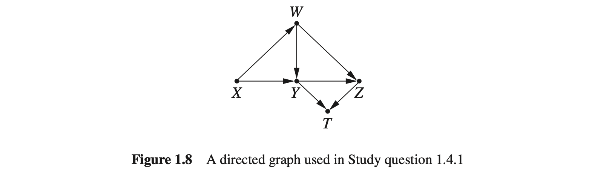
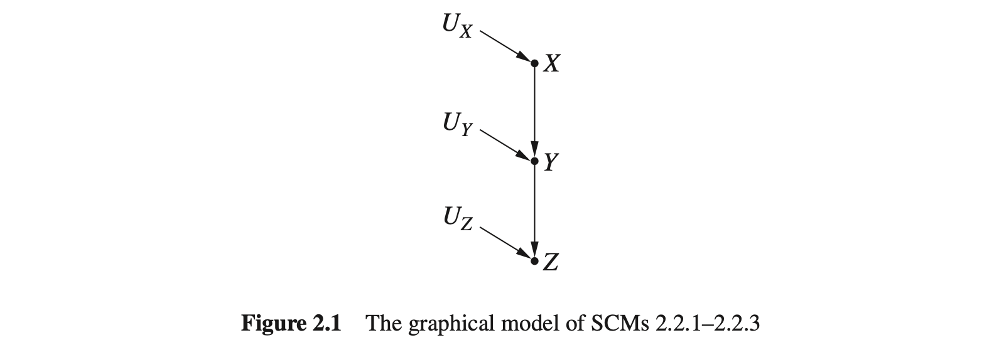
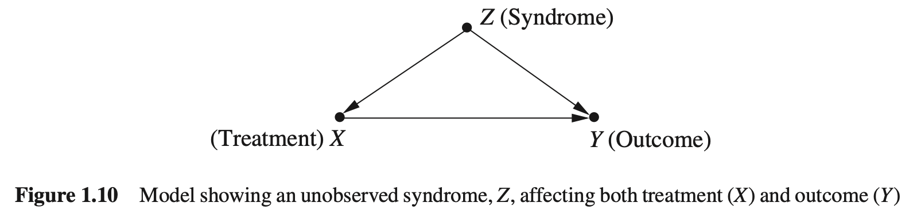

## 1. 引言：统计和因果模型

本章按[正文](../content/1_Preliminaries_Statistical_and_Causal_Models.md)的题号整理中文解答，并以[完整答案手册](https://github.com/jneuer/pearl-primer/blob/master/Sol/Causal%20Inference%20in%20Statistics_%20Solution%20M%20-%20Judea%20Pearl.pdf)核对题目和结果。解答采用独立的中文表述；手册或原答案中的计算、排版问题在相关题目中注明。图示优先引用仓库已有图片；没有对应图片的图示使用 HTML 绘制。

#### 1.2.1

下面三个推断有什么错误？

(a) 收入与婚姻高度正相关，所以结婚会增加收入。

(b) 火灾越多，消防员越多，所以减少消防员可以减少火灾。

(c) 匆忙赶赴会议的人更容易迟到，所以不要着急，否则会迟到。

**解：**

(a)

相关性不足以确定干预的结果。例如，个人能力、家庭背景或社交条件可能同时影响婚姻和收入。即使婚姻本身不影响收入，也能出现正相关。要判断结婚的效果，需要额外的因果假设或适当的研究设计。

(b)

火灾风险较高的地区通常需要更多消防员，这是从火灾风险到消防员配置的影响。不能把这个关联反过来当成“消防员导致火灾”的证据。在同样的风险条件下，减少消防力量还可能使损失更严重。

(c)

出发太晚可能同时造成匆忙和迟到。固定出发时间和路程后，赶路反而可能降低迟到概率。观察到的正相关不能决定加快速度的因果效应。

#### 1.2.2

蒂姆的总体击球率高于弗兰克，但面对右手和左手投手时，弗兰克的击球率都更高。用表格说明这种情况如何发生。

**解：** 可以构造以下数据，各格给出“击中次数 / 击球次数”：

| 投手类型 | 弗兰克 | 蒂姆 |
| --- | --- | --- |
| 右手投手 | 9/10 = 90% | 80/100 = 80% |
| 左手投手 | 60/100 = 60% | 5/10 = 50% |
| 总计 | 69/110 ≈ 62.73% | 85/110 ≈ 77.27% |

两类投手中弗兰克都占优，但蒂姆的大部分击球发生在较容易击中的右手投手组。总体击球率是分组击球率的加权平均，而两人的组别权重不同，因此可以逆转。这才满足题目要求；原答案的表格没有产生这种逆转。

#### 1.2.3

下列情形应使用总体数据还是分组数据？

(a) 医生更常对大结石采用治疗 A，对小结石采用治疗 B。患者不知道结石大小，应如何比较疗效？

(b) 两名医生接诊的手术难度分布不同，患者不知道自己的手术难度，应如何比较医生？

**解：**

(a)

应按治疗前的结石大小比较。结石大小同时影响治疗选择和康复机会，是混杂变量。


不知道自己的结石大小，并不会使混杂消失。估计目标人群的平均效果时，应把各大小组的治疗效果按同一组人群权重汇总。

(b)

应分别比较简单、复杂手术的成功率，再按目标患者的难度分布加权。手术难度同时影响医生选择和成功率，直接比较总体成功率会把病例构成差异混入医生的效果。


#### 1.2.4

药物与安慰剂被随机分配。护士更常给已分配到治疗组且表现抑郁的患者棒棒糖。棒棒糖不影响康复。总体数据显示药物有益，两个棒棒糖分组却都显示药物有害。

(a) 药物对总体有益还是有害？

(b) 这与按性别分组的例子矛盾吗？

(c) 画出因果图。

(d) 为什么分组后出现逆转？

(e) 若按相同规则在试验后发放棒棒糖，答案改变吗？

**解：**

(a)

在题设的随机分配和棒棒糖无效应假设下，总体比较识别药物的平均效果，因此药物有益。

(b)

不矛盾。性别例子中的分组变量是治疗与康复的共同原因；棒棒糖领取是治疗分配因素与健康因素的共同结果。两者的因果位置不同。

(c)

令 $`X`$ 为接受治疗， $`Z`$ 为领取棒棒糖， $`Y`$ 为康复； $`U_1`$ 表示分配病房等因素， $`U_2`$ 表示影响抑郁表现和康复的健康因素。


这里的边为 $`U_1\to X`$、 $`U_1\to Z`$、 $`U_2\to Z`$、 $`U_2\to Y`$ 和 $`X\to Y`$；没有 $`Z\to Y`$。

(d)

$`Z`$ 是路径 $`X\leftarrow U_1\to Z\leftarrow U_2\to Y`$ 上的对撞节点。不按 $`Z`$ 分组时，此路径阻断；固定是否领取棒棒糖后，路径打开，治疗组和对照组在健康风险上的构成发生差异，从而产生选择偏倚。随机分配本身并没有因此失效。

(e)

不改变。只要棒棒糖仍不影响治疗或康复，且领取仍由治疗分配因素和健康因素共同决定，上述对撞结构和分组偏倚仍存在。原答案把发放时间的改变误当成偏倚的消失。

#### 1.3.1

识别棒棒糖故事中的变量和事件。

**解：** 变量包括是否接受药物 $`X`$、是否领取棒棒糖 $`Z`$、是否康复 $`Y`$，以及抑郁表现或基础健康状态。变量是可取不同值的属性；事件是这些属性取到指定值，例如 $`X=1`$，或联合事件 $`X=1,Z=1,Y=1`$。二值变量的一个取值不能与变量本身混为一谈。

#### 1.3.2

依据表 1.5，估计高中学历的概率、高中学历或女性的概率，以及两个条件概率。这里“高中”指最高学历为高中。

| 性别 | 高中以下 | 高中 | 大学 | 研究生 | 合计 |
| --- | ---: | ---: | ---: | ---: | ---: |
| 男性 | 112 | 231 | 595 | 242 | 1180 |
| 女性 | 136 | 189 | 763 | 172 | 1260 |
| 合计 | 248 | 420 | 1358 | 414 | 2440 |

(a) 估计 $`P(H)`$。

(b) 估计 $`P(H\cup F)`$。

(c) 估计 $`P(H\mid F)`$。

(d) 估计 $`P(F\mid H)`$。

**解：** 令 $`H`$ 表示高中学历， $`F`$ 表示女性。

(a)

```math
P(H)=\frac{420}{2440}\approx0.17213.
```

(b) “或”是并集，重复的女性高中学历人数只能计一次：

```math
P(H\cup F)=\frac{420+1260-189}{2440}=\frac{1491}{2440}\approx0.61107.
```

(c)

```math
P(H\mid F)=\frac{189}{1260}=0.15.
```

(d)

```math
P(F\mid H)=\frac{189}{420}=0.45.
```

#### 1.3.3

令 $`D`$ 表示骰子游戏，$`R`$ 表示轮盘游戏。骰子游戏的观测结果是两枚公平骰子的点数和；美式轮盘有 38 个等概率结果。假设按赌桌数量随机选桌。

(a) 轮盘桌数是骰子桌数的两倍，听到“11”后来自骰子桌的概率是多少？

(b) 骰子桌数是轮盘桌数的两倍，听到“10”后来自轮盘桌的概率是多少？

**解：**

(a)

$`P(R)=2/3`$、 $`P(D)=1/3`$，而 $`P(11\mid D)=2/36=1/18`$、 $`P(11\mid R)=1/38`$。先用全概率公式求听到“11”的概率，再使用贝叶斯公式：

```math
P(11)=\frac1{18}\frac13+\frac1{38}\frac23=\frac{37}{1026}.
```

```math
P(D\mid11)=\frac{(1/18)(1/3)}{(1/18)(1/3)+(1/38)(2/3)}=\frac{19}{37}\approx0.51351.
```

(b)

$`P(R)=1/3`$、 $`P(D)=2/3`$， $`P(10\mid D)=3/36=1/12`$。先求

```math
P(10)=\frac1{12}\frac23+\frac1{38}\frac13=\frac{11}{171},
```

再使用贝叶斯公式：

```math
P(R\mid10)=\frac{(1/38)(1/3)}{(1/12)(2/3)+(1/38)(1/3)}=\frac{3}{22}\approx0.13636.
```

#### 1.3.4

三张卡片分别为黑黑、白白、黑白。等概率选卡，随机决定哪面朝上，观察到朝上面为黑色。

(a) 为什么朝下面也为黑色的概率不是 $`1/2`$？

(b) 列出易求的概率，并求未观察朝上颜色时朝下面为黑色的概率。

(c) 用贝叶斯法则求观察到黑色朝上后的答案。

**解：**

(a)

排除白白卡后，剩下两张卡并非后验等概率。黑黑卡有两种朝向都能产生黑色朝上，黑白卡只有一种，因此黑黑卡更容易出现在所观察的样本中。

(b)

令卡片编号为 $`I`$，朝上、朝下颜色分别为 $`C_U,C_D`$。

| 卡片 $`I`$ | $`P(I)`$ | $`P(C_U=黑\mid I)`$ | $`P(C_D=黑\mid I)`$ |
| --- | --- | --- | --- |
| 1：黑黑 | $`1/3`$ | $`1`$ | $`1`$ |
| 2：白白 | $`1/3`$ | $`0`$ | $`0`$ |
| 3：黑白 | $`1/3`$ | $`1/2`$ | $`1/2`$ |

```math
P(C_D=黑)=P(C_U=黑)=\frac13+\frac16=\frac12.
```

(c)

此时朝下也是黑色当且仅当选中卡片 1：

```math
P(C_D=黑\mid C_U=黑)=P(I=1\mid C_U=黑)=\frac{1\times(1/3)}{1/2}=\frac23.
```

#### 1.3.5

用贝叶斯法则证明蒙蒂霍尔问题中换门提高中奖概率。

**解：** 设玩家先选 A，汽车位置为 $`Y`$，主持人打开的门为 $`Z`$。主持人知道汽车位置，必开一扇未选中的山羊门；有两扇可开时等概率选择。于是

```math
P(Z=C\mid Y=A)=\frac12,\quad P(Z=C\mid Y=B)=1,\quad P(Z=C\mid Y=C)=0.
```

三种汽车位置先验均为 $`1/3`$，故 $`P(Z=C)=1/2`$，并有

```math
P(Y=A\mid Z=C)=\frac{(1/2)(1/3)}{1/2}=\frac13,\qquad
P(Y=B\mid Z=C)=\frac{1\times(1/3)}{1/2}=\frac23.
```

因此坚持 A 的中奖概率为 $`1/3`$，换到 B 为 $`2/3`$。这些结论依赖于明确的主持人开门规则。

#### 1.3.6

(a) 证明独立变量的协方差和相关系数为零。

(b) 举出相关系数为零但不独立的例子。

**解：**

(a)

若二阶矩存在，独立性给出 $`E(XY)=E(X)E(Y)`$，因此

```math
\mathrm{Cov}(X,Y)=E(XY)-E(X)E(Y)=0.
```

在两变量方差均大于零时， $`\rho_{XY}=\mathrm{Cov}(X,Y)/(\sigma_X\sigma_Y)=0`$。若某变量方差为零，相关系数未定义，不能直接称为零。

(b)

令 $`X`$ 在 $`\{-1,0,1\}`$ 上均匀分布， $`Y=X^2`$。则 $`Y`$ 完全由 $`X`$ 决定，二者显然不独立；但 $`E(X)=E(XY)=0`$，所以协方差为零。又有 $`\mathrm{Var}(X)=2/3`$、 $`\mathrm{Var}(Y)=2/9`$，故相关系数为零。这个例子的概率分布已归一化；参考手册此问给出的概率表有列和不为 1 的问题。

#### 1.3.7

同时掷两枚独立公平硬币。至少一枚正面时玩家 1 得 1 元，两枚同面时玩家 2 得 1 元；否则各自得 0 元。收益分别记为 $`X,Y`$。

(a) 求边缘、联合和条件分布。

(b) 求期望、条件期望、方差、协方差和相关系数。

(c) 玩家 2 得 1 元后，对玩家 1 收益的最优估计是什么？

(d) 玩家 1 得 1 元后，对玩家 2 收益的最优估计是什么？

(e) 是否存在独立的事件 $`X=x`$ 和 $`Y=y`$？

**解：**

(a)

四种硬币结果各有 $`1/4`$ 的概率：

| 硬币结果 | $`X`$ | $`Y`$ |
| --- | ---: | ---: |
| 正正 | 1 | 1 |
| 正反 | 1 | 0 |
| 反正 | 1 | 0 |
| 反反 | 0 | 1 |

联合分布及边缘分布为：

| $`P(X=x,Y=y)`$ | $`Y=0`$ | $`Y=1`$ | $`P(X=x)`$ |
| --- | --- | --- | --- |
| $`X=0`$ | $`0`$ | $`1/4`$ | $`1/4`$ |
| $`X=1`$ | $`1/2`$ | $`1/4`$ | $`3/4`$ |
| $`P(Y=y)`$ | $`1/2`$ | $`1/2`$ | $`1`$ |

条件分布为：

| 条件 | 零收益的概率 | 一元收益的概率 |
| --- | --- | --- |
| $`Y\mid X=0`$ | $`0`$ | $`1`$ |
| $`Y\mid X=1`$ | $`2/3`$ | $`1/3`$ |
| $`X\mid Y=0`$ | $`0`$ | $`1`$ |
| $`X\mid Y=1`$ | $`1/2`$ | $`1/2`$ |

(b)

二值收益的期望就是得 1 元的概率：

```math
E(X)=\frac34,\qquad E(Y)=\frac12.
```

```math
E(Y\mid X=0)=1,\quad E(Y\mid X=1)=\frac13,\quad
E(X\mid Y=0)=1,\quad E(X\mid Y=1)=\frac12.
```

```math
\mathrm{Var}(X)=\frac{3}{16},\qquad
\mathrm{Var}(Y)=\frac14,\qquad
\mathrm{Cov}(X,Y)=\frac14-\frac34\frac12=-\frac18.
```

```math
\rho_{XY}=\frac{-1/8}{\sqrt{3/16}\sqrt{1/4}}=-\frac1{\sqrt3}.
```

(c)

按平方损失下的条件期望，估计为 $`E(X\mid Y=1)=1/2`$ 元。

(d)

$`E(Y\mid X=1)=1/3`$ 元。

(e)

不存在。四个联合概率为 $`0,1/4,1/2,1/4`$，对应的边缘概率乘积分别为 $`1/8,1/8,3/8,3/8`$，没有任何一对相等。

#### 1.3.8

两枚独立公平骰子的点数为 $`X,Z`$，点数和为 $`Y=X+Z`$。

(a) 求各取值下的期望和条件期望，以及方差、协方差和相关系数。

(b) 根据表 1.6 的 12 次投掷，求上述量的样本估计。

(c) 已知 $`X=3`$，理论上对 $`Y`$ 的最优估计是多少？

(d) 已知 $`Y=4`$，对 $`X`$ 的最优估计是多少？

(e) 已知 $`Y=4,Z=1`$，对 $`X`$ 的最优估计是多少？

| 次数 | $`X`$ | $`Z`$ | $`Y`$ |
| --- | ---: | ---: | ---: |
| 1 | 6 | 3 | 9 |
| 2 | 3 | 4 | 7 |
| 3 | 4 | 6 | 10 |
| 4 | 6 | 2 | 8 |
| 5 | 6 | 4 | 10 |
| 6 | 5 | 3 | 8 |
| 7 | 1 | 5 | 6 |
| 8 | 3 | 5 | 8 |
| 9 | 6 | 5 | 11 |
| 10 | 3 | 5 | 8 |
| 11 | 5 | 3 | 8 |
| 12 | 4 | 5 | 9 |

**解：**

(a)

单枚骰子在 1 至 6 上均匀分布，故

```math
E(X)=E(Z)=\frac72,\quad E(Y)=7,\quad
E(Y\mid X=x)=x+\frac72\quad(x=1,\ldots,6).
```

给定点数和后，两枚骰子的条件分布对称，因此

```math
E(X\mid Y=y)=E(Z\mid Y=y)=\frac y2\quad(y=2,\ldots,12).
```

```math
\mathrm{Var}(X)=\mathrm{Var}(Z)=\frac{35}{12},\quad
\mathrm{Var}(Y)=\frac{35}{6},\quad
\mathrm{Cov}(X,Y)=\frac{35}{12},\quad
\mathrm{Cov}(X,Z)=0,\quad \rho_{XY}=\frac1{\sqrt2}.
```

(b)

均值为 $`\bar X=13/3\approx4.33333`$、 $`\bar Y=17/2=8.5`$。为避免混用分母，列出两种约定：

| 统计量 | 经验分布估计（分母 $`n=12`$） | 无偏估计（分母 $`n-1=11`$） |
| --- | --- | --- |
| $`\mathrm{Var}(X)`$ | $`43/18\approx2.38889`$ | $`86/33\approx2.60606`$ |
| $`\mathrm{Var}(Y)`$ | $`7/4=1.75`$ | $`21/11\approx1.90909`$ |
| $`\mathrm{Cov}(X,Y)`$ | $`17/12\approx1.41667`$ | $`17/11\approx1.54545`$ |
| $`\mathrm{Cov}(X,Z)`$ | $`-35/36\approx-0.97222`$ | $`-35/33\approx-1.06061`$ |

只要方差和协方差统一采用同一分母，样本相关系数均为

```math
\widehat\rho_{XY}=\frac{17/12}{\sqrt{43/18}\sqrt{7/4}}\approx0.69287.
```

各有观测支持的条件均值为：

| $`x`$ | 1 | 3 | 4 | 5 | 6 |
| --- | --- | --- | --- | --- | --- |
| $`\widehat E(Y\mid X=x)`$ | $`6`$ | $`23/3`$ | $`19/2`$ | $`8`$ | $`19/2`$ |

| $`y`$ | 6 | 7 | 8 | 9 | 10 | 11 |
| --- | --- | --- | --- | --- | --- | --- |
| $`\widehat E(X\mid Y=y)`$ | $`1`$ | $`3`$ | $`22/5`$ | $`5`$ | $`5`$ | $`6`$ |

样本未出现 $`X=2`$ 和其余点数和，不能仅靠对应组的频数估计这些条件均值。参考手册混用了方差、协方差的分母，导致其相关系数也不正确。

(c)

$`E(Y\mid X=3)=6.5`$。

(d)

$`E(X\mid Y=4)=2`$。

(e)

$`X=Y-Z=3`$，不再有不确定性。增加 $`Z=1`$ 排除了其余可能的骰子组合，因此答案不同于 (d)。

#### 1.3.9

(a) 用正交原则证明最小二乘回归的斜率公式。

(b) 求骰子模型中的六个偏回归系数。

**解：**

(a)

写作 $`Y=a+bX+\varepsilon`$。最优线性预测要求残差与常数和 $`X`$ 正交，即 $`E(\varepsilon)=0`$、 $`E(X\varepsilon)=0`$。因此

```math
E(Y)=a+bE(X),\qquad E(XY)=aE(X)+bE(X^2).
```

消去 $`a`$，得到

```math
b=\frac{E(XY)-E(X)E(Y)}{E(X^2)-E(X)^2}
=\frac{\mathrm{Cov}(X,Y)}{\mathrm{Var}(X)}.
```

这里的回归直线不要求每个观测都严格满足 $`Y=a+bX`$。

(b)

由于三个精确关系 $`Y=X+Z`$、 $`X=Y-Z`$、 $`Z=Y-X`$，可直接读出

```math
R_{YX\cdot Z}=R_{XY\cdot Z}=R_{YZ\cdot X}=R_{ZY\cdot X}=1,\qquad
R_{XZ\cdot Y}=R_{ZX\cdot Y}=-1.
```

也可把上一题的理论协方差代入偏回归公式验证。控制 $`Y`$ 后，两枚骰子的负关联来自固定总和的限制。

#### 1.4.1

根据图 1.8，求父节点、祖先、子节点、后代和路径。



(a) 找出 $`Z`$ 的所有父节点。

(b) 找出 $`Z`$ 的所有祖先。

(c) 找出 $`W`$ 的所有子节点。

(d) 找出 $`W`$ 的所有后代。

(e) 画出 $`X`$ 到 $`T`$ 的所有简单路径。

(f) 画出 $`X`$ 到 $`T`$ 的所有有向路径。

**解：**

(a) $`Z`$ 的父节点为 $`\{W,Y\}`$。

(b) $`Z`$ 的祖先为 $`\{X,W,Y\}`$。

(c) $`W`$ 的子节点为 $`\{Y,Z\}`$。 $`T`$ 是后代但不是子节点， $`X`$ 是父节点。

(d) 按完整答案手册， $`W`$ 的后代为 $`\{Y,Z,T\}`$。

**注：** 仓库正文此问写作 $`X`$ 的后代，其答案为 $`\{W,Y,Z,T\}`$。

(e) $`X`$ 到 $`T`$ 的所有简单路径如下。路径可逆着箭头经过某条边，但必须保留该边的实际方向：

```math
\begin{aligned}
&X\to Y\to T,\\
&X\to Y\to Z\to T,\\
&X\to Y\leftarrow W\to Z\to T,\\
&X\to W\to Y\to T,\\
&X\to W\to Y\to Z\to T,\\
&X\to W\to Z\to T,\\
&X\to W\to Z\leftarrow Y\to T.
\end{aligned}
```

(f) 全部有向路径为上面第 1、2、4、5、6 条，共 5 条。第 3、7 条含有逆向经过的边，不能算有向路径。

#### 1.5.1

设 $`X=U_X`$、 $`Y=X/3+U_Y`$、 $`Z=Y/16+U_Z`$，外生变量相互独立、均值为零。

(a) 画出模型图。

(b) 观察到 $`Y=3`$，求 $`Z`$ 的条件期望。

(c) 观察到 $`X=3`$，求 $`Z`$ 的条件期望。

(d) 观察到 $`X=1,Y=3`$，求 $`Z`$ 的条件期望。

(e) 进一步假设各外生变量服从独立标准正态分布。

(i) 观察到 $`Y=2`$，求 $`X`$ 的条件期望。

(ii) 观察到 $`X=1,Z=3`$，求 $`Y`$ 的条件期望。

**解：**

(a)

模型结构与图 2.1 相同：



(b)

$`U_Z`$ 与 $`Y`$ 独立，所以 $`E(Z\mid Y=3)=3/16`$。

(c)

$`E(Y\mid X=3)=1`$，因此 $`E(Z\mid X=3)=1/16`$。

(d)

给定 $`Y`$ 后， $`X`$ 不再提供预测 $`Z`$ 的信息，故 $`E(Z\mid X=1,Y=3)=3/16`$。

(e)

(i) $`\mathrm{Cov}(X,Y)=1/3`$、 $`\mathrm{Var}(Y)=10/9`$。由高斯条件期望，

```math
E(X\mid Y=2)=\frac{1/3}{10/9}\times2=\frac35.
```

(ii) 给定 $`X=1`$， $`Y`$ 的均值为 $`1/3`$、方差为 1， $`Z`$ 的均值为 $`1/48`$、方差为 $`257/256`$，二者的条件协方差为 $`1/16`$。于是

```math
E(Y\mid X=1,Z=3)
=\frac13+\frac{1/16}{257/256}\left(3-\frac1{48}\right)
=\frac{400}{771}\approx0.51881.
```

**注：** 参考手册此处给出的 6 不正确，因为观察 $`Y`$ 后不能仍令 $`E(U_Y\mid Y)=0`$。

#### 1.5.2

令 $`Z=1`$ 表示有症状， $`X=1`$ 表示服药， $`Y=1`$ 表示死亡。设 $`P(Z=1)=r`$， $`P(X=1\mid Z=0)=q_1`$、 $`P(X=1\mid Z=1)=q_2`$；四个死亡概率依次为 $`p_1=P(Y=1\mid0,0)`$、 $`p_2=P(Y=1\mid1,0)`$、 $`p_3=P(Y=1\mid0,1)`$、 $`p_4=P(Y=1\mid1,1)`$，条件中的顺序为 $`X,Z`$。



(a) 求 $`P(x,y,z)`$ 及三个二维边缘分布。

(b) 求有症状、无症状和总体的服药死亡率差。

(c) 给出产生辛普森逆转的参数。

**解：**

(a)

因子分解为 $`P(x,y,z)=P(z)P(x\mid z)P(y\mid x,z)`$，全部 8 项为：

| $`x`$ | $`y`$ | $`z`$ | $`P(x,y,z)`$ |
| --- | --- | --- | --- |
| 0 | 0 | 0 | $`(1-r)(1-q_1)(1-p_1)`$ |
| 0 | 0 | 1 | $`r(1-q_2)(1-p_3)`$ |
| 0 | 1 | 0 | $`(1-r)(1-q_1)p_1`$ |
| 0 | 1 | 1 | $`r(1-q_2)p_3`$ |
| 1 | 0 | 0 | $`(1-r)q_1(1-p_2)`$ |
| 1 | 0 | 1 | $`rq_2(1-p_4)`$ |
| 1 | 1 | 0 | $`(1-r)q_1p_2`$ |
| 1 | 1 | 1 | $`rq_2p_4`$ |

对 $`z`$ 求和，得到：

| $`(x,y)`$ | $`P(x,y)`$ |
| --- | --- |
| $`(0,0)`$ | $`(1-r)(1-q_1)(1-p_1)+r(1-q_2)(1-p_3)`$ |
| $`(0,1)`$ | $`(1-r)(1-q_1)p_1+r(1-q_2)p_3`$ |
| $`(1,0)`$ | $`(1-r)q_1(1-p_2)+rq_2(1-p_4)`$ |
| $`(1,1)`$ | $`(1-r)q_1p_2+rq_2p_4`$ |

另外两个边缘分布为：

| $`(x,z)`$ | $`P(x,z)`$ |
| --- | --- |
| $`(0,0)`$ | $`(1-r)(1-q_1)`$ |
| $`(0,1)`$ | $`r(1-q_2)`$ |
| $`(1,0)`$ | $`(1-r)q_1`$ |
| $`(1,1)`$ | $`rq_2`$ |

| $`(y,z)`$ | $`P(y,z)`$ |
| --- | --- |
| $`(0,0)`$ | $`(1-r)[(1-q_1)(1-p_1)+q_1(1-p_2)]`$ |
| $`(0,1)`$ | $`r[(1-q_2)(1-p_3)+q_2(1-p_4)]`$ |
| $`(1,0)`$ | $`(1-r)[(1-q_1)p_1+q_1p_2]`$ |
| $`(1,1)`$ | $`r[(1-q_2)p_3+q_2p_4]`$ |

(b)

有症状组为 $`p_4-p_3`$，无症状组为 $`p_2-p_1`$；总体的观测风险差为

```math
RD=\frac{(1-r)q_1p_2+rq_2p_4}{(1-r)q_1+rq_2}
-\frac{(1-r)(1-q_1)p_1+r(1-q_2)p_3}{(1-r)(1-q_1)+r(1-q_2)}.
```

各条件概率要求相应的条件事件具有正概率。

(c)

对纯粹的概率模型，可取

```math
r=\frac12,\quad p_1=0.2,\ p_2=0.1,\ p_3=0.8,\ p_4=0.7,\quad q_1=0.1,\ q_2=0.9.
```

两组死亡率差均为 $`-0.1`$，但总体服药死亡率为 $`0.64`$，未服药死亡率为 $`0.26`$，所以 $`RD=0.38`$。药物在两组都降低死亡率，却在总体观测数据中看似提高死亡率。

**注：** 此例为保留“药物有益、症状增加风险”而放宽了题干“有症状者更倾向不服药”的方向假设。若同时坚持 $`q_2\le q_1`$、 $`p_3\ge p_1`$、 $`p_2\le p_1`$、 $`p_4\le p_3`$，上述有益变有害的逆转不能发生：此时服药组有症状者的比例 $`w_1`$ 不超过未服药组的 $`w_0`$，故

```math
p_2(1-w_1)+p_4w_1
\le p_1(1-w_1)+p_3w_1
\le p_1(1-w_0)+p_3w_0.
```

参考手册的例子同样改变了服药倾向方向，而且取 $`q_1=0,q_2=1`$，使部分观测条件事件概率为零。本例取值严格位于 0 与 1 之间，避免该问题。

#### 1.5.3

二值变量构成链 $`X_1\to X_2\to X_3\to X_4`$，其中 $`P(X_i=1\mid X_{i-1}=1)=p`$、 $`P(X_i=1\mid X_{i-1}=0)=q`$、 $`P(X_1=1)=p_0`$。求题设的四个概率。

<!-- diagram:binarychain -->
<table>
<caption>四个二值变量的链</caption>
  <tr><td align="center">X<sub>1</sub></td><td align="center">→</td><td align="center">X<sub>2</sub></td><td align="center">→</td><td align="center">X<sub>3</sub></td><td align="center">→</td><td align="center">X<sub>4</sub></td></tr>
</table>

(1) 求 $`P(X_1=1,X_2=0,X_3=1,X_4=0)`$。

(2) 求 $`P(X_4=1\mid X_1=1)`$。

(3) 求 $`P(X_1=1\mid X_4=1)`$。

(4) 求 $`P(X_3=1\mid X_1=0,X_4=1)`$。

**解：**

(1) 由链的乘积分解，

```math
P(X_1=1,X_2=0,X_3=1,X_4=0)=p_0(1-p)^2q.
```

(2) 对两个中间变量求和。令

```math
A=p^3+2pq(1-p)+q(1-p)(1-q),
```

它是从初始状态 1 出发，经过三次转移到达状态 1 的概率，因此

```math
P(X_4=1\mid X_1=1)=A.
```

(3) 令

```math
B=qp^2+q^2(1-p)+pq(1-q)+q(1-q)^2,
```

它是从初始状态 0 出发，经过三次转移到达状态 1 的概率。由贝叶斯公式，

```math
P(X_1=1\mid X_4=1)=\frac{p_0A}{p_0A+(1-p_0)B}.
```

(4) 在 $`X_1=0`$ 下， $`P(X_3=1)=qp+(1-q)q`$，故

```math
P(X_3=1\mid X_1=0,X_4=1)=\frac{p[qp+(1-q)q]}{B}.
```

上述条件概率仅在其条件事件具有正概率时定义。

#### 1.5.4

给出蒙蒂霍尔问题的结构因果模型和联合分布。

**解：** 令 $`X`$ 为玩家选择的门， $`Y`$ 为汽车所在的门， $`Z`$ 为主持人打开的门。令 $`U_X,U_Y`$ 独立且均匀取 A、B、C， $`U_Z`$ 为独立公平的二值随机变量。

```math
X=U_X,\qquad Y=U_Y,\qquad Z=h(X,Y,U_Z).
```

当 $`X\ne Y`$ 时， $`h`$ 返回唯一未被选中且没有汽车的门；当 $`X=Y`$ 时， $`U_Z`$ 决定等概率打开剩余两门之一。不能简单地把门的标签与一个加性误差相加。

<!-- diagram:monty -->
<table>
<caption>主持人的开门选择由玩家选择和汽车位置共同决定</caption>
  <tr><td align="center">U<sub>X</sub></td><td align="center">&nbsp;</td><td align="center">U<sub>Z</sub></td><td align="center">&nbsp;</td><td align="center">U<sub>Y</sub></td></tr>
  <tr><td align="center">↓</td><td align="center">&nbsp;</td><td align="center">↓</td><td align="center">&nbsp;</td><td align="center">↓</td></tr>
  <tr><td align="center">X：玩家选门</td><td align="center">→</td><td align="center">Z：主持人开门</td><td align="center">←</td><td align="center">Y：汽车位置</td></tr>
</table>

联合分布为

```math
P(x,y,z)=P(x)P(y)P(z\mid x,y)=\frac19P(z\mid x,y),
```

其中全部可能情形由下表给定：

| 条件 | $`P(z\mid x,y)`$ | $`P(x,y,z)`$ |
| --- | --- | --- |
| $`z=x`$ 或 $`z=y`$ | $`0`$ | $`0`$ |
| $`x\ne y`$ 且 $`z`$ 为第三扇门 | $`1`$ | $`1/9`$ |
| $`x=y`$ 且 $`z\ne x`$ | $`1/2`$ | $`1/18`$ |

共 6 个 $`1/9`$ 的联合事件与 6 个 $`1/18`$ 的联合事件，总概率为 1。
