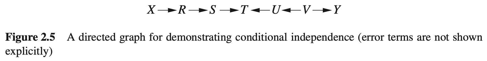
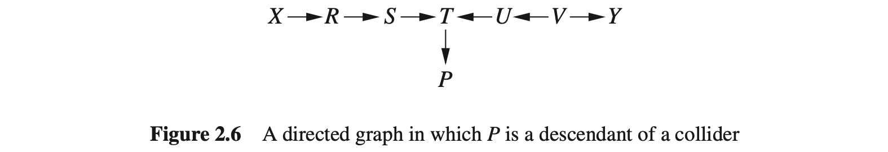
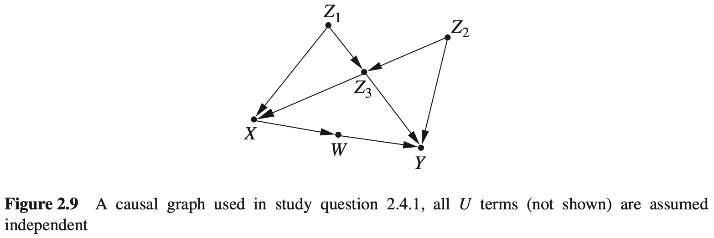

## 2. 图模型及其应用

本章按[正文](../content/2_Graphical_Models_and_Their_Applications.md)的题号整理中文解答，并以[完整答案手册](https://github.com/jneuer/pearl-primer/blob/master/Sol/Causal%20Inference%20in%20Statistics_%20Solution%20M%20-%20Judea%20Pearl.pdf)核对。图示优先引用仓库已有图片；没有对应图片的图示使用 HTML 绘制。以下独立性结论假定外生误差相互独立；回归结论按本书的线性模型理解。

**注：** d-分离保证相应的条件独立；d-连通只表示图不保证独立，特殊参数仍可能使关联消失。讨论由观测数据确定箭头方向时，另需因果马尔可夫性、忠实性及图中没有遗漏共同原因等假设。

#### 2.3.1

根据图 2.5 和图 2.6，求条件独立关系与零回归系数。

(a) 图 2.5 中，给定 $\{R,V\}$，哪些变量对独立？

**解：** 在不包含条件变量本身的变量对中，全部 8 对为：

| 变量对 | 阻断的原因 |
| --- | --- |
| $(X,S)$ | 条件中的 $R$ 阻断链 |
| $(X,T)$ | 同上 |
| $(X,U)$ | 同上；且未条件化的 $T$ 为对撞节点 |
| $(X,Y)$ | $R$ 阻断链，$V$ 也阻断右侧分叉 |
| $(S,U)$ | 对撞节点 $T$ 及其后代均未作为条件 |
| $(S,Y)$ | 同上 |
| $(T,Y)$ | 条件中的 $V$ 阻断 $T\leftarrow U\leftarrow V\to Y$ |
| $(U,Y)$ | 条件中的 $V$ 阻断分叉 |

(b) 为图 2.5 的每对不相邻变量给出一个分离集合。

**解：** 空集记为 $\varnothing$。集合不必唯一，下面覆盖全部 15 对：

| 变量对 | 一个条件集合 |
| --- | --- |
| $(X,S)$ | $\{R\}$ |
| $(X,T)$ | $\{R\}$ |
| $(X,U)$ | $\{R\}$ |
| $(X,V)$ | $\{R\}$ |
| $(X,Y)$ | $\{R\}$ |
| $(R,T)$ | $\{S\}$ |
| $(R,U)$ | $\{S\}$ |
| $(R,V)$ | $\{S\}$ |
| $(R,Y)$ | $\{S\}$ |
| $(S,U)$ | $\varnothing$ |
| $(S,V)$ | $\varnothing$ |
| $(S,Y)$ | $\varnothing$ |
| $(T,V)$ | $\{U\}$ |
| $(T,Y)$ | $\{U\}$ |
| $(U,Y)$ | $\{V\}$ |

(c) 图 2.6 中，给定 $\{R,P\}$，哪些变量对独立？

**解：** $P$ 是 $T$ 的后代，条件化 $P$ 打开 $S\to T\leftarrow U$；$R$ 仍将 $X$ 与其余未固定变量隔开。全部非平凡独立对为

$$
(X,S),\ (X,T),\ (X,U),\ (X,V),\ (X,Y).
$$

参考手册另把 $(X,R)$ 和 $(X,P)$ 列入；固定的条件变量与其他变量只有平凡的条件独立，不计入这里的变量对。

(d) 为图 2.6 的每对不相邻变量给出一个分离集合。

**解：** (b) 中全部 15 对仍可用原集合分离。新增节点 $P$ 引入以下 6 对，总计 21 对：

| 新增变量对 | 一个条件集合 |
| --- | --- |
| $(X,P)$ | $\{R\}$ |
| $(R,P)$ | $\{S\}$ |
| $(S,P)$ | $\{T\}$ |
| $(U,P)$ | $\{T\}$ |
| $(V,P)$ | $\{T\}$ |
| $(Y,P)$ | $\{T\}$ |

(e) 在图 2.5 的线性模型下拟合 $Y=a+bX+cZ$，选哪个变量作 $Z$ 能保证 $b=0$？

**解：** 可以选 $R,S,U,V$ 中任意一个，它们均阻断 $X$ 到 $Y$ 的唯一无向路径。不能选 $T$：控制对撞节点会打开路径，使 $X$ 与 $Y$ 可能相关。

(f) 图 2.6 下拟合 $Y=a+bX+cR+dS+eT+fP$，哪些系数由图保证为零？

**解：** $b=c=f=0$。分别控制其余回归量后，$X,R,P$ 都与 $Y$ d-分离。$d,e$ 不被图强制为零：控制 $T$ 打开对撞路径，因此 $S$ 可以与 $Y$ 关联，$T$ 也可以提供预测信息。截距 $a$ 是否为零取决于是否对变量作了中心化。

#### 2.4.1

图 2.9 的外生误差均独立。根据图求分离集合、马尔可夫毯与预测变量集合。

图中的边为 $Z_1\to Z_3$、$Z_2\to Z_3$、$Z_1\to X$、$Z_3\to X$、$Z_2\to Y$、$Z_3\to Y$、$X\to W$、$W\to Y$。

(a) 对每对不相邻变量给出一个 d-分离集合。这对数据中的独立性意味着什么？

**解：** 全部 7 对为：

| 变量对 | 一个条件集合 |
| --- | --- |
| $(X,Y)$ | $\{Z_1,Z_3,W\}$ |
| $(X,Z_2)$ | $\{Z_1,Z_3\}$ |
| $(Y,Z_1)$ | $\{Z_2,Z_3,W\}$ |
| $(W,Z_1)$ | $\{X\}$ |
| $(W,Z_2)$ | $\{X\}$ |
| $(W,Z_3)$ | $\{X\}$ |
| $(Z_1,Z_2)$ | $\varnothing$ |

例如，分离 $X,Y$ 时，$W$ 阻断有向链，$Z_3$ 阻断共同原因路径；控制 $Z_3$ 又打开 $Z_1\to Z_3\leftarrow Z_2$，因此还需控制 $Z_1$。若数据确由此图的马尔可夫模型产生，上表相应的条件独立都必须成立。

(b) 若只有 $\{Z_3,W,X,Z_1\}$ 可测量，重新作答。

**解：** 在实际可检验的观测变量对中，不相邻的只有 $(W,Z_1)$ 和 $(W,Z_3)$，两者均可给定 $X$ 分离。

若仍考虑 (a) 的全部原图变量对，只限制可用的条件变量，则除 $(Y,Z_1)$ 外，其他 6 对仍可使用 (a) 中的集合。$(Y,Z_1)$ 无法用可测变量分离：不控制 $Z_3$ 会留下 $Z_1\to Z_3\to Y$；控制 $Z_3$ 则打开 $Z_1\to Z_3\leftarrow Z_2\to Y$，而 $Z_2$ 不可控制。涉及不可测端点的独立性只是图上结论，不能直接用此观测数据检验。

(c) 给定其余全部变量时，上述 7 对是否独立？

**解：**

| 变量对 | 是否由图保证独立 | 说明 |
| --- | --- | --- |
| $(X,Y)$ | 是 | 所有路径都被其他变量阻断 |
| $(X,Z_2)$ | 是 | 同上 |
| $(Y,Z_1)$ | 是 | 同上 |
| $(W,Z_1)$ | 是 | 同上 |
| $(W,Z_2)$ | 否 | 控制 $Y$ 打开 $W\to Y\leftarrow Z_2$ |
| $(W,Z_3)$ | 否 | 控制 $Y$ 打开 $W\to Y\leftarrow Z_3$ |
| $(Z_1,Z_2)$ | 否 | 控制 $Z_3$ 打开 $Z_1\to Z_3\leftarrow Z_2$ |

(d) 对每个节点，找出使它与其余未固定变量独立的最小集合。

**解：** 节点的马尔可夫毯由其父节点、子节点和子节点的其他父节点组成。在本图中：

| 节点 | 马尔可夫毯 |
| --- | --- |
| $X$ | $\{Z_1,Z_3,W\}$ |
| $Y$ | $\{Z_2,Z_3,W\}$ |
| $W$ | $\{X,Y,Z_2,Z_3\}$ |
| $Z_1$ | $\{X,Z_3,Z_2\}$ |
| $Z_2$ | $\{Z_3,Y,Z_1,W\}$ |
| $Z_3$ | $\{Z_1,Z_2,X,Y,W\}$ |

**注：** 参考手册误把 $Z_3$ 放入自己的马尔可夫毯，并漏掉 $Z_2$。这里给出图结构保证的最小集合；若具体分布存在退化或不忠实情形，统计上可能进一步缩小。

(e) 预测 $Y$ 时，哪些变量足以达到观测所有其余变量的预测精度？

**解：** $\{Z_2,Z_3,W\}$。给定这个马尔可夫毯后，再加入 $X,Z_1$ 不改变 $Y$ 的条件分布。

(f) 若预测 $Z_2$ 呢？

**解：** $\{Z_1,Z_3,Y,W\}$。给定这组变量后，$X$ 不提供额外预测信息。

(g) 已用 $Z_3$ 预测 $Z_2$，增加 $W$ 会有帮助吗？

**解：** 图允许帮助，因为控制 $Z_3$ 打开路径 $Z_2\to Z_3\leftarrow Z_1\to X\to W$，所以 $Z_2$ 与 $W$ 不再 d-分离。在通常的忠实、非退化模型下会增加信息；图本身不能保证每种参数下预测误差都严格下降。

#### 2.5.1

继续使用图 2.9，讨论马尔可夫等价和可检验的回归约束。

(a) 哪些箭头能反向而不被统计独立性检验发现？

**解：** 没有。等价图必须保持骨架、无环性和非屏蔽对撞结构。原图的非屏蔽对撞结构包括

$$
Z_1\to Z_3\leftarrow Z_2,\qquad Z_3\to Y\leftarrow W,\qquad Z_2\to Y\leftarrow W.
$$

逐一反向会产生下列问题：

| 反向的原边 | 违反等价性的原因 |
| --- | --- |
| $Z_1\to Z_3$ | 破坏 $Z_3$ 处的对撞结构 |
| $Z_2\to Z_3$ | 同上 |
| $Z_3\to Y$ | 破坏 $Y$ 处的对撞结构 |
| $Z_2\to Y$ | 同上 |
| $W\to Y$ | 同上 |
| $Z_3\to X$ | 新增 $X\to Z_3\leftarrow Z_2$ |
| $Z_1\to X$ | 产生 $Z_1\to Z_3\to X\to Z_1$ 的有向环 |
| $X\to W$ | 新增 $W\to X\leftarrow Z_1$ |

(b) 列出全部等价图。

**解：** 只有图 2.9 本身。不能仅凭“单边无法反向”就一般性地断言等价类唯一；对本图，前三个非屏蔽对撞结构先固定指向 $Z_3,Y$ 的边，其余方向再由避免新对撞和避免有向环确定。枚举同一骨架的全部无环定向也只得到这一张图。

(c) 哪些箭头方向能由非实验数据确定？

**解：** 在本章开头列明的识别假设下，全部 8 条边的方向都被等价类确定。这不是说任意有限样本都能可靠恢复方向，也不是无需因果假设就能从相关性推断因果。

(d) 给出关于 $Y$ 的回归方程，其中某个非零系数可否定模型。

**解：** 在线性模型下，可使用

$$
Y=\alpha+r_2Z_2+r_3Z_3+r_WW+r_1Z_1+\varepsilon.
$$

由于 $Y\perp Z_1\mid Z_2,Z_3,W$，总体回归系数必须满足 $r_1=0$。实际检验应考虑抽样误差，不能把有限样本中的微小非零值直接当成模型被否定。

(e) 对 $Z_3$ 给出同类方程。

**解：** 可使用

$$
Z_3=\alpha+r_XX+r_WW+\varepsilon,
$$

其中由 $Z_3\perp W\mid X$ 得到约束 $r_W=0$。

(f) 若 $X$ 不可测量，还能给出这样的 $Z_3$ 回归检验吗？

**解：** 不能。其余可测变量中，$Z_1,Z_2,Y$ 与 $Z_3$ 都直接相邻；$W$ 与 $Z_3$ 的路径 $Z_3\to X\to W$ 则无法用其他可测变量阻断。因此不存在此类以 $Z_3$ 为因变量的零系数约束。

(g) 为检验乘积分解包含的全部零回归约束，需要多少个方程？

**解：** 按拓扑顺序 $Z_1,Z_2,Z_3,X,W,Y$，分解为

$$
\begin{aligned}
P(z_1,z_2,z_3,x,w,y)
={}&P(z_1)P(z_2)P(z_3\mid z_1,z_2)\\
&\cdot P(x\mid z_1,z_3)P(w\mid x)P(y\mid w,z_2,z_3).
\end{aligned}
$$

对每个变量回归其拓扑顺序之前的变量，比较它的父节点与非父节点，可用以下 4 个方程检验全部 7 个零系数：

| 回归方程（省略截距和残差） | 必须为零的系数 |
| --- | --- |
| $Z_2=r_1Z_1$ | $r_1$ |
| $X=r_1Z_1+r_2Z_2+r_3Z_3$ | $r_2$ |
| $W=r_XX+r_1Z_1+r_2Z_2+r_3Z_3$ | $r_1,r_2,r_3$ |
| $Y=r_WW+r_XX+r_1Z_1+r_2Z_2+r_3Z_3$ | $r_X,r_1$ |

在线性高斯模型下，这些检验覆盖相应的条件独立约束。在一般非线性分布下，零线性系数不等价于条件独立，应直接检验因子分解所要求的条件独立性。
