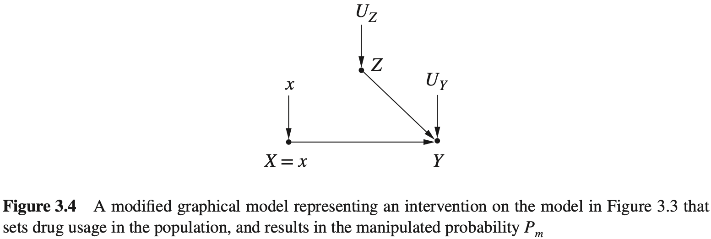
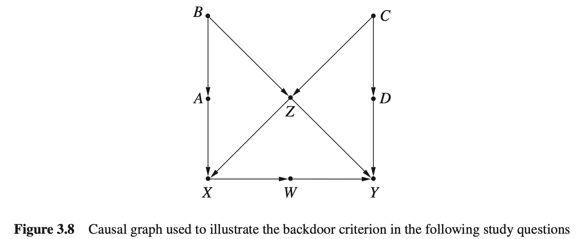
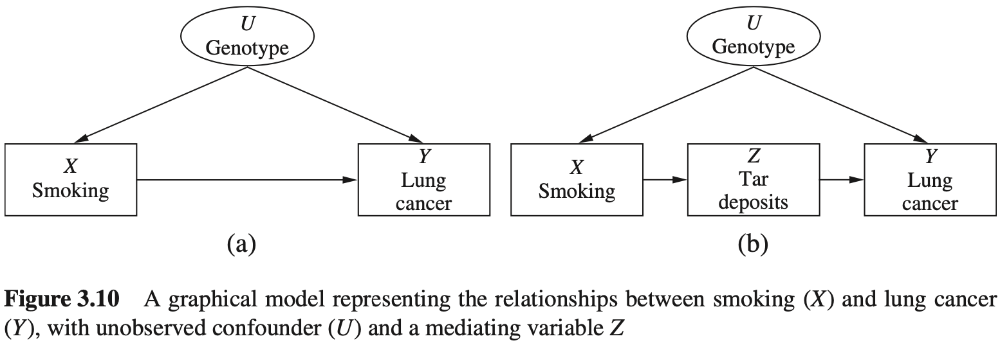

## 3. 干预的效果

本章按[正文](../content/3_The_Effects_of_Interventions.md)整理中文解答，并补入正文遗漏的习题 3.8.1。参考核对：[完整答案手册](https://github.com/jneuer/pearl-primer/blob/master/Sol/Causal%20Inference%20in%20Statistics_%20Solution%20M%20-%20Judea%20Pearl.pdf)。图示优先引用仓库已有图片；没有对应图片的图示使用 HTML 绘制，同名节点表示同一变量。

#### 3.2.1

使用习题 1.5.2 的症状、服药与死亡模型，以及参数 $`r,p_1,p_2,p_3,p_4,q_1,q_2`$。

(a) 通过模拟 $`do(X=x)`$ 求全部干预概率。

(b) 使用调整公式重新求解。

(c) 求平均因果效应 ACE，并与观测风险差 RD 比较。

(d) 用辛普森逆转的参数说明如何得到总体因果效果。

**解：**

(a)

干预替换 $`X`$ 的赋值机制，删除 $`Z\to X`$，保留 $`Z`$ 的分布和 $`Y`$ 的机制：

干预后的结构与图 3.4 相同；本题的 $`Z`$ 表示症状：



因此 $`P_x(z,y)=P(z)P(y\mid x,z)`$，对 $`z`$ 求和可得：

| 干预 | 死亡概率 $`P(y_1\mid do(x))`$ | 存活概率 $`P(y_0\mid do(x))`$ |
| --- | --- | --- |
| $`do(X=0)`$ | $`(1-r)p_1+rp_3`$ | $`1-(1-r)p_1-rp_3`$ |
| $`do(X=1)`$ | $`(1-r)p_2+rp_4`$ | $`1-(1-r)p_2-rp_4`$ |

服药倾向 $`q_1,q_2`$ 已不参与干预分布。

(b)

$`Z`$ 阻断唯一后门路径 $`X\leftarrow Z\to Y`$，所以

```math
P(y\mid do(x))=\sum_{z=0}^1P(y\mid x,z)P(z).
```

代入 $`P(Z=1)=r`$ 即得到 (a) 的四个结果。使用观测数据估计时，仍需各症状组内的治疗选择具有正概率。

(c)

```math
ACE=(1-r)(p_2-p_1)+r(p_4-p_3).
```

```math
RD=\frac{(1-r)q_1p_2+rq_2p_4}{(1-r)q_1+rq_2}
-\frac{(1-r)(1-q_1)p_1+r(1-q_2)p_3}{(1-r)(1-q_1)+r(1-q_2)}.
```

ACE 对两种治疗使用同一人群的症状权重；RD 使用服药组和未服药组各自的症状权重，所以一般不相等。例如 $`q_1=q_2\in(0,1)`$ 时，治疗选择与症状独立，二者相等。

(d)

使用习题 1.5.2(c) 中为展示逆转而放宽服药倾向方向的参数：

```math
r=0.5,\quad(p_1,p_2,p_3,p_4)=(0.2,0.1,0.8,0.7),\quad(q_1,q_2)=(0.1,0.9).
```

则

```math
P(y_1\mid do(x_1))=0.4,\quad P(y_1\mid do(x_0))=0.5,\quad ACE=-0.1,
```

但 $`RD=0.64-0.26=0.38`$。正确总体效果由分层死亡概率按 $`P(Z)`$ 加权得到，不能直接用未调整的总体观测比较得到。

**注：** 手册题干此问出现“由总体数据得到”的表述，但其推导实际使用分层调整。若“总体数据”仅指不含 $`Z`$ 的边缘表，该说法一般不成立；题干服药倾向的方向限制另见习题 1.5.2 的说明。

#### 3.3.1

根据图 3.8，求后门调整集合。



(a) 列出识别 $`X`$ 对 $`Y`$ 总效应的所有后门集合。

(b) 列出其中全部最小集合。

(c) 求 $`D`$ 对 $`Y`$ 及联合干预 $`\{W,D\}`$ 对 $`Y`$ 的全部最小调整集合。

**解：**

(a)

$`W`$ 是 $`X`$ 的后代，不能放入这里的后门集合。路径 $`X\leftarrow Z\to Y`$ 强制我们控制 $`Z`$；但控制 $`Z`$ 打开 $`B\to Z\leftarrow C`$，还需在 $`X\leftarrow A\leftarrow B\to Z\leftarrow C\to D\to Y`$ 上控制 $`A,B,C,D`$ 中至少一个。全部 15 个集合为：

| 大小 | 全部集合 |
| --- | --- |
| 2 | $`\{Z,A\},\{Z,B\},\{Z,C\},\{Z,D\}`$ |
| 3 | $`\{Z,A,B\},\{Z,A,C\},\{Z,A,D\},\{Z,B,C\},\{Z,B,D\},\{Z,C,D\}`$ |
| 4 | $`\{Z,A,B,C\},\{Z,A,B,D\},\{Z,A,C,D\},\{Z,B,C,D\}`$ |
| 5 | $`\{Z,A,B,C,D\}`$ |

(b)

$`\{Z,A\}`$、 $`\{Z,B\}`$、 $`\{Z,C\}`$、 $`\{Z,D\}`$。更大的集合都包含其中一个，因而可删除变量而仍满足准则。

(c)

对 $`D`$ 的单独干预，最小集合为

```math
\{C\},\quad\{Z,A\},\quad\{Z,B\},\quad\{Z,X\},\quad\{Z,W\}.
```

控制 $`C`$ 能阻断所有以 $`D\leftarrow C`$ 开始的后门路径；若改为控制 $`Z`$，还要阻断由条件化对撞节点 $`Z`$ 打开的左侧路径。

对 $`W,D`$ 的联合干预，应同时删除它们的入边来理解干预分布。可用于调整的最小集合为

```math
\{Z\},\qquad\{C,X\}.
```

例如使用 $`Z`$，有 $`P(y\mid do(w),do(d))=\sum_zP(y\mid w,d,z)P(z)`$。这里 $`W`$ 已是干预变量，不能再作为用于调整 $`D`$ 的普通协变量。

#### 3.3.2（洛德悖论）

两种自选饮食方案的总体平均增重都为零，但在相同初始体重下，方案 B 的最终体重更高。如何解释两位统计学家的不同结论？

(a) 给出一个符合故事的因果图。

(b) 哪位统计学家的因果分析正确？

(c) 与辛普森悖论有什么关系？

**解：**

(a)

令 $`X`$ 为饮食方案， $`W_I,W_F`$ 分别为初始和最终体重。若初始体重影响方案选择和最终体重，可用：

<!-- diagram:lord -->
<table>
<caption>初始体重混杂饮食方案与最终体重</caption>
  <tr><td align="center">&nbsp;</td><td align="center">W<sub>I</sub>：初始体重</td><td align="center">&nbsp;</td></tr>
  <tr><td align="center">↙</td><td align="center">&nbsp;</td><td align="center">↘</td></tr>
  <tr><td align="center">X：饮食方案</td><td align="center">→</td><td align="center">W<sub>F</sub>：最终体重</td></tr>
</table>

(b)

在上述图成立且不存在其他未控制混杂的条件下，第二位更合适： $`W_I`$ 是后门变量，应比较相同初始体重的学生，再按目标人群的初始体重分布汇总。

第一位比较的是 $`E(W_F-W_I\mid X=B)-E(W_F-W_I\mid X=A)`$，不同方案组的初始体重构成可能不同。把结果改写为增重 $`G=W_F-W_I`$，并没有消除混杂：原图还需增加 $`W_I\to G`$ 和 $`W_F\to G`$。

<!-- diagram:lord_gain -->
<table>
<caption>增重 G 的两个父节点是初始和最终体重</caption>
  <tr><td align="center">W<sub>I</sub></td><td align="center">→</td><td align="center">G = W<sub>F</sub> − W<sub>I</sub></td></tr>
  <tr><td align="center">&nbsp;</td><td align="center">&nbsp;</td><td align="center">↑</td></tr>
  <tr><td align="center">X</td><td align="center">→</td><td align="center">W<sub>F</sub></td></tr>
</table>

固定 $`W_I`$ 时，方案对增重和最终体重的因果差相同。仅凭题目描述的观测分布，无法无条件认定某位统计学家识别了因果效应；结论依赖于 (a) 的因果假设。

(c)

两者都源于总体比较与条件比较使用了不同的组别权重。辛普森悖论通常表现为符号相反；此处表现为“总体相等、分组不相等”。并不存在概率运算上的矛盾。

#### 3.3.3

重新分析习题 1.2.4 的棒棒糖故事。

(a) 给出因果图。

(b) 后门准则要求调整哪些变量？

(c) 写出治疗对康复的调整公式。

(d) 如果护士在研究后按同样标准发糖呢？

**解：**

(a)

仍令 $`X`$ 为治疗、 $`Z`$ 为棒棒糖、 $`Y`$ 为康复， $`U_1`$ 为分配因素、 $`U_2`$ 为健康因素。


(b)

空集已经满足准则。唯一可能的非因果路径 $`X\leftarrow U_1\to Z\leftarrow U_2\to Y`$ 被对撞节点 $`Z`$ 阻断；调整 $`Z`$ 反而打开这条路径。

(c)

```math
P(y\mid do(x))=P(y\mid x).
```

(d)

在棒棒糖不影响治疗或康复、发放仍由同样因素决定的假设下，图中关键路径不变，因此 (b)、(c) 的结论都不改变。变量发生在治疗之前或之后，不能单独决定是否应该调整。

#### 3.4.1

在图 3.8 中，除 $`X,Y`$ 外只能测一个变量。测哪个变量能识别 $`X`$ 对 $`Y`$ 的效果？

**解：** 测量 $`W`$，并使用前门公式：

```math
P(y\mid do(x))=\sum_wP(w\mid x)\sum_{x'}P(y\mid w,x')P(x').
```

$`W`$ 截断 $`X`$ 到 $`Y`$ 的全部有向路径； $`X`$ 到 $`W`$ 没有开放后门路径； $`W`$ 到 $`Y`$ 的后门路径均可由 $`X`$ 阻断。因此不必测量其余混杂变量，也能识别总效应。识别仍要求相关条件概率有观测支持。

#### 3.4.2

便宜的旧药有 95% 失去有效成分，昂贵的新药只有 5% 失效。观测数据却显示旧药组、低有效成分组的康复率更高。假设顾客不知道具体药瓶的成分，且药物对康复的影响只通过成分起作用。

(a) 用因果图描述。

(b) 构造符合故事的数据。

(c) 估计选择新药相对旧药的因果效果。

**解：**

(a)

令 $`X`$ 为药物新旧或价格， $`Z`$ 为有效成分高低， $`Y`$ 为康复， $`U`$ 为影响购买选择和康复的未观测因素。

沿用图 3.10(b) 的前门结构；图中的吸烟、焦油、肺癌，在本题中分别换成药物新旧、有效成分、康复：



购买选择可以受到 $`U`$ 的混杂影响，但 $`X`$ 到 $`Y`$ 没有绕过有效成分 $`Z`$ 的直接因果路径。

(b)

以下 800 位顾客的数据满足要求。这里 $`X=0`$ 为旧药、 $`X=1`$ 为新药， $`Z=1`$ 为高有效成分。

| 药物 | 成分 | 人数 | 康复 | 未康复 | 康复率 |
| --- | --- | ---: | ---: | ---: | ---: |
| 旧药 | 低 | 380 | 323 | 57 | 85% |
| 旧药 | 高 | 20 | 18 | 2 | 90% |
| 新药 | 低 | 20 | 1 | 19 | 5% |
| 新药 | 高 | 380 | 38 | 342 | 10% |

旧药总体康复率为 $`341/400=0.8525`$，新药为 $`39/400=0.0975`$；低成分组为 $`324/400=0.81`$，高成分组为 $`56/400=0.14`$。所以两种边缘比较都符合药剂师的说法。参考手册“新药、高成分、未康复”的 324 是排版错误，应为 342。

(c)

由前门公式

```math
P(y_1\mid do(x))=\sum_zP(z\mid x)\sum_{x'}P(y_1\mid x',z)P(x'),
```

新药有 95% 的概率含高有效成分，旧药只有 5%，所以

```math
\begin{aligned}
P(y_1\mid do(x_1))&=0.95(0.5\times0.10+0.5\times0.90)+0.05(0.5\times0.05+0.5\times0.85)=0.4975,\\
P(y_1\mid do(x_0))&=0.05(0.5\times0.10+0.5\times0.90)+0.95(0.5\times0.05+0.5\times0.85)=0.4525.
\end{aligned}
```

新药相对旧药使平均康复概率提高 $`0.045`$，即 4.5 个百分点。观测到旧药组更健康，不等于购买旧药更有效。

也可先调整购买选择，求有效成分的因果康复率，再按新旧药的成分分布加权理解上述结果：

```math
\begin{aligned}
P(y_1\mid do(z_1))&=0.5\times0.90+0.5\times0.10=0.50,\\
P(y_1\mid do(z_0))&=0.5\times0.85+0.5\times0.05=0.45.
\end{aligned}
```

#### 3.5.1

根据图 3.8，求特定人群效应和依赖 $`Z`$ 的治疗策略效果。

(a) 写出给定 $`C=c`$ 时 $`X`$ 对 $`Y`$ 的效果。

(b) 找到估计 $`Z=z`$ 人群效果所需的 4 个可测变量，并给出公式。

(c) 令 $`Z`$ 取 1 至 5；当 $`Z\le2`$ 时令 $`X=0`$，否则令 $`X=1`$。求策略下的 $`Y`$ 期望。

**解：**

(a)

$`\{C,Z\}`$ 满足后门准则。先固定人群条件 $`C=c`$，再按该人群的 $`Z`$ 分布调整：

```math
P(y\mid do(x),C=c)=\sum_zP(y\mid x,z,c)P(z\mid c).
```

**注：** 参考手册写成了 $`P(z)`$。由于 $`C\to Z`$，通常必须使用 $`P(z\mid c)`$；给定亚群不能仍使用总体权重。

(b)

可测量 $`X,Y,Z,C`$。在固定 $`Z=z`$ 的人群中，对额外混杂变量 $`C`$ 调整：

```math
P(y\mid do(x),Z=z)=\sum_cP(y\mid x,z,c)P(c\mid z).
```

这里同样不能把 $`P(c\mid z)`$ 错写成 $`P(c)`$。另一个可用的四变量组合为 $`X,Y,Z,W`$，在每个 $`Z`$ 组内应用前门公式：

```math
P(y\mid do(x),z)=\sum_wP(w\mid x,z)\sum_{x'}P(y\mid w,x',z)P(x'\mid z).
```

(c)

定义 $`g(1)=g(2)=0`$、 $`g(3)=g(4)=g(5)=1`$。利用 (b)，

```math
E[Y\mid do(X=g(Z))]
=\sum_{z=1}^{5}\sum_c E(Y\mid X=g(z),Z=z,C=c)P(c\mid z)P(z).
```

等价地，令 $`\mu(x,z)=\sum_cE(Y\mid x,z,c)P(c\mid z)`$，则

```math
E[Y\mid do(X=g(Z))]
=\sum_{z=1}^{2}\mu(0,z)P(z)+\sum_{z=3}^{5}\mu(1,z)P(z).
```

对于二值 $`Y`$，上述条件均值就是 $`Y=1`$ 的概率；对于一般数值 $`Y`$，应对 $`y`$ 求期望，不能只给出策略下的概率分布就当成期望。

#### 3.8.1

以下是参考手册习题 3.8.1 的线性模型；该题在仓库正文的“思考题”之后遗漏。手册把它标为图 3.10，与仓库正文同号的吸烟前门图不同，这里以如下图和方程为准。

<!-- diagram:linear381 -->
<table>
<caption>习题 3.8.1 的线性模型（沿用手册参数名）</caption>
  <tr><td align="center">Z<sub>1</sub></td><td align="center">&nbsp;</td><td align="center">&nbsp;</td><td align="center">&nbsp;</td><td align="center">Z<sub>2</sub></td></tr>
  <tr><td align="center">↓ a<sub>1</sub></td><td align="center">↘ a<sub>3</sub></td><td align="center">&nbsp;</td><td align="center">↙ b<sub>3</sub></td><td align="center">↓ c<sub>2</sub></td></tr>
  <tr><td align="center">W<sub>1</sub></td><td align="center">&nbsp;</td><td align="center">Z<sub>3</sub></td><td align="center">&nbsp;</td><td align="center">W<sub>2</sub></td></tr>
  <tr><td align="center">↓ t<sub>1</sub></td><td align="center">↙ t<sub>2</sub></td><td align="center">&nbsp;</td><td align="center">↘ b</td><td align="center">↓ c</td></tr>
  <tr><td align="center">X</td><td align="center">→ c<sub>3</sub></td><td align="center">W<sub>3</sub></td><td align="center">→ a</td><td align="center">Y</td></tr>
</table>

所有外生误差相互独立，变量已中心化。模型为

```math
\begin{aligned}
Z_1&=U_1, &Z_2&=U_2,\\
W_1&=a_1Z_1+U_{W_1}, &W_2&=c_2Z_2+U_{W_2},\\
Z_3&=a_3Z_1+b_3Z_2+U_{Z_3},\\
X&=t_1W_1+t_2Z_3+U_X,\\
W_3&=c_3X+U_{W_3},\\
Y&=aW_3+bZ_3+cW_2+U_Y.
\end{aligned}
```

(a) 给出三个可检验的模型约束。

(b) 只有 $`X,Y,W_3,Z_3`$ 可测时，给出一个可检验约束。

(c) 对每个结构参数给出一个能识别它的回归方程，指出可使用多个方程的参数。

(d) 只有 $`X,Y,W_3`$ 可测，哪些参数和总效应可识别？

(e) 将 $`Z_1`$ 对其余全部变量回归，哪些系数为零？

(f) 给出五个在加入另一个回归量后仍不改变的系数。

(g) 如果 $`Z_2,W_2`$ 不可测，如何用回归系数估计 $`b`$？

**解：**

(a)

可以使用以下三个条件独立及其零系数检验：

| 条件独立 | 回归方程（省略截距、残差） | 零系数 |
| --- | --- | --- |
| $`W_3\perp W_1\mid X`$ | $`W_3=r_XX+r_1W_1`$ | $`r_1=0`$ |
| $`W_1\perp Z_3\mid Z_1`$ | $`W_1=r_1Z_1+r_3Z_3`$ | $`r_3=0`$ |
| $`Y\perp Z_1\mid W_1,Z_2,Z_3`$ | $`Y=r_WW_1+r_2Z_2+r_3Z_3+r_1Z_1`$ | $`r_1=0`$ |

(b)

$`W_3\perp Z_3\mid X`$，所以在 $`W_3=r_XX+r_ZZ_3+\varepsilon`$ 中有 $`r_Z=0`$。

(c)

在线性、独立误差模型中，回归一个节点的全部父节点即可识别对应结构系数：

| 回归方程 | 被识别的结构参数 |
| --- | --- |
| $`Y=r_3W_3+r_ZZ_3+r_2W_2+\varepsilon`$ | $`r_3=a,\ r_Z=b,\ r_2=c`$ |
| $`W_1=r_1Z_1+\varepsilon`$ | $`r_1=a_1`$ |
| $`Z_3=r_1Z_1+r_2Z_2+\varepsilon`$ | $`r_1=a_3,\ r_2=b_3`$ |
| $`W_2=r_2Z_2+\varepsilon`$ | $`r_2=c_2`$ |
| $`W_3=r_XX+\varepsilon`$ | $`r_X=c_3`$ |
| $`X=r_1W_1+r_3Z_3+\varepsilon`$ | $`r_1=t_1,\ r_3=t_2`$ |

不同的合适控制集合也可给出相同的参数。例如：

```math
\begin{aligned}
a&=R_{Y W_3\cdot X}=R_{Y W_3\cdot Z_3,W_2},\\
b&=R_{Y Z_3\cdot W_3,W_2}=R_{Y Z_3\cdot X,Z_2},\\
c&=R_{Y W_2\cdot W_3,Z_3}=R_{Y W_2\cdot Z_2},\\
t_1&=R_{X W_1\cdot Z_3}=R_{X W_1\cdot Z_1},\\
t_2&=R_{X Z_3\cdot W_1}=R_{X Z_3\cdot Z_1}.
\end{aligned}
```

由于 $`Z_1,Z_2`$ 独立，还有 $`a_3=R_{Z_3Z_1}`$、 $`b_3=R_{Z_3Z_2}`$。对 $`a_1,c_2,c_3`$，也能加入适当的无关回归量而保持系数不变，例子见 (f)。因此若按“存在不同回归方程”理解，全部 10 个参数都有多个方程；并非任意增加变量都安全。

**注：** 参考手册此处混淆了若干系数下标。把 $`W_2`$ 替换为 $`Z_2`$ 后， $`Y`$ 对 $`Z_2`$ 的系数一般是 $`cc_2`$，不能直接称为 $`c`$； $`a`$ 则对应 $`W_3`$ 的系数。

(d)

可识别 $`c_3=R_{W_3X}`$ 和 $`a=R_{Y W_3\cdot X}`$。 $`W_3`$ 满足前门准则，所以 $`X`$ 对 $`Y`$ 的总效应为

```math
\tau_{XY}=ac_3=R_{W_3X}R_{Y W_3\cdot X}.
```

其余结构参数一般不能由这三个变量单独确定。

(e)

$`Z_1`$ 的马尔可夫毯为 $`\{W_1,Z_3,Z_2\}`$。因此在

```math
Z_1=r_1W_1+r_3Z_3+r_2Z_2+r_XX+r_{W_2}W_2+r_{W_3}W_3+r_YY+\varepsilon
```

中， $`r_X=r_{W_2}=r_{W_3}=r_Y=0`$。

(f)

以下五组均由结构方程和独立误差保证：

| 原系数 | 新增回归量 | 新系数 |
| --- | --- | --- |
| $`R_{W_1Z_1}=a_1`$ | $`Z_2`$ | $`R_{W_1Z_1\cdot Z_2}=a_1`$ |
| $`R_{W_2Z_2}=c_2`$ | $`Z_1`$ | $`R_{W_2Z_2\cdot Z_1}=c_2`$ |
| $`R_{Z_3Z_1}=a_3`$ | $`Z_2`$ | $`R_{Z_3Z_1\cdot Z_2}=a_3`$ |
| $`R_{Z_3Z_2}=b_3`$ | $`Z_1`$ | $`R_{Z_3Z_2\cdot Z_1}=b_3`$ |
| $`R_{W_3X}=c_3`$ | $`Z_3`$ | $`R_{W_3X\cdot Z_3}=c_3`$ |

前两组和最后一组可由相应条件独立解释；中间两组则因为新增的根节点与原自变量独立，所以不会改变原斜率。保持某个斜率不变，并不一定要求因变量与新增回归量条件独立。

(g)

控制 $`W_1`$ 后， $`Z_1`$ 可以作为 $`Z_3`$ 对 $`Y`$ 总效应的条件工具变量。控制 $`W_1`$ 阻断 $`Z_1\to W_1\to X\to W_3\to Y`$，保留经 $`Z_3`$ 的路径。令

```math
k_Y=R_{Y Z_1\cdot W_1},\qquad k_Z=R_{Z_3Z_1\cdot W_1}.
```

在工具相关性 $`k_Z\ne0`$ 及非退化条件下，

```math
\frac{k_Y}{k_Z}=b+t_2c_3a.
```

此外 $`t_2=R_{XZ_3\cdot W_1}`$、 $`c_3=R_{W_3X}`$、 $`a=R_{Y W_3\cdot X}`$ 都能由剩余观测量估计。因此

```math
b=\frac{R_{Y Z_1\cdot W_1}}{R_{Z_3Z_1\cdot W_1}}
-R_{XZ_3\cdot W_1}R_{W_3X}R_{Y W_3\cdot X}.
```

比值先识别 $`Z_3`$ 对 $`Y`$ 的总效应，再减去经 $`X,W_3`$ 的间接路径，得到直接系数 $`b`$。工具变量不相关时不能使用这个比值。
