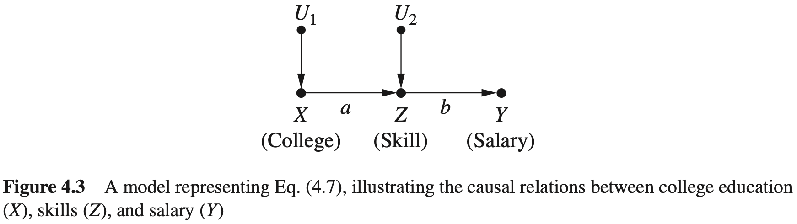
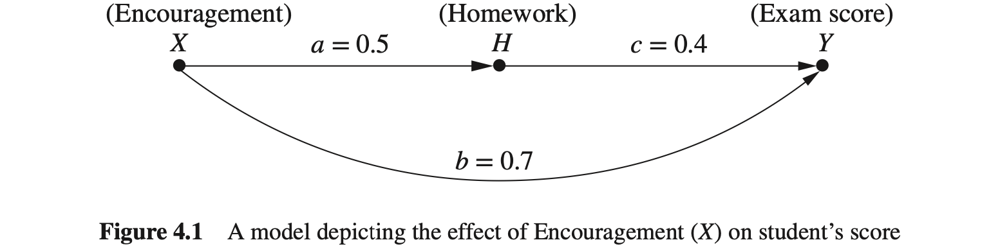

## 4. 反事实及其应用

本章按[正文](../content/4_Counterfactuals_and_Their_Applications.md)的习题编号整理中文解答，并以[完整答案手册](https://github.com/jneuer/pearl-primer/blob/master/Sol/Causal%20Inference%20in%20Statistics_%20Solution%20M%20-%20Judea%20Pearl.pdf)核对。图示优先引用仓库已有图片；没有对应图片的图示使用 HTML 绘制。

正文与所给手册的两个题号不同，对应关系为：

| 本章及仓库正文 | 参考手册 | 题目 |
| --- | --- | --- |
| 4.4.1 | 4.3.3 | 二值治疗的 ETT 与辛普森例子 |
| 4.4.2 | 4.3.4 | 乔是否开始吸烟 |

其他题号一致。本章 $Y_x$ 表示在同一个体、同一外生背景下将 $X$ 设为 $x$ 的潜在结果；不能把反事实条件简单改成观测条件。

#### 4.3.1

设 $X=U_1$、$Z=aX+U_2$、$Y=bZ$，$U_1,U_2$ 为相互独立的标准正态变量。$X,Z,Y$ 分别表示教育、技能、薪资。

(a) 对当前技能为 $Z=z$ 的人，求他们当初接受 $x$ 年教育时的期望薪资。

**解：** 干预后的结构结果是 $Y_x=abx+bU_2$。由于

$$
\mathrm{Var}(Z)=1+a^2,\qquad \mathrm{Cov}(U_2,Z)=1,
$$

高斯条件期望给出 $E(U_2\mid Z=z)=z/(1+a^2)$，因此

$$
E(Y_x\mid Z=z)=abx+\frac{bz}{1+a^2}.
$$

也可代入线性反事实公式 $E(Y_x\mid e)=E(Y\mid e)+ab[x-E(X\mid e)]$，其中 $E(X\mid Z=z)=az/(1+a^2)$。

(b) 证明教育的技能特定效应不依赖技能水平。

**解：** 两个干预结果相减时，背景技能项抵消：

$$
E(Y_1-Y_0\mid Z=z)=ab=E(Y_1-Y_0).
$$

更一般地，教育从 $x_0$ 增加到 $x_1$ 的效果为 $ab(x_1-x_0)$。条件化当前技能与把技能干预固定为 $z$ 不同，后者会截断教育到薪资的路径。

#### 4.3.2

(a) 如何用非实验数据估计图 4.1 的 $a,b,c$？

**解：** 假定图中独立误差的线性结构正确，$H=aX+U_H$、$Y=bX+cH+U_Y$。先回归 $H$ 对 $X$，再回归 $Y$ 对 $X,H$：

$$
a=R_{HX},\qquad b=R_{YX\cdot H},\qquad c=R_{YH\cdot X}.
$$

未中心化时还需截距。简单回归 $Y$ 对 $X$ 通常识别的是总效应 $b+ac$，不是直接系数 $b$。

(b) 对图 4.3 中薪资 $Y=1$ 的人，求教育从 0 增加到 1 的效应。

**解：** 对每个外生背景，$Y_1-Y_0=ab$，所以

$$
E(Y_1-Y_0\mid Y=1)=ab.
$$

(c) 对反转 $X,H$ 之间箭头、并加入交互项的模型，求总体效应 $\tau$ 和 ETT。

**解：** 模型为

$$
H=U_H,\quad X=aH+U_X,\quad Y=bX+cH+\delta XH+U_Y.
$$

对同一个体干预 $X$，$H$ 不变，故 $Y_1-Y_0=b+\delta H$。在零均值背景下，

$$
\tau=E(Y_1-Y_0)=b,\qquad ETT=b+\delta E(H\mid X=1).
$$

若 $U_H,U_X$ 为独立标准正态变量，则 $E(H\mid X=1)=a/(1+a^2)$，因此

$$
ETT=b+\frac{\delta a}{1+a^2},\qquad ETT-\tau=\frac{\delta a}{1+a^2}.
$$

只有零均值、单位方差而没有高斯性或线性条件均值假设时，应保留 $E(H\mid X=1)$，不能仅靠二阶矩把它替换成回归值。正文中把最后一个正值写成 $\tau-ETT$ 的地方，符号应反过来。

#### 4.4.1

本题对应参考手册 4.3.3。

(a) 证明二值治疗的 ETT 可以通过观测和实验数据的结合来估计。

**解：** 令 $\pi=P(X=1)>0$。对未治疗潜在结果作全概率分解，并利用一致性：

$$
E(Y_0)=E(Y_0\mid X=1)\pi+E(Y\mid X=0)(1-\pi).
$$

其中 $E(Y_0)=E(Y\mid do(X=0))$ 可由随机实验估计，其他右侧观测项可由自然选择的观测数据估计。解得

$$
E(Y_0\mid X=1)=\frac{E(Y\mid do(X=0))-E(Y\mid X=0)(1-\pi)}{\pi},
$$

因此

$$
ETT=E(Y\mid X=1)-\frac{E(Y\mid do(X=0))-E(Y\mid X=0)(1-\pi)}{\pi}.
$$

这不是说任意一种数据单独都足够。一般需要同一目标人群的实验结果和自然治疗选择的观测数据；若另有后门等识别假设，才可能只用观测数据。

(b) 用表 1.1 求自愿服药者的治疗效果，假定性别是唯一混杂因素。

| 性别 | 服药后的康复人数/人数 | 未服药后的康复人数/人数 |
| --- | --- | --- |
| 男性 | 81/87 | 234/270 |
| 女性 | 192/263 | 55/80 |
| 总计 | 273/350 | 289/350 |

**解：** 用性别调整估计总体未服药潜在康复率，保留原始计数而不先将分组比率取整：

$$
E(Y_0)=\frac{234}{270}\frac{357}{700}+\frac{55}{80}\frac{343}{700}
=\frac{6231}{8000}=0.778875.
$$

$\pi=1/2$，故

$$
ETT=\frac{273}{350}-\frac{6231/8000-(289/350)(1/2)}{1/2}
=\frac{1343}{28000}\approx0.0479643.
$$

自愿服药者的平均康复概率增加约 4.80 个百分点。手册的约 0.05 是使用取整分组比例后的近似值。

(c) 直接用后门公式计算 ETT，并比较。

**解：** ETT 调整应使用已治疗人群的性别权重：

$$
E(Y_0\mid X=1)=\sum_zE(Y\mid X=0,Z=z)P(z\mid X=1).
$$

因此

$$
ETT=\frac{273}{350}-\frac{234}{270}\frac{87}{350}-\frac{55}{80}\frac{263}{350}
=\frac{1343}{28000}.
$$

与 (b) 完全一致。两式相等来自一致性和全概率分解，不是近似巧合。

#### 4.4.2

本题对应参考手册 4.3.4。乔已经产生开始吸烟的自然倾向，想比较实际开始吸烟与克制该倾向的后果。

(a) 用 ETT 表述问题。

**解：** 令 $X=1$ 表示自然选择吸烟的类型或倾向，$Y=1$ 表示患肺癌。对于这类人，比较

$$
P(Y_1=1\mid X=1)\quad\text{与}\quad P(Y_0=1\mid X=1),
$$

差值为 $ETT=E(Y_1-Y_0\mid X=1)$。这是针对与乔具有同类自然选择倾向的人群的平均效果，不是对乔个人结局的确定预测。

(b) 需要什么数据？

**解：** 无额外识别结构时，可结合相同目标人群的观测与随机实验数据，使用上一题的二值治疗公式。若可信的后门或前门结构能识别所需总体干预结果，则可用观测数据识别 ETT；仅有任意一张吸烟与癌症边缘表一般不够。

(c) 使用表 3.1 的前门模型计算两种选择的概率。

**解：** 令 $Z$ 为焦油沉积，$U$ 为影响吸烟和肺癌的未测共同原因：

使用图 3.10(b) 的前门模型：

原始计数为：

| 自然选择 | 焦油 | 人数 | 患癌症 | 未患癌症 |
| --- | --- | ---: | ---: | ---: |
| 吸烟 | 有 | 380 | 57 | 323 |
| 吸烟 | 无 | 20 | 2 | 18 |
| 不吸烟 | 有 | 20 | 19 | 1 |
| 不吸烟 | 无 | 380 | 342 | 38 |

前门公式给出

$$
P(Y_0=1)=0.05[0.15\times0.5+0.95\times0.5]
+0.95[0.10\times0.5+0.90\times0.5]=0.5025.
$$

观测数据中 $P(Y=1\mid X=0)=361/400=0.9025$、$P(X=1)=1/2$，所以

$$
P(Y_0=1\mid X=1)=\frac{0.5025-0.9025\times0.5}{0.5}=0.1025.
$$

一致性给出 $P(Y_1=1\mid X=1)=59/400=0.1475$，于是

$$
ETT=0.1475-0.1025=0.045.
$$

在这组假设数据和模型下，克制吸烟倾向使该人群患癌概率从 14.75% 降至 10.25%，相差 4.5 个百分点。手册把 $59/400$ 先取为 0.15，导致最后出现 0.0475；使用原始计数应为 0.045。

#### 4.5.1

琼斯女士接受肿瘤切除术加放疗，之后未复发。试验中，仅手术和手术加放疗的复发率分别为 39%、14%。另有观测资料：总体复发率 30%，复发者中 70% 未选择放疗。使用式 (4.30) 更新其决定对于未复发的必要性概率。

**解：** 令 $X=1$ 为放疗、$Y=1$ 为未复发，则目标为

$$
PN=P(Y_0=0\mid X=1,Y=1).
$$

必须区分复发与未复发的编码。按题设将各项资料视为同一目标人群的数据，有

$$
P(Y_1=1)=0.86,\quad P(Y_0=1)=0.61,\quad P(Y=1)=0.70,
$$

$$
P(X=0,Y=0)=0.70\times0.30=0.21,\qquad
P(X=1,Y=0)=0.09.
$$

令 $s=P(X=1,Y=1)>0$。式 (4.30) 给出

$$
\max\left(0,\frac{P(Y=1)-P(Y_0=1)}s\right)
\le PN\le
\min\left(1,\frac{P(Y_0=0)-P(X=0,Y=0)}s\right),
$$

即

$$
\frac{0.09}{s}\le PN\le\min\left(1,\frac{0.18}{s}\right).
$$

题目没有给出放疗选择率，所以 $s$ 未确定。由 $s\le P(Y=1)=0.70$，至少可得

$$
PN\ge\frac{0.09}{0.70}=\frac9{70}\approx0.12857.
$$

结合概率不超过 1，数据还要求 $s\ge0.09$。因此仅凭所给资料，不能把 PN 识别成一个数，也不能断定其大于 $1/2$；应报告依赖 $s$ 的上述界限。若额外知道放疗率 $\pi$，则 $s=\pi-0.09$；若再假设放疗不会使本来不复发的人复发，单调性会给出 $PN=0.09/s$。

**注：** 参考手册把试验复发率与未复发率混用，并给出了 $PN\ge0.62$ 的结论。该数值不符合本题事件编码。此外，$P(X=1)=1$ 与已知 $P(X=0,Y=0)=0.21$ 不相容，不能作为增大分母的可行参数。

#### 4.5.2

设 $M=\gamma_1T+U_M$、$Y=\beta_1M+\beta_2T+U_Y$，比较处理 $T=1$ 与 $T=0$。

(a) 根据自然效应定义求 TE、NDE、NIE。

**解：** $M_0=U_M$、$M_1=\gamma_1+U_M$，且 $Y_{t,m}=\beta_1m+\beta_2t+U_Y$。在相同外生背景下相减可得

$$
NDE=E(Y_{1,M_0}-Y_{0,M_0})=\beta_2,
$$

$$
NIE=E(Y_{0,M_1}-Y_{0,M_0})=\beta_1\gamma_1,
$$

$$
TE=E(Y_1-Y_0)=\beta_2+\beta_1\gamma_1=NDE+NIE.
$$

(b) 若 $U_Y,U_M$ 相关，结果如何改变？

**解：** 给定结构参数后的效应表达式不变，因为上述个体差值中的误差项直接抵消。但从观测回归识别参数是另一件事：相关误差产生中介与结果之间的未测混杂，$Y$ 对 $M,T$ 的普通回归系数一般不再等于 $\beta_1,\beta_2$。不能把“结构效应公式不变”误读为“仍能直接回归估计”。

#### 4.5.3

考虑零均值外生误差的结构模型：

$$
\begin{aligned}
W&=\alpha T+U_W,\\
M&=\gamma_1T+\gamma_2W+U_M,\\
Y&=\beta_1M+\beta_2T+\beta_3TM+\beta_4W+U_Y.
\end{aligned}
$$

其中 $\beta_3TM$ 是处理与中介的交互项。

<!-- diagram:mediation -->
<table>
<caption>处理、上游中介、下游中介与结果（同名节点为同一变量）</caption>
  <tr><td align="center">T</td><td align="center">→ α</td><td align="center">W</td><td align="center">→ γ2</td><td align="center">M</td><td align="center">→ β1</td><td align="center">Y</td></tr>
  <tr><td align="center">T</td><td align="center">→ γ1</td><td align="center">→</td><td align="center">→</td><td align="center">M</td><td align="center">&nbsp;</td><td align="center">&nbsp;</td></tr>
  <tr><td align="center">T</td><td align="center">→ β2</td><td align="center">→</td><td align="center">→</td><td align="center">→</td><td align="center">→</td><td align="center">Y</td></tr>
  <tr><td align="center">&nbsp;</td><td align="center">&nbsp;</td><td align="center">W</td><td align="center">→ β4</td><td align="center">→</td><td align="center">→</td><td align="center">Y</td></tr>
</table>

图中的箭头表达方程的依赖关系；$T,M$ 对 $Y$ 的作用还包含交互项 $\beta_3TM$。

(a) 以 $M$ 为中介，求自然效应、中介必要部分 $TE-NDE$ 和中介充分部分 $NIE$。

**解：** 记 $k=\gamma_1+\alpha\gamma_2$，则 $E(W_0)=0$、$E(W_1)=\alpha$、$E(M_0)=0$、$E(M_1)=k$。当固定 $M=M_0$ 时，$W$ 仍随 $T$ 自然变化，故

$$
\begin{aligned}
NDE_M&=E(Y_{1,M_0}-Y_{0,M_0})=\beta_2+\alpha\beta_4,\\
NIE_M&=E(Y_{0,M_1}-Y_{0,M_0})=\beta_1k,\\
TE&=\beta_2+\alpha\beta_4+(\beta_1+\beta_3)k,\\
TE-NDE_M&=(\beta_1+\beta_3)k.
\end{aligned}
$$

这里在干预 $M$ 时，只有 $M$ 的结构方程被替换，不能把其上游变量 $W$ 也一起固定。

(b) 改以 $W$ 为中介，重新计算。

**解：** 固定 $W=W_0$ 后，$M$ 仍受 $T$ 的直接影响。分别在同一背景下计算嵌套潜在结果，得到

$$
\begin{aligned}
NDE_W&=\beta_2+(\beta_1+\beta_3)\gamma_1,\\
NIE_W&=\alpha(\beta_1\gamma_2+\beta_4),\\
TE-NDE_W&=\alpha[\gamma_2(\beta_1+\beta_3)+\beta_4].
\end{aligned}
$$

TE 与 (a) 相同。$TE-NDE$ 与 $NIE$ 的差分别为

$$
(TE-NDE_M)-NIE_M=\beta_3(\gamma_1+\alpha\gamma_2),
$$

$$
(TE-NDE_W)-NIE_W=\alpha\gamma_2\beta_3.
$$

因此存在交互时，自然直接效应与这里定义的自然间接效应一般不能简单相加为总效应。上述均值公式使用零均值背景；若背景均值不为零，应在嵌套期望中保留相应项。

#### 4.5.4

将中介公式用于招聘例子。$T=1$ 为男性、$T=0$ 为女性，$M=1$ 为高资格，$Y=1$ 为录用。估计性别差异和资格差异对录用差距的贡献。

**解：** 在题设的无未观测混杂、中介公式适用的假设下，数据为：

| 性别 | 高资格比例 $P(M=1\mid T)$ | 低资格录用率 | 高资格录用率 |
| --- | ---: | ---: | ---: |
| 女性 $T=0$ | 0.40 | 0.20 | 0.30 |
| 男性 $T=1$ | 0.75 | 0.40 | 0.80 |

女性总体录用率为 $0.6\times0.2+0.4\times0.3=0.24$；男性为 $0.25\times0.4+0.75\times0.8=0.70$，所以

$$
TE=0.70-0.24=0.46.
$$

保持女性的资格分布，只改变与性别相应的录用机制，自然直接效应为

$$
\begin{aligned}
NDE&=\sum_m[E(Y\mid T=1,m)-E(Y\mid T=0,m)]P(m\mid T=0)\\
&=(0.4-0.2)\times0.6+(0.8-0.3)\times0.4=0.32.
\end{aligned}
$$

保持女性对应的录用机制，只把资格分布改成男性的资格分布，自然间接效应为

$$
\begin{aligned}
NIE&=\sum_mE(Y\mid T=0,m)[P(m\mid T=1)-P(m\mid T=0)]\\
&=0.2(0.25-0.60)+0.3(0.75-0.40)=0.035.
\end{aligned}
$$

因此按这两个基准反事实，分别有

| 成分 | 录用概率差 | 占总差距的比例 |
| --- | ---: | ---: |
| 仅改变性别录用机制的直接差异 $NDE$ | 0.32 | $0.32/0.46\approx69.57\%$ |
| 仅改变资格分布的间接差异 $NIE$ | 0.035 | $0.035/0.46\approx7.61\%$ |
| 两种改变的交互部分 $TE-NDE-NIE$ | 0.105 | $0.105/0.46\approx22.83\%$ |

直接与间接的两个纯自然效应之和不等于 TE，因为资格对录用的作用在男女之间不同。若需要相加为总差距的二项分解，必须明确顺序：

$$
TE=NDE+(TE-NDE)=0.32+0.14,
$$

对应 69.57% 的直接部分和 30.43% 的中介必要部分；或者

$$
TE=(TE-NIE)+NIE=0.425+0.035,
$$

对应 92.39% 的直接必要部分和 7.61% 的中介充分部分。两种分解把交互项分配给不同成分，不能交叉拼接。

**注：** 手册的 $1-NDE/TE\approx30.4\%$ 是“改变资格所必要的部分”的比例，不能标成仅由性别直接造成的比例；$NIE/TE$ 约为 7.61%，而不是把两者都称作能够相加的完整贡献比例。
