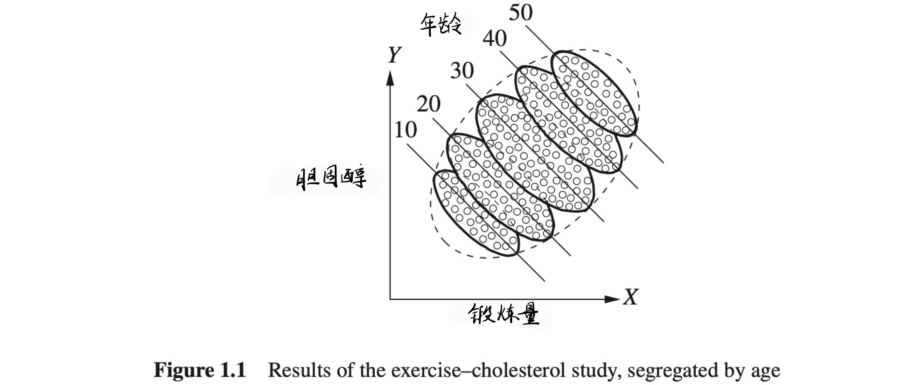
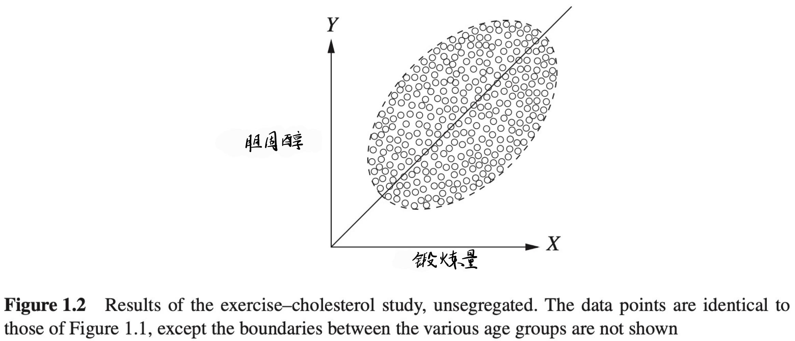
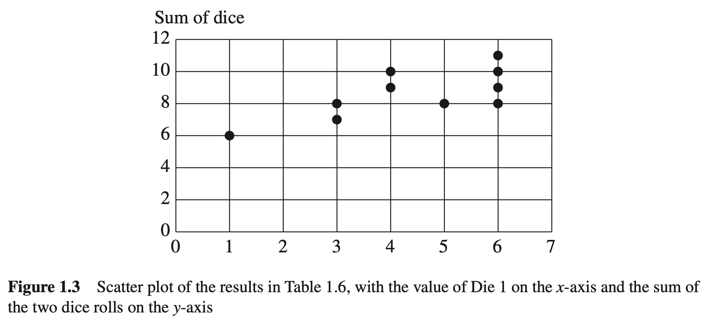
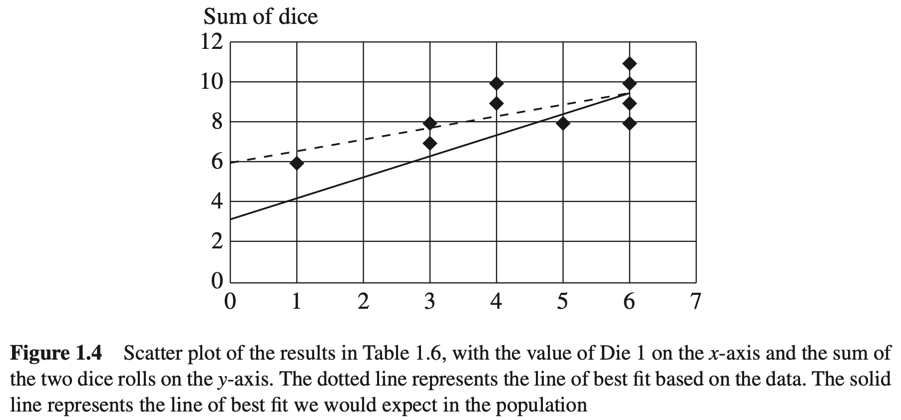
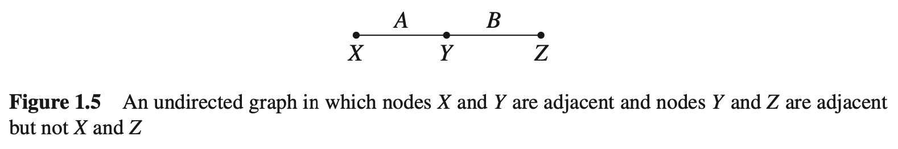
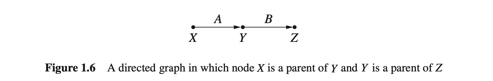
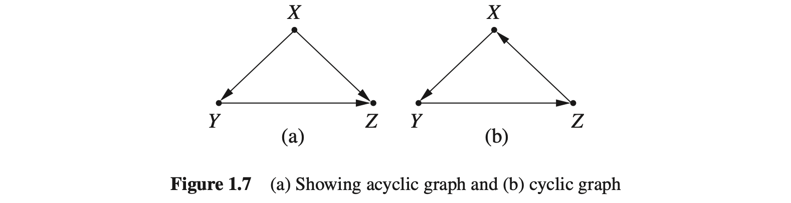
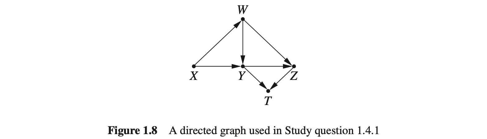

## 1. 引言：统计和因果模型

### 1.1 为什么研究因果关系

“为什么要研究因果关系”这一问题的答案与“为什么要研究统计学”几乎一样直接。我们研究因果关系，是因为我们需要理解数据进而指导行动与决策，并从成功与失败中总结出经验与教训。例如，通过研究预估吸烟对肺癌发病率、受教育程度对薪资水平、碳排放对气候产生的影响等。在研究因果关系的基础上，还要进一步挖掘因果关系产生的原因以及对结果产生的影响，这一点是很有价值的。例如，知道疟疾是通过蚊子传播还是通过“异常空气”传播后，我们就知道下次湿地旅行时应该携带蚊帐还是呼吸面罩了，而疟疾通过异常空气传播曾被许多人相信。

为什么要将因果关系区别于传统的统计学习课程作为独立的话题来研究呢？这一问题的答案并不明显。就起本身而言，“因果关系”这一概念说明了这个世界的一些信息，而实证的统计学方法却不能。

已有大量的事实证明了这一点。严格来说，因果关系不只是统计学的一个方面，当它与传统的统计学结合后，将会揭示世界的运行机制，这是仅靠统计方法不能实现的。例如，前面提到的任何问题，都不能用标准的统计学语言来描述，这可能令许多人感到吃惊。为了理解因果关系在统计学中的特殊作用，首先来看一个有趣的统计学悖论。他可以形象地说明为什么传统统计学必须补充新内容，才能处理诸如上面提到的那些因果关系。

### 1.2 辛普森悖论

辛普森悖论（Simpson’s paradox）以第一个论及该问题的统计学家Edward Simpson（生于1922年）命名，该悖论指出：存在这样的数据，总体上的统计结果与其每一个子部分的统计结果相反。下面通过一个实例说明。根据有关统计数据，平均来说，吸烟人群比不吸烟人群的收入更高；但当考虑吸烟人群的年龄因素时就可能发现，在每个年龄组，吸烟人群的收入低于不吸烟人群；如果再同时纳入年龄和学历这两个因素，可能又会发现相同年龄和学历的吸烟者比不吸烟者收入高。可见，随着考虑的因素增多，统计结果会不断发生逆转。在类似这样的问题中，想要确定吸烟是否会影响收入以及影响有多大，仅从数据表面似乎无法获得准确的答案。

在辛普森使用的经典例子（1951年）中，一组患者可以选择是否尝试一种新药。根据总体统计，服用该药的患者其痊愈率却低于未服药的患者。然而，当对患者按性别划分时，发现服药的男性患者比不服药男性患者痊愈率高，服药的女性患者也比不服药的女性患者痊愈率高！换句话说，这种药似乎分别有益于男性患者和女性患者，但从男性患者和女性患者所构成的全体受试者来看却是无益的，这似乎是矛盾的，也是不可思议的，这就是为什么该例子被认为是一个悖论的原因。有些人很难相信这一悖论，下面详细说明。

**例1.2.1** 记录选择服药与否的700例患者的痊愈率。其中，350例患者服药，350例患者不服药。研究结果如表1.1所示。

| 表1.1 | 用药         | 不用药       |
| ----- | ------------ | ------------ |
| 男性  | 81/87(93%)   | 234/270(87%) |
| 女性  | 192/263(73%) | 55/80(69%)   |
| 共计  | 273/350(78%) | 289/350(83%) |

如表1.1所示，第一行是男性患者服药与不服药的对比，第二行是女性患者服药与不服药的对比，第三行表示所有患者服药与不服药的对比。男性患者中，服药患者痊愈率（93%）比未服药患者痊愈率（87%）高。这一结果同样出现在女性患者中（分别是73%、69%）。然而，对全体受试者而言，服药患者痊愈率（83%）比未服药患者痊愈率（78%）高。

表1.1中数据似乎说明，如果知道患者的性别（男性或女性），那么就可以开出药物，但如果性别不明，则不能开药！然而，这个结论是荒谬的。如果药物有益于男性患者和女性患者，那么它必然对任何患者都有效，忽略患者的性别，并不会使药物变得无效。

鉴于这一研究结果，医生是否可为一名女性或男性或未知性别的患者开药呢？或者考虑一个正在评估药物对总人群有效性的决策者，他是否应该采信总人群的痊愈率数据？或者，他是否应该考虑按性别划分得出的亚群痊愈率数据？

这个问题无法简单地从统计学中找到答案。为了考察药物对患者的作用，首先要了解数据背后的原因，即产生结果的因果机制。例如， **假设已知另外一个事实** ：雌激素对患者痊愈有负面效应，那么不管是否服药，女性患者总比男性患者难以痊愈。另外从表1.1所示数据可以看出，女性患者比男性患者更倾向于被选中服用药物。所以如果随机选择一名服药者，这个人更有可能是女性，因此与不服药的受试者相比，服药者更加倾向于未痊愈，这就给人感觉药物对于全体受试者是无效的。也就是说，女性是与用药和未痊愈都相关的共同因素。因此为了评估有效性，我们需要比较同一性别的受试者，从而确保服药与否的痊愈率差异并不归因于雌激素。这意味着我们应该研究分类数据，这些数据明确告诉我们药物是有益的，这也符合我们的直觉，即分类的数据比未分类的数据“更详细”，因此具有更大的信息量。

**注：** 上述中仍然有一个假设，即先验知识。并且是因为这个先验知识后，才得知需要根据性别进行分组查看数据，进而得出结论的。因此，我目前认为先验知识(假设)尤其重要，它似乎很大程度上影响着结论。

对上面的例子做少许变化，进一步分析在连续取值的例子中是怎样发生类似的逆转的。以调研不同年龄段的每周锻炼量和胆固醇为例。如图1.1所示，当用横轴表示锻炼量，纵轴表示胆固醇，并按年龄划分时，可以看到每组呈总体下降趋势：即年轻人锻炼得越多，胆固醇越低，这同样适用于中年人和老年人。如果采用不按年龄划分的散点图，如图1.2所示，除未显示不同年龄组边界外，数据点与图1.1相同，而图1.2呈现出的是一个总体向上的趋势：人们越锻炼，胆固醇越高。为了探究这个问题的根源，我们再次挖掘数据背后的原因。如果已知 **对于愿意锻炼的老年人（见图1.1），无论锻炼与否，他们都更可能具有高的胆固醇** ，那么就很容易解释这个逆转了。年龄是与锻炼和胆固醇都相关的共同因素。因此，应该考虑将数据按年龄分组，在同年龄人之间做比较，也就不会得出锻炼量大的人胆固醇反而高这种由年龄而非锻炼导致的错误结论了。

**注：** 在这个连续型变量的例子当中，同样也是需要有先验知识(年龄会影响胆固醇)，从而才能得知可能“正确”的结果。因此，我仍然认为若在陌生应用场景中，若不能发现这种先验知识，那还是要很大程度上依赖事实数据。

然而，分类的数据并不总能给出正确的答案，这可能让一些读者感到惊讶。假设使用与例1.2.1相同的用药和痊愈数据，但在试验结束后还要记录每位患者的血压，而非性别。试验数据如表1.2所示，对比表1.1可知，区别仅在于行列标签有差异。在这一案例中，我们知道药物会通过降低服药患者的血压来影响痊愈率，但不幸的是，药物也会产生副作用。

| 表1.2  | 用药         | 不用药       |
| ------ | ------------ | ------------ |
| 低血压 | 81/87(93%)   | 234/270(87%) |
| 高血压 | 192/263(73%) | 55/80(69%)   |
| 共计   | 273/350(78%) | 289/350(83%) |

现在，你会给患者推荐这种药物吗？

同样，答案 **因数据分类方式的不同** 而不同。对全体受试者而言，药物可能因其对血压的影响而提高痊愈率。但将受试者分类后，在治疗后血压偏高和治疗后血压偏低的亚群中，我们无法观察到这样的结果，而只能看出因药物副作用而降低痊愈率。

与例 1.2.1 一样，本试验的目的是评估药物对痊愈率的总体影响。但在这个例子中，由于降低血压是药物影响痊愈率的结果之一，所以基于血压的分类就变得没有意义了（如果在治疗前记录患者的血压，并且 **假定仅有血压对治疗有影响，那么情况就不同了** ）。我们再次统计、分析全体受试者的试验数据，发现药物治疗增加了痊愈的可能性，于是我们确定应该推荐药物治疗。值得注意的是，虽然表 1.1 和表 1.2 中的数值相同，但表 1.1 的正确结论体现在分类后的数据，而表 1.2 的正确结论体现在总体数据。

由前面的例子可知，数据并没有为治疗决策提供足够的信息，例如，无法知道何时测定药物的作用，无法知道药物如何影响血压，也无法知道血压如何影响痊愈率。事实上，正如统计学教科书所常提及（且正确地）指出的，相关性并不等于因果关系。利用统计方法无法仅根据数据确定因果关系，因此统计方法无法为决策提供支持。

然而，统计学一直是以某种因果假设来解释数据的。事实上，在辛普森悖论中，按性别对数据进行分类后之所以会得出矛盾的结论，其根本原因在于我们确信治疗不能影响性别。如果治疗可以影响性别，那么悖论就不存在了，因为我们可以轻松假设数据背后的因果关系具有与按血压分类那个例子相同的结构。尽管“治疗不能影响性别”这一命题看似平凡，但它无法通过数据验证，也无法依据标准统计学写出数学表达式。事实上，列联表（如表 1.1 和表 1.2）无法表达任何因果信息，而统计推理通常是以列联表为基础的。

可喜的是，最新发展的统计学方法能够用于表达和解释因果假设。这些方法及其内涵是本书讨论的重点内容。通过运用这些方法，读者可以用数学语言描述任何复杂的因果场景，解决类似辛普森悖论引发的决策问题，就像在代数中求解未知量一样“有法可依”。利用这些方法，可以轻松识别上述例子中的问题，并用适当的统计分析方法加以解释。通过简单的逻辑操作组合而成的因果演算，将验证我们已有的直觉，包括不存在一种药物会仅对男性患者或女性患者有效，但对总体人群无效，以及对（服药后）具有相同血压患者的无用性。这些方法还能处理更复杂的问题，而在这些问题中无需再依赖直觉来分析。也就是说，简单的数学工具有助于解决政策评估中的实际问题，以及诸如事件如何发生和为何发生等科学问题。

但是，我们还没有做好完成这些任务的准备。为了严格表述数据中蕴含的因果关系，还需要完成以下工作：

第一，给出“因果关系”的可操作性定义；

第二，给出表达因果假设的形式化方法，即建立因果模型；

第三，给出因果模型结构与数据特征相联系的方法；

第四，给出从数据与模型的因果假设中得出结论的方法。

本书的前两章主要介绍因果假设建模及其与数据相关联的方法，接着在第3章我们使用这些假设和数据来解决因果问题。在开始所有讨论之前，首先必须给出因果关系的定义。因果关系看似简单直观，但几个世纪以来，仍没有一个得到统计学家和哲学家共同认可的、完整的因果关系定义。本书将因果关系的定义简化为：如果变量 $Y$ 的值以某种形式依赖于变量 $X$  的值，那么变量 $X$  就是变量 $Y$  的原因。之后我们会对这个定义稍加扩展，但现在仅将因果关系看作是一种“听从”，即如果 $Y$  听从 $X$ ，需依据 $X$  的取值来决定自身的值，那么 $X$  就是 $Y$ 的原因。

为了理解上述的因果方法，读者还必须了解一些概率学、统计学及图论的基本概念。因此，下面两节将给出这些必要的基本概念和示例。读者若对概率、统计和图论有基本了解，可直接转到第1.5节，这并不会影响对全书内容的理解。

#### 思考题

#### 1.2.1

下面的命题有什么错误？

(a) 数据表明，收入与婚姻具有高度的正相关。因此，如果你结婚了，你的收入会增加。

(b) 数据表明，随着火灾数量的增加，消防员的数最也会增加。因此，为了减少火灾，应该域少消员的数量。

(c) 数据表明，匆忙赶赴会议的人，通常更容易迟到。因此不要着急，否则你会迟到。

#### 1.2.2

球手蒂姆的击球率比他的队友弗兰克高。然而，有人注意到，弗兰克分别跟右手投手和左手投手比赛时，击球率都比蒂姆高。为什么会这样？（用表格说明）

#### 1.2.3

对于下面的每一个因果问题，判断应该使用分类数据还是总体数据以获得正确的结论。

(a) 肾结石治疗有两种方法：方案 A 和方案 B。医生对大的结石（因此病情更严重）更倾向于采用方案 A，对小的结石倾向于采用方案 B。如果一个患者不知道其体内结石的大小，为确定哪种治疗方案更有效，应该检索总体人群的数据还是结石大小不同亚群的数据？

(b) 在一个小镇上有两位医生，两人在其职业生涯中都曾做过 100 例手术。手术分两类：一类是非常复杂的，一类是非常简单的。相比而言，第一位医生经常做简单的手术，第二位医生经常做复杂的手术。假如你需要做手术，但不知道自己的情况是属于简单情况还是复杂情况。为尽可能提高手术成功概率，你应该查阅每位医生的总体成功率，还是分别查阅他们各自简单和复杂手术的成功率呢？

#### 1.2.4

为评估一种新药的疗效，进行了一项随机试验。总体来说，50%的患者被分配服用新药，50%的患者接受安慰剂。在试验的前一天，某位护士给一些表现抑郁的患者分发棒棒糖，他们中的大多数是被指定第二天接受治疗的（也就是说，护士这一轮查房正巧经过诊疗病房）。奇怪的是，试验数据显示了一个辛普森悖论：尽管总体来看，药物对受试者是有益的，但在得到棒棒糖的亚群和没有棒棒糖的亚群中，服用药物的患者比不服用药物的患者更不容易痊愈。假设吃棒棒糖本身对痊愈没有任何影响，回答以下问题。

(a) 药物对总体受试者是有益的还是有害的？

(b) 你的答案能反驳前面的按性别分类的例子吗？在那个例子中，依据性别对数据进行分类更合适。

(c) 画一个简略图解释这一内容（可参考 1.4 节相关内容）。

(d) 你怎么解释这个问题中出现的辛普森悖论？

(e) 如果棒棒糖在试验后的第二天分发（按同样的准则），答案会不同吗？

[提示：接受棒棒糖的患者更可能被安排药物治疗，同时这些患者更有抑郁表现，而抑郁是降低痊愈可能性的风险因素。]

### 1.3 概率和统计

由于统计本身通常关注的是可能性而非绝对性，因此对统计来说，概率表述极其重要。概率对于因果关系的研究同样重要，因为大多数因果命题都具有不确定性。例如，“粗心驾驶导致事故”这句话是对的，但并不意味着一位粗心的司机一定会引发事故。概率是表达不确定性的工具。本书将使用概率的语言及定理来描述我们对现实世界的信念和不确定性。为帮助读者更好地理解本书后续内容，下面介绍一些需要了解的重要术语和概念。

#### 1.3.1 变量

变量是能取多个值的任意属性或符号。例如，在一项比较吸烟者和不吸烟者健康状况的研究中，变量可以是参与者的年龄、性别、是否有家族癌症史、吸烟多少年等。可以把变量看作一个问题，而变量的值就是这个问题的答案。例如，“这个参与者多大年龄了？”“38岁”，这里“年龄”是变量，“38”是变量的值。变量 $X$ 所取值 $x$ 的概率记作 $P(X=x)$ ，没有歧义时通常简写为 $P(x)$ 。也可以讨论多个变量同时取值的概率，例如， $X=x$ 与 $Y=y$ 的概率记作 $P(X=x,Y=y)$ 或 $P(x,y)$ 。因此 $P(X=38)$ 表示人群中随机选择一人，其年龄为38岁的概率。

变量可分为离散变量和连续变量。离散变量（有时又称类别变量）可以从有限集或可数无限集中取值，这些集合中的值可以是任意范围的。例如，描述一个标准开关状态的变量是离散变量，因为它有两个值：“开”和“关”。连续变量可以从无限集中任取一个值，这些集合中的值是连续区间上的值（即，对于任何两个值，存在位于它们之间的第三个值）。例如，描述体重的变量是连续变量，因为重量的测量值是实数。

#### 1.3.2 事件

为一个变量或者一个变量集合指定一个值（或一组值）称为一个事件，例如，“ $X=1$ ”“ $X=1$ 或 $X=2$ ”“ $X=1$ 与 $Y=3$ ”“ $X=1$ 或 $Y=3$ ”是事件。“掷硬币正面朝上”“调查对象年龄大于40岁”“患者痊愈”等也是事件。“掷硬币的结果”是变量，“正面朝上”是它的值；“调查对象的年龄”是变量，“40岁以上”描述了变量可以取的值；“患者的状态”是变量，“痊愈”是值。这里“事件”的定义与人们日常概念并不完全一致，日常概念中的事件指发生某些变化。例如，在日常谈话中，我们不会将某人处于某个年龄作为一个事件，但我们会将他长了一岁作为一个事件。另一种从概率角度考虑事件的方法是：任何陈述性说明（说明可能是真或假）都是一个事件。

#### 思考题

#### 1.3.1

对于思考题 1.2.4 中棒棒糖的故事，可以识别出以下变量和事件。

#### 1.3.3 条件概率

假设已知事件 $B$ 已经发生，那么此时事件 $A$ 发生的概率称为在 $B$ 条件下 $A$ 的条件概率。已知 $Y = y$ 条件下， $X = x$ 的条件概率记作 $P(X = x\mid Y = y)$ ，通常简记为 $P(x\mid y)$ ，表示事件“ $X = x$ ”的概率取决于给定的条件“ $Y = y$ ”。例如，你现在得流感的概率很低，但是如果你量体温发现是39°C，那你患流感的概率就大大提高了。

当数据乐使用由频次表示的概率时，一种考虑条件的方法是依据一个或多个变量的值过滤数据。例如，假设查看2012年美国总统选举中美国选民的年龄，根根据人口普查品的统计，得到如表1.3所示的数据集。

在表1.3中，总共有132,949,000张选票，因此可以估算一位选民年龄小于45岁的概率。

$$
P(选民的年龄<45)=\frac{20,539,000+30,756,000}{132,949,000}=\frac{51,295,000}{132,949,000}=0.38
$$

假定已知一位选民的年龄大于29岁，想要估算其年龄小于45岁的概率，则只需用年龄大于29岁的条件简单过滤数据，形成一个新的数据集（如表1.4所示）。

这个新的数据中，总共有112,410,000张选票，因此可以估算

$$
P(选民的年龄<45\mid 选民的年龄>29)=\frac{30,756,000}{112,410,000}=0.27
$$

表1.3 2012年美国总统造学选民/人数（按年龄分组）

| 年龄组 | 选民人数    |
| ------ | ----------- |
| 18～29 | 20,539,000  |
| 30~44  | 30,756,000  |
| 45~64  | 52,013,000  |
| 65以上 | 29,641,000  |
| 合计   | 132,949,000 |

表1.4 2012年美国总统选举选民数（按大于29岁的年龄分组）

| 年龄组 | 选民人数    |
| ------ | ----------- |
| 30~44  | 30,756,000  |
| 45~64  | 52,013,000  |
| 65以上 | 29,641,000  |
| 合计   | 112,410,000 |

在固果何题的研究中，你这样的条件概率起着重要的作用，因为经常安比软在不同的过滤或是不条件下，结果的概率（或风险）变化情况。例 如，与不吸烟的人相比吸烟者患肺癌的概率。

#### 思考题

#### 1.3.2

如表1.5所示为某年关国成年人与性别与受教育水平的关系。

| 性别 | 最高学历 | 人数(单位：十万) |
| ---- | -------- | ---------------- |
| 男性 | 高中以下 | 112              |
| 男性 | 高中     | 231              |
| 男性 | 大学     | 595              |
| 男性 | 研究生   | 242              |
| 女性 | 高中以下 | 189              |
| 女性 | 高中     | 189              |
| 女性 | 大学     | 763              |
| 女性 | 研究生   | 172              |

(a) 估算 $P(高中)$ 。

(b) 估算 $P(高中+女性)$ 。

(c) 估算 $P(高中\mid 女性)$ 。

(d) 估算 $P(女性\mid 高中)$ 。

#### 1.3.4 独立性

存在这样一种情况：一个事作的概率不随另一个事件的发生面改变。例如，当观察到事件“你体温升高会增加你忠流感的率”时，对于事件“你的朋友乔38岁的概率没有任何影响”。在这种情况下，我们说这两个事件是独立的。一般地， 如果

$$
P(A\mid B)=P(A)\tag{1.1}
$$

则称事件A与及相互独立。也就是说，事件 $B$ 发生对 $A$ 发生的概率不能提供任何额外信息。如果这一等式不成立，则说 $A$ 与 $B$ 相关。相关与独立具有对称关系：如果 $A$ 与 $B$ 相关，那么 $B$ 也与 $A$ 相关；如果 $A$ 独立于 $B$ ，那么 $B$ 也独立于 $A$ 。形式化表述为：如果 $P(A|B)=P(A)$ ，那么 $P(B|A)=P(B)$ 一定成立。从直观上说，如果“烟”能够提供一些关于“火”的信息，那么“火”一定会能提供一些关于“烟”的信息。

给定第三个事件C，如果

$$
P(A\mid B,C)=P(A\mid C)\tag{1.2}
$$

并且 $P(B\mid A,C)=P(B\mid C)$ 。则称两个事件 $A$ 和 $B$ 条件独立。例如，事件“烟雾检测器报警”与事件“附近有火”相关。但在第三个事件“附近有烟雾”的条件下，这两个事件可能变为独立的，烟雾检测器只对烟雾的存在做出响应，而不是对产生烟雾的原因做出响应。在处理数据集或列联表时，如果事件 $A$ 和 $B$ 在对 $C$ 过滤所产生的新数据集中是独立的，则称在给定 $C$ 的条件下， $A$ 和 $B$ 是条件独立的。如果 $A$ 和 $B$ 在原始的、未经速的数集中过滤后是独立的，则称它们为边独立的。

变量与事件类似，相互之间也存在相关或独立关系。对于 $X$ 和 $Y$ 的每一个取值 $x$ 和 $y$ ，如果有

$$
P(X=x\mid Y=y)=P(X=x)\tag{1.3}
$$

则称两个变量 $X$ 和 $Y$ 是独立的。与事件的独立性一样，变量的独立性也具有对称关系，因此式(1.3)意味着 $P(Y=y\mid X=x)=P(Y=y)$ 成立。若对 $X$ 和 $Y$ 的某一对取值，式(1.3)不成立，则称 $X$ 和 $Y$ 相关。从这个意义上说，变量的独立性可以理解为一组事件的独立性。例如，“高度”和“音乐才能”是两个独立的变量，对每一个高度 $h$ 和音乐水平 $m$ ，一个人身高 $h$ 英尺的概率不会因为发现他有音乐水平 $m$ 而改变。

#### 1.3.5 概率分布

变量 $X$ 的稳定率分布是 $X$ 的每一个可能取值的概率的集合。例如，如果 $X$ 能取三个值：1、2和3，则 $X$ 的一种可能的概率分布是 $P(X = 1)= 0.5,P(X = 2)= 0.25,P(X = 3)= 0.25$。在概率分布中，概率的值必定为 $0\sim 1$，并且所有可能取值的概率和必为1。概率为0的事件是不可发生事件，概率为1的事件是必然事件。

连续变量也有概率分布，连续变量 $X$ 的概率分布用密度函数 $f$ 来表示。当将密度函数 $f$ 绘制到坐标平面上时，变量 $X$ 的值在 $a$ 和 $b$ 之间的概率是曲线下 $a$ 与 $b$ 之间的面积，用积分表示该面积为 $\int_a^bf(x)dx$ 。整个去线下的面积，即 $\int_{-\infty}^{+\infty}f(x)dx$ 必定为1。

变量集也有概率分布，称为联合分布。一组变量 $V$ 的联合分布是 $V$ 中变量值的每一种可能组合的概率的集合。例如，如果 $V$ 中有两个变量 $X$ 和 $Y$ ，每个变量均可取两个值：1和2，那么，V的一种可能的联合分布是： $P(X=1, Y=1) = 0.2$ , $P(X=1, Y=2) = 0.1$ , $P(X=2, Y=1) = 0.5$ , $P(X=2, Y=2) = 0.2$ 。与单变量概率分布一样，联合分布的概率之和也一定是1。

#### 1.3.6 全概率公式

下面介绍几个非常有用的概率论定理。首先，对于任何两个互斥事件A和B（即A和B不能同时发生），有

$$
P(A+B)=P(A)+P(B)\tag{1.4}
$$

由此，对于任何两个事件A和B，有

$$
P(A)=P(A,B)+P(A,\bar B)\tag{1.5}
$$

因为事件“ $A$ 与 $B$ ”与“ $A$ 与 $\bar B$ ”是互斥的——如果 $A$ 为真，那么“ $A$ 与 $B$ ”或“ $A$ 与 $\bar B$ ”必定有一个为真。例如，“Dana是位高个子男性”与“Dana是位高个子女性”是互斥的，如果Dana是高个子，那么他必定要么是高个子男性，要么是高个子女性，因此，有 $P(Dana是个高个子)=P(Dana是个高个子男性)+P(Dana是个高个子女性)$ 。

更一般地，如果任意一组事件 $B_1,B_2,\dots,B_n$ ，其中恰好有一个事件必定为真（穷举的互斥集称为一个划分），那么

$$
P(A)=P(A,B_1)+P(A,B_2)+\dots+P(A,B_n)\tag{1.6}
$$

式（1.6）称为全概率公式，将其应用于日常生活中的实际例子，便可很容易地验证式（1.6）成立：例如，从整副牌中随机抽取一张，那么它正好是 $J$ 的概率等于它是红桃 $J$ 的概率加上梅花 $J$ 的概率，再加上方块 $J$  和黑桃 $J$ 的概率。事件 $A$ 与每个 $B_i$ 的联合概率称为 $A$ 在 $B_i$ 上的边缘概率，而对 $A$ 在所有 $B_i$ 上的边缘概率求和得到 $P(A)$ ，称为 $A$ 的边缘概率。

如果已知 $B$ 的概率以及在 $B$ 条件下 $A$ 的概率，可以通过简单的乘积推导求出 $A$ 与 $B$ 同时发生的概率：

$$
P(A,B)=P(A\mid B)P(B)\tag{1.7}
$$

例如，乔既风趣又聪明的概率等于一位聪明人风趣的概率，乘以乔聪明的概率。

除法法则

$$
P(A\mid B)=\frac{P(A,B)}{P(B)}
$$

被看作条件概率的形式化定义，正如表 1.3 和表 1.4 所示的案例，把条件视为过滤操作即可验证该法则的合理性。当以 $B$ 为条件时，从原始联合表中去掉所有与 $B$ 冲突的事件，得到的子表也表示一个概率分布，并且与所有概率分布一样，它的和必定为 1。由于子表中的每行在原表分布中的概率之和为 $P(B)$ （根据定义），那么可以通过每行乘以 $\frac{1}{P(B)}$ 来确定它们在新表中的分布概率。

式（1.7）蕴含了独立性的定义，到目前为止，对这一概念的使用是非正式的，意味着“没有给出额外的信息”。在概率分布中，它有一种数值形式的表示，即若事件 $A$ 和 $B$ 独立，则有：

$$
P(A,B)=P(A)P(B)
$$

例如，要检查两枚银币的结果是否真正独立，应该计算它们同时呈现背面的频次，并确定它等于每枚银币呈现背面的频次的乘积。

由式(1.7)及对称性 $P(A,B)=P(B,A)$ ，可以直接得到概率论中最重要的定理之一——贝叶斯法则：

$$
P(A\mid B)=\frac{P(B\mid A)P(A)}{P(B)}\tag{1.8}
$$

借助式(1.7)中的乘法法则，可以把全概率公式表示为条件概率的加权和：

$$
P(A)=P(A\mid B_1)P(B_1)+P(A\mid B_2)P(B_2)+\dots+P(A\mid B_n)P(B_n)\tag{1.9}
$$

式(1.9)非常有用，因为我们常常发现无法直接计算P(A)，但通常情况下更容易计算条件概率，比如 $P(A\mid B_k)$ ，它与特定的背景条件有关，而不是与背景条件无关的 $P(A)$ 。例如，假设有来自两个产地的一批小零件，其中30%是工厂A生产的，次品率是 $\frac{1}{5,000}$ ；70%是工厂B生产的，次品率是 $\frac{1}{10,000}$ ，求一个随机选择的小零件是次品的概率。这是一个伤脑经的问题，但是按照式(1.9)分解就变得容易了，有

$$
\begin{aligned}
P(次品)&=P(次品\mid A)P(A)+P(次品\mid B)P(B)\\
&=\frac{0.30}{5000}+\frac{0.70}{10000}=\frac{1.30}{10000}=0.00013
\end{aligned}
$$

或者举一个稍难的例子，假设掷两个骰子，想知道掷第二个骰子比第一个骰子点数大的概率，即求 $P(A)=P(掷2>掷1)$ 。没有一个直观的方法可以立即算出这个概率。如果以第一个骰子的点数为条件，将其分解到条件 $B_1,B_2,\dots,B_n$ ，就容易解决了，即有

$$
\begin{aligned}
P(掷2>掷1)&=P(掷2>掷1\mid 掷1=1)P(掷1=1)+P(掷2>掷1\mid 掷1=2)P(掷1=2)+\dots+P(掷2>掷1\mid 掷1=6)P(掷1=6)\\
&=(\frac{5}{6}\times\frac{1}{6})+(\frac{4}{6}\times\frac{1}{6})+(\frac{3}{6}\times\frac{1}{6})+(\frac{2}{6}\times\frac{1}{6})+(\frac{1}{6}\times\frac{1}{6})+(\frac{0}{6}\times\frac{1}{6})\\
&=\frac{5}{12}
\end{aligned}
$$

式(1.9)所给出的分解法有时也称为“替代率”或“扩展法”，在本书中，我们将其称为条件化B。

#### 1.3.7 使用贝叶斯法则

在使用贝叶斯法则时，有时把事件 A 称为假设，事件 B 称为证据。这种命名反映了贝叶斯定理的核心目的。在许多情况下，已知或可以轻易确定 （假设 A 正确的情况下，证据 B 发生的概率），但很难计算 （在得到证据 B 的情况下，假设 A 发生的概率）。然而，在现实世界中，后者是人们经常需要回答的问题。一般来说，在证据 B 发生后，希望将某些假设的信任度由 $P(A)$ 更新为 $P(A\mid B)$ 。在这种情况下，为了精确地使用贝叶斯法则，必须将某一个假设当作一个事件，并对所有假设赋予一个事先的概率分布，称为先验分布。

例如，假设在赌场中听到庄家喊出“11”。你恰好知道，该事件只能由骰子赌局和轮盘赌局这两种游戏引发，并且在任意时刻，这两种游戏正在进行的赌局数量完全相等。那么，在听到庄家报“11”的情况下，他正在进行骰子赌局的概率是多少呢？

在这种情况下，“骰子赌”是**假设**，而“11”是**证据**。要立即计算出这个概率是有困难的，但反过来，一轮骰子赌的结果是“11”的概率却很容易计算。骰子赌是一种游戏，掷两个骰子后计算点数的和。显然，两个骰子点数和为11的可能性是 $\frac{2}{36}=\frac{1}{18}$ ， $P(11\mid 骰子赌)=\frac{1}{18}$ 。在轮盘赌中，有等概率的38种结果，因此 $P(11\mid 轮盘赌)=\frac{1}{38}$ 。在此情况下，有两种可能的假设：“骰子赌”和“轮盘赌”，因为他们的赌局数相等， $P(骰子赌)=P(轮盘赌)=\frac{1}{2}$ ，这些是对两种赌局的先验知识。有全概率公式， 

$$
\begin{aligned}
P(11)&=P(11\mid 骰子赌)P(骰子赌)+P(11\mid 轮盘赌)P(轮盘赌)\\
&=\frac{1}{2}\times\frac{1}{18}+\frac{1}{2}\times\frac{1}{38}=\frac{7}{171}
\end{aligned}
$$

现在已经很容易地获取了确定 $P(骰子赌\mid 11)$ 所需要的全部信息： 

$$
P(骰子赌\mid 11)=\frac{P(11\mid 骰子赌)\times P(骰子赌)}{P(11)}=\frac{1/18\times1/2}{7/171}=0.679
$$

贝叶斯法则的另一个应用例子是蒙提霍尔问题（即三门问题），这是统计学中一个经典的脑筋急转弯问题。在这个问题中，你是一位由蒙提霍尔主持的游戏节目中的参赛者。蒙提向你展示三扇门 A、B 和 C，其中只有一扇门后面有一辆新车（另外两扇门后面是山羊）。如果你选对了车的门，车就归你；否则，你得到一只山羊。你随便猜测了一扇门，比如 A，然后在没有任何暗示的情况下，蒙提打开了 C 门，C 门后面是山羊。他告诉你，现在你可以换到 B，或者坚持选择 A。无论你选哪一扇门，你都将得到它后面的东西。

你的最好策略是坚持打开A门，还是换到B门？

当第一次遇到这个问题时，很多人认为，由于车的位置与你第一次选择门之间是独立的，换门既没有好处也没有坏处；车在A门后面的概率等于在B门后面的概率。

但是多年以后，统计学的学生惊愕地发现，正确的答案为，与坚持A门相比，如果换成B门，赢得汽车的可能性会变为原来的两倍。对这个有些违背直觉的结果通常的解释是，当最初选择一扇门时，你有 $\frac{1}{3}$ 的概率选到有车的那扇门。因为不管最初你是否选中了有车的那扇门，蒙蒂总是打开有山羊的那扇门，之后你没有接收到任何新信息。因此，你选择的那扇门有车的概率仍然是 $\frac{1}{3}$ ，其余 $\frac{2}{3}$ 的概率必定属于剩下的另一扇关闭的门。

可以用贝叶斯法则来证明这一令人惊讶的事实：这里有三个变量： $X$ ，参赛者选择的门； $Y$ ，后面藏有汽车的门； $Z$ ，蒙蒂打开的门。 $X$ 、 $Y$ 和 $Z$ 均可取值 $A$ 、 $B$ 或 $C$ 。现在要证明 $P(Y=B\mid X=A,Z=C)>P(Y=A\mid X=A,Z=C)$ 。先验假设是车在 $A$ 门后面，证据是蒙蒂打开了 $C$ 门。我们把证明留给读者（见思考题 1.3.5）。为进一步加强直觉认识，可以把游戏推广到有 100 扇门（1 扇门后有汽车，99 扇门后有山羊）的情况。参赛者仍然选择一扇门，但这次蒙蒂打开了 98 扇门——所有刻意打开的门后面都是山羊——在最后两扇门之间，给参赛者提供是否更换选择的机会。现在，选择更换应该是显而易见的。

为什么蒙蒂打开 $C$ 门构成了改变车位置的证据呢？毕竟它没有为你最初的选择是否正确提供任何证据。当他准备打开某扇门的时候，不管是 $B$ 还是 $C$ ，你当然知道它的后面没有车。答案是，在你选择 $A$ 门之后，蒙蒂不可以再打开它，但他本来可以打开其他门。但他没有这样做，这意味着他打开 $C$ 门更有可能是因为被迫这样做：这提供了汽车在 $B$ 门后面的证据。这是贝叶斯分析的一般性原理：任何经得起反驳的假设都会变得更有可能。 门容易被反驳（即蒙蒂本来可以打开它），但 $A$ 门不是。因此， $B$ 门变成了更可能的位置。

读者可能会发现，上面的解释充满了反事实术语，例如，“他本来可以打开”“因为他可能被迫”“他本来打算打开”。事实上， **蒙蒂霍尔问题** 在概率游戏中如此特别的原因就在于其 **对数据生成过程的高度依赖** 。它表明我们的概念不应该仅依赖于观察到的事实，还应该依赖于产生这些事实的过程。特别地，“汽车不在 $C$ 门后”的信息本身，不足以说明这个问题。为了计算所涉及的概率，我们也必须知道，在打开 $C$ 门之前主持人有哪些选项。本书第 4 章将形式化地陈述反事实理论，以便描述这样的过程和可能的选择，形成关于选择的正确概念。

有一些质疑贝叶斯法则的争议。当试图在给定一些证据条件下确定假设的概率时，通常无法根据情境的一部分或发生的频次来计算先验概率 $P(A)$ 。思考一下，如果不知道赌场里轮盘赌桌与骰子赌桌的比例，如何确定先验概率 $P(骰子赌)$ 呢？也许会尝试设定 $P(A)=\frac{1}{2}$ ，用以表达一种无所知的情境。但如果获知了一些信息，比如轮盘赌桌在这个赌场里并不常见，或者报数人的声调让我们联想起昨天听到的骰子赌的庄家，这会如何影响结果？在这些情况下，为了使用贝叶斯法则，可以将 $P(A)$ 设置为对假设的主观确信度，这比其他概率值更为可靠。然而， **对于贝叶斯法则的争论源于这种确信度的主观性质** 。例如，如何确定指定的 $P(A)$ 准确地概括了关于这个假设的已知信息？是否应该坚持将对某个问题的所有正反观点归结为一个数字？即使这样做了，为什么又要根据客观事件的发生频次来更新假设的主观确信度呢？一些行为实验表明， **人们不会依照贝叶斯法则更新他们的信念，尽管很多人相信他们应该这样做** 。如果不是推理上有问题，那么这种偏离规则的行为可能代表了一种妥协，并导致次优决策。关于如何恰当使用贝叶斯定理的争论一直持续到今天。然而，尽管存在这些争议，贝叶斯法则仍然是统计学中一个强大的工具。本书中将利用它来实现我们的目标。

#### 思考题

#### 1.3.3

思考第 1.3.6 节描述的赌场问题。

(a) 假设赌场中轮盘赌桌是骰子赌桌的两倍，计算 $P(骰子赌\mid 11)$ 。

(b) 假设赌场中骰子赌桌是轮盘赌桌的两倍，计算 $P(骰子赌\mid 10)$ 。

#### 1.3.4

假设有三张卡片，卡片1正反面各一个黑脸，卡片2正反面各一个白脸，卡片3正反面分别为一个白脸和一个黑脸。你随机选择张卡片并放在桌子上，发现面朝上的是黑脸。那么，这张卡片明下的一面也是黑脸的概率是多少？

(a) 根据你的直觉说明，这张卡片朝下的一面也是黑脸的概率是 $\frac{1}{2}$ 。为什么它也许大于 $\frac{1}{2}$ ？

(b) 根据下列的变量，给出你认为容易估计的概率和条件概率，例如， $P(C_D=黑脸)$ 。

$$
I=选择卡的标识(卡1, 卡2, 卡3)\\
C_D=朝下一面的颜色(黑脸, 白脸)\\
C_U=朝上一面的颜色(黑脸, 白脸)
$$

使用你上面的估计，找出选择卡片朝下一面是黑脸的概率。

(c) 对随机选择的卡片，如果你看到它的正面是黑脸，使用贝叶斯法则找出其背面是黑脸的正确概率。

#### 1.3.5

使用贝叶斯法则证明，在蒙蒂霍尔问题中，换门提高你赢得汽车的概率。

#### 1.3.8 期望值

在统计学中，常常遇到要处理的数据量和概率分布规模太大，以至于无法有效检测变量取值的所有可能组合的情况。作为替代，常以损失部分信息为代价，用统计量来表示分布的、有意义的特征。这其中最常用的是期望值，也称为均值，它可以用于变量取值为数值的情况。变量 $X$ 的期望值表示为 $E(X)$ ，等于变量的每一个可能的取值与变量取这个值的概率的乘积，再对来积求和，即

$$
E(X)=\sum_xxP(X=x)\tag{1.10}
$$

例如，用变量 $X$ 表示掷一次六面骰子的结果，概率分布如下：

$$
P(1)=\frac{1}{6},P(2)=\frac{1}{6},P(3)=\frac{1}{6},P(4)=\frac{1}{6},P(5)=\frac{1}{6},P(6)=\frac{1}{6}
$$

则 $X$ 的期望值为

$$
E(X)=(1\times\frac{1}{6})+(2\times\frac{1}{6})+(3\times\frac{1}{6})+(4\times\frac{1}{6})+(5\times\frac{1}{6})+(6\times\frac{1}{6})=3.5
$$

同样地， $X$ 的任意函数 $g(X)$ 的期望值，可通过在 $X$ 的所有取值上对 $g(x)P(X=x)$ 求和得到，即：

$$
E(g(x))=\sum_xg(x)P(x)\tag{1.11}
$$

例如，若掷一个骰子后能得到点数平方的现金奖励，即有： $g(X)=X^2$ ，则奖励的期望值为：

$$
E(g(X))=(1^2\times\frac{1}{6})+(2^2\times\frac{1}{6})+(3^2\times\frac{1}{6})+(4^2\times\frac{1}{6})+(5^2\times\frac{1}{6})+(6^2\times\frac{1}{6})=15.17\tag{1.12}
$$

还可以计算 $Y$ 关于条件 $X$ 的期望值 $E(Y\mid X=x)$ ，方法是对 $Y$ 的每一个可能取值 $y$  乘以 $P(Y=y\mid X=x)$ 并求和，即

$$
E(Y\mid X=x)=\sum_yyP(Y=y\mid X=x)\tag{1.13}
$$

 $E(X)$ 是估计 $X$ 可能取值的一种方法。特别地，对于 $g$ 的值的所有猜测中，选择 $g=E(X)$ 可使得方差期望  $E(g-X)^2$ 最小。类似地，假定观察到 $X=x$ ，则 $E(Y\mid X=x)$ 表示对 $Y$ 的最佳估计。如果 $g=E(Y\mid X=x)$ ，那么使得方差期望 $E((g-Y)^2\mid X=x)$ 最小。

**注：** 可得到常用的概论论结论 $g=E(X)\quad s.t.\quad\min E(g-X)^2$ ，若要证明，不妨计算 $h(g)=E(g-X)^2$ ，后计算 $\frac{d}{dg}h(g)=0$ ，即可得证。

如表 1.3 所示，2012 年美国总统选举选民的期望年龄为 $E(\text{选民的年龄}) = 23.5 \times 0.16 + 37 \times 0.23 + 54.5 \times 0.39 + 70 \times 0.22 = 48.9$ 

对于该计算，假定每个类别中的各年龄的可能性相同，例如，选民是18岁的可能性与25岁相同，30岁的可能性与44岁相同。还假设投票者的最大年龄是75岁。这意味着，随机猜测一个选民的年龄，如果与真实值相差 $e$ 年，将会失去 $e^2$ 美元，那么猜测48.9，则平均损失会最小。同样，如果要求去猜测一个小于45岁的随机选民的年龄，则最好的赌注是

$$
P(\text{选民的年龄}\mid\text{选民的年龄}<45)=23.5\times0.40+37\times0.60=31.6\tag{1.14}
$$

用期望作为预测或“最佳猜测”的依据，在很大程度上取决于 $X$ 或 $(Y\mid X=x)$ 分布的假设，即它们的分布是近似对称的。然而，如果感兴趣的分布是高度偏态的，那么其他预测方法可能更好。例如，在这种情况下，可以使用 $X$ 分布的中值作为“最佳估计”，这个估计使期望的绝对误差 $E(|g - X|)$ 最小，这里不再进一步探讨这种方法。

**注：** 可以得到的结论为若对一个分布估计为 **中值** ，则满足 $\min E(|g-X|)$ 。

#### 1.3.9 方差和协方差

变量 $X$ 的方差记为 $Var(X)$ 或 $\sigma^2_X$ ，用于粗略地衡量 $X$ 的值在数据集或群体中“偏离”平均值的情况。如果 $X$ 的值均处于一个值附近，则方差相对较小；如果X的值覆盖了较大的范围，方差则相对较大。在数学上，将变量的方差定义为变量与均值的平均平方差。可先找出均值 $\mu$ ，然后依据如下公式计算得到：

$$
\sigma^2_X=E((X-\mu)^2)\tag{1.15}
$$

随机变量 $X$ 的标准差 $\sigma_X$ 是其方差的平方根。不同于方差， $\sigma_X$ 与 $X$ 有相同的单位表示。例如，根据表 1.3，小于 45 岁选民的年龄分布的方差，可以很容易地根据式（1.15）算出：

$$
\begin{aligned}
\sigma_X^2&=((23.5-31.6)^2\times0.40)+((37-31.6)^2\times0.60)\\
&=(65.61\times0.40)+(29.16\times0.60)\\
&=26.24+17.5=43.74
\end{aligned}
$$

而标准差是

$$
\sigma_X=\sqrt{43.74}=6.61
$$

这意味着，随机选择一个选民，他的年龄与平均年龄 31.6 岁相比，偏离值在 6.61 岁以内的概率很高。这种解释可以量化。例如，对于正态分布的随机变量 $X$ ，其中约 2/3 的值落在期望值或均值的一个标准差内，并且，大约 95% 的值落在偏离均值的两个标准差内。

乘积 $(X-E(X))(Y-E(Y))$ 的期望具有特别的重要性，它称为 $X$ 和 $Y$ 协方差，记为 $Cov(X,Y)$ 或 $\sigma_{XY}$ ：

$$
\sigma_{XY}\triangleq E((X-E(X))(Y-E(Y)))\tag{1.16}
$$

它用于衡量 $X$ 和 $Y$ 共变的程度，即这两个变量一起变化的程度，或称为“相关”。这种对相关性的度量实际上反映了 $X$ 和 $Y$ 共变的特定方式，它体现了 $X$ 和 $Y$ 线性共变的程度。读者可以把这看作是绘制点 $(X,Y)$ ，然后通过一条直线来刻画 $Y$ 随 $X$ 的变化而变化的程度。

协方差 $\sigma_{XY}$ 通常被归一化为相关系数

$$
\rho_{XY}=\frac{\sigma_{XY}}{\sigma_X\sigma_Y}\tag{1.17}
$$

这是一个标量值，范围为 -1 到 1，表示通过各自的标准差归一化 $X$ 和 $Y$ 后，最佳拟合直线的斜率。相关系数 $\rho_{XY}$ 等于 1 当且仅当一个变量能以线性方式预测另一个变量时；如果没有这样的线性预测，相关系数 $\rho_{XY}$ 为 0。无论什么情况下，这样的预测方法都不如随机估计效果好。相关系数 $\sigma_{XY}$ 和 $\rho_{XY}$ 的含义将在后面讨论。这里需要注意的是，共变的程度可以利用式（1.16）和式（1.17）根据联合分布 $P(X,Y)$ 计算得出。此外，当 $X$ 和 $Y$ 相互独立时， $\sigma_{XY}$ 和 $\rho_{XY}$ 都为 0。还需特别注意， $Y$ 和 $X$ 的非线性关系无法通过简单的数值来刻画，需要借助完全明确化的条件概率 $P(Y=y\mid X=x)$ 。

#### 思考题

#### 1.3.6

(a) 证明：当 $X$ 和 $Y$ 相互独立时， $\sigma_{XY}$ 和 $\rho_{XY}$ 都为0。[提示：使用式(1.16)和式(1.17)。]

(b) 给两个变量高度依赖，但它们的协相关系数仍然为0的例子。

#### 1.3.7

同时抛掷两枚硬币来确定乡镇俱乐部两名玩家的收益。当且仅当至少一枚硬币正面朝上时，1号玩家获得1美元。当且仅当两枚硬币落地面相同时，2号玩家得到1美元。现 $X$ 表示1号玩家的收益， $Y$ 表示2号玩家的收益。

(a) 指出并描述概率分布：

$$
P(x),P(y),P(x,y),P(y\mid x)和P(x\mid y)
$$

(b) 使用(a)中的描述，计算下面的度量：

$$
E(X),E(Y),E(Y\mid X=x),E(X\mid Y=y),\sigma_X^2,\sigma_Y^2,\sigma_{XY},\rho_{XY}
$$

(c) 如果 2号玩家获得 1元，则 1号玩家收益的最佳估计是多少？

(d) 如果 1号玩家获得 1元，则 2号玩家收益的最佳估计是多少？

(e) 存在相互独立的两个事件 $X=x$ 和 $Y=y$ 吗？

#### 1.3.8

一个掷双骰子游戏（一次掷两个独立的骰子），其中， $X$ 表示骰子1投掷结果， $Z$ 表示骰子2投掷结果， $Y$ 表示骰子1和骰子2投掷结果和。计算下面理论估计的结果。

表1.6描述了12轮掷双骰子游戏的结果。

(a) $E(X),E(Y),E(Y\mid X=x),E(X\mid Y=y)$ (对 $x$ 和 $y$ 的每一个值)，以及 $\sigma_X^2,\sigma_Y^2,\sigma_{XY},\rho_{XY},\sigma_{XZ}$ 。

(b) 根据表1.6中的数据，找出(a)中各个参数的样本估值。[提示：使用软件包。]

(c) 假设测得 $X=3$ ，利用 (a) 中的结果，确定 $Y$ 的最佳估计。

(d) 假设测得 $Y=4$ ， $X$ 的最佳估计是什么？

(e) 假设测得 $Y=4$ 和 $Z=1$ ，$X$ 的最佳估计是什么？说明为什么它与(d)的结果不一样。

| 轮次   | X    | Z    | Y    |
| ------ | ---- | ---- | ---- |
| 第1轮  | 6    | 3    | 9    |
| 第2轮  | 3    | 4    | 7    |
| 第3轮  | 4    | 6    | 10   |
| 第4轮  | 6    | 2    | 8    |
| 第5轮  | 6    | 4    | 10   |
| 第6轮  | 5    | 3    | 8    |
| 第7轮  | 1    | 5    | 6    |
| 第8轮  | 3    | 5    | 8    |
| 第9轮  | 6    | 5    | 11   |
| 第10轮 | 3    | 5    | 8    |
| 第11轮 | 5    | 3    | 8    |
| 第12轮 | 4    | 5    | 9    |

#### 1.3.10 回归

在统计学中，通常希望根据一个变量 $X$ 的值来预测另一个变量 $Y$ 的值。例如，根据年龄来预测一位学生的身高。通过前面的介绍可以看出， $Y$ 基于 $X$ 的最佳预测由条件期望 $E(Y \mid X = x)$ 给出，但这需要假定已知条件期望，或者能从联合分布 $P(y, x)$ 中计算出条件期望。而使用回归方法，则可以直接从数据中做出预测。我们试图找到一个函数，通常是线性函数，这个函数以 $X$ 的观测值作为输入，以 $Y$ 的值作为输出，使得 $Y$ 的预测值（输出）与实际值的平方误差量最小。

下面从一个散点图开始，将数据集的每种情况都画在同一个坐标平面上，其中，预测变量或输入变量位于横轴，预测结果变量位于纵轴上，如图1.3所示。

最小二乘回归线是使得散点图上的点到这条线的垂直距离的均方差量最小的直线，也就是说，如果散点图上有 $n$ 个数据点 $(x,y)$ ，对于任何一个数据点 $(x_i,y_i)$ ，直线 $y=\alpha+\beta x$ 在 $x_i$ 的值用 $y_i'$ 表示，那么最小二乘回归线就是使式（1.18）的值最小的直线：

$$
\sum_i(y_i-y_i')^2=\sum_i(y_i-\alpha-\beta x_i)^2\tag{1.18}
$$

下面分析斜率 $\beta$ 与概率分布 $P(x, y)$ 是如何关联的。假设连续投掷12轮骰子，得到如表1.6所示结果。根据该数据，根据骰子 $1(X)$ 的值来预测两个骰子的点数和 $Y$ ，图1.3为该数据的散点图。对于该例子，最小二乘回归线如图1.4所示，虚线表示样本数据的最佳拟合直线，实线表示总体数据的最佳拟合直线。注意，我们使用的样本数据的回归线不必与总体数据的回归线相同。当允许样本量增加到无限大时，将得到总体数据的回归线。图1.4中的实线表示理论上的最小二乘线，由式（1.19）给出：

$$
y=3.5+1.0x\tag{1.19}
$$

虚线表示样本的最小二乘线，由于抽样的原因，在斜率和截距两方面均与理论直线存在差异。

因为已知给定第一个骰子值为 $x$ 的条件下两个骰子和的期望值，因此在图1.4中，能够得到总体数据的回归线方程。计算比较简单：

$$
E(Y\mid X=x)=E(骰子2+X\mid X=x)=E(骰子2)+x=3.5+1.0x
$$

这个结果并不奇怪，因为 $Y$ （两个骰子之和）可以写成

$$
Y=X+Z
$$

其中 $Z$ 是骰子2的投掷结果。容易看出，如果 $X$ 增加一个单位，比如从 $X = 3$ 增加到 $X = 4$ ，那么 $E(Y)$ 也将同样增加一个单位。然而，读者可能有点奇怪，这个结果反过来则不成立， $X$ 关于 $Y$ 的回归线的斜率不为1.0。为了解释原因，有

$$
E(X\mid Y=y)=E(Y-Z\mid Y=y)=y-E(Z\mid Y=y)\tag{1.20}
$$

需要注意的是项 $E(Z\mid Y=y)$ ，因为它（线性）依赖于 $y$ ，因此 $y-E(Z\mid Y=y)<y$ ，从而使斜率小于1.0。为了计算 $E(X\mid Y=y)$ 的准确值，根据 $X$ 和 $Z$ 的对称性，有

$$
E(X\mid Y=y)=E(Z\mid Y=y)
$$

带入公式（1.20）后，得到

$$
E(X\mid Y=y)=0.5y
$$

这里斜率减小的原因是，当给 $Y$ 增加1个单位时，平均来说，每一个 $X$ 和 $Z$ 对此的贡献相同，这是与直觉相符的。当观察到两个极值的和是 $Y = 10$ 时，对每个数值的最佳估计是 $X = 5$ 和 $Z = 5$ 。

一般来说，如果写出 $Y$ 关于 $X$ 的回归方程为

$$
y=a+bx\tag{1.21}
$$

斜率 $b$ 由 $R_{YX}$ 表示，它可以用协方差 $\sigma_{XY}$ 来计算如下：

$$
b=R_{YX}=\frac{\sigma_{XY}}{\sigma_X^2}\tag{1.22}
$$

从这个方程可以清楚地看出， $Y$ 关于 $X$ 的斜率可能与 $X$ 关于 $Y$ 的斜率不一样，也就是说，在大多数情况下， $R_{YX}\neq R_{XY}$ （ $R_{YX}=R_{XY}$ 仅当 $X$ 的方差与 $Y$ 的方差相等时成立）。回归线的斜率可以为正、负或零。如果为正，称 $X$ 和 $Y$ 正相关，意思是随着 $X$ 值的增大， $Y$ 的值也增大；如果为负，称 $X$ 和 $Y$ 负相关，意思是随着 $X$ 值的增大， $Y$ 的值减小；如果为零（一条水平线），称 $X$ 和 $Y$ 线性无关，这意味着，至少从线性关系上来说，知道 $X$ 的值并不能有助于预测Y的值。如果两个变量是相关的，无论是正相关还是负相关（或其他方式），它们都是相互依赖的。

#### 1.3.11 多元回归

用多元线性回归也可以实现对多个变量进行回归分析。例如，如果想用变量 $X$ 和 $Z$ 的值来估计变量 $Y$ 的值，则可以在 $\{X,Z\}$ 上进行 $Y$ 的多元线性回归，并估计一个回归关系。

$$
y=r_0+r_1x+r_2x\tag{1.23}
$$

它表示三维坐标系中的一个斜面。

可以创建一个三维散点图， $Y$ 、 $X$ 和 $Z$ 的值分别表示在纵轴、横轴和竖轴上。然后，沿竖轴将散点图切片。每个切片将构成如图1.4所示的那种二维散点图。每个二维散点图将有一个斜率为 $r_1$ 的回归线。沿横轴的切片给出的斜率是 $r_2$ 。

当保持 $Z$ 不变时， $Y$ 关于 $X$ 的斜率称为偏回归系数，表示为 $R_{YX\cdot Z}$ 。注意当 $R_{YX}$ 为正时， $R_{YX\cdot Z}$ 可能为负，如图1.1所示。这从普森悖论中可以看出， $Y$ 与 $X$ 之间总是正相关的，但当增加第三个变量 $Z$ 为条件时， $Y$ 与 $X$ 就变成负相关了。

利用一个定理来极大地简化偏回归系数的计算，例如式（1.23）中的 $r_1$ 和 $r_2$ ，该定理是回归分析中最基础的定理之一。这个定理表述为，如果 $Y$ 是变量 $X_1$ 、 $X_2$ 、 $X_3$ 与噪声项 $\epsilon$ 的线性组合，

$$
Y=r_0+r_1X_1+r_2X_2+\dots+r_kX_k+\epsilon\tag{1.24}
$$

那么，不管 $Y,X_1,X_2,\dots,X_k$ 的实际分布如何，当 $\epsilon$ 与每一个回归元 $X_1,X_2,\dots,X_k$ 都不想关时，即

$$
Cov(\epsilon,X_i)=0\quad for\quad i=1,2,\dots,k
$$

可以得到最佳的最小二乘系数。

这一条件称为正交性原理，下面解释如何利用它来简化计算。假设想要在已知两个骰子点数之和 $Y = 骰子1 + 骰子2$ 的条件下，计算骰子1的最优估计，记

$$
X=\alpha+\beta Y+\epsilon\tag{1.25}
$$

我们的目标是按照可估计的统计度量找到 $\alpha$ 和 $\beta$ 。假设不失一般性，令 $E(\epsilon)=0$ ，在方程的两边取期望值，得到

$$
E(X)=\alpha+\beta E(Y)\tag{1.26}
$$

将式（1.25）两边乘以 $Y$ ，并取期望值，得

$$
E(XY)=\alpha E(Y)+\beta E(Y^2)+E(Y\epsilon)\tag{1.27}
$$

根据正交性原理得到 $E(Y\epsilon)=0$ ，由式（1.26）和式（1.27）得到关于两个未知数 $\alpha$ 和 $\beta$ 的两个方程，求解方程得到：

$$
\alpha=E(X)-E(Y)\frac{\sigma_{XY}}{\sigma_Y^2}\\
\beta=\frac{\sigma_{XY}}{\sigma_Y^2}
$$

推导完毕。斜率 $\beta$ 其实已经可以从式（1.22）通过互换 $X$ 与 $Y$ 得到，但上面的推导展示了一个在二维或多维情况下计算斜率的一般性方法。

作为例子，考虑给定两个观测值 $X = x$ 和 $Y = y$ 时，找出 $Z$ 的最优估计问题。如前所述，写出回归方程

$$
Z=\alpha+\beta_YY+\beta_XX+\epsilon
$$

但现在，为得到关于 $\beta$ 、 $\beta_Y$ 和 $\beta_X$ 的三个方程，也需要两边乘以 $Y$ 和 $X$ ，并求期望。利用正交条件 $E(\epsilon Y) = E(\epsilon X) = 0$ ，解得到的方程，得

$$
\beta_Y=R_{ZY\cdot X}=\frac{\sigma_X^2\sigma_{ZY}-\sigma_{ZX}\sigma_{XY}}{\sigma_Y^2\sigma_X^2-\sigma_{YX}^2}\tag{1.27}
$$

$$
\beta_X=R_{ZX\cdot Y}=\frac{\sigma_Y^2\sigma_{ZX}-\sigma_{ZY}\sigma_{YX}}{\sigma_Y^2\sigma_X^2-\sigma_{YX}^2}\tag{1.27}
$$

式（1.28）和式（1.29）具有通用性；对于任何三个变量，这两个公式以方差和协方差的形式给出了线性回归系数 $R_{ZY\cdot X}$ 和 $R_{ZX\cdot Y}$ 。并且同样地，它们也反映了这些斜率受模型其他参数影响的敏感程度。然而，在实际求解中，回归斜率是通过有效的“最小二乘”算法从样本数据中估计出来的，一般很少通过数学方程直接进行演算。一个例外是在获得数据之前，需要估计这些斜率中是否有一个为零。当考虑为某种情况选择一组回归变量时，这样的预测很重要，正如后面将在第3.8节中提到的，这项任务可利用因果图进行非常有效的处理。

#### 思考题

#### 1.3.9

(a) 使用正交性原理证明式（1.22）[提示：参照式（1.27）的处理方式。]

(b) 为思考题1.3.8中描述的骰子游戏，计算所有的偏回归系数。[提示：应用式（1.28）及思考题1.3.8（a）中计算得到的方差和协方差。]

$$
R_{R_{YX\cdot Z}},R_{XY\cdot Z},R_{YZ\cdot X},R_{ZY\cdot X},R_{XZ\cdot Y}\text{和}R_{ZX\cdot Y}
$$

### 1.4 图

从辛普森悖论可知，某些决策无法仅从数据本身获得有效信息，而要依赖于 **数据背后的原因** 。本节介绍一种表述这些原因的数学工具——图论。在高中数学中一般并不讲授图论的内容，但作为一种有用的数学语言，它能像解决算术问题一样，用简单的运算解决因果问题。

虽然“图”这个词通俗来说或多或少与“图表”这个词相当，用于指代一大类视觉对象，但在数学中，图是一个形式化定义的对象。数学中的图是由顶点（或称为节点）和边组成的集合，图中的节点由边相连接（或不连接）。图1.5给出了一个简单的图，X、Y 和 Z（圆点）是节点，A 和 B（直线）是边，节点 X 和 Y 相邻，节点 Y 和 Z 相邻，节点 X 和 Z 不相邻。

如果两个节点间有边连接，则称这两个节点为相邻节点。在图1.5中，X和Y是相邻节点，Y和Z是相邻节点。若图中的每一对节点都有边连接，这种图称为完全图。

节点X和Z之间的路径是指从X开始，到Z结束的一系列由边首尾连接的节点。例如，在图1.5中，由于X和Y相连，而Y和Z相连，因此从X到Z有一条路径。

图中的边可以是有向的，也可以是无向的。图1.5中的两条边都是无向边，因为它们没有指定的输入端与输出端。有向边是指以一个节点指向另一个节点的边，并用箭头指示方向。所有边都有方向的图称为有向图。图1.6展示了一个有向图，其中A是从X到Y的有向边，B是从Y到Z的有向边，节点X是Y的父节点，节点Y是Z的父节点。

有向边的起始节点称为其终止节点的父节点；反之，有向边的指向节点称为其起始节点的子节点。在图1.6中，X是Y的父节点，Y是Z的父节点；相应地，Y是X的子节点，Z是Y的子节点。

如果两个节点间的路径能沿着箭头方向追踪，那么这条路径称为有向路径。也就是说，路径上不存在该路径上的某条边同时指向的节点，也不存在两条边共同起始的节点。如果两个节点由一条有向路径连接，那么，第一个节点称为该路径上所有节点(除自己外)的祖先节点，路径上的其他每个节点(除第一个节点)都是第一个节点的后代。类似于父节点与子节点的关系：父节点是其子节点的祖先，也是子节点的子节点的祖先，以此类推。例如，在图1.6中，X是Y和Z的祖先，Y和Z都是X的后代。

当一个节点存在返回自身的有向路径时，这个路径（或图）称为环（有环图），没有环的有向图称为无环图。例如，图1.7（a）是无环图，而图1.7（b）是有环图。注意，在图1.7（a）中不存在从任何节点回到该节点自身的有向路径，而图1.7（b）中存在从X回到X的有向路径。

#### 思考题

#### 1.4.1

如图1.8所示：

(a) 找出Z的所有父节点。

(b) 找出Z的所有祖先。

(c) 找出W的所有子节点。

(d) 找出X的所有后代。

(e) 画出X到T的所有简单路径（即每个节点只出现一次）。

(f) 画出X到T的所有有向路径。

### 1.5 结构因果模型

#### 1.5.1 因果假设建模

为了能够严格地处理因果关系问题，需要寻找一种能够形式化表述数据背后因果假设的方法。为此，引入结构因果模型（structural causal model, SCM）的概念，用于描述现实世界关联特征及其相互作用。具体来说，结构因果模型描述了如何为感兴趣的变量赋值。

从形式上看，结构因果模型含有两个变量集 $U$ 和 $V$ ，以及一组函数

$$
f = \left\{ f_X : W_X \to X \mid X \in V \right\}
$$

其中 $W_X\subseteq(U\cup V)-\{X\}$ ，即函数 $f_X$ 根据模型中其他变量的值给变量 $X$ 赋值。在这里，我们展开因果的定义：若 $Y$ 存在于 $f_X$ 后者的定义域中，则变量 $Y$ 是变量 $X$ 的直接原因。若 $Y$ 是 $X$ 的直接原因或原因的原因，则 $Y$ 是 $X$ 的原因。

