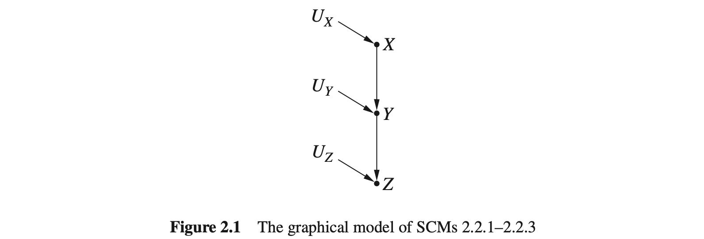
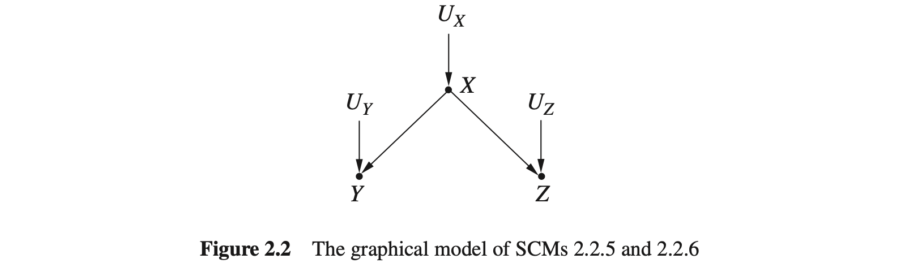
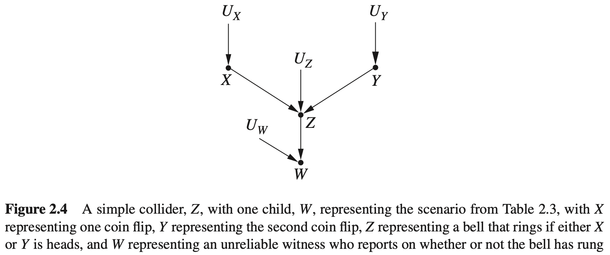
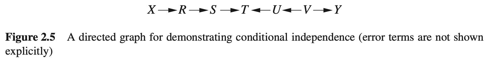
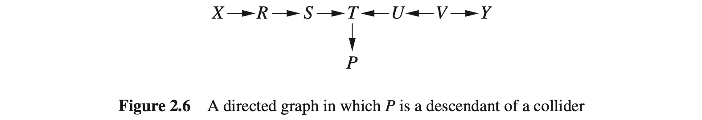
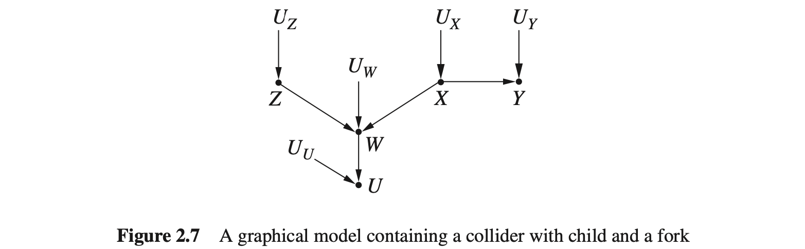
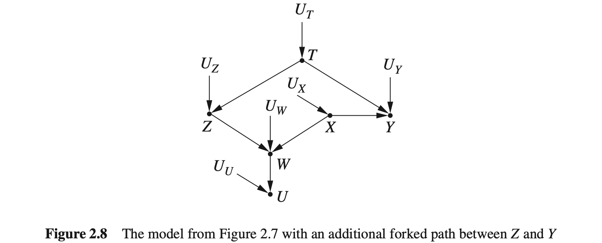
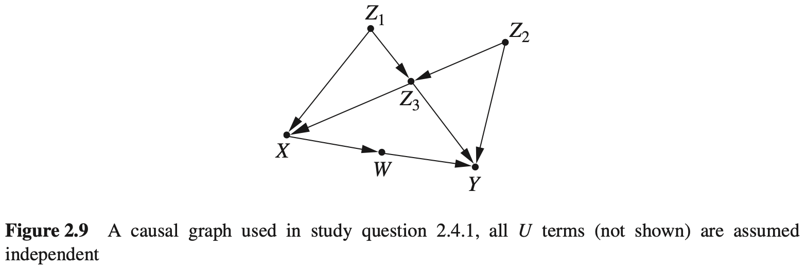

## 2. 图模型及其应用

### 2.1 模型与数据的联系

在第1章中，分别介绍了概率、图和结构方程，但没有提及它们之间的关系。实际上，这三者是密切相关的。在概率语言中，独立的概念是用代数等式定义的，本章将展示如何用有向无环图（DAG）形象地表示概念。此外，图形化的表示还有利于刻画结构方程模型中隐含的概率信息。

熟悉结构方程模型的研究人员可以仅仅根据图模型的结构就能预测数据中的独立性质，而不需要依赖方程式或误差分布所携带的任何定量信息。反过来看，这意味着观察数据中的独立性质对判断一个假设模型是否正确是有帮助的。在第3章还将介绍与数据结合的图结构，利用它能够定量预测干预的结果，而不必实际进行干预措施。

### 2.2 链结构和分叉结构

到目前为止，我们一直把因果模型看作是对数据背后的“因果故事”的表示。另一种看法是因果模型代表了数据产生的机制，可以把它看作世界相关部分的某种设计蓝图，我们可以用它来模拟世界中的数据。例如，如果给出高中三年级学生数学考试成绩的一个真实、完整的因果模型，并且给出一张完整的包含该模型各个外生变量值的表，那么理论上可以得出每个学生的考试成绩。当然，这需要指定所有可能影响学生考试成绩的因素，但这是不现实的。在大多数情况下，我们无法知道一个模型如此精确的知识。作为一种弥补，可以用一个概率分布来刻画外生变量，这样就可以生成整个学生群体和相关学生子群体的考试分数的近似分布了。

假设只有模型的一个图结构，但因果模型中变量的概率分布不明确，只知道哪些变量是由哪些其他变量引起的，但不知道关联的强度或性质，在此情况下，即使使用如此有限的信息，也可以获得由此模型生成的数据集的许多信息。从一个不明确的图形化因果模型中，即只知道该模型中哪些变量是哪些其他变量的函数，但不知道函数的具体形式，但可以获知数据集中哪些变量是相互独立的，以及哪些变量在哪些其他变量的条件下是相互独立的。这些独立性适用于由该图形化因果模型生成的各个数据集，而不论结构因果模型（SCM）附带的具体函数如何。

举个例子，以下三个假设的结构因果模型共享一个相同的图形化模型，第一个结构因果模型表示美国一所高中的学费（ $X$ ，单位为美元）、SAT平均分（ $Y$ ）和某年的大学录取率（ $Z$ ）之间的因果关系。第二个结构因果模型表示一个灯泡开关状态（ $X$ ）、一个与之相关的电路的状态（ $Y$ ）和一个灯泡的状态（ $Z$ ）之间的因果关系。第三个结构因果模型与竞赛参与者相关，它代表了参与者每周工作时间（ $X$ ）、参与者每周参加训练的时间（ $Y$ ）以及参与者完成比赛的时间（ $Z$ ）之间的因果关系。在这三个模型中，外生变量（ $U_X$ 、 $U_Y$ 、 $U_Z$ 等）代表了可能改变内生变量关系的未知或随机的影响因素。具体来说，在SCM2.2.1和SCM2.2.3中， $U_Y$ 和 $U_Z$ 是导致个体差异的附加因素。在SCM2.2.2中，如果有一些未被发现的异常，则 $U_Y$ 和 $U_Z$ 取值为1；反之，则 $U_Y$ 和 $U_Z$ 取值为0。

**SCM 2.2.1（高中学费、SAT平均分和大学录取率）**

$$
\begin{aligned}
V=\{X,Y,Z\},U=\{U_X,U_Y,U_Z\},F=\{f_X,f_Y,f_Z\}\\
f_X:X=U_X\\
f_Y:Y=\frac{x}{3}+U_Y\\
f_Z:Z=\frac{Y}{16}+U_Z
\end{aligned}
$$

**SCM 2.2.2（开灯、电路和灯泡状态）**

$$
\begin{aligned}
V &= \{X,Y,Z\}, U = \{U_X, U_Y, U_Z\}, F = \{f_X, f_Y, f_Z\} \\
f_X: X &= U_X \\
f_Y: Y &= 
\begin{cases}
\text{关} & \text{当}(\text{X="打开"且} U_Y = 0) \text{或}(\text{X = "合上"且} U_Y = 1) \\
\text{开} & \text{否则}
\end{cases} \\
f_Z: Z &= 
\begin{cases}
\text{亮} & \text{当}(\text{Y="关"且} U_Z = 0) \text{或}(\text{Y="开"且} U_Z = 1) \\
\text{灭} & \text{否则}
\end{cases} \\
\end{aligned}
$$

**SCM 2.2.3（工作时间、训练时间和比赛完成时间）**

$$
\begin{aligned}
V=\{X,Y,Z\},U=\{U_X,U_Y,U_Z\},F=\{f_X,f_Y,f_Z\}\\
f_X:X=U_X\\
f_Y:Y=84-x+U_Y\\
f_Z:Z=\frac{100}{y}+U_Z
\end{aligned}
$$

SCM2.2.1-SCM2.2.3共享如图2.1所示的图模型。

SCM 2.2.1 和 SCM 2.2.3 处理的是连续变量，SCM 2.2.2 处理的是离散变量。在 SCM 2.2.1 中，自变量（父变量）的值越大，因变量（子变量）的值越大；SCM 2.2.3 中，自变量（父变量）的值越大，因变量（子变量）的值越小；SCM 2.2.2 中，变量之间的相关关系是逻辑的。虽然没有任何两个结构因果模型包含共同的函数，但是由于它们对应同一个图结构，因此所有由这三个结构因果模型生成的数据必然具有某些相同的独立性质，可以通过检测图 2.1 中的图模型来简单地预测这些独立性质。这三种结构因果模型生成的数据具有共同的独立性和可能的依赖关系如下。

1.  $Z$ 和 $Y$ 可能是相互依赖的：对于某些 $z,y$ ，有：

$$
P(Z=z\mid Y=y)\neq P(Z=z)
$$

2.  $Y$ 和 $X$ 可能是相互依赖的：对于某些 $y,x$ ，有：

$$
P(Y=y\mid X=x)\neq P(Y=y)
$$

3.  $Z$ 和 $X$ 可能是相互依赖的：对于某些 $z,x$ ，有：

$$
P(Z=z\mid X=x)\neq P(Z=z)
$$

4.  $Z$ 和 $X$ 在 $Y$ 的条件条是独立的：对于所有的 $x,y,z$ ，有：

$$
P(Z=z\mid X=x,Y=y)=P(Z=z\mid Y=y)
$$

为了理解这些独立性和依赖关系，我们来检测图模型。首先，验证由一条边连接的两个变量可能是相互依赖的。注意，从一个变量指向另一个变量的箭头表示第一个变量是第二个变量的原因，也就是说，第一个变量是确定第二个变量值的函数的一部分。因此，第二个变量的值依赖于第一个变量的值；在某些情况下，改变第一个变量的值会引起第二个变量值的改变。这意味着，当检测数据集中的这些变量时，如果已知一个变量的值，则另一个变量取某个值的概率可能会改变。所以在一个典型的因果模型中，不管具体的函数是什么，由边连接的两个变量是依赖的。有这个推理可知，在SCM2.2.1～SCM2.2.3中， $Z$ 和 $Y$ 可能是相互依赖的， $Y$ 和 $X$ 也可能是相互依赖的。

根据这两个事实，可以得出结论：如果 $Z$ 依赖于 $Y$ 的值，而 $Y$ 依赖于 $X$ 的值，那么 $Z$ 很可能依赖于 $X$ 的值，即 $Z$ 和 $X$ 可能是依赖的。然后，在某些特殊的情况下不是这样的。例如，考虑下面的结构因果模型，他的图模型也与图2.1相同。

**SCM 2.2.4（非传递依赖的情况）**

$$
\begin{aligned}
V = \{X,Y,Z\}, U &= \{U_X, U_Y, U_Z\}, F = \{f_X, f_Y, f_Z\} \\
f_X:X&=U\\
f_Y:Y&=
\begin{cases}
a\text{, 当}X=1\text{且}U_Y=1\\
b\text{, 当}X=2\text{且}U_Y=1\\
c\text{, 当}U_Y=2
\end{cases}\\
f_Z:Z&=
\begin{cases}
i\text{, 当}Y=c\text{或}U_Z=1\\
j\text{, 当}U_Z=2
\end{cases}
\end{aligned}
$$

在这个例子中，无论 $U_Y$ 和 $U_Z$ 取什么值， $X$ 都对 $Z$ 值没有任何影响。 $X$ 的变化会造成 $Y$ 在 $a$ 和 $b$ 之间发生变化，但除非 $Y$ 取值 $c$ ，否则 $Y$ 不会影响 $Z$ 。因此， $X$ 和 $Z$ 在这个模型中独立地变化。此类情况称为非传递情况。

然而，非传递情况并不常见，在大多情况下， $X$ 和 $Z$ 的值会一起变化，就像 $X$ 和 $Y$ 、 $Y$ 和 $Z$ 一样，因此，在数据集中它们可能是相互依赖的。

现在再来讨论：在条件 $Y$ 下， $Z$ 和 $X$ 是独立的。 回顾一下，以 $Y$ 为条件时，我们基于 $Y$ 的值将数据过滤划分成不同的组，然后分别比较 $Y=a,Y=b$ 时的情况。首先来看 $Y=a$ 的情况。我们想知道在这些情况下， $Z$ 的值是否独立于 $X$ 的值。之前，我们认为 $X$ 和 $Z$ 可能是相互依赖的，因为当 $X$ 的值发生变化时， $Y$ 的值可能会发生改变，而当 $Y$ 的值发生变化时， $Z$ 的值可能会改变。但是现在仅检测 $Y=a$ 值的情况，即选择具有不同的 $X$ 值时， $U_Y$ 的值需随之变化而使得 $Y$ 的值保持为 $a$ 。但因为 $Z$ 值仅取决于 $Y$ 和 $U_Z$ ，不依赖于 $U_Y$ ，所以（无论 $U_Y$ 怎么变） $Z$ 的值都不会改变。这样一来，选择一个不同的 $X$ 值并不会改变 $Z$ 的值，因此，在 $Y=a$ 的情况下， $X$ 与 $Z$ 是独立的。无论 $Y$ 的值怎样变化，这个结论显然都是正确的。所以在 $Y$ 的条件下， $X$ 与 $Z$ 是独立的。

这种由三个节点和两条边组成，并且中间变量有一条边进入和一条边射出的结构称为链结构。以上的推理说明，在任何图模型中，对于给定的任意两个变量 $X$ 和 $Y$ ，如果 $X$ 和 $Y$ 之间的唯一路径完全由链组成，那么以该路径上的任何中间变量为条件， $X$ 和 $Y$ 都是独立的。无论连接变量的函数是什么，这种独立关系都成立。由此得到第一条规则：

**规则 2.2.1（链结构中的条件独立性）** 如果变量 $X$ 和 $Y$ 之间只有一条单向路径， $Z$ 是截断这条路径的任何一组变量，则在 $Z$ 的条件下， $X$ 和 $Y$ 是独立的。

**注：** 链式结构当中两头(即 $X$ 和 $Z$ )不一定关联，但是在 $Y$ 的条件下，两头一定独立。

需要注意的是，只有当假设误差项 $U_X,U_Y$ 和 $U_Z$ 相互独立时，规则2.2.1才成立。例加，如果 $U_X$ 是 $U_Y$ 的原因，那么以 $Z$ 为条件不一定会使 $X$ 和 $Y$ 相互独立，因为 $X$ 的变化可能仍然通过它们的误差项与 $Y$ 的变化关联。

现在来看如图2.2所示的图模型。举例来说，这个结构可能表示一个城市某天的温度（ $X$ ），当天本地一家冰激凌店的销售量（ $Y$ ），以及当天城市暴力犯罪的数量（ $Z$ ）之间的因果机制。SCM 2.2.5给出了这些变量之间可能的函数关系。这种结构也可以代表SCM 2.2.6中关于开关（ $X$ ）的状态（开或关），第一个灯泡（ $Y$ ）的状态（亮或灭）以及第二个灯泡（ $Z$ ）的状态（灭活亮）之间的因果关系，外生变量 $U_X,U_Y$ 和 $U_Z$ 代表影响这些变量相互之间关系的其他随机因素。

**SCM 2.2.5（温度、冰激凌销量和罪犯）**

$$
\begin{aligned}
V = \{X,Y,Z\}, U &= \{U_X, U_Y, U_Z\}, F = \{f_X, f_Y, f_Z\} \\
f_X:X&=U_X\\
f_Y:Y&=4x+U_Y\\
f_Z:Z&=\frac{x}{10}+U_Z
\end{aligned}
$$

**SCM 2.2.6（开关和两个灯泡的状态）**

$$
\begin{aligned}
V = \{X,Y,Z\}, U &= \{U_X, U_Y, U_Z\}, F = \{f_X, f_Y, f_Z\} \\
f_X:X&=U_X\\
f_Y:Y&=
\begin{cases}
\text{亮，当( $X$ ="开"且 $U_X=0$ )或( $X$ ="关"且 $U_Y=1$ )}\\
\text{灭，否则}
\end{cases}\\
f_Z:Z&=
\begin{cases}
\text{亮，当( $X$ ="开"且 $U_Z=0$ )或( $X$ ="关"且 $U_Z=1$ )}\\
\text{灭，否则}
\end{cases}
\end{aligned}
$$

如果假设误差项 $U_X,U_Y$ 和 $U_Z$ 是相互独立的，那么通过检测图2.2中的图模型，可以确定SCM 2.2.5和SCM 2.2.6共享如下的依赖性和独立性。

1.   $X$ 和 $Y$ 可能是相互依赖的：对于某些 $x,y$ ，有

$$
P(X=x\mid Y=y)\neq P(X=x)
$$

2.   $X$ 和 $Z$ 可能是相互依赖的：对于某些 $y,z$ ，有

$$
P(Y=y\mid Z=z)\neq P(Y=y)
$$

3.   $Z$ 和 $Y$ 是独立的：对于所有的 $z,y$ ，有

$$
P(Z=z\mid Y=y)\neq P(Z=z)
$$

4.   $Y$ 和 $Z$ 在 $X$ 的条件下可能是独立的：对于某些 $x,y,z$ ，有

$$
P(Y=y\mid Z=z,X=x)=P(Y=y\mid Z=z)
$$

对于第1点和第2点，由于 $Y$ 和 $Z$ 也都通过肩头与 $X$ 直接相连，因此当 $X$ 的值改变时， $Y$ 的值和 $Z$ 的值都可能发生变化。这使我们进一步想到：当 $X$ 改变时， $Y$ 会发生变化， $Z$ 也会发生变化，那么当 $X$ 改变时， $Y$ 与 $Z$ 可能（虽然不确定）会一起发生变化，反之亦然。由于可以从 $Y$ 值的变化中得到 $Z$ 值发生相应变化的信息，所以 $Y$ 和 $Z$ 可能是相互依赖的变量。

那么，为什么在 $X$ 的条件下 $Y$ 和 $Z$ 独立呢？当以 $X$ 为条件时发生了什么？以 $X$ 的值来筛选数据，所以只比较 $X$ 是一个固定值的情况。由于 $X$ 的值是不变的，所以 $Y$ 和 $Z$ 的值不会随着 $X$ 的变化而变化，它们只会随着 $U_Y$ 和 $U_Z$ 而变化，由于已经假设 $U_Y$ 和 $U_Z$ 是独立的，因此， $Y$ 和 $Z$ 的值是独立变化的。

这种具有三个节点，并且有两个箭头从中间变量射向的结构称为分叉结构。分叉结构中的中间变量是其他两个变量和它们任何后代的共同原因。如果两个变量共享一个共同原因，并且这个共同原因是它们之间唯一路径的一部分，那么上述推理说明，这些变量的依赖关系和条件独立性是成立的，因此，得到另一个规律：

**规则2.2.2（分叉结构的条件独立性）** 如果变量 $X$ 是变量 $Y$ 和 $Z$ 的共同原因，并且 $Y$ 和 $Z$ 之间只有一条路径，则 $Y$ 和 $Z$ 在 $X$ 的条件下独立。

### 2.3 对撞结构

到目前为止，已经研究了两种简单的边和节点的结构：链结构和分叉结构，这两种结构均允许边和节点出现在两个变量之间的路径上。还有第三种结构，因为这种结构有其独特的考虑和挑战，因此在这里专门介绍。这种结构包含一个对撞节点，它指的是一个节点接收来自两个节点射出的边。图2.3展示了一个最简单的，包含对撞结构的因果模型图，它代表两个原因 $X$ 和 $Y$ 的共同效应 $Z$ 。

与每个因果模型图一样，所有具有像图2.3这样结构的因果模型都可以从图中得出相同的依赖性和独立性。对于如图2.3所示的模型，假设 $U_X$ 、 $U_Y$ 和 $U_Z$ 是独立的，可以得出如下的独立性。

1.   $X$ 和 $Z$ 可能是相互依赖的：对于某些 $x,z$ ，有

$$
P(X=x\mid Z=z)\neq P(X=x)
$$

2.   $X$ 和 $Z$ 可能是相互依赖的：对于某些 $y,z$ ，有

$$
P(Y=y\mid Z=z)\neq P(Y=y)
$$

3.   $X$ 和 $Y$ 是独立的：对于所有的 $x,y$ ，有

$$
P(X=x\mid Y=y)=P(X=x)
$$

4.   $X$ 和 $Y$ 在 $Z$ 的条件下可能是相互依赖的：对于某些 $x,y,z$ ，有

$$
P(X=x\mid Y=y,Z=z)\neq P(X=x\mid Z=z)
$$

前两点已在2.2节中解释了。第3点是不言而喻的，因为 $X$ 和 $Y$ 都不是彼此的后代或祖先，也没有依赖于同一个变量的值，它们只会分别受 $U_X$ 和 $U_Y$ 的影响，而 $U_X$ 和 $U_Y$ 是独立的，所以没有使 $X$ 值变化与 $Y$ 值变化相关联的因果机制。这种独立性也反映了因果关系在时间上的机制，当前独立的事件不会因为将来产生共同的效应而变得相互依赖。

那么什么第4点成立呢？为什么以共同效应作为条件时，两个独立的变量实际上变得相互依赖了呢？为了回答这个问题，再改回到以条件变量的值来过滤的定义上。当以 $Z$ 为条件时，我们将比较限定在 $Z$ 取相同值的情况。由于 $Z$ 的值依赖于 $X$ 和 $Y$ ，因此，在对 $Z$ 取相同值做比较时， $X$ 值的任何变化必须通过 $Y$ 值的变化来补偿，否则 $Z$ 值也会改变。

对撞结构的这种特性，以对撞节点为条件会使该节点的父节点互相依赖，背后的原理一开始很令人费解，例如，一个最基本的例子： $Z=X+Y$ ，且 $X$ 和 $Y$ 是独立的变量，有以下推理：如果已知 $X=3$ ，你不知道关于 $Y$ 可能值的任何信息，因为这两个数字是独立的；另一方面，如果已知 $Z=10 $ ，那么再告诉 $X=3$ ，相当于立刻确认 $Y$ 必然是7。因此，当给定 $Z=10 $ 时， $X$ 和 $Y$ 是依赖的。

可以通过现实生活的例子进一步阐明这种现象。例如，假设某所大学为两类学生提供奖学金：一类是具有超常音乐天赋的学生，另一类则是拥有超常学业成绩的学生。通常，音乐天赋和学业成绩是独立的特质，所以在广泛人群中，对于一个有音乐天赋的人，无从获得关于其学业成绩的任何信息。但是，如果发现一个人获得了奖学金，并且知道这个缺乏音乐才能，那么会立即推断他可能有很高的学业成绩。因此，在固定两个独立变量的共同效应（第三变量为奖学金）的值时，这两个独立变量会变得相互依赖。

再来研究一个数值例子：同时（独立）投掷两枚质地均匀的硬币，至少有一枚硬币落地时正面向上时，铃就会响。令 $X$ 和 $Y$ 分别表示两枚硬币的投掷结果，令 $Z$ 代表铃的状态， $Z=1$ 表示铃响了， $Z=0$ 表示铃没响。这种机制可以表示为如图2.3所示的对撞结构，图中两枚硬币的投掷结果是父节点，铃的状态是对撞节点。

如果已知硬币1落地时正面向上，由于两枚硬币是独立的，我们不能获得硬币2的结果。但是假设听到铃声，且知道硬币1落地时反面向上，则可确认硬币2落地时必然正面向上。同样，如果假设听到了铃声，且知道硬币2也是落地时正面向上，那么硬币1落地时正面向上的概率会改变，这种概率变化比前一种情况更微妙。

为了后面的计算，表2.1给出了两枚质地均匀的硬币同时投掷的结果的概率分布。其中， $X$ 表示第一枚硬币， $Y$ 表示第二枚硬币， $Z$ 表示铃，如果任何一枚硬币落地时正面向上，则铃响。

表2.1 两枚质地均匀的硬币同时投掷的结果的概率分布

| $X$  | $Y$  | $Z$  | $P(X,Y,Z)$ |
| ---- | ---- | ---- | ---------- |
| 正面 | 正面 | 1    | 0.25       |
| 正面 | 反面 | 1    | 0.25       |
| 反面 | 正面 | 1    | 0.25       |
| 反面 | 反面 | 0    | 0.25       |

由表2.1知

$$
P(X=\text{正面}\mid Y=\text{正面})=P(X=\text{反面}\mid Y=\text{反面})=\frac{1}{2}
$$

也就是说， $X$ 和 $Y$ 是相互独立的。现在，以 $Z=1$ （铃声响）和 $Z=0$ （铃声不响）为条件，所得数据子集如表2.2所示。

表2.2 基于表2.1分布的条件概率分布

| $X$  | $Y$  | $P(X,Y\mid Z=1)$ | $P(X,Y\mid Z=0)$ |
| ---- | ---- | ---------------- | ---------------- |
| 正面 | 正面 | 0.333 | 0       |
| 正面 | 反面 | 0.333 | 0       |
| 反面 | 正面 | 0.333 | 0       |
| 反面 | 反面 | 0    | 1       |

通过计算这些表中的概率，有

$$
P(X=\text{正面}\mid Z=1)=\frac{1}{3}+\frac{1}{3}=\frac{2}{3}
$$

如果进一步筛选出 $Z=1$ 的子表，然后研究 $Y=\text{正面}$ 的情况，将得到

$$
P(X=\text{正面}\mid Y=\text{正面},Z=1)=\frac{1}{2}
$$

可以看出，在 $Z=1$ 的情况下，在知道 $Y=\text{正面}$ 时， $X=\text{正面}$ 的概率从 $\frac{2}{3}$ 变到 $\frac{1}{2}$ 。显然，给定 $Z=1$ 后， $X$ 和 $Y$ 是相互依赖的。当然，当铃声不响（ $Z=0$ ）时，更明显的相关依赖发生了，因为我们知道这两枚硬币落地时肯定都是反面向上的。

另一个对撞结构的例子是1.3节中遇到的蒙蒂霍尔问题。这个例子有助于进一步理解这种结构引起的问题。从本质上来说，蒙蒂霍尔问题反映了对撞结构的存在。你最初选择的门是一个父节点；后而有车的门是另一个父节点；蒙蒂打开的、后而有山羊的门是对撞节点，该节点受其他两个变量的共同影响。这里的因果关系是：如果你选择门 $A$ ，如果门 $A$ 后面有一只羊，那么蒙蒂将被迫打开剩下的、后面有羊的门。

最初关于门的选择和汽车的位置是独立的，这就是为什么虽初有 $\frac{1}{3}$ 的机会选择有车的门。然而，正如投掷两枚独立的硬币一样，在蒙蒂对门进行选择的条件下，最初的选择和车的位置是相互依赖的。在这个例子中，最初车在门 $B$ 后面的概率为 $\frac{1}{3}$ ，但是在选择门 $A$ 并且蒙蒂打开门 $C$ 的情况下，车在门 $B$ 后面的概率将为 $\frac{2}{3}$ 。

在对撞节点的条件下，可以使先前独立的变量变得相互依赖，以对撞点的任何后代为条件也是如此，再次回到投掷两枚独立的硬币的例子看看为什么是这样。假设没有直接听到铃声，而是依靠一个不太可靠的目击者。当铃不响时，目击者有 $50%$ 的概率谎报铃响。令 $W$ 表示目击者的报告，因果结构如图2.4所示，其中， $X$ 代表第一枚硬币投掷的结果， $Y$ 代表第二枚硬币投掷的结果， $Z$ 表示当 $X$ 或 $Y$ 是正面向上就会响的铃， $W$ 代表报告铃是否响的目击者， $X,Y$ 和 $W$ 的所有组合的概率如表2.3所示。

表2.3 两枚质地均匀的硬币同时投掷的结果的概率分布。

| $X$  | $Y$  | $W$  | $P(X,Y,W)$ |
| ---- | ---- | ---- | ---------- |
| 正面 | 正面 | 1    | 0.25       |
| 正面 | 反面 | 1    | 0.25       |
| 反面 | 正面 | 1    | 0.25       |
| 反面 | 反面 | 1    | 0.125      |
| 反面 | 反面 | 0    | 0.125      |

基于表2.3，可以很容易地验证如下式子：

$$
P(X=\text{正面}\mid Y=\text{正面})=P(X=\text{正面})=\frac{1}{2}
$$

$$
P(X=\text{正面}\mid W=1)=\frac{0.25+0.25}{0.25+0.25+0.25+0.125}=\frac{0.5}{0.875}
$$

$$
P(X=\text{正面}\mid Y=正面,W=1)=\frac{0.25}{0.25+0.25}=0.5<\frac{0.5}{0.875}
$$

由上述结果可得出，在得到目击者报告之前， $X$ 和 $Y$ 是独立的，但之后就变得相互依赖了。进而得出2.2节两个规则之外的第三条规则：

**规则 2.3.1（对撞结构中的条件独立性）** 如果变量 $Z$ 是变量 $X$ 和 $Y$ 之间的对撞节点，并且 $X$ 与 $Y$ 之间只有一条路径，那么 $X$ 与 $Y$ 是无条件独立的，但是在 $Z$ 或 $Z$ 的任何子孙条件下是相互依赖的。

规则2.3.1对于研究因果关系是极其重要的，在接下来的章节中，该规则可用于测试一个数据集是否由某个因果模型所生成，用于从数据中发现模型，或者用于在混杂情况下确定应该检测哪个变量以及如何估计因果效应，从而彻底解决因果推断问题。

备注：好奇的读者可能想知道为什么在对撞节点条件下产生的依赖关系会令大多数人都感到惊讶，正如蒙蒂霍尔问题所示的那样。原因是人们倾向于将依赖关系和因果关系联系起来。因此，他们错误地认为两个变量之间的统计依赖之所以存在，只能是因为有产生这种依赖性的因果机制；也就是说，要么两个变量中的一个是另一个的原因，要么出现第三个变量是这两个变量的共同原因。在对撞结构中，他们惊奇地发现还有第三种方式可以产生这种依赖，违背了“没有因果关系就无关联”的假设。

#### 思考题

#### 2.3.1

(a) 列出图2.5中在集合 $Z=\{R,V\}$ 条件下的每一对独立的变量。

(b) 列出图2.5中使每一对不相邻的变量独立的条件变量。

(c) 列出图2.6中在集合 $Z=\{R,P\}$ 条件下的每一对独立的变量。

(d) 列出图2.6中使每一对不相邻的变量独立的条件变量。

(e) 假设用图2.5中的模型产生一组数据，并用线性方程 $Y=a+bX+cZ$ 来拟合这组数据，为确保斜率 $b=0$ ， $Z$ 可以是模型中的那些变量？ [提示：回归一下，一个非零斜率意味着 $X$ 与 $Y$ 在 $Z$ 条件下相互依赖。]

(f) 继续问题(e)，但现在参考图2.6，如果方程 $Y=a+bX+cR+dS+eT+fP$ 来拟合数据，哪些系数可能为0？

### 2.4 d-分离

因果模型通常不会像前面遇到的例子那样简单。具体来说，变量之间只有一条路径的图模型是很少的。在大多数的图模型中，变量可能有多条路径连接，且每个路径包含多个链、分叉和对撞结构。因此需要考虑这样的问题，即对于任意复杂的图因果模型，是否存在一个准则或方法，用来预测由该模型生成的数据所具有的相关性质呢？

实际上，根据前面章节介绍的规则，可以得到一个这样的方法：d-分离。d-分离（d表示“方向的”）使我们能够确定任何一对节点是否是d-连通的，即它们之间是存在一条连通路径；或者确定任何一对节点是否是d-分离的，即它们之间不存在连通的路径。当说一对节点是d-分离的，指的是这两个变量是绝对独立的；当说一对节点是d-连通的，指的是这两个变量可能或很有可能是相互依赖的。

如果两个节点 $X$ 和 $Y$ 之间存在的任何路径都被阻断，则它们是（关于这些阻断变量）d-分离的；如果 $X$ 和 $Y$ 之间存在一条路径没有被阻断，那么 $X$ 和 $Y$ 是连通的。可以把变量之间的路径看作管道、依赖性就像通过管道里的水：如果存在一根管道是未被阻断的，水就可以从一个地方流到另一个地方，如果有一条路径是通畅的，那么两端的变量就是相互依赖的。仅在一个地方阻断管道就可以阻止水流通过，同样地，只需要一个节点就可以阻断整个路径上的依赖性传递。

d-分离分为两类：以某些节点为条件和不以任何节点为条件。如果不以任何节点为条件，那么只有对撞节点可以阻断一条路径。原因是：不以任何变量为条件时，对撞结构会阻断依赖关系，正如在2.3节中所提到的那样。因此，如果两个节点 $X$ 和 $Y$ 之间的每条路径都有一个对撞节点，则 $X$ 和 $Y$ 不会有依赖关系，它们必须是边缘独立的。

然而，如果以一组节点 $Z$ 为条件，那么以下类型的节点可以阻断一条路径：

- 自身不在 $Z$ 中且其子孙节点也不在 $Z$ 中的对撞节点
- 在 $Z$ 中的链节点或分叉的中间节点

其背后的原因要追溯到在2.2节和2.3节介绍的内容。对撞节点不允许依赖性在其父节点之间传递，因此阻断了路径。而规则2.3.1告诉我们，当以对撞节点或其后代为条件时，父节点之间可能会变成互相依赖的。因此，不在条件集 $Z$ 中的对撞节点会使依赖关系无法在路径上传递，而在条件集中的对撞节点或其后代则不会阻断依赖关系。相反，非对撞结构（包括链结构和分叉结构）不会阻断依赖关系，但规则2.2.1和规则2.2.2又告诉我们，当以非对撞结构的中间节点为条件时，这些路径的两端节点会变得独立（每次只考察一条路径）。因此，条件集中的任何非对撞节点将阻断依赖关系，而不在条件集中的非对撞节点将允许依赖关系在路径上传递。

**定义2.4.1（d-分离）** 一条路径会被一组节点 $Z$ 阻断，当且仅当：

1. 路径包含链结构 $A\to B\to C$ 或分叉结构 $A\gets B\to C$ ，其中间节点 $B$ 在 $Z$ 中（即以 $B$ 为条件）；或者
2. 路径 $p$ 包含一个对撞结构 $A\to B\gets C$ ，且对撞节点 $B$ 及其子孙节点都不在 $Z$ 中。

如果 $Z$ 阻断了 $X$ 和 $Y$ 间的每一条路径，则 $X$ 和 $Y$ 在 $Z$ 的条件下是d-分离的，因此 $X$ 和 $Y$ 在以 $Z$ 为条件时是独立的。

我们使用d-分离工具来探究一些更复杂的图模型，并确定其中的独立变量和依赖变量，包括不以其它变量为条件和以其它变量为条件这两种情况。以如图2.7所示的图模型为例，图2.7可能与许多因果模型相关联。变量可能是离散的、连续的或两者的混合，它们之间的关系可能是线性的、指数的或其它任意形式的。然而，无论模型如何，d-分离将总是描述该模型生成的数据集所具有的独立性质。

特别地，我们来分析图2.7模型中 $Z$ 和 $Y$ 之间的关系。使用一个空的条件集时，它们是d-分离的，这说明 $Z$ 和 $Y$ 是无条件独立的。为什么呢？因为 $Z$ 和 $Y$ 之间只有一条路径，并且该路径被对撞结构 $(Z\to W\gets X)$ 阻断，所以它们之间就没有未被阻断的路径。

但如果以 $W$ 为条件呢？d-分离告诉我们在 $W$ 的条件下， $Z$ 和 $Y$ 是d-连通的。原因是：当条件集是 $\{W\}$ 时， $Z$ 和 $Y$ 之间的唯一路径包含一个分叉节点 $(X)$ ，该节点不在条件集内，并且路径中的唯一对撞节点 $(W)$ 在条件集内，因此该路径没有被阻断（注意以对撞节点为条件时，会“解除阻断”）。如果以 $U$ 为条件，由于 $U$ 是 $Z$ 和 $Y$ 之间路径上对撞节点的后代，因此结果也是如此。

另一方面，如果以集合 $\{W,X\}$ 为条件，则 $Z$ 和 $Y$ 仍然是独立的。此时，基于规则2.2.1，路径上有一个在条件集合中的非对撞节点 $(X)$ ，因此 $Z$ 和 $Y$ 之间的路径被阻断。虽然通过以 $W$ 为条件解除了阻断，但有一个阻断节点就足以阻断整条路径。由于 $Z$ 和 $Y$ 之间的唯一路径被该条件所阻断，所以 $Z$ 和 $Y$ 在 $\{W, X\}$ 的条件下是d-分离的。

现在考虑，当在 $Z$ 和 $Y$ 之间添加另一个路径时，如图2.8所示，会发生什么情况。 $Z$ 和 $Y$ 现在是无条件依赖的。为什么？因为它们之间有一条路径 $(Z\gets T\to Y)$ ，且该路径不包含对撞节点。然而，如果以 $T$ 为条件，则该路径被阻断， $Z$ 和 $Y$ 再变得独立。另一方面，以 $\{T,W\}$ 为条件时，它们再次变成d-连通（以 $T$ 为条件时，阻断了路径 $Z\gets T\to Y$ ，但以 $W$ 为条件则解除了路径 $Z\to W\gets X\to Y$ 的阻断）。如果将 $X$ 添加到条件集中，条件集变成 $W,U,\{W,U\},\{W,T\},\{U,T\},\{W,U,T\},\{W,X\},\{U,X\}$ ，或 $\{W,U,X\}$ 时， $Z$  和 $Y$ 是d-连通的（因此也可能是相互依赖的）。而当条件集为 $T,\{X,T\},\{W,X,T\},\{U,X,T\},\{W,U,X,T\}$ 时，它们是d-分离的（因此是独立的）。注意： $T$ 在使和 $Z$ 和 $Y$ 是d-分离的每个条件集合中；这是因为 $T$ 是使 $Z$ 和 $Y$ 无条件d-连通的路径上的唯一节点，所以除非以它为条件，否则 $Z$ 和 $Y$ 将始终是d-连通的。

#### 思考题

#### 2.4.1

图2.9表示一个误差项已被移除的因果图，其中，假设所有 $U$ （未显示）都是独立的。假设所有这些误差项都是相互独立的。

(a) 对于图2.9中每一对不相邻的节点，找到一组使它们d-分离的节点。在数据独立性方面，这个结果说明了什么？

(b) 假设只有集合 $\{Z_3,W,X,Z_1\}$ 中的节点可以测量，重新回答同题(a)。

(c) 对于图2.9中每一对不相邻的节点，在以其他所有节点为条件的情况下，确定它们是否是独立的。

(d)对于图中每一个节点 $V$ ，找到一个最小的节点集合，使得 $V$ 与图中其他所有节点独立。

(e) 假设想要用模型中其他所有变量的值来估计 $Y$ 的值。我找到一个最小的变量集合，能够获得与所有变量同样准确的对于 $Y$ 的估计。

(f) 假设希望估计 $Z_2$ ，重新回答问题(e)。

(g) 假设希望用 $Z_3$ 的值来预测 $Z_2$ 的值，如果增加 $W$ 的值，精度会提升吗？解释原因。

### 2.5 模型检验与因果搜索

前面的章节表明因果模型在其生成的数据集上有可被检验的推论式。例如，如果认为图 $G$ 可能生成了数据集 $S$ ，d-分离将告诉我们图 $G$ 中的哪些变量在哪些其他变量的条件下一定是独立的，而我们可以用数据集来检验条件独立性。假设列出图 $G$ 中的d-分离条件，并注意到变量 $A$ 和 $B$ 在 $C$ 的条件下一定是独立的，然后，基于数据集 $S$ 来估计概率，发现 $A$ 和 $B$ 在 $C$ 的条件下不是独立的，我们就拒绝将图 $G$ 作为数据集 $S$ 的因果模型。

现在以图2.9的因果模型来说明。由模型列出的条件独立性可知， $W$ 和 $Z_1$ 在给定 $X$ 的条件下是独立的，因为$X$ “d-分离” $W$ 与 $Z_1$ 。现在在 $X$ 和 $Z_1$ 上回归 $W$ ，也就是说，要寻找一条最符合我们的数据的直线：

$$
w=r_Xx+r_1z_1
$$

如果 $r_1\ne0$ ，表明在给定 $X$ 的条件下， $W$ 的值依赖于 $Z_1$ ，因此，模型是错误的（回想一下，条件相关就是条件依赖）。我们不仅知道模型是错误的，而且也知道错误在哪儿。在正确的模型中，在 $W$ 和 $Z_1$ 间一定有一条不被 $X$ “d-分离”的路径，这是适用于所有具有误差独立性特质的（有向）无环模型的一个理论结果（Verma et al., 1990）。而且如果模型中的每个d-分离条件均与数据中的条件独立性一致，则任何进一步的检验也不能否定该模型。这意味着，对于任何（与模型独立性相符的）数据集，人们总能为这个模型找到一组函数，并指定误差项的摄率，从而确地生成该数据。

还可以利用其他方法来检验模型（对于数据集）的适合度。评估适合度的标准方法涉及对模型的统计假设检验，也就是说，评估所观察的样本不是凭运气，而是根据由假设模型产生的可能性有多大。然而，由于模型设有完全确定，在评估这种可能性之前需要先估计模型参数。可以通过假设线性高斯模型（即，模型中的所有函数都是线性的，所有误差项都是正态分布的）来近似估计参数，因为在这样的假设下，联合分布（也是高斯分布）可以用模型参数来简洁地表达，然后可以评估观察样本由完全参数化的模型生成的可能性（Bollen, 1989）。

然而，这个过程也存在很多问题。首先，如果有某些参数不能被估计，那么就得不到联合分布，则模型不能被检验。正如将在3.8.3节中看到的，当某些误差项相关或者某些变量不可观谢时，会出现这种问题。其次，这是一个全局性模型检验过程，如果发现这个模型不能较好地适合数据，我们无法去寻找其原因，也没有办法确定应该在模型中删除或添加哪些边来提高这种适合性。第三，当对一个模型实施局部性检验时，涉及的变量可能很多，如果每个变量均存在测量噪声和/或采样差异，那么检验将不可靠。

相比于这种局部性检验方法，d-分离有以下优点。首先，它是非参数的，这意味着它不依赖于任何具体的变量间的函数，而是仅使用问题中的图模型。其次，它仅能依赖局部性检验模型，而不是全局性检验，这使我们能够识别假设模型中有缺陷的特定区域，并修复该区域，从而得到一个全新的模型。这也意味着，如果无法确定模型中某个区域的参数，无论是什么原因导致的，我们仍然可以获得模型剩余部分的一些不完整的信息（与全局性检验方法相反，在全局性检验方法中，如果无法估计一个参数，就不能检验模型的任何部分）。

如果有一台计算机，就可以用d-分离方法来检验和排除很多可能的模型，最终将得到一些经过检验，与数据结果中依赖关系不矛盾的模型。最终结果是几个模型，而不是一个模型，这是因为有些图有不可区分的蕴涵式。具有不可区分蕴涵式的一组图被称为等价类。如果两个图 $G_1$ 和 $G_2$ 有相同的骨架（即有相同的边，而不管边的方向），并且它们具有同样的v-结构（即父节点不相邻的对撞结构），则这两个图在同一个等价类内。满足这条规则的任何两个图都具有相同的d-分离条件集，因此具有相同的可检验蕴涵式集（Verma et al., 1990）。

这个结果的重要性在于它使我们能够为数据集寻找可能产生它的因果模型。因此，不仅可以从一个因果模型出发生成一个数据集，也可以从一个数据集出发反推出因果模型。由于大多数数据分析研究的目标正是要找到一个解释数据的模型，因此，这个结果是非常有用的。

还有其他的因果模型搜索方法，包括在本节开始时提到的依赖于全局校型检验的一些方法，但是对它们进行全面研究超出了本书的范围，对此感兴趣、想要了解更多的读者可以参考Pearl（2000）、Pearl祭（1991）、Rebane等（1987）、Spirtes等（1991）以及Spirtes等（1993）。

#### 思考题

#### 2.5.1

(a) 图2.9中的哪些箭头反向后可不被任何统计检验识别出来？[提示：使用等价类准则。]

(b) 应用等价类准则列出所有等价于如图2.9所示的因果图。

(c) 列出图2.9中可以由非实验数据确定方向的箭头。

(d) 给出一个 $Y$ 的回归方程，使得当方程中某个系数非零时，如图2.9所示的模型是错误的。

(e) 给出一个 $Z_3$ 的回归方程，使得当方程中某个系数非零时，如图2.9所示的模型是错误的。

(f) 假设 $X$ 不可测量，重新回答问题(e)。

(g) 对(d)和(c)中的这类回归方程一共需要多少个，才能确保模型能够被完全检验？也就是说，如果图通过了所有的这些检验，它将不能被其他这类检验所否定。[提示：确保你检验了每一个由式（1.30）乘积分解所隐含的偏回归系数为0的情况。]

