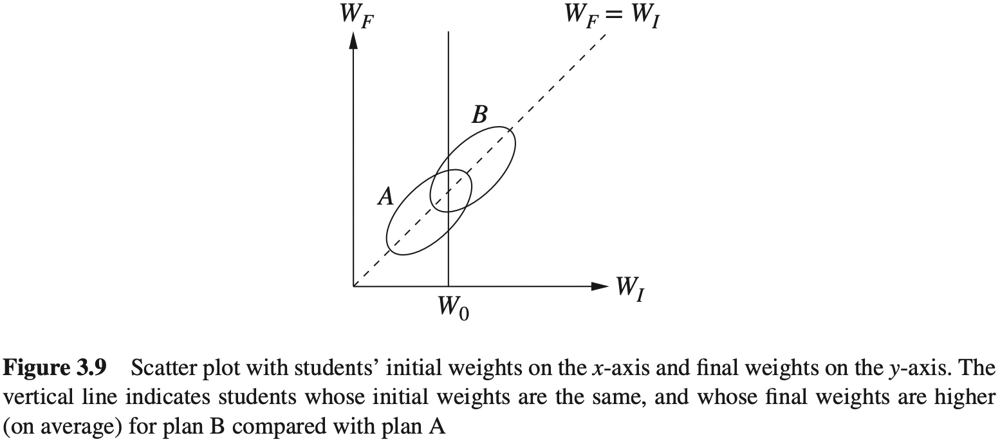
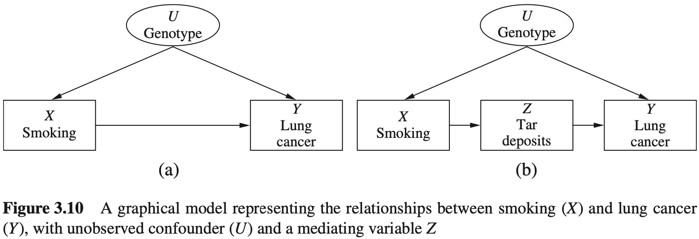

## 3 干预的效果

### 3.1 干预

许多统计研究的最终目标是预测干预措施的效果。例如，我们收集西部火灾相关因素的数据，实际上是要寻找可以用于预测的因素，以减少火灾的发生；当对一种新的癌症药物进行研究时，通过让患者服药以实施干预，观察患者用药后的反应；而当研究暴力电视节目与儿童的攻击性行为之间的相关性时，是想尝试确认少数儿童接触暴力电视节目的干预措施能否降低儿童的攻击性。

在统计学课程中常会提到“相关关系不是因果关系”。两个变量之间的关系并不仅仅只有一个变量引起另一个变量的变化（关于这个性质有一个著名例子：冰激凌销量的增加与暴力犯罪数目的增加是有关系的，不是因为冰激凌导致犯罪，而是因为冰激凌销量和暴力犯罪都在炎热天气中更常见）。因此，随机对照试验被认为是统计学中的黄金准则。在一个正确的随机对照试验中，除了输入变量，所有影响输出变量的因素要么是不变的，要么是随机变化的，因此输出变量的任何改变必然由这一个输入变量引起。

不幸的是，很多问题不适合用随机对照试验来解决。我们不能控制天气，所以无法将引起火灾的变量随机化；研究暴力电视节目的时候，虽可以随机选取参与者，但很难有效地控制每个孩子电视的行为，而且几乎不可能知道我们对孩子的控制是否有效；甚至在随机药物试验中，也会出现很多问题，参与者退出了、没有吃药或者弄虚作假吃药。

在随机对照试验不可行的情况下，研究人员实施观察性研究，他们仅仅记录数据，而不是擦除数据。这种研究方法的问题在于很难将因果关系从相关关系中提取出来。常识告诉我们，对冰激凌的销量进行干预，不会影响犯罪的数目，但事实不都是这么清晰。例如，温尼伯大学最近的一项研究表明，青少年过度发短信与（知识）“肤浅”相关。有媒体证实说，发短信使青少年更加肤浅（从干预角度说，对青少年进行干预，使他们减少发短信的数量，从而不让他们那么“肤浅”）。但是，这个试验没有证明任何事情，可能是肤浅使青少年发短信更多；也可能肤浅和短信过度是由一个共同因素引起的，例如基因，如果可能的话，对该基因因素进行干预，可以避免这两个方面的问题。

对一个变量进行干预与以该变量为条件的区别是很明显的。当干预模型中的一个变量时，我们固定这个变量的值，这意味着改变了系统，其他变量的值通常会因此发生变化。当以一个变量为条件时，我们不做任何改变；仅仅关注问题的子集，在这个子集内，变量的值都是我们感兴趣的，这里改变的是我们对世界的看法，而不是世界本身。

例如，图3.1展示了冰激凌销量例子的图模型， $X$ 表示冰激凌销量， $Y$ 表示犯罪率， $Z$ 表示温度。当采取干预措施、固定变量的值时，意味着削弱了该变量为响应其他变量而变化的自然趋势。这相当于在图模型上进行一种处理，即删除指向该变量的所有边。如果采取的干预措施是降低冰激凌销量（比如，关闭所有的冰激凌店），将得到如图3.2所示的图模型。检验图3.2中的相关性可以发现，犯罪率与冰激凌的销量完全独立（即不相关），这是因为后者不再与温度（2）相关。换句话说，即使改变了固定值的水平，这个变化也不会传递到变量 $Y$ （犯罪率）。也就是说，干预一个变量会产生一种与以变量为条件完全不同的依赖模式。此外，以变量为条件可以用第1章中描述的方法直接从数据集中获得，而干预的变化依赖于因果图的结构。对于任何给定的干预，可以根据图模型来确定应该删除哪些边。

我们在符号上区分变量 $X$ 自然地取值 $x$ 的情况和固定 $X$ 取值 $x$ 的情况，后者用 $do(X=x)$ 来表示。因此， $P(Y=y\mid X=x)$表示在 $X=x$ 的条件下 $Y=y$ 的概率： $P(Y=y\mid do(X=x))$ 表示通过干预使 $X=x$ 时 $Y=y$ 的概率。以分布的术语来说， $P(Y=y\mid X=x)$ 反映了在 $X$ 的值都是 $x$ 的个体上 $Y$ 的总体分布；另一方面， $P(Y=y\mid do(X=x))$ 反映了如果群体中的每个个体均将 $X$ 值固定为 $x$ 时， $Y$ 的总体分布。类似地，用 $P(Y=y\mid do(X=x),Z=z)$ 表示对于给定的 $Z=z$ ，干预 $do(X=x)$ 得到的分布中 $Y=y$ 的条件概率。

利用do-表达式和图模型，可以将因果关系从相关关系中分解出来。在这一章剩下的部分，我们将学习一种通过单纯地观察数据就能神奇地分解出因果关系的方法，当然，首先要假设图是实际问题的有效表述。箭要注意的是，默认假设的干预不会造成其他影响，也就是说，当对一个个体给变量 $X$ 分配值 $x$ 时，不会直接改变其他变量的值。比如，给一个患者分配一种药物和违背了他的宗教信仰强迫其服用药物，在恢复上可能有不同的效果，当改变了其他变量的值时，这些改变必须在模型中明确地表示出来。

### 3.2 校正公式

冰激淋的例子代表了一种极端的情况，在这个例子中， $X$ 和 $Y$ 之间的相关性从因果角度完全是假设的，因为从 $X$ 到 $Y$ 没有因果路径，但现实生活中大多数情况并不那么明确。为了探讨一个更现实的情况，我们来分析图3.3，其中 $X$ 代表使用药物， $Y$ 代表痊愈， $Z$ 代表性别， $Z$ 和 $X$ 都对 $Y$ 有影响，这个模型实际上反映的就是辛音森悖论。为了确定药物在人群中的有效性，设想一种假设性的干预指施，即对整个人人统一致服用这种药物，并与补充干预下的痊愈率进行比较，补充干预指阳止每个服用药物。用 $do(X=1)$ 表示第一种干预，用 $do(X=0)$ 表示第二种干预，现在要估计它们的差异。

$$
P(Y=1\mid do(X=1))-P(Y=1\mid do(X=0))\tag{3.1}
$$

该差异称为“因果效应差异”或“平均因果效应”（average causal effect, ACE）。一般地，如果 $X$ 和 $Y$ 都能取多个值，我们希望使 $x$ 和 $y$ 取遍 $X$ 和 $Y$ 可以取得的任意两个值来预测综合因果效应 $P(Y=y\mid do(X=x))$ ，例如，$X$ 可能是药物的剂量， $Y$ 可能是患者的血压。

根据基本规则可知，在没有因果关联的情况下，当然无法从数据集本身估计因果效应。这就是辛普森悖论的教训，数据本身甚至不足以确定药物的作用是正面的还是负面的。但是，借助图 3.3 的图模型，可以从数据中计算因果效应的大小。为此，可以通过对图进行处理的方式模拟干预（见图 3.4，该模型中全体人群都服用了该药物，结果为操纵概率 $P_m$ ），就像在冰激凌的例子中所做的那样。因果效应 $P(Y=y\mid do(X=x))$ 与图3.4中修改后模型的条件概率 $P_m(Y=y\mid X=x)$ 相等。$P_m$ 代表修改后模型中的概率，因此也被称为操纵概率（这种处理方法也解决了是应该分析总体数据，还是应该分析以变量 $z$ 的值划分的子表才能得到正确答案的问题。当通过干预来确定答案时，只需处理一个表就行了）。

计算因果效应的关键在于观察操纵概率 $P_m$ ，其具有 $P$ （图 3.3 中干预前模型的原始概率）的两个基本属性。第一，边际概率 $P(Z)$ 在干预后不变，因为移除 $Z$ 到 $X$ 的箭头不会影响确定 $Z$ 值的过程。在辛普森悖论的例子中，这意味着干预前后男性患者和女性患者的比例不会发生变化。第二，条件概率 $P(Y=y\mid Z=z,X=x)$ 是不变的，因为无论 $X$ 是自然变化还是被故意操控发生变化， $Y$ 对 $X$ 和 $Z$ 的响应函数 $Y=f(x,z,u_Y)$ 都不变。因此，可以给出两个不变性方程：

$$
P_m(Y=y\mid Z=z,X=x)=P(Y=y\mid Z=z,X=x)
$$

$$
P_m(Z=z)=P(Z=z)
$$

由于 $Z$ 和 $X$ 在修改后的模型中是d-分离的，因此在干预分布中也是独立的，这说明 $P_m(Z=z\mid X=x)=P_m(Z=z)=P(Z=z)$ 综上所述，可以得到：

$$
P(Y=y\mid do(X=x))=P_m(Y=y\mid X=x)(\text{由定义})\tag{3.2}
$$

$$
=\sum_zP_m(Y=y\mid X=x,Z=z)P_m(Z=z\mid X=x)\tag{3.3}
$$

$$
=\sum_zP_m(Y=y\mid X=x,Z=z)P_m(Z=z)\tag{3.4}
$$

式（3.3）由全概率公式得到，即以 $Z=z$ 的所有值为条件求条件概率，然后求和，正如式（1.9）一样，而式（3.4）则利用了修改后模型中 $Z$ 和 $X$ 的独立性得到。

最后，利用不变性关系，得到一个以干预前概率表示的因果效应公式

$$
P(Y=y\mid do(X=x))=\sum_zP(Y=y\mid X=x,Z=z)P(Z=z)\tag{3.5}
$$

式（3.5）称为校正公式，它对每一个 $Z$ 的值 $z$ 计算了 $X$ 和 $Y$ 之间的关系，然后对这些值求平均值，这个过程被称为“对 $Z$ 的校正”或“对 $Z$ 的控制”。

式（3.5）的右边可以直接从数据中估算得到，这是因为它只包括条件概率，每个条件概率可以用第1章中描述的方法来计算。还应注意，随机对照试验中不需要做这样的校正计算，因为在这一试验中，数据是由具有如图3.4所示的模型生成的。因此，不管影响 $Y$ 的因素 $Z$ 是什么， $P_m=P$ 都成立。因此，对于校正公式（3.5）的推导形式化地证明了：随机试验可用于定量估计 $P(Y=y\mid do(X=x))$ 。实际上，研究人员也使用该公式对随机试验的数据进行校正，以减少采样误差（Cox, 1958）。

为了演示校正公式的作用，我们将其应用于辛普森悖论。设 $X=1$ 表示患者用药， $Z=1$ 表示男性患者， $Y=1$ 表示患者痊愈。于是有：

$$
\begin{aligned}
P(Y=1\mid do(X=1))=&P(Y=1\mid X=1,Z=1)P(Z=1)+\\
&P(Y=1\mid X=1,Z=0)P(Z=0)
\end{aligned}
$$

使用表1.1中给出的数据，可以得到：

$$
P(Y=1\mid do(X=1))=\frac{0.93\times(87+270)}{700}+\frac{0.73\times(263+80)}{700}=0.832
$$

同理，

$$
P(Y=1\mid do(X=0))=\frac{0.87\times(87+270)}{700}+\frac{0.69\times(263+80)}{700}=0.7818
$$

因此，比较服用药物（ $X=1$ ）的效果和不服用药物（ $X=0$ ）的效果，有：

$$
ACE=P(Y=1\mid do(X=1))-P(Y=1\mid do(X=0))=0.832-0.7818=0.0502
$$

这表明服药具有明显的积极作用。对平均因果效应（ACE）更通俗的解释是，如果将每位患者在服用药物和不服用药物的情况下进行比较，那么平均因果效应反映的是在总体人群中痊愈率比例的差异。

校正公式指示，以性别为条件，分别计算男性患者和女性患者服用药物的痊愈率，然后根据男性患者和女性患者在全体受试者中的比例，对结果求平均值。该公式还指出，可以不直接使用群体数据 $P(Y=1 | X=1)$ 和 $P(Y=1 | X=0)$ ，因为这些群体数据可能会导致错误地判断该药物对全体受试者具有负面作用。

这些简单的例子可能会让读者产生这样的印象：每当我们面临是否使用第三个变量 $Z$ 进行条件分析的困境时，相比非特异性分析，校正公式更倾向于 Z-特异性分析。但事实并非如此。回想表 1.2 中辛普森悖论的血压示例。在那个例子中，我们认为更明智的方法是不使用血压进行条件分析，而是直接测试无条件的群体数据。那么，校正公式如何应对这种情况呢？

图3.5中的图表示了血压例子中的因果关系，与图3.3不同之处是 $X$ 和 $Z$ 之间的箭头反转了，这反映了治疗对血压有影响的事实。图3.5中没有显示外生变量，这意味着这些外生变量是相互独立的。现在来评估与这个模型相关联的因果效应 $P(Y=y\mid do(X=1))$ ，就像处理性别例子一样。首先模拟干预，然后计算模拟干预产生的校正公式。在图模型中，通过切断进入干预变量 $X$ 的所有箭头来模拟干预。但在这个例子中，因为图3.5中 $X$ 没有父节点，所以没有箭头进入 $X$ 。这意味着不需要修改这个图模型；这种获得数据的情况类似于服药分配“好像是随机的”。如果有一个因素使受试者偏爱或拒绝治疗，这个因素就应该出现在模型中，由于没有这样一个因素，因此可以认为 $X$ 是随机变化的。

在这种条件下，干预后的图与原始图相同（没有箭头被删除），校正公式归约为

$$
P(Y=y\mid do(X=x))=P(Y=y\mid X=x)
$$

这个式子可以将校正公式的校正变量设为空集得到。显然，如果试图校正血压对于结果的影响（对应的模型是血压引发人们服药），我们会得到一个不正确的估计。

#### 3.2.1 校正还是不校正

我们现在需要确定，哪个变量或哪组变量最可以合理地用于校正公式中。导出校正公式的干预过程说明， $Z$ 应与 $X$ 的父节点一致。因为当通过外部操作固定 $X$ 的值时，我们消除的是这些父节点的影响。将 $X$ 的父节点记作 $PA(X)$ ，可以得到一般化的校正公式，并将其总结为下面这条规律：

**规则 3.2.1（因果效应规则）** 给定一个图 $G$ ，设变量 $X$ 的父节点集合为 $PA$ ，则 $X$ 对 $Y$ 的因果效应为：

$$
P(Y=y\mid do(X=x))=\sum_zP(Y=y\mid X=x,PA=z)P(PA=z)\tag{3.6}
$$

其中， $z$ 的取值范围是 $PA$ 中变量可能取值的所有组合。

如果将式（3.6）求和公式乘以概率 $P(X=x\mid PA=z)$ ，再除以这个概率，这样可以得到以联合概率表示的形式：

$$
P(y\mid do(x))=\sum_z\frac{P(X=x,Y=y,PA=z)}{P(X=x\mid PA=z)}\tag{3.7}
$$

式（3.7）明确显示了 $X$ 的父节点在预测干预结果中所起的作用。因素 $P(X=x\mid PA=z)$ 被称为倾向分数，第 3.5 节将讨论 $P(y\mid do(x))$ 这种表达式的优点。

现在，我们了解了因果图在解决辛普森悖论中的作用。更一般地，利用图即可单纯地从统计数据中预测因果关系。根据图来确定 $X$ 的父节点，在不进行试验的条件下，这一组变量足够用来确定 $X$ 的值或值的概率。

使用图及其基本假设，能够在纯观测数据中识别出因果关系，这是令人吃惊的。但是，基于前面的讨论，读者可能会认为图的作用是相当有限的，一旦识别出了 $X$ 的父节点，即可应用校正公式刻板地评估因果效应，图剩下的部分就可以被舍弃了。在下一节将看到事情可能并不是这么简单，在大多数实际的例子中， $X$ 的父节点集合会包含不可观测的变量，这使我们无法计算校正公式中的条件概率。幸运的是，我们将在后续章节中看到，可以对模型中的其他变量进行校正，从而代替 $PA(X)$ 中不可观测的变量。

#### 思考题

#### 3.2.1

参考思考题 1.5.2（图 1.10）及其中列出的参数。

(a) 通过对模型进行模拟干预 $do(x)$ ，对 $X$ 和 $Y$ 所有的值计算 $P(y\mid do(x))$ 。

(b) 用校正公式(3.5)，对 $X$ 和 $Y$ 所有的值计算 $P(Y\mid do(x))$ 。

(c) 计算平均因果效应： $ACE=P(y_1\mid do(x_1))-P(y_1\mid do(x_0))$ ，并与风险差（risk difference，RD）比较： $RD=P(y_1|x_1)−P(y_1|x_0)$ 。ACE和RD有什么不同，哪个参数的值可能使两者的差异最小化？

(d) 找到一个参数组合，使这个例子变成辛普森悖论（正如思考题1.5.2(c)一样），并解释药物的总体因果效应可以从分类数据中获得。

#### 3.2.2 多重干预和截断乘积规则

在推导校正公式时，假设仅对单个变量 $X$ 进行干预，使 $X$ 不与其父节点连接，以模拟干预后 $X$ 不受影响的情形。有关社会和医疗政策决策问题偶尔会涉及多重干预措施，例如同时指定几个变量的值，或者控制一个变量随时间而变。为了表示多重干预，可以使用在 1.5.2 节讨论的方法，简单地对图模型产生的联合分布进行乘积分解。根据乘积分解法则，图 3.3 中的模型在干预前的分布可用乘积的形式给出：

$$
P(x,y,z)=P(z)P(x\mid z)P(y\mid x,z)\tag{3.8}
$$

而干预后的分布由图 3.4 的模型确定，以乘积的形式表示为

$$
P(z,y\mid do(z))=P_m(z)P_m(y\mid x,z)=P(z)P(y\mid x,z)\tag{3.9}
$$

在这个公式中，由于固定 $X=x$ 后， $X$ 无父节点了，因此从乘积中删除了因子 $P(x)$ 。这与校正公式一致，因为在评估 $P(y\mid do(x))$ 时，需要对 $z$ 求和，所以校正公式为

$$
P(y\mid do(x))=\sum_zP(z)P(y\mid x,z)
$$

这与式（3.5）一致。

这也启发我们将校正公式推广到多重干预，即将一组变量 $X$ 的值固定为常数的干预，简单写下干预前分布的乘积分解，并且删去与干预集 $X$ 中的变量相对应的所有因素，有

$$
P(x_1,x_2,\dots,x_n\mid do(x))=\prod_iP(x_i\mid pa_i)\quad\text{( $i$ 取所有不在 $X$ 中的 $X_i$ )}
$$

这被称为截断公式或g-公式。为了说明，假设干预如图2.9所示的模型，将 $X$ 设置为 $x$ ， $Z_3$ 设置为常数 $z_3$ ，则干预后模型中其他变量的分布为

$$
P(z_1,x_2,w,y\mid do(X=x,Z_3=x_3))=P(z_1)P(z_2)P(w\mid x)P(y\mid w,z_3,z_2)
$$

其中，从乘积公式中删除了因子 $P(x\mid z_1,x_3)$ 和 $P(z_3\mid z_1,z_2)$ 。

有趣的是，结合式（3.8）和式（3.9），得到干预前和干预后分布之间的简单关系为

$$
P(z,y\mid do(x))=\frac{P(x,y,z)}{P(x\mid z)}\tag{3.10}
$$

它告诉我们，为了预测在分布 $P(x,y,z)$ 下非试验数据对 $X$ 干预的效果，我们仅需要知道所有的条件概率 $P(x\mid z)$ 即可。

### 3.3 后门准则

根据3.2节讨论可以得到结论：当试图确定一个变量对另一个变量的因果效应时，可以对该变量的父节点变量进行校正。但我们知道或者相信变量通常有不可观察的父节点，即虽然该父节点在途中表现出来了，但是节点的值却无法得到。在这些情况下，需要找到一个替代的变量集合用于校正。

这一定困境引发了一个更深层次的统计问题：在什么条件下，因果关系允许我们从被动观察得到的非干预数据中计算一个变量对另一个变量的因果效应呢？既然我们已经决定用图的方法表示因果关系，那么这个问题就变为一个图论问题：在什么条件下，因果图结构足以用来计算给定数据的因果效应？

这个问题的答案很长，也很重要，我们将用本章剩下的内容来说明。实际上，用于计算因果效应的一个非常重要的工具就是一个简单的准则——后门准则。使用后门准则可以确定，对于由有向无环图表示的因果模型中的任何两个变量 $X$ 和 $Y$ ，应该以模型中的某些变量 $Z$ 为条件来寻找 $X$ 与 $Y$ 之间的因果关系。

**定义 3.3.1（后门准则）** 给定有向无环图中的一对有序变量 $(X, Y)$ 。如果变量集合 $Z$ 满足：$Z$ 中没有 $X$ 的后代节点，且 $Z$ 阻断了 $X$ 与 $Y$ 之间的每条含有指向 $X$ 的路径，则称 $Z$ 满足关于 $(X, Y)$ 的后门准则。

如果变量集合 $Z$ 满足 $(X, Y)$ 的后门准则，那么 $X$ 对 $Y$ 的因果效应可以由以下公式计算：

$$
P(Y=y\mid do(X=x))=\sum_zP(Y=y\mid X=x,Z=z)P(Z=z)
$$

这类似于前面 3.2 节对 $PA(X)$ 做的校正（注意： $PA(X)$ 总是满足后门准则）。

后门准则背后的逻辑很明确，一般来说，我们希望以这样的节点集合 $Z$ 为条件：

1. 阻断 $X$ 和 $Y$ 之间的所有伪路径，
2. 保持所有从 $X$ 到 $Y$ 的有向路径不变，
3. 不会产生新的伪路径。

当试图寻找 $X$ 对 $Y$ 的因果效应时，希望被纳入条件的节点能阻断任何含有指向 $X$ 的“后门”路径，这样的路径可能使 $X$ 和 $Y$ 相关但并不传递 $X$ 产生的因果效应。如果不阻断它们，它们会混淆 $X$ 对 $Y$ 的效应。因此，应该以阻断后门路径为条件，以满足第一个要求。然而，并不会以 $X$ 的任何后代节点为条件，因为对 $X$ 的干预会影响 $X$ 的后代节点，从而影响 $Y$ ，以 $X$ 的后代为条件可能会阻断这些路径。因此，不以 $X$ 的后代节点为条件就符合第二个要求。最后，为了遵守第三个要求，应该避免以任何对撞节点为条件，否则会解除阻断，从而产生 $X$ 与 $Y$ 之间的一条新路径。排除 $X$ 后代节点的要求也能避免以 $X$ 和 $Y$ 之间共同节点的后代节点为条件（例如，图2.4中的对撞节点 $W$ ），以这些后代节点为条件会干扰因果关系在 $X$ 和 $Y$ 之间的传递，正如以它们的父节点为条件时那样。

下面以图3.6所示的具体案例为例，说明这些要求在实际应用中的含义。

这⾥，试图获取药物（ $K$ ）对痊愈率（ $Y$ ）的因果效应，同时还测量了对痊愈率有影响的体重 $W$ 。此外，我们知道经济社会地位（ $Z$ ）同时影响患者体重和患者对接受治疗的选择，但是在这个研究中并没有关于经济社会地位的统计数据。

我们搜索满足从 $X$ 到 $Y$ 后门准则的观察变量。观察图 3.6 可发现：节点 $W$ （⾮ $X$ 的后代）阻断后门路径 $X\leftarrow Z\to W\to Y$ 。因此， $W$ 满足后门准则。只要因果关系符合如图3.6所示的图模型，校正 $W$ 都会得到 $X$ 对 $Y$ 的因果效应，使用校正公式，有

$$
P(Y=y\mid do(X=x))=\sum_wP(Y=y\mid X=x,W=w)P(W=w)
$$

只要 $W$ 是可观测的，上述求和式就可以通过观察数据估算出来。

在后门准则的帮助下，读者可以轻松地应用算法为一个追切关注的政策问题寻找答案，即使该问题的图型很复杂。考虑如图2.8所示的模型，再次假设我们希望评估 $X$ 对 $Y$ 的因果效应。那么应该以什么变量为条件来得到正确的效应呢？这个问题可以归结为找到一组满足后门准则的变量集合。图2.8的模型中没有从 $X$ 到 $Y$ 的后门路径，那么问题的答案就很简单了：空集即满足准则，因此不需要校正。答案是

$$
P(y\mid do(x))=P(y\mid x)
$$

但是，如果对 $W$ 进行了校正，能够得到 $X$ 对 $Y$ 的因果效应的正确结果吗？由于 $W$ 是对撞节点，因此以 $W$ 为条件将打开路径 $W\leftarrow Z\leftarrow T\to Y$ ，该路径不是从 $X$ 到 $Y$ 的因果路径，它是伪路径。打开这条路径将产生偏差并导致错误的答案。这意味着对 $W$ 的每一个值分别计算 $X$ 和 $Y$ 的关联性不会得到 $X$ 对 $Y$ 的正确因果效应，甚至对于 $W$ 的每一个值计算 $X$ 和 $Y$ 的关联性也是错误的。

那么当指定 $W$ 为一个确定值 $w$ 时，如何计算 $X$ 对 $Y$ 的因果效应呢？例如，在图 2.8 中， $W$ 可以表示患者治疗后的疼痛水平，我们可能感兴趣的是仅在那些没有遭受任何疼痛的患者中评估 $X$ 对 $Y$ 的效应。指定 $W$ 的值相当于以 $W=w$ 为条件，这样正如之前所说的，由于 $W$ 是对撞节点，因此会打开一条从 $X$ 到 $Y$ 的伪路径。

答案是，可以选择使用其他变量来阻断这条路径。例如，如果以 $T$ 为条件，即使 $W$ 是条件集的一部分，仍可阻断伪路径 $X\to W\leftarrow T\to Y$ 。因此，为了计算 w-特定因果效应 $P(y\mid do(x), w)$ ，可以对 $T$ 进行校正，获得

$$
\begin{aligned}
&P(Y=y\mid do(X=x), W=w)\\
=&\sum_tP(Y=y\mid X=x,W=w,T=t)P(T=t\mid X=x,W=w)
\end{aligned}\tag{3.11}
$$

计算这样的 W-特定因果效应是检验效应受某个变量调节的关键步骤，即 $X$ 对 $Y$ 的因果效应依据 $W$ 值的变化而改变的程度。再来考虑如图3.6所示的图模型，假设希望对某个个体，测试 $W=w$ 时与 $W=w'$ 时的因果效应是否相同（ $W$ 可表示任何预处理变量，例如年龄、性别）。这个问题需要计算两个因果效应，即

$$
P(Y=y\mid do(X=x), W=w)\quad\text{与}\quad P(Y=y\mid do(X=x),W=w')
$$

在图 3.6 中，因为 $W$ 是满足后门准则的节点，所以这个答案很简单。只需要比较 $P(Y=y\mid X=x,W=w)$ 和 $P(Y=y\mid X=x,W=w')$ 的提奥见概率就可以了，不需要进行求和运算。在更一般的情况下，单独的 $W$ 通常不满足后门准则，然而一个更大的集合，如 $T\cup W$ ，可以满足后门准则，因此需要对 $T$ 的成员进行校正，这就产生了式（3.11）。我们将在3.5节继续讨论。

从前面介绍的各个例子中，读者可能会产生我们应该避免校正对撞节点的印象。但是有的时候，如图3.7所示，这样的校正是不可避免的。在图3.7中，从 $X$ 到 $Y$ 有四条后门路径，并且它们都经过 $Z$ 节点，其中 $Z$ 节点在路径 $X\leftarrow E\to Z\leftarrow A\to Y$ 中是一个对撞节点。以 $Z$ 为条件会导致这条路径连通，从而违反了后门准则。要阻断所有的后门路径，需要以下面条合中的一个为条件： $\{E,Z\}$ , $\{A,Z\}$ 或 $\{E,Z,A\}$ 。每一个集合都包括节点 $Z$ 。因此，要得到 $X$ 对 $Y$ 的因果效应的无偏向估计，对撞节点 $Z$ 必须存在于校正集合中。

后门准则还有其他一些好处。考虑 $P(Y=y\mid do(X=x))$ 是自然存在的试验这一事实，而不是我们计算分析得到的附带结果，这意味着关于 $P(Y=y\mid do(X=x))$ ，对任何适当的校正变量或变量集合，无论它是 $PA(X)$ 还是符合后门准则的任何共他集合，计算的结果都必须是相同的。在这种情况下，以图3.6为例，这意味着若

$$
\sum_wP(Y=y\mid X=x,W=w)P(W=w)=\sum_zP(Y=y\mid X=x,Z=z)P(Z=z)
$$

这个等式具有两个用处。首先，当拥有多个观测到的、可供校正的变量集时（例如图3.6中，如果 $W$ 和 $Z$ 都已经被观测到），等式可为校正变量提供选择。这种选择非常有用，特别是考虑若干现实原因，例如，也许其中一组变量的观测成本比其他变量高，或者更容易出现人为的错误，或者因为这个变量集合拥有更多变量导致难以计算等。

其次，当所有校正变量都可观测时，这个等式在数据上提供了一个可衡试的约束，这很像d-分离准则。如果构建了一个模型，这个模型能够推断出上述的等式，但是与实际数据不相符，那么就可以舍弃这个模型。

#### 思考题

#### 3.3.1

考虑如图3.8所示的图模型。

(a) 列出所有满足后门准则的变量集合，以确定 $X$ 对 $Y$ 的因果效应。

(b) 列出所有满足后门准则的最小变量集合，以确定 $X$ 对 $Y$ 的因果效应（即，对于任何一个变量集合，如果从集合中移除任何一个变量，它将不再满足后门准则）。

(c) 为了识别 $D$ 对 $Y$ 的因果效应，列出需要控制的最小变量集合。如果要识别 $\{W,D\}$ 对 $Y$ 的因果效应，重新回答该问题。

#### 3.3.2(洛德悖论)

在学年初，某寄宿学校为学生提供两种用餐方案：方案 $A$ 和方案 $B$ 。在年初和年终会记录学生的体重。为了确定每个方案如何影响学生的体重，学校雇用了两位统计学家，但他们奇怪地得出了不同的结论。第一个统计学家计算每个学生在 6 月（ $W_F$ ）和 9 月（ $W_I$ ）之间的体重差异，发现每个方案的平均增重都为零。

第二个统计学家将学生分为几组，每组对应一个相同的初始体重。他发现相对于初始体重，方案B的最终（平均）体重要高于方案A的最终（平均）体重。

因此，第一个统计学家认为饮食对增重设有影响，第二个统计学家则得出结论：有影响。

图3.9展示了一个能导致两个统计学家得出矛盾结论的数据架，其中横轴表示学生初始体重，纵轴表示学生最终体重。统计学家1检验了体重增量 $W_F-W_I$ ，对于每一个学生，该增量由图中点到45°线的垂直距离表示。确实，这两个组分别关于零增重线（ $W_F=W_I$ ）对称，因此每种饮食方案的平均增量是零。另一方面，统计学家2比较了起初相同体重 $W_0$ 的学生在方案 $A$ 的最终体重和方案 $B$ 的最终体重，正如图3.9中竖直线所示：沿着这条竖直线，方案 $B$ 学生的平均最终体重高于方案 $A$ 学生的平均最终体重。无论选取哪条竖直线 $W_0$ ，结果都一样。

(a) 给出一个表示题目中情况的因果图。

(b) 确定那个统计学家是正确的。

(c) 这个例子郁辛普森悖论有什么关系？

#### 3.3.3

重温思考题 1.2.4 的棒棒糖故事，并回答以下问题。

(a) 给出一个刻画该故事的因果图。

(b) 应用后门准则确定必须校正哪些变量。

(c) 写出药物对恢复效果的校正公式。

(d) 假设护士在研究结束第二天给了棒棒糖，相比于接受安慰剂的患者，护士仍然优先选择接受治疗的患者。在此情形下，重新回答同题 (a) ~ (c)。

### 3.4 前门准则

当试图通过非实验数据来估计因果效应时，后门准则为我们提供了一种简单的方式来识别需要校验的变量集合。然而，并不是所有的因果效应估计问题都可以通过这种方法来解决。do-操作还可以应用于一些不满足后门准则的图模式，已确定哪些初看似乎无法求解的因果效应，本节将讨论这样的一种模式，即前门。

考虑一个世纪性争论案例，关于吸烟与肺癌之间的关系。在1870年前，烟草业积极宣扬一种理论，即吸烟与肺癌之间观察到的相关性，可以由某种嗜好尼古丁的致癌基因给出解释，从而阻止反吸烟立法。

描述该案列的图模型如图3.10(a)所示。该模型不符合后门准则，因为变量 $U$ 是未观测到的，因此不能阻断从 $X$ 到 $Y$ 的后门路径。吸烟对肺癌的因果效应在这个模型中是不可识别的；人们永远都不能确定 $X$ 和 $Y$ 之间观察到的相关性中哪一部分是虚假的，即可归因为他们的共同效应 $U$ ，哪一部分是真正的原因。然而，我们观察到，即使在这种情况下，为了完全解释 $X$ 和 $Y$ 之间观察到的关联关系，对于 $U$ 和 $X$ 以及 $U$ 和 $Y$ 之间的(未观测的)关联性所必须达到的量化强度，人们还是做了很多令人信服的研究。

通过思考如图 3.10(b)所示的图模型来做更深层的探究。在图 3.10(b)中，有一个额外的可观测的变量：患者肺部焦油的含量。这个模型不满足后门则，因为仍然没有变量能够阻断 $X \leftarrow U \rightarrow Y$ 这条协路径。然而，我们发现在这个模型中，因果效应 $P(Y=y\mid do(X=x))$ 可以通过连续两次应用后门准则来识别。

如何通过中介变量 $Z$ 来评估 $X$ 对 $Y$ 的因果效应呢？该问题的回答绝不是无关紧要的，正如下述量化的例子所示，它可能会引发极大的争议。

假设有一个严谨的研究，该研究中随机选择了 80 万名受试者来同时测量以下因素。这些受试者被认为具有非常高的癌症风险（由于吸烟、石棉、氮等环境暴露因素）。

1. 受试者是否吸烟。
2. 受试者肺重的焦油量。
3. 受试者是否被检测到肺癌。

表3.1展示了本研究的数据。为简单起见，假定三个变量为布尔型变量。

表 3.1 一个样本随机选择的假设数据集

<table border=0 cellpadding=0 cellspacing=0 width=696 style='border-collapse:
 collapse;table-layout:fixed;width:520pt'>
 <col width=87 span=8 style='width:65pt'>
 <tr height=21 style='height:16.0pt'>
  <td colspan=2 rowspan=3 height=63 class=xl65 width=174 style='height:48.0pt;
  width:130pt'>患病情况</td>
  <td colspan=2 class=xl65 width=174 style='width:130pt'>有焦油</td>
  <td colspan=2 class=xl65 width=174 style='width:130pt'>无焦油</td>
  <td colspan=2 class=xl65 width=174 style='width:130pt'>合计</td>
 </tr>
 <tr height=21 style='height:16.0pt'>
  <td height=21 class=xl63 style='height:16.0pt'>吸烟者</td>
  <td class=xl63>不吸烟者</td>
  <td class=xl63>吸烟者</td>
  <td class=xl63>不吸烟者</td>
  <td class=xl63>吸烟者</td>
  <td class=xl63>不吸烟者</td>
 </tr>
 <tr height=21 style='height:16.0pt'>
  <td height=21 class=xl64 style='height:16.0pt'>380</td>
  <td class=xl64>20</td>
  <td class=xl64>20</td>
  <td class=xl64>380</td>
  <td class=xl64>400</td>
  <td class=xl64>400</td>
 </tr>
 <tr height=21 style='height:16.0pt'>
  <td rowspan=2 height=42 class=xl65 style='height:32.0pt'>无癌症</td>
  <td class=xl63>人数</td>
  <td class=xl64>323</td>
  <td class=xl64>1</td>
  <td class=xl64>18</td>
  <td class=xl64>38</td>
  <td class=xl64>341</td>
  <td class=xl64>39</td>
 </tr>
 <tr height=21 style='height:16.0pt'>
  <td height=21 class=xl63 style='height:16.0pt'>比例/%</td>
  <td class=xl64>85</td>
  <td class=xl64>5</td>
  <td class=xl64>90</td>
  <td class=xl64>10</td>
  <td class=xl64>85.25</td>
  <td class=xl64>9.75</td>
 </tr>
 <tr height=21 style='height:16.0pt'>
  <td rowspan=2 height=42 class=xl65 style='height:32.0pt'>患癌症</td>
  <td class=xl63>人数</td>
  <td class=xl64>57</td>
  <td class=xl64>19</td>
  <td class=xl64>2</td>
  <td class=xl64>342</td>
  <td class=xl64>59</td>
  <td class=xl64>361</td>
 </tr>
 <tr height=21 style='height:16.0pt'>
  <td height=21 class=xl63 style='height:16.0pt'>比例/%</td>
  <td class=xl64>15</td>
  <td class=xl64>95</td>
  <td class=xl64>10</td>
  <td class=xl64>90</td>
  <td class=xl64>14.75</td>
  <td class=xl64>90.25</td>
 </tr>
 <![if supportMisalignedColumns]>
 <tr height=0 style='display:none'>
  <td width=87 style='width:65pt'></td>
  <td width=87 style='width:65pt'></td>
  <td width=87 style='width:65pt'></td>
  <td width=87 style='width:65pt'></td>
  <td width=87 style='width:65pt'></td>
  <td width=87 style='width:65pt'></td>
  <td width=87 style='width:65pt'></td>
  <td width=87 style='width:65pt'></td>
 </tr>
 <![endif]>
</table>
从这些数据中可以得出两个相反的结论。烟草业辩称该表证明了吸烟的有益效果。他们指出，只有 14.75% 的吸烟者得了肺癌，而不吸烟者为 90.25%。此外，在有焦油和无焦油两个分组中，吸烟者比不吸烟者显示出了更低的癌症患病比例。这些数字显然与经验观察相反，但这也正好说明了我们的观点：观察是不可信的。

**注：** 此处的描述当中，作者显然已经带着吸烟会导致肺癌的先验知识再进行的论述/实验。

然而，反对吸烟者则辩称该表讲述了一个完全不同的故事，即吸烟确实增加而不是降低了一个人的肺癌风险。他们的论点是：如果你选择吸烟，那么你有 95%（380/400）的概率出现焦油沉积；如果选择不抽烟，则概率仅为 5%（20/400）。为了评估焦油沉积对肺癌的影响，对样本重新分组为吸烟者和不吸烟者两组，如表 3.2 所示。

表3.2 重新组织表 3.1 的数据，展示了每个吸烟-焦油分组中的癌症比例

<table border=0 cellpadding=0 cellspacing=0 width=696 style='border-collapse:
 collapse;table-layout:fixed;width:520pt'>
 <col width=87 span=8 style='width:65pt'>
 <tr height=21 style='height:16.0pt'>
  <td colspan=2 rowspan=3 height=63 class=xl63 width=174 style='height:48.0pt;
  width:130pt'>患病情况</td>
  <td colspan=2 class=xl63 width=174 style='width:130pt'>吸烟者</td>
  <td colspan=2 class=xl63 width=174 style='width:130pt'>不吸烟者</td>
  <td colspan=2 class=xl63 width=174 style='width:130pt'>合计</td>
 </tr>
 <tr height=21 style='height:16.0pt'>
  <td height=21 style='height:16.0pt'>有焦油</td>
  <td>无焦油</td>
  <td>有焦油</td>
  <td>无焦油</td>
  <td>有焦油</td>
  <td>无焦油</td>
 </tr>
 <tr height=21 style='height:16.0pt'>
  <td height=21 align=right style='height:16.0pt'>380</td>
  <td align=right>20</td>
  <td align=right>20</td>
  <td align=right>380</td>
  <td align=right>400</td>
  <td align=right>400</td>
 </tr>
 <tr height=21 style='height:16.0pt'>
  <td rowspan=2 height=42 class=xl63 style='height:32.0pt'>无癌症</td>
  <td>人数</td>
  <td align=right>323</td>
  <td align=right>18</td>
  <td align=right>1</td>
  <td align=right>38</td>
  <td align=right>324</td>
  <td align=right>56</td>
 </tr>
 <tr height=21 style='height:16.0pt'>
  <td height=21 style='height:16.0pt'>比例/%</td>
  <td align=right>85</td>
  <td align=right>90</td>
  <td align=right>5</td>
  <td align=right>10</td>
  <td align=right>81</td>
  <td align=right>14</td>
 </tr>
 <tr height=21 style='height:16.0pt'>
  <td rowspan=2 height=42 class=xl63 style='height:32.0pt'>患癌症</td>
  <td>人数</td>
  <td align=right>57</td>
  <td align=right>2</td>
  <td align=right>19</td>
  <td align=right>342</td>
  <td align=right>76</td>
  <td align=right>344</td>
 </tr>
 <tr height=21 style='height:16.0pt'>
  <td height=21 style='height:16.0pt'>比例/%</td>
  <td align=right>15</td>
  <td align=right>10</td>
  <td align=right>95</td>
  <td align=right>90</td>
  <td align=right>19</td>
  <td align=right>86</td>
 </tr>
 <![if supportMisalignedColumns]>
 <tr height=0 style='display:none'>
  <td width=87 style='width:65pt'></td>
  <td width=87 style='width:65pt'></td>
  <td width=87 style='width:65pt'></td>
  <td width=87 style='width:65pt'></td>
  <td width=87 style='width:65pt'></td>
  <td width=87 style='width:65pt'></td>
  <td width=87 style='width:65pt'></td>
  <td width=87 style='width:65pt'></td>
 </tr>
 <![endif]>
</table>
似乎焦油沉积在两组中都是有害影响：在吸烟组中，它将癌症比例从 $10%$ 提升到了 $15%$ ，在不吸烟组中，它将癌症比例从 $90%$ 提升到了 $95%$ 。因此，无论是否对尼古丁有嗜好，都应该避免焦油沉积的有害影响，而不吸烟是避免这种情况的非常有效的方法。图3.10(b)使我们能够在这两组统计结论中做出决定。首先， $X$ 对 $Z$ 的因果效应是可识别的，这是因为没有从 $X$ 到 $Z$ 的后门路径。因此，可以立即得到

$$
P(Z=z\mid do(X=x))=P(Z=z\mid X=x)\tag{3.12}
$$

接下来， $Z$ 对 $Y$ 的因果效应也是能够识别的，因为从 $Z$ 到 $Y$ 的后门路径 $Z\leftarrow X\leftarrow U\to Y$ ，通过以 $X$ 为条件来阻断。因此，有

$$
P(Y=y\mid do(Z=z))=\sum_xP(Y=y\mid Z=z,X=x)P(X=x)\tag{3.13}
$$

式（3.12）和式（3.13）都是通过校正公式获得的，第一个以空集为条件，第二个对 $X$ 进行校正。

现在要把这两部分效应连接起来，以获得 $X$ 对 $Y$ 的整体因果效应。推理如下：如果选择固定 $Z$ 的值为 $z$ ，则 $Y$ 的概率为 $P(Y\mid do(Z=z))$ 。但考虑选择将 $X$ 设置为 $x$ ，那么选择固定 $Z$ 值为 $z$ 的概率为 $P(Z=z\mid do(X = x))$ 。对 $Z$ 的所有可能取值 $z$ 求和，可以得到：

$$
P(Y=y\mid do(X=x))=\sum_zP(Y=y\mid do(Z=z))P(Z=z\mid do(X=x))\tag{3.14}
$$

式（3.14）的右边部分可以由式（3.12）和式（3.13）来评估，替换后可得到 $P(Y=y\mid do(X=x))$ 的无do-操作的表达式。我们要区分出现在式（3.12）中的 $z$ 和出现在式（3.13）中的 $z$ ，后者仅用于求和的索引，（为区分二者）也可以表示为 $x'$ 。因此，得到最终表达式为：

$$
\begin{aligned}
&P(Y=y\mid do(X=x))\\
&=\sum_z\sum_xP(Y=y\mid Z=z,X=x')P(X=x')P(Z=z\mid X=x)
\end{aligned}\tag{3.15}
$$

式（3.15）称为前门公式。

将式（3.15）应用于表3.1的数据可发现，烟草业的观点是错误的；焦油沉积产生有害的影响，它们会使肺癌更可能发生，而吸烟通过增加焦油沉积而增加了产生这种危害的可能。

表3.1中的数据虽然不是真实的，而是刻意设计出来的，目的是为了阐明对观测数据进行简单因果分析时可能得出的违背直觉的结论，这可能会让读者感到惊讶。在现实中，我们期望通过观察性研究能够显示吸烟与肺癌之间的正相关性，那么式（3.15）的估计就可以用于验证和量化吸烟对肺癌的有害影响。

前面的分析可以推广到具有多条从 $X$ 到 $Y$ 路径的图结构。

**定义 3.4.1（前门）** 变量集合 $Z$ 被称为满足关于有序变量对 $(X,Y)$ 的前门准则，如果：

1.  $Z$ 切断了所有 $X$ 到 $Y$ 的有向路径，

2.  $X$ 到 $Z$ 没有后门路径；

3. 所有 $Z$ 到 $Y$ 的后门路径都被 $X$ 阻断。

**定理 3.4.1（前门校正）** 如果 $Z$ 满足变量对 $(X, Y)$ 的前门准则，且 $P(x,z)>0$ ，那么 $X$ 对 $Y$ 的因果效应是可识别的，并由下式计算：

$$
P(Y=y\mid do(x))=\sum_zP(z\mid x)\sum_{x'}P(y\mid x',z)P(x')\tag{3.16}
$$

定义3.4.1中规定的条件过于保守了；条件2和3排除了一些（从 $Z$ 到 $Y$ 的）可能被其他变量阻断的后门路径，但实际上这也是允许的。有一个被称为“do-演算”的强大工具可以实现这种复杂结构的分析。事实上，do-演算可以揭示给定图结构中能够被识别的所有因果效应。该工具的讨论超出了本书的范畴（详见 Tian et al., 2002; Shpitser et al., 2008; Pearl, 2009; Bareinboim et al., 2012），但是结合校正公式、后门准则和前门准则，已经涵盖了许多场景。这证明了因果图的作用不仅体现在表示因果信息方面，更是在发现因果关系方面具有强大甚至是指导性的能力。

#### 思考题

#### 3.4.1

假设在图3.8中只能测量 $X$ ， $Y$ 和一个附加变量。那个变量可用于确定 $X$ 对 $Y$ 的因果效应？请找出并计算 $X$ 对 $Y$ 的因果效应。

#### 3.4.2

假设你去一家药店买一种药，发现不同价格的两个品种：一种标价为1美元，另一种标价为10美元。你问店员：“有什么区别？”店员说：“10美元那瓶是新进的，而1美元那瓶已经在货架上3年了。但是，数据显示，买便宜药的人有更高的痊愈率。很神奇吧？”你追问这些陈旧的药物是否经过测试。店员说：“是的，这甚至更神奇，95%的陈旧药物失去了活性成分，而仅有5%的新进药物失去了活性成分，但那些购买旧药的患者仍然比那些购买了新药的患者的痊愈率高。”

在买陈旧的药物之前，你出于好奇看了一下数据。数据记录了购买信息，包括购买的药物类型（陈旧或新进）、药物活性成分浓度（高或低）、顾客是否从疾病中痊愈等。数据完美地证实了店员的说法。但是经过一番额外的计算后，你还是决定购买昂贵的新药，甚至没有测试它的活性成分。你确认新药会为普通皮肤者提供更高的痊愈率。

基于两个非常合理的假设，数据明确地表明新药更加有效，这两个假设如下：

1. 顾客不知道他们要买的药中化学成分，他们的选择仅受价格和上架时问影响；
2. 药物对任何个体的疗效仅取决于它的化学成分，而不是上架时间（新进或陈旧）。

​	(a) 确定问题的相关变量，并以一个因果图来描述该问题。

​	(b) 构建与题干适配的数据集。

​	(c) 使用假设1和2及问题(b)的数据，确定选样新进药物相比于陈旧药物的效果。

### 3.5 条件干预和特定变量效应

迄今为止所讨论的干预仅仅限于固定一个变量或一组变量 $X$ ，并且只取一些特定的值。一般而言，干预是动态的，即变量 $X$ 以指定的方式响应其他变量 $Z$ ，例如，通过函数关系 $x=g(z)$ 或通过一种随机关系，其中 $X$ 依据 $P^*(x|z)$ 的概率取 $x$ 。例如，医生仅对体重 $Z$ 超过特定水平 $(Z = z)$ 的患者使用药物。在这种情况下，干预以 $Z$ 的取值作为条件，可以写为 $do(X = f(Z))$ 。其中当 $Z>z$ 时， $g(Z)=1$ ，否则为0（其中 $X=0$ 表示不使用药物）。由于 $Z$ 是一个随机变量，所以追随 $Z$ 变化的 $X$ 的预期取值也类似于随机变量。这种情况下的结果可以写作概率分布 $P(Y=y\mid do(X=g(Z)))$ ，其取决于函数 $g$ 和驱动 $X$ 的变量集合 $Z$ 。

为了估计这种干预的效应，要借助另一个概念—— $X$ 的“z-特定效应”，在3.3节中简单介绍过这个效应，类似于式（3.11），写作 $P(Y=y\mid do(X = x),Z=z)$ ，它度量了 $Y$ 在总体的一个子集中的分布，该子集合在干预后 $Z$ 的取值为 $z$ ，例如，我们可能会感兴趣于治疗方案如何影响特定年龄组 $(Z=z)$ ，或治疗后调整的具有特定特征 $(Z=z)$ 的患者。

z-特定效应可以通过类似于后门校正的方法来获得。推理如下：当要估计 $P(Y=y\mid do(X=x))$ 时，如果存在集合 $S$ 阻断了 $X$ 到 $Y$ 的所有后门路径，则对 $S$ 进行校正。现在希望计算 $P(Y=y\mid do(X=x),Z=z)$ ，需要确保当添加另一个变量 $Z$ 到条件集时，这些后门路径仍然是阻断的。这产生了计算z-特定效应的一个简单规则。

**规则 3.5.1** 如果可以找到可测变量集合 $S$ ，使集合 $S\cup Z$ 满足后门准则，则z-特定效应 $P(Y=y\mid do(X-x),Z=z)$ 即可确定。此时，z-特定效应可以由以下校正公式获得：

$$
\begin{aligned}
&P(Y=y\mid do(X=x), Z=z)\\
=&\sum_zP(Y=y\mid X=x,S=s,Z=z)P(S=s\mid Z=z)
\end{aligned}
$$

这个修改后的校正公式非常接近于式（3.5），但是仍然有两点不同：首先，校正集合是 $S\cup Z$ ，而不仅仅是 $S$ ；第二，只需对的每个取值求和，不需要包括 $Z$ 。表达式 $S\cup Z$ 中的 $U$ 符号表示集合加法（或并），这意味着如果 $Z$ 是 $S$ 的子集，则有 $S\cup Z=S$ 且仅需 $S$ 满足后门标准。

要注意的是，z-特定效应的可计算准则比非特定效应的准则更严苛，把 $Z$ 添加到条件集中可能会产生变量依赖，进而阻碍后门路径的阻断。举个简单的例子，当变量 $Z$ 是一个对撞节点时，以 $Z$ 为条件会在 $Z$ 的父节点之间产生新的依赖关系，可能因此违背后门准则。

现在我们可以处理最初的条件干预估计了。假设一个政策制定者考虑一个与年龄相关的政策，其中分配给忠者的药物量依赖于他们的年龄 $Z$ 。写作 $do(X=g(Z))$ 。为了找出由这一个政策产生的结果 $Y$ 的分布，尝试估计 $P(Y=y\mid do(X=g(Z)))$ 。

现在我们展示确定政策的效应等价于计算z-特定效应 $P(Y=y|do(X=x),Z=z)$ 的值。

要计算 $P(Y=y\mid do(X=g(Z))$ ，我们以 $Z=z$ 为条件，有

$$
\begin{aligned}
P(Y=y\mid do(X=g(Z)))&=\sum_zP(Y=y\mid do(X=g(Z)),Z=z)\cdot P(Z=z\mid do(X=g(Z)))\\
&=\sum_zP(Y=y\mid do(X=g(z)),Z=z)P(Z=z)
\end{aligned}\tag{3.17}
$$

因为 $Z$ 是发生在 $X$ 之前的事实，所以等式 $P(Z=z\mid do(X=g(Z)))=P(Z=z)$ 一定成立。因此，对 $X$ 进行任何的改变都不会对 $Z$ 的分布产生影响，式（3.17）也可以写成。

$$
\sum_zP(Y=y\mid do(X=x), Z=z)\mid_{x=g(z)}P(Z=z)
$$

这说明我们可以通过公式 $P(Y=y\mid do(X=x),Z=z)$ 将 $g(z)$ 替换为 $x$ ，并对 $Z$ 求期望（使用观察分布 $P(Z=z)$ ）来直接估计条件干预 $do(X=g(Z))$ 的因果效应。

#### 思考题

#### 3.5.1

考虑图3.8的因果模型。

(a) 找到对于 $Y$ 的 $X$ 的c-特定效应的表达式（注：干预后变量 $C$ 取 $c$ 值的特定效应）。

(b) 确定一个需要测量的四个变量的集合，以便估计 $X$ 对 $Y$ 的z-特定效应，并给出表示该效应的值的表达式。

(c) 使用（b）的答案，确定在Z-依赖策略下 $Y$ 的期望值，其中当 $Z\le 2$ 时 $X$ 被设置为0，当 $Z>2$ 时， $X$ 被设置为1（假设 $Z$ 取1~5的整数值）。

### 3.6 逆概率加权

聪明的读者可能会发现前面干预过程中一个问题。后门和前门准则告诉我们能否从观测数据中预测假设干预的结果，更进一步，不必做实际模拟干预，甚至不用考虑干预，即可做出预测。只需要找到一个满足其中一个准则的协交量集合 $Z$ ，然后将该集合代入校正公式中就可以了，得到的表达式能够确保对干预结果提供有效的预测。

这在理论上是美好的，但是在实际应用中，对 $Z$ 进行校正可能会产生问题。它需要分别查看 $X$ 的每个值或值的每一种组合，估计每种情况下给定 $X$ 的 $Y$ 的条件概率，然后对结果求平均值。随着规模的增大，对 $Z$ 的校正会产生计算上和估计上的困难，因为变量 $Z$ 可以由许多变量组成，每个变量又有许多离散值，校正公式所需的计算量可能会极大，这样落在每个 $Z=z$ 单元中的有效样本数量可能太小以至于不能提供所要求的条件概率的可靠估计值。

校正过程本身很简单，因此很容易用来解释干预准则，还可使用另一种更精妙的方法来克服校正的实际困难。

本节将讨论这种方法，该方法仅需假设对于每个 $x$ 与 $z$ ，能够获得函数 $g(x,z)=P(X=x\mid Z=z)$ 的可靠估计，这个函数通常称为“倾向分数”。这样的估计可以通过将函数 $g(x, z)$ 的参数拟合数据来获得，与通过最小化一组样本的均方误差来拟合线性回归函数的系数（图1.4）基本一致。该方法的使用依赖于随机变量 $X$ 的性质，例如它是连续的、离散的或者二值的。

假设已知函数 $P(X=x\mid Z=z)$ ，且可以使用它来生成仿真样本，这些样本似乎是从干预后的概率 $P_m$ 得到的，而不是从 $P(x,y,z)$ 得到的。一旦获得了这样的虚构样本，就可以通过对样本中每个 $X=x$ 分组来简单地统计事件 $Y=y$ 的频次，从而计算 $P(Y=y|do(x))$ 。这样，就省略了对所有 $Z=z$ 分组求和运算，这个过程本质上是将这个求和隐含在其中了。

使用虚构样本估计概率的想法对我们来说并不陌生，每当从有限样本中估计条件概率时，实际上就是在使用虚构样本的方法。

在第1章中，曾将按条件取值刻画为一个过滤过程，也就是说，忽略了所有条件 $X=x$ 不成立的情况，并将成立的情况归一化，使它们的总概率之和为1。这个操作的最终结果是使每个成立情况的概率被因子 $1/P(X=x)$ 提高了。这可以从贝叶斯法则中直接看出来，即有

$$
P(Y=y,Z=z\mid X=x)=\frac{P(Y=y,Z=z,X=x)}{P(X=x)}
$$

换句话说，要找到成立情况列表中每一行的概率，需要将无条件概率 $P(Y=y,Z=z,X=x)$ 乘以常数 $1/P(X=x)$ 。

现在来看由 $do(X=x)$ -操作产生的总体数据，并讨论执行该操作后，每种情况的概率是怎么改变的。校正公式可以给予我们答案：

$$
P(y\mid do(x))=\sum_zP(Y=y\mid X=x,Z=z)P(Z=z)
$$

将求和号内部的表达式乘以倾向分数 $P(X=x\mid Z=z)$ ，然后除以该分数，得到

$$
P(y\mid do(x))=\sum_z\frac{P(Y=y\mid X=x,Z=z)P(X=x\mid Z=z)P(Z=z)}{P(X=x\mid Z=z)}
$$

实际上，分子是 $(X,Y,Z)$ 在干预前的分布，上式可以写为。

$$
P(y\mid do(X))=\sum_z\frac{P(Y=y,X=x,Z=z)}{P(X=x\mid Z=z)}
$$

现在客案就变得很清晰了，总体数握中的每个 $(Y=y,X=x,Z=z)$ 的概率被因子 $1/P(X=x\mid Z=z)$ 放大了（因此被称为“逆概率加权”）。

这为我们在使用有限样本的时候提供了一个估计 $P(Y=y\mid do(X=x))$ 的简单方法。如果通过因子 $1/P(X=x\mid Z=z)$ 对每个可用样本进行加权，那么将重新加权的样本看作是从 $P_m$ 生成的而不是 $P$ 。然后用它们来估计 $P(Y=y\mid do(X))$ 。

我们用例子进行说明。

表3.3显示的是一个关于药物效果的辛普森悖论，这种药物似乎分别对男性患者和女性患者有效，但对总体人群是有害的。现在使用与之前相同的数据，但这次以加权表格的形式呈现。其中， $X$ 表示患者是否服用药物， $Y$ 表示患者是否痊愈， $Z$ 表示患者的性别。

表3.3 第1章（表1.1）的药物-性别-痊愈的联合概率分布 $P(X,Y,Z)$

| X    | Y    | Z    | 人口比例 |
| ---- | ---- | ---- | -------- |
| 是   | 是   | 男性 | 0.116    |
| 是   | 是   | 女性 | 0.274    |
| 是   | 否   | 男性 | 0.009    |
| 是   | 否   | 女性 | 0.101    |
| 否   | 是   | 男性 | 0.334    |
| 否   | 是   | 女性 | 0.079    |
| 否   | 否   | 男性 | 0.051    |
| 否   | 否   | 女性 | 0.036    |

如果以“X=是”为条件，那么可以通过两个步骤（从表3.3）得到表3.4的数据。第一步，删除所有”X=否”的行；第二步，赋予剩余行的权重，使其”重新归一化”，即乘以一个常数，使它们总和为1。根据贝叶斯法则，这个常数是 $1/P(X=\text{是})$ ，本例中的 $P(X=\text{是})$ 为表3.3中前四行的合并权重，计算如下：

$$
P(X=是)=0.116+0.274+0.009+0.101=0.5
$$

重新归一化后的结果为表3.4中四行数据的加权分布，每行的权重已经被因子 $1/0.5=2$ 提高了。

表3.4 表3.3群体数据里以服药者（X = 是）为条件的概率分布 $P(Y,Z\mid X)$ 

| X    | Y    | Z    | 人口比例 |
| ---- | ---- | ---- | -------- |
| 是   | 是   | 男性 | 0.232    |
| 是   | 是   | 女性 | 0.548    |
| 是   | 否   | 男性 | 0.018    |
| 是   | 否   | 女性 | 0.202    |

现在来看看由 $do(X=\text{是})$ -操作产生的总体数据，该操作表示对总体人员全部给予药物的慎重决策。

要计算这个总体的权重分布，需要对每一个 $z$ ，计算因子 $P(X=\text{是}\mid Z=z)$ ，根据表3.3，计算如下：

$$
\begin{aligned}
P(X=\text{是}\mid Z=\text{男性})&=\frac{0.116+0.009}{0.116+0.009+0.334+0.051}=0.245\\
P(X=\text{是}\mid Z=\text{女性})&=\frac{0.274+0.101}{0.274+0.101+0.079+0.036}=0.765
\end{aligned}
$$

将表3.3相关数据按照对应性别分别加以 $1 / 0.245$ 和 $1 / 0.765$ ，得到如表3.5所示数据，该表表示对表3.3的样本进行干预后的分布。在这个分布中，可以直接通过将前两行相加来从数据中计算痊愈的概率：

$$
P(Y=\text{是}\mid do(X=\text{是}))=0.473+0.358=0.831
$$

表3.5 通过逆摄率法确定的在 $do(X=\text{是})$ 干预下的表3.3群体的概率分布

| X    | Y    | Z    | 人群比例 |
| ---- | ---- | ---- | -------- |
| 是   | 是   | 男性 | 0.473    |
| 是   | 是   | 女性 | 0.358    |
| 是   | 否   | 男性 | 0.037    |
| 是   | 否   | 女性 | 0.132    |

这个过程中特别需要注意三点。首先，权重的重新分配不再是成比例的，而是有差别的。例如，第1行将权重从0.116提高到0.473，系数为4.1，而第2行从0.274提高到0.358，系数仅为1.3。这种权重重新分配使得 $X$ 独立于 $Z$ ，正如在随机试验（图3.4）中 $X$ 独立于 $Z$ 一样。

聪明的读者还会发现这个例子本身并没有简化计算，为了估计 $P(Y=\text{是}\mid do(X=\text{是}))$ ，仍然需要对 $Z$ 的所有值（男性，女性）求和。实际上，如果 $Z$ 值的数量是成千上万，且样本规模是数百时，这个计算方法的简化效果会变得非常显著。在这些问题中，利用逆概率法计算的 $Z$ 值数量等于可用样本的数量，而不是可能的 $Z$ 值数量，后者的数量非常惊人。

最后需要注意一点。逆概率加权法仅在因子 $1/P(X=x\mid Z=z)$ 中的集合 $Z$ 满足后门准则时有效。如果缺乏这种保证，该方法实际上可能会比简单的条件计算方法引入更多的偏差，而条件计算方法产生了表3.4和辛普森悖论。

基于这个原因，我们将仅专注因果效应的无偏估计，换句话说，将重点放在当样本数量无限大时会收敛到真实因果效应的估计。

这显然很重要，但也不是与估计有关的唯一问题，还必须解决精度问题。精度是指如果样本数量有限，所做因果估计的方差，特别是其在不同试验之间的误差有多大。显然，当所有其他事情都是一致的时候，我们更喜欢具有高精度且只有很小或没有偏差的估计方法。实际上，用样本来估计感兴趣的因果效应，置信区间能够量化这种估计的确定性水平，而高精度估计具有更小的置信区间宽度。前面大部分讨论并没有关注“最佳”或最精确的估计相关因果效应的方法，而是关注当样本数量达到无限大时，是否可以从观察到的数据分布中估计这些量化值。

例如，假设希望估计 $X$ 对 $Y$ 的因果效应（如图3.3所示），其中 $X$ 和 $Y$ 都是连续变量。假设 $Z$ 的效应是使得 $X$ 的较大值和较小值更可能被观察，而接近 $X$ 取值范围中间位置的值则很难被观察。那么，使用逆概率加权法可降低 $X$ 取值范围两端极值的权重（由于 $Z$ 的原因它们会被频繁地观察到），并主要关注 $X$ 的“中间”值。如果随后使用一个回归模型来估计 $X$ 对 $Y$ 的因果效应（例如，参见3.8节），并通过重新分配的观察分布来说明作用，那么得到的估计将非常不准确。如果遇到这些情况，我们通常会去寻求更精确的估计策略。虽然本书不讨论这些替代策略，但有必要强调，除了看到因果效应可从数据中识别之外，还必须设计有效策略，使用有限数据来估计效应。

### 3.7 中介

通常，当一个变量引起另一个变量变化时，这种作用是通过一系列中介变量以直接或间接形式产生的。例如，在辛普森悖论的关于血压-治疗-痊愈的实例中，治疗既是痊愈的直接（消极）原因，也是间接（积极）原因，后者是通过血压作为中介产生的，治疗降低血压，进而提高痊愈率。在很多情况下，知道 $X$ 对 $Y$ 的效应中直接因素及间接因素的比例是非常有用的。然而，现实中，分离这两种因果路径被证实是困难的。

例如，假设想知道公司的雇佣政策（ $Y$ ）中是否存在性别（ $X$ ）歧视及歧视的程度，这样的歧视构成了性别对雇佣的直接效应，在许多场景中这种歧视是非法的。然而，性别也会以其他方式影响雇佣政策。例如，女性通常比男性更有可能在某些特定领域获得聘用，或是在这些领域中获得更高的职位。因此，性别也可能通过中介变量资质（ $Z$ ）对雇佣产生同样效应。

为了找到性别对雇佣的直接效应，需要控制资质不变，从而衡量性别与雇佣之间剩下的关系；在资质保持不变的情况下，任何雇佣的变化都仅由性别导致。一般情况下，以中介变量为条件来完成这个操作。如果 $P(\text{雇佣}\mid \text{女性},\text{高资质})$ 与 $P(\text{雇佣}\mid \text{男性},\text{高资质})$ 存在差异，那么可以判断性别对雇佣有直接效应。

在图3.11的例子中，上述方法是正确的。但是如果中介变量和结果变量之间存在混杂因子，会发生什么呢？比如，混杂因子为收入，高收入的人更有可能上大学从而获得高资质，他们也更有可能拥有人脉关系，从而帮助他们更可能得到雇佣。

现在，如果以资质为条件，那实际上是以对撞节点为条件。如果不以资质为条件，那么间接依赖会通过路径“ $\text{性别}\to\text{资质}\to\text{雇佣}$ ”从性别传递到雇佣。但是如果以资质为条件，那么间接依赖会通过路径“ $\text{性别}\to\text{资质}\leftarrow\text{收入}\to\text{雇佣}$ ”从性别传递到雇佣（要直观地理解这个问题，需要注意：以资质为条件，我们将比较不同收入水平的男性和女性，因为性别与收入均影响资质，性别发生变化而资质不变，则收入必须相应改变），如图3.12所示。无论怎么看，我们都不能获得性别对雇佣的真实直接效应。因此，长期以来，统计学家不得不放弃大量的潜在中介问题，“直接效应”的概念无法被定义，更不用说估计“直接效应”了。

幸运的是，我们现在有一个理论的方法可用于保持中介变量不变，而不需要以中介变量为条件，就可以直接干预中介变量。如果固定资质变量，而不是以其为条件，那么性别与资质之间的箭头（以及收入与资质之间的箭头）会消失，没有伪相关性能通过它（当然，我们实际上去改变应聘者的资质是不可能的，但回想一下，这是理论上的干预，可以通过选择合适的校正变量完成）。因此，对于任意的三个变量 $X$ 、 $Y$ 和 $Z$ ，其中 $Z$ 是 $X$ 和 $Y$ 之间的中介变量，将 $X$ 的值从 $x$ 变为 $x’$ 后，对于 $Y$ 的受控直接效应（controlled direct effect，CDE）由下面的公式定义：

$$
CDE=P(Y=y\mid do(X=x),do(Z=z))-P(Y=y\mid do(X=x')do(Z=z))\tag{3.18}
$$

与基于条件概率的定义相比，这一定义的显著优势是其通用性；它剥离了“保持不变”的含义，即使 $Z\to Y$ 的关系是混杂的情况（同样适用于 $X\to Z$ 和 $X\to Y$ 的关系是混杂的情况），实际上，这个定义保证了，在任何预估概率可由观测概率确定的情况下，都能估计 $X$ 对 $Y$ 的直接效应。注意：对于不同的 $X$ 值，直接效应可能会不同；例如，对于资质要求高的工作，雇佣政策歧视女性；而对于资质要求低的工作，雇佣政策歧视男性。因此，想要获得直接效应的全部信息，必须对 $Z$ 的每一个相关取值 $z$ 进行计算（在线性模型中，则不必这么做，详见3.8节）。

当表达式中有两个do-操作时，如何估计直接效应？这项技术或多或少与3.2节中用校正处理一个d0-操作的技术类似，如图3.12所示，资质（ $Z$ ）是性别（ $X$ ）和雇佣（ $Y$ ）的中介变量，收人（ $I$ ）是混杂因系，我们首先注意到在模型里没有从 $X$ 到 $Y$ 的后门路径，因此可以将 $do(x)$ 替换为简单地对 $x$ 取条件（这本质上相当于对所有混杂因求进进行校正），可得

$$
P(Y=y\mid X=x,do(Z=z))-P(Y=y\mid X=x',do(Z=z))
$$

接下来，尝试移除 $do(z)$ 项，注意从 $X$ 到 $Y$ 有两条后门路径，一条经过 $X$ ，一条经过 $I$ 。第一条已经被阻断（因为取 $X$ 为条件），如果对 $I$ 进行校正，则可以阻断第二条。因此得到

$$
\sum_i(P(Y=y\mid X=x,Z=z,I=i)-P(Y=y\mid X=x',Z=z,I=i))P(I=i)
$$

该公式是没有do-操作的，这意味着可以从非实验数据中得到结果。

通常情况下，如果满足以下两个条件，可以确定以 $Z$ 为中介的 $X$ 对 $Y$ 的受控直接效应：

1. 存在一个变量集合 $S_1$ 阻断 $X$ 到 $Y$ 的所有后门路径；

2. 删除了所有指向 $Z$ 的箭头后，存在一个变量集合 $S_2$ 阻断 $X$ 到 $Y$ 的所有后门路径。

如果一个模型 $M$ 同时满足以上两个条件，那么可以通过合适的变量进行校正，并估计条件率从数据中获得 $P(Y=y\mid do(X=x),do(Z=z))$ 。注意：条件2在随机试验中并不是必需的，因为 $X$ 的随机性导致其不存在父节点。同样的情况也发生在 $X$ 被认为是外生变量时（即如问随机试验中一样），正如之前提到的性别歧视的例子。

比起直接效应，间接效应更加难以确定，因为没有方法可以简单地排除 $X$ 对 $Y$ 的直接效应。我们可以很容易地获得总效应和直接效应，因此一些人可能认为间接效应是二者之差。这在线性模型中或许是正确的，但在非线性系统中，这种差值没有太大意义。例如， $Y$ 的变化可能取决于 $X$ 和 $Y$ 之间的一些相互作用，正如前面假设的，如果女性在对资质要求高的工作招聘中受到歧视，而男性在对资质要求低的工作招聘中受到歧视，从总效应中减去直接效应，仍然无法获得由资质导致的性别对雇佣的间接效应。显然，我们需要一个不依赖于总效应或直接效应的间接效应定义。

我们将在第4章中展示如何应用反事实来克服这些困难，反事实是一种更为复杂的干预类型，其适用于个体层面，且可以从结构模型中计算得到。

### 3.8 线性系统中的因果推断

本书介绍的因果方法的优点之一是，无论构成问题中因果模型的方程是什么类型，该方法均有效。d-分离和后门准则没有任何两个位量之间关系形式的假设，只要求关系存在即可。

然而，从非参数化的角度展示和解释因果方法限制了我们，不能很好地描述这些方法的全部能力，如它们在线性系统中所展现的性能，这是令人遗憾的。线性系统是传统因果分析在社会和行为科学中应用的主要平台，许多统计学家在线性系统上具有丰富的经验，几乎所有统计学家都非常熟悉线性系统。

在本节中，我们深入研究类似线性方程系统中的因果假设和蕴涵等内容，以及如何利用图论方法来回答线性系统中的固果问题。这是对应用于非参数模型方法的扩展，也为那些希望在线性系统环境中应用因果推断的研究者提供了有用的帮助。

例如，想知道校正混泽因素后计划生育对血压的效应；课后学习项目对考试成绩的总体效座；没有其他中介变量影响的课后学习项目对考试成绩的直接效应；或者参与一项可选的工作培训项目对未来收入的效应，其中参与项目与收入被共同原因（例如动机）所混杂。这些涉及连续变量的问题，长久以来被形式化表示为线性方程模型，但很少有人关注这些方程中独特的因果特性，我们将弄明白这些因果特性。

在本节用到的所有模型中，都做了一个很强的假设，变量之间的关系是线性的，且所有的误差项服从高斯（或“正态”）分布（在一些情形中，仅需要假设为对称分布）。这一假设在很大程度上简化了因果分析的过程。我们都熟悉刻画一个变量正态分布的钟形曲线。它在统计学中如此受欢迎的原因是其在自然界中频繁出现，只要一个现象的宏观检测量，如身高、体重、收入或死亡率等，附加上许多微小的噪声过程，这个检测量就能满足正态分布。然而，我们对于正态分布的兴趣源于各个服从正态分布的变量组合成联合分布的方式。正态性的假设为我们使用线性模型提供了四个非常有用的性质：

1. 高效的表示，
2. 期望对概率的可替代性，
3. 期望是线性的，
4. 回归系数的不变形。

下⾯从两个正态变量 $X$ 和 $Y$ 开始讨论，它们的联合密度形成了一个三维尖峰（像在 $Oxy$ 平⾯上升起的⼭），尖峰上相同⾼度形成的平⾯是如图1.2所示的椭圆。每个这样椭可由1.3.8节和1.3.9节中定义的统计量表示的五个参数刻画： $\mu_X$ ， $\mu_Y$ ， $\sigma_X$ ， $\sigma_Y$ 和 $\sigma_{XY}$ 。均值 $\mu_X$ 和 $\mu_Y$ 确定了椭圆在 $Oxy$ 平⾯上的位置（或重心），标准差 $\sigma_X$ 和 $\sigma_Y$ 分别确定了椭圆在 $x$ 维度和 $y$ 维度上的范围，相相关系数 $\rho_{XY}$ 确定了椭圆的方向。在三维空间中，描绘联合分布的最直观方式是想象一个悬浮在 $Oxyz$ 空间中的椭圆形足球（图1.2）；那么每一个常数 $Z$ 的平⾯将把足球切成如图1.1所示的二维椭圆。

若扩展到更高的维度，考虑含有 $N$ 个正态分布变量 $X_1,X_2,\dots,X_N$ 的集合，只需要确定刻面 $N(N-1)/2$ 个变量对 $(X_i,X_j)$ 参数就足够了，不需要考虑额外的参数。换句话说，一旦确定 $(X_i,X_j)$ 的双变量概率密度，其中 $i$ 和 $j(i\neq j)$ 的变化范围是 $1\sim N$ ，那么 $(X_1,X_2,\dots,X_N)$ 的联合概率密度就能完全确定了，这是一种非常有用的性质，因为它提供了一种极其简化的方法来确定 $N$ 个变量的联合分布。此外，因为每一对变量的联合分布由五个参数确定，因此可得出结论：联合分布最多需要 $5(N(N-1))/2$ 个参数（均值、方差和协方差），且每个参数都由期望定义。事实上，参数的数量甚至更少，即 $2N+N(N-1)/2$ ，前一项是均值和方差参数的数目，后一项是相关系数的数目。

这为我们提供了另一个多变量正态分布的有用性质，多变量正态分布完全由期望定义，因此不需要像处理离散型变量那样关注概率表。条件概率可以表示为条件期望，而且图模型构造的概念，如条件独立等，可以用条件期望中的等价关系表示。例如，要表示在给定 $Z$ 的条件下， $Y$ 和 $X$ 的条件独立：

$$
P(Y\mid X,Z)=P(Y\mid Z)
$$

可以写为

$$
E(Y\mid X,Z)=E(Y\mid Z)
$$

其中 $Z$ 是变量集合。

正态分布的这个性质赋予我们一项非常有用的能力，用期望代替概率进而使用回归（一种预测方法）来确定因果信息。正态分布的另一个有用的特征是它们的线性特性，每个条件期望 $E(Y|X_1,X_2,\dots,X_k)$ 均由条件变量的线性组合得出，即：

$$
E(E\mid X_1=x_1,X_2=x_2,\dots,X_n=x_n)=r_0+r_1x_1+r_2x_2+\dots+r_nx_n
$$

其中，斜率 $r_1,r_2\dots,r_n$ 是1.3.10节和1.3.11节中定义的偏回归系数。

这些斜率的大小不取决于条件变量（回归量）的值，它们仅取决于选择哪些变量作为回归量：换句话说， $Y$ 关于测量量 $X_i=x_i$ 的敏感性不依赖于回归方程中其他变量的测量值，它仅依赖于选择测量哪个变量， $X_i=1, X_i=2$ 或 $X_i=312.3$ 均没有关系，只要用 $X_1,X_2,\dots,X_n$ 对 $Y$ 作回归，所有的系统效应将保持不变。

第1章的圈1.1和图1.2展示了正态分布的这个独特而有用的性质。图1.1显示了无论选择什么阶段的年龄，那个阶段的 $Y$ 对 $X$ 的斜率均相同。然而，如果不维持年龄不变（例如，不对其做回归），斜率则变化很大，如图1.2所示。

线性假设还允许我们完全确定模型中的函数，方法是使用沿着每条边的路径系数（或结构系数）来注释因果图。沿着边 $X\to Y$ 的路径系数 $\beta$ 量化了模型里定义的函数中工作的贡献。例如，如果有函数定义 $Y=3X+U$ ，则 $X\to Y$ 的路径系数为3。路径系数 $\beta_1,\beta_2,\dots,\beta_n$ 从根本上不同于在1.3节讨论的回归系数 $r_1,r_2,\dots,r_n$ ，前者是“结构的”或“因果的”，而后者则是统计的，这其中的差异会在下一节给予说明。

前面讨论的许多回归方法具有普适性，可以应用于变量 $X_1,X_2,\dots,X_k$ 服从多变量非正态分布的情况，例如一些 $X_i'$ 的取值是离散的，甚至是二值的。因此，这种普适性也允许条件期望 $E(Y\mid X_1=x_1,X_2=x_2,\dots,X_k=x_k)$ 包含 $X_i$ 的非线性组合，例如包括诸如 $X_1X_2$ 项，允许效果修正或者交叉影响。因为以所有 $X_i'$ 的值为条件，因此通常不需要对这些变量强制作分布假设。不过，利用完整的多变量正态分布能够对结构因果模型进行更深入的挖掘。

#### 3.8.1 结构系数与回归系数

现在我们要处理线性模型。那么，理所当然地要使用回归方程，因此，明确回归方程和贯穿全书的结构因果模型中使用的结构方程的区别是至关重要的。回归方程是描述性的，它不涉及关于因果的假设。当写出 $y=r_1x+r_2x+\epsilon$ 时，作为一个回归方程，不是说 $X$ 和 $Z$ 造成了 $Y$ ，只能说需要知道 $r_1,r_2$ 取什么值可以使等式 $y=r_1x+r_2z$ 成为数据的最佳线性近似，或者，等价地，成为 $E(y\mid x,z)$ 的最佳线性近似。

由于结构方程和回归方程之间存在这样的本质区别，一些书籍中通过在结构方程中使用箭头来区分它们，而不是也使用等号，还有一些书籍通过使用不同的字体来区分系数。我们通过将结构方程系数表示为 $\alpha$ 、 $\beta$ 等，将回归系数表示为 $r_1,r_2$ 等，以此来区分这两种方程。此外，我们还区分了这些方程中出现的随机“误差项”，回归方程中的误差项表示为 $\epsilon_1,\epsilon_2$ 等，例如式（1.24），结构方程中的误差项表示为 $U_1,U_2$ 等，如SCM 1.5.2中那样。前者表示在对数据拟合方程 $y=r_1x+r_2z$ 后的残留误差，而后者表示影响但不明确的那些潜在因素（有时称为“扰动”，或者“省略变量”）。前者是人为（由于不完美的拟合）造成的，后者则是自然形成的。

虽然回归方程本身没有绑定因果关系，但是它们在因果研究中非常有用，因为它们属于线性系统。思考一下，在3.2节中用条件概率形式表示预期的效应，例如校正公式（3.5）。在线性系统中，条件概率将会被回归系数所取代，这些系数表示模型蕴含的相关性。此外，它们很容易用最小二乘分析估计出来。类似地，非参数化模型的可测试蕴含式以条件独立的形式表示，这些独立性在线性系统中通过消除回归系数表示，正如在1.3.11节中讨论的那样。具体来说，给定回归方程

$$
y=r_0+r_1X_1+r_2X_2+\dots+r_kX_k+g
$$

如果 $r_i$ 取0，则在其他所有回归变量的条件下， $Y$ 独立于 $X_i$ 。

#### 3.8.2 结构系数的因果解释

