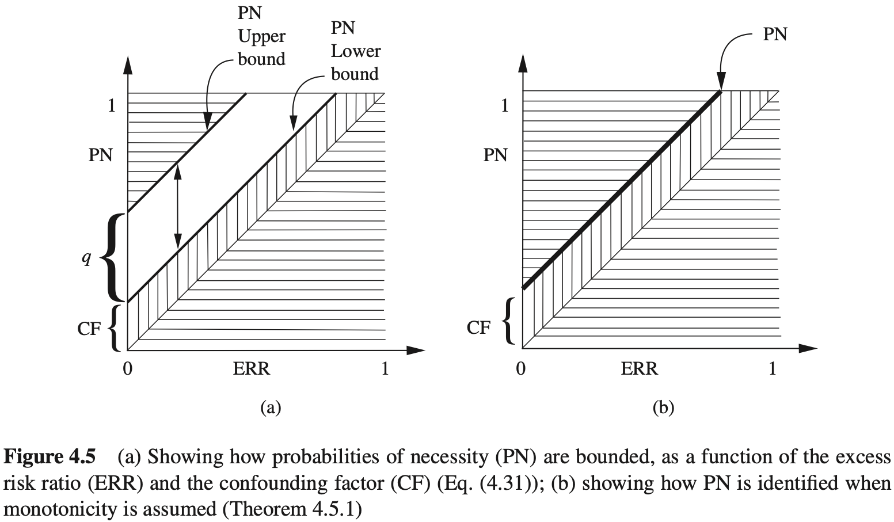
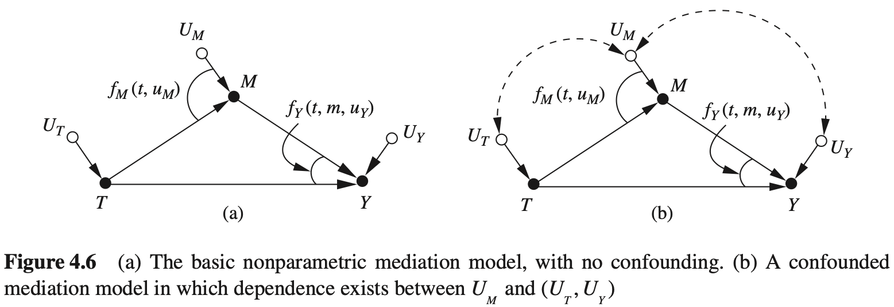

## 4 反事实及其应用

### 4.1 反事实

当我昨晚开车回家的时候，我来到了一个路口，我必须做出选择：走高速公路（ $X=1$ ）还是走维达大道（ $X=0$ ）。我最终选择了维达大道，结果发现交通非常拥堵。一小时以后我终于到家了，我对自己说：“啊，我应该选择走高速公路的！”

“我应该选择走高速公路的”这句话意味着什么呢？通俗地讲，它表示，“如果我当初选择走高速公路，我会早一点到家”。科学地来说，它意味着：在同样的那一天，在同样的环境、相同的驾驶习惯条件下，我心里估计的、走高速公路的期望驾驶时间要小于我的实际驾驶时间。

这种“如果”的陈述形式（其中“如果”部分是不真实的或者未能实现的）被称作反事实。反事实的“如果”部分称作假设条件，或者更一般地，称为前件。使用反事实来着重强调，想要在完全一致的现实条件下比较不同前件的结果（例如，行驶时间），在前面的例子中，前件是“走高速公路”，对比于“走维达大道”。已知实际决策的结果，这一事实很重要，因为在看到实际决策（走维达大道）结果后，我对于走高速公路的驾驶时间预估可能会与我知道结果前的估计完全不一样。实际决策结果（1小时）可以为走高速公路的评估提供有价值的证据，例如，那天的交通特别拥堵，这可能是由一场木丛火灾造成的。陈述“我应该走高速公路的”表达了这样的判断：无论什么情况影响了维达大道上的行驶速度，它都不会以同样的方式影响高速公路上的行驶速度。我的事后估计是，高速公路的行驶时间不超过1小时，这个估计和我在知道结果前做决策时的期望估计明显不同，否则，我会在开始时选择走高速公路。

如果尝试用，do-表达式来描述这个问题，会遇到困境，如

$$
E(\text{驾驶时间}\mid do(\text{高度公路}),\text{驾驶时间=1小时})
$$

我们想要估计的驾驶时间和观察到的实际驾驶时间之间产生了冲突。显然，要避免这个冲突，必须从符号上区分以下两个变量：

1. 实际驾驶时间；
2. 若知道走维达大道的驾驶时间为1小时，走高速公路的假设驾驶时间。

不幸的是，do-操作太笼统，无法实现这个区分。do-操作能区分两个概率： $P(\text{驾驶时间}\mid do(\text{高速公路}))$ 和 $P(\text{驾驶时间}\mid do(维达大道))$ ，但却不能区分两个变量：维达大道实际驾驶时间和高速公路假设驾驶时间。现在需要区分这两个变量，从而让实际驾驶时间（走维达大道）为估计假设驾驶时间提供信息。

幸运的是，实现这样的区分还是容易的。我们简单地使用不同的下标来标记这两个变量。用 $Y_{X=1}$ （或者 $Y_1$ ，上下文允许的话）来表示高速公路的驾驶时间，用 $Y_{X=0}$ （ $Y_0$ ）来表示维达大道的驾驶时间。针对前面的例子中，因为 $Y_0$ 是 $Y$ 实际观测值，因此希望估计的数值为

$$
E(Y_{x=1}\mid X=0,Y=Y_0=1)\tag{4.1}
$$

初学者在看到这个表达式时可能会感觉有些不适，这个表达式包含了三个变量的混合，一个假设变量和两个观察变量，假设变量 $Y_{X=1}$ 是一个事件（ $X=1$ ）上的断言，它以实际观察到的事件（ $X=0$ ）为条件。我们之前没有遇到过这样的冲突。当使用do-操作预测因果效应时，使用如下表达式：

$$
E(Y\mid do(X=x))\tag{4.2}
$$

这个表达式里的 $Y$ 是事件 $X=x$ 的结果。这个表达式也可以用新符号描述为 $E(Y_{X=x})$ ，它也表示在 $X$ 设置为 $x$ 时， $Y$ 的取值，两种表示形式都可以使用，没有必要抛弃do-操作，而仅使用反事实的符号。

我们会遇到需要使用反事实表达式（4.1）才能解决的问题，这是因为 $Y_{X=1}=y$ 一和 $X=0$ 是且一定是在不同条件下发生的事件，这两个事件发生在“不同的世界”。这样的问题不会出现在干预表示中，因为式（4.1）试图在给定实际驾驶时间（在我们选择走维达大道的世界中）为1小时的条件下，估计在选择走高速公路的世界中的驾驶时间；而式（4.2）则是在选择走高速公路的世界中估计期望驾驶时间，不参考发生在另一个世界中的任何信息。

在式（4.1）中出现的冲突使我们不能把这个表达式归约为一个do-表达式，这意味着不能从预试验中估计表达式的值。实际上，在两个决策选项上进行随机对照试验永远不会得到我们想要的估计值，这样的试验说明 $E(Y_1)=E(Y\mid do(\text{高速公路}))$ 和 $E(Y_0)=E(Y\mid do(\text{维达大道}))$ ，但是我们不能同时走高速公路和维达大道，因此无法计算我们想要的估计值，即条件期望 $E(Y_1\mid X=0,Y=1)$ 。研究者可能感兴趣是否有其他方法可以绕过这个困难，如事后专门测量高速公路时间，或者同时用另一个驾驶员，但现场条件可能随着时间发生变化，另一个驾驶员有他自己的驾驶习惯。无论哪种情况，用这些智能方法估量的驾驶时间仅是我们想要估计的“驾驶时间”的近似，随着这些条件与如果当初走高速公路的条件相似度的变化，估计的近似度也会变化。这种近似可能适合估计某些情况下的目标值，但并不适用于定义反事实。定义需要能够准确刻画我们想要做的估计，因此必须依赖下标符号 $Y_1$ ，它表示在那个特定的历史时刻我选择走高速公路的条件下，我“想要”的估计时间。

尽管式（4.1）中反事实 $Y_1$ 属于假设，但是本书第2章中的结构因果模型已证明其不仅能够用于计算任何完全确定模型的反事实摄率，也能在潜在的函数不确定或者某些变量不可测时，从数据中估计这些概率。

下一节将详细介绍计算及估计反事实的方法，之后还会用这些方法来解决各种复杂的、看起来难以解决的问题。例如，计算有多少参与者如果当初没有参加培训还能得到工作，从而识别一个工作培训项目的效应；在一个使用统一千预（将忠者组的族岛素水平控制在相同的常数值）试验中预测添加干预（对不同康岛素水平的忠者组增加5mg/l的成岛素）的效应；确定一个癌症患者如果当初选择不同的治疗方案有不同结果的可能性；以足够的概率来证明当公司拒绝应聘者时是否存在歧视现象；通过直接效应和间接效应的分析，来弄清楚不同性别的雇佣政策对于纠正劳动力中性别差异的效应。

我们可以用反事实解决所有上述问题和许多其他问题。但首先，必须学习怎样定义反事实，以及在实际中如何使用它们。

### 4.2 反事实的定义和计算

#### 4.2.1 反事实的结构性解释

在前面关于干预的章节中，通过用等式 $X=x$ 代替结构方程中的 $X$ 来模拟将变量 $X$ 设置为值 $x$ 的行为，从而用结构因果模型预测从未实施过的行动和决策的效应。本节将展示：通过在一个稍微不同的环境中使用相同的操作，我们如何使用结构方程模型来定义反事实，如何从给定模型中理解反事实，以及当模型中一部分未知时，有多大的概率能够估计出反事实。

从一个完全确定的模型 $M$ 开始，已知模型中所有外生变量的值和函数 $\{F\}$ 。在这样一个确定的模型中，每一个对于外生变量的赋值 $U=u$ 。关联到群体中的每个单个成员，或个体中的“个体”，或者关联到某种“情形”。这一关联的理由如下：每一个赋值 $U=u$ 唯一定了“中所有变量的值，因此总体中的每一个个体的属性取得唯一值，这依赖于个体的身份。如果群体是“人”，那么这些属性可能包括资历、地址、受教育情况、参加音乐活动的倾向以及在任何给定时间关联给那个个体的所有其他属性。如果群体是“农业用地”，那么属性包括土壤含量、环境气候和当地野生动物等。这些定义属性如此之多，我们不可能把所有属性都包含在模型里，但是必须把能够区别每个个体的属性全部考虑进来，这样才能确定模型里所有变量的值。从这个意义上说，每一个值对应了群体中的某个成员或“个体”，或者某种“情形”。

例如，如果 $U=u$ 代表一个名叫乔的人的属性， $X$ 代表变量“薪资”，那么 $X(u)$ 就代表了乔的薪资。如果 $U=u$ 代表了一块农业用地， $Y$ 代表了给定季节的产量，那么 $Y(u)$ 代表了那个季节 $U=u$ 该地块的产量。

现在，考虑反事实语句“在 $U=u$ 的情况下，若 $X$ 当初取值 $x$ ，则 $Y$ 会取值 $y''$ ，记做 $Y_x(u)=y$ ，其中 $X$ 和 $Y$ 是 $V$ 中的任意两个变量。解释这个句子的关键是将语句“ $X$ 当初取值 $x$ ”作为一个在当前模型中进行微小修改的陈述，以便建立前件条件 $X=x$ ，这个前件条件有可能与 $X$ 的实际观测值 $X(u)$ 冲突。这个微小修改相当于将方程中的 $X$ 替换为常量 $x$ 。可以认为是一个外部干预 $do(X=x)$ ，这个替换允许常量 $x$ 不同于 $X$ 的实际观测值（即 $X(u)$ ），而不会使方程系统不协调，用这种方式允许所有变量（包括外生变量和内生变量）都可以作为其他变量的前件。

下面在一个简单的因果模型中演示这个定义，它只包含三个变量 $X$ 、 $Y$ 、 $Z$ ，并由以下两个方程定义：

$$
X=aU\tag{4.3}
$$

$$
Y=bX+U\tag{4.4}
$$

首先计算反事实 $Y_x(u)$ ，即在 $U=u$ 的情况下，若 $X$ 当初取 $x$ ， $Y$ 的取值情况。用 $X=x$ 替换第一个方程，得到“修正”的模型 $M_x$ ：

$$
X=x
$$

$$
Y=bX+U
$$

代入 $U=u$ ，求解 $Y$ ，得到

$$
Y_x(u)=bx+u
$$

这正是我们所预期的。因为结构方程 $Y=bX+U$ 的含义是“赋值给 $Y$ 的值是加上 $X$ 赋值的 $b$ 倍”，让我们展示一个不是那么明显的结果，观察反事实 $X_y(u)$ ，即在 $U=u$ 的情况下，若 $Y$ 当初取值 $y$ 的话。 $X$ 会取什么值。这时，用 $Y=y$ 替换第二个方程，并求解 $X$ ，得到 $X_y(u)=au$ ，这意味着在假设条件“ $Y$ 当初取值 $y$ ”下， $X$ 保持不变。如果将这个假设条件看作是来自外部的、未知的干预产生的，那么似乎是可以接受的。如果不用干预的说法，而将 $Y=y$ 看作是自发的，意料之外的变化，那就可能不是我们期望的了。无论 $Y$ 的变化是外部产生的还是自发产生的， $X$ 都不会发生变化，反事实条件下的 $X$ 不变性反映了这样一种直觉：假设的未来事件并不会改变过去。

对应于模型中变量可以取得的不同值，每个结构方程模型都包含许多这样的反事实。为了展示这个模型隐含的其他反事实，现假设式（4.3）和式（4.4）中的 $U$ 可以取三个值 $1,2,3$ ，并令 $a=b=1$ 。表4.1给出了对应 $x$ 和 $y$ 不同水平的 $X(u), Y(u),Y_X(u)$ 和 $X_y(u)$ 的取值。例如，为了计算 $u=2$ 时的 $Y_2(u)$ ，只需要 $X=2$ 替换 $X=aU$ ，求解一组新的方程，然后得到 $Y_2(u)=2+u=4$ 。这个计算非常简单，其足以表明虽然反事实被认为是假设的，甚至从统计角度看是神秘的，但它们很自然地从我们对现实的感知中表现出来，就像在结构模型中表现的那样。每一个结构方程模型都为所有可能的反事实赋予了确定的值。

表4.1 对式（4.3）和式（4.4）线性模型取值情况

| $u$  | $X(u)$ | $Y(u)$ | $Y_1(u)$ | $Y_2(u)$ | $Y_3(u)$ | $X_1(u)$ | $X_2(u)$ | $X_3(u)$ |
| ---- | ------ | ------ | -------- | -------- | -------- | -------- | -------- | -------- |
| 1    | 1      | 2      | 2        | 3        | 4        | 1        | 1        | 1        |
| 2    | 2      | 4      | 3        | 4        | 5        | 2        | 2        | 2        |
| 3    | 3      | 6      | 4        | 5        | 6        | 3        | 3        | 3        |

从这个例子中，读者可能会得到这样的印象：反事实与待通的由 do-操作刻画的干预措施没有区别。然而，需要注意的是，在这个例子中，我们计算的不仅仅是 $Y$ 在这样或那样干预下的概念或期望值，而且还计算了 $Y$ 在假设的新条件 $X=x$ 下的值。对于每一种情况 $U=u$ ，得到了一个确定的数值 $Y_x(u)$ ，它代表了 $Y$ 在这种情况下的假设值。另一方面，do-操作仅仅根据定义在从来积分类（式（1.30））中删除因子 $P(x_i\mid pa_i)$ 之后的概率分布，提供了如 $E(Y\mid do(x))$ 这样的概率结果。从实验主义的角度来看，这一差异反映了计算总体水平和个体水平之间的巨大鸿沟：do(x)-操作刻画了干预下的总体行为，而 $Y_x(u)$ 描述了一个特定的个体在这样一个干预下的行为。这一差异具有意义深远的影响，将使我们能够定义诸如信任、过失和遗憾等概念的概率，而这些都是 do-操作无法刻画的。

#### 4.2.2 反事实的基本定理

现在，可以将反事实的概念推广到任何结构模型 $M$ 。考虑任意两个变量 $X,Y$ ，它们不一定在同一个方程里（但在同一个方程组里）。令 $M_x$ 表示用 $X=x$ 代替 $X$ 后得到的 $M$ 的修改版。反事实 $Y_x(u)$ 的形式化定义为

$$
Y_x(u)=Y_{M_x}(u)\tag{4.5}
$$

用语言描述为：模型 $M$ 中的反事实 $Y_x(u)$ 被定义为“修改后的”子模型 $M_x$ 中 $Y$ 的解。式（4.5）是因果推理最重要的基本原则之一。它使我们获得具有现实意义的科学概念，并用它来回答大量类似于“若当初取值 $x$ ， $Y$ 会取什么值”的各种问题。当 $X$ 和 $Y$ 是变量集合时，如果 $M_x$ 表示 $X$ 集合中所有成员均被常数值替换后的模型，定义同样适用。这带来了大量的、可由给定模型计算的反事实语句，并引出了一个有趣的问题：这样一个由几个方程组成的简单模型，怎么会有如此多的反事实赋值？答案是：这些反事实得到的值并不是完全任意的，而是必须相互一致的，并且与一个基础模型相协调。

例如，如果观察到 $X(u)=1$ 和 $Y(u)=0$ ，那么 $Y_{X=1}(u)$ 一定是0。这是因为将 $X$ 设定为一个已经存在的值 $X(u)=1$ ，不应该对世界产生任何改变。因此， $Y$ 应当保持当前的值 $Y(u)=0$ 。

一般来说，反事实遵循以下的一致性原则：

$$
\text{如果}\quad X=x\quad\text{那么}\quad Y_x=Y\tag{4.6}
$$

如果 $X$ 是二值的，那么一致性原则变为

$$
Y=XY_1+(1-X)Y_0
$$

这可以解释如下： $Y_1$ 为 $X$ 取值为1时候的 $Y$ 的观察值。对应地， $Y_0$ 为 $X$ 取值为0时候的 $Y$ 的观察值，如果通过式（4.5）计算反事实，那么所有这些约束都会自动成立。

#### 4.2.3 从总体数据到个体数据行为

为了显示反事实个体行为推理中的作用，使用图4.1中描述的模型加以说明。图4.1表示一个“激励方案”：即表示一个学生在课后补习班上花费的时间， $H$ 表示家庭作业量， $Y$ 表示考试成绩。每一个变量的值以超出学生考试成绩均值的标准差来表示（即模型是标准化的，所有的变量均值为0，方差为1）。例如，如果 $Y=1$ ，那么学生得分超出考试成绩均值的1个标准差。这个模型表示一个随机试点项目，学生们被随机地指定参加课后补习。图4.1对应模型描述见“模型4.1”。

模型4.1

$$
X=U_X
$$

$$
H=aX+U_H
$$

$$
Y=bX+cH+U_Y
$$

$$
\sigma_{U_iU_j}=0,\quad\text{对于所有}i,j\in\{X,H,Y\}
$$

假设所有的因子 $U$ 都是独立的，且得到了模型4.1中系数的值（这些值可以从总体数据中估计得到）：

$$
a=0.5,b=0.7,c=0.4
$$

考总一个名为乔的学生，测得： $X=0.5,H=1,Y=1.5$ 。假设希望回答以下问题：如果乔当韧的家庭作业量加倍，他的分数会是多少呢？

在线性结构方程模型中，每个变量的值均由系数和变量 $U$ 确定，后者表示了个体之间的差异。因此，可以使用证据 $X=0.5,H=1$ 以及 $Y=1.5$ ，确定与乔相关的变量 $U$ 的值。这些值对于假设的行为是不变的，比如那些可能使乔家庭作业量加倍的行为。

这种情况下，能够从证据中获得乔的特定 $U$ 值：

$$
U_X=0.5
$$

$$
U_H=1-0.5\times0.5=0.75
$$

$$
U_Y=1.5-0.7\times0.5-0.4\times1=0.75
$$

接下来，用 $H=2$ 替换 $H$ 的结构方程，模拟将乔的家庭作业量加倍的行为。图4.2描述了修改后的模型，最后，在修改后的模型中用计算后的 $U$ 值来计算 $Y$ 的值，得到

$$
\begin{aligned}
Y_{H=2}(U_X&=0.5,U_H=0.75,U_Y=0.75)\\
&=0.5\times0.7+2.0\times0.4+0.75\\
&=1.90
\end{aligned}
$$

因此得出了如果乔的家庭作业量增加一倍，则他的分数会变为1.9而不是1.5。根据之前的约定，这意味着增加到比均值高1.9个标准差，而不是现在的1.5个标准差。

上述过程可总结为：首先应用证据 $X=0.5,H=1$ 以及 $Y=1.5$ 去获取变量 $U$ 的值；然后通过 $H=2$ 替换方程 $H=aX+U_H$ ，来模拟一个外部干预从而强制条件 $H=2$ ；最后，在给定的结构方程和获取的取值条件下计算 $Y$ 的值（当然，在上面的所有情况下，假设对 $H$ 的干涉不会改变 $U$ 的值）。

#### 4.2.4 计算反事实的三个步骤

乔的课后补习项目的例子展示了反事实的基本定义，以及如何获得给定反事实值的过程。任何反事实值的确定可由如下三步过程来计算：

(i)溯因：用证据 $E=e$ 来确定 $U$ 的值；

(ii)作用：修改模型 $M$ ，移除变量 $X$ 出现在左边的方程，用 $X=x$ 来替换它们，从而获得修正的模型 $M_x$ ；

(iii)预测：使用修改后的模型 $M_x$ 和 $U$ 的值来计算 $Y$ 的值，即反事实的结果。

做一个时间上的比喻，步骤（i）根据当前证据 $e$ 解释过去（ $U$ ）；步骤（ii）通过（最低限度的）扭曲历史来符合假设的前件 $X=x$ ；步骤（iii）根据对过去的认识和新立的条件 $X=x$ 来预测未来（ $Y$ ）。

这个过程可以解决任何确定性的反事实问题，即已知每个相关变量值的总体中与个体有关的反事实问题，结构方程模型能够回答这种性质的反事实问题，因为每个方程都表示一个变量获得其值的方式。如果我们知道这些方式，也就应该能够预测给定修改条件下，某些方式被改变后变量将会得到什么值。因此，将反事实视作是结构方程的衍生性质是很自然的。在一些框架中，反事实被当作本原性质（Hallamd, 1986；Rubin, 1974）。

但反事实是可论是以某概率发生的，这与总体中的一类个体有关。例如，在课后补习项目的例子中，可能想知道如果令所有 $Y<2$ 的学生当初的家庭作业量加倍，会发生什么。这些概率性的反事实与do-操作干预不同，因为它们限制了施加干预的个体集合，而do-表达式不能这样做。

现在可以将确定性模型改进为概率性模型来处理关于反事实的概率和期望的问题。例如，假设乔是一名参与了图4.1项目的学生，他的考试分数为 $Y=y$ 。如果当初增加5个小时的激励训练，那么他的分数是 $Y=y’$ 的概率是多少？或者，在这样一个假设世界中，他期望的分数是多少？与模型4.1不同，我们没有关于所有三个变量 $\{X,Y,H\}$ 的信息，因此不能唯一地确定与乔相关的值 $u$ 。相反，乔可能属于一个与证据相对应的个体分组，组内每个个体具有不同的 $u$ 值。

我们可以通过为外生变量 $U$ 赋饱和率 $P(U=u)$ ，将不确定性引入因果模型。它们代表了我们对于识别对象的不确定性，或者，当对象已知时，对于问题中可能包含的对象的其他属性的不确定性。

外生点率 $P(U=u)$ 在内生变量 $V$ 上引入了唯一的概率分布 $P(V)$ 。在这个分布的帮助下，我们不仅可以定义和计算任何一个反事实 $Y_x=y$ 的概率，还可以定义和计算观测变量及反事实变量所有组合的联合分布。例如，可以确定 $P(Y_x=y,Z_x=z,X==x')$ ，其中 $X,Y,Z$ 和 $W$ 是模型中的任意变量。这样的联合概率表示某些 $u$ 的比例，即括号内的所有事件对于这些 $u$ 都是事实的，满足 $Y_x(u)=y$ 和 $Z_w(u)=z$ 以及 $X(u)=x'$ ，特别是，允许 $w$ 或者 $x'$ 与 $x$ 冲突。

关于这些概率的一个典型问题是：假定我们观察到给定个体的特征 $E=e$ ，那么如果 $X$ 当初取值 $x$ ，我们对于这个个体的 $Y$ 的期望值是多少？这个期望表示为 $E(Y_{X=x}\mid E=e)$ 。其中，允许 $E=e$ 与前件 $X=x$ 冲实。竖线后的 $E=e$ 代表了我们在这个个体上所获得的所有的信息（或证据），可能包括 $X,Y$ 或其他变量的值，就像在式（4.1）中看到的那样。下标 $X=x$ 表示了由反事实语句所确定的前件。 

在接下来的章节中会介绍处理这些概率和期望的细节。但是目前知道如何使用它们很重要，可以将之前的三步法扩展到任何概率型的非线性系统。

给定任何一个形式为 $E(Y_{X=x}\mid E=e)$ 的反事实，三步法过程如下：

（i）溯因：根据证据更新 $P(U)$ ，获得 $P(U\mid E=e)$ ；

（ii）作用：修改模型 $M$ ，移除 $X$ 出现在左边的结构方程，用 $X=x$ 来替换它们，从而获得修正的模型 $M_x$ ；

（iii）预测：使用修正的模型 $M_x$ 和 $P(U\mid E=e)$ ，计算 $Y$ 的期望，即反事实的结果。

我们将在4.4节中看到，以上的过程不仅适用于回顾性的反事实问题（形式为“如果 $X$ 当初取值 $x$ ， $Y$ 的值会是多少？”的问题），还适用于某些前瞻性问题。特别地，若让每个个体都实施一个依赖于它的 $X$ 当前值的行为，该方法也适用。一个典型的例子是“添加干预”，例如，不管患者之前的剂量如何，均对每个患者增加5 mg/L的胰岛素。由于最终胰岛素水平根据患者的不同而不同，因此这个措施不能用do-表达式来表示。

另一个例子是，假设想要使用图4.1来估计一项学校政策对考试成绩的效应，该政策是令懒得做作业（ $H<H_0$ ）的学生参加课后补习项目（ $X=1$ ）。我们不能简单地干预 $X$ ，使其在 $H$ 低的情况下等于1，因为在该模型中， $X$ 是 $H$ 低的原因之一（参见图4.1）。

相反，我们用反事实符号表示这个量的期望，即 $E(Y_{X=1}\mid H\le H_0)$ ，原则上，它可以使用上述三步法来计算。在用由特征表示的总体子集估计行为和政策效应时，如果这些特征受政策的影响（如 $H\le H_0$ ），那么反事实推理和上述过程是必需的。

### 4.3 非确定性的反事实

#### 4.3.1 反事实的概率

为了说明非确定性是如何体现在反事实计算中的，让我们给公式（4.3）和（4.4）中的变量 $U$ 的值赋予概率。设想 $U=\{1, 2, 3\}$ 代表了总体中的三种类型的个体，概率如下：

$$
P(U=1)=\frac{1}{2},P(U=2)=\frac{1}{3},P(U=3)=\frac{1}{6}
$$

所有在同一总体类型中的个体有相同的反事实值，正如表4.1中对应行所确定的。使用这些值，可以计算满足指定条件的反事实的概率，例如，可以计算若 $X$ 当初取值为2， $Y$ 的值会是3的个体的比例，或者 $Y_2(u)=3$ 。这个条件仅发生在表的第一行，因为它是 $U=1$ 的一个属性，所以可以得出结论：它的发生概率为1/2，即 $P(Y_2=3)=1/2$ 。同样可以计算其他反事实的概率，例如， $P(Y_1=4)=1/6,P(Y_1=3)=1/3,P(Y_2>3)=1/2$ 等。然而，值得注意的是，也可以计算每一个反事实事件和观察事件组合的联合概率，例如：

$$
P(Y_2>3,Y_1<4)=1/3
$$

$$
P(Y_1<4,Y-X>1)=1/3
$$

$$
P(Y_1<Y_2)=1
$$

在第一个表达式中，我们发现了两个发生在不同世界中的事件的联合概率： $Y_2>3$ 发生在 $X=2$ 的世界中， $Y_1<4$ 发生在 $X=1$ 的世界中。它们联合的概率为1/3，这是因为这两个事件仅在 $U=2$ 时才能共同发生，而 $U=2$ 的概率为1/3。第二个和第三个表达式展示了其他跨越世界的事件。值得注意的是，不同世界之间的冲突不会为计算设置障碍。实际上，跨越世界的概率计算正如在相同世界内计算那样简单：简单地确定那些特定组合条件为真的行，然后将这些行的概率加起来，这使我们具有在反事实中计算条件概率和定义相关概念的能力，例如反事实中的变量依赖和条件独立，正如在第1章中处理观察变量时所做的那样。例如，很容易验证，在 $Y>2$ 的个体中，如果 $X$ 当初取 3， $Y$ 会增加的概率为 2/3。因为 $P(Y_3>Y\mid Y>2)=\frac{1}{3}/\frac{1}{2}=\frac{2}{3}$ 。同样地，可以验证差值 $Y_{x+1}-Y_x$ 与 $x$ 独立，这意味着 $X$ 对 $Y$ 的因果效应不会随着总体类型的变化而变化，这是一个所有线性模型都具有的性质。

这种多个世界中的反事实联合概率可以很容易地用下标符号来表示，如 $P(Y_1=y_1,Y_2=y_2)$ ，且能够从结构模型中计算，正如表4.1那样，然而，它们不能用 do(x) 符号来表示，因为后者仅能为每一个干预 $X=x$ 计算一个概率。为了了解这个局限带来的问题，我们来研究一个对式（4.3）和式（4.4）中模型进行轻微改动形成的模型。新模型的方法如下：

$$
X=U_1,Z=aX+U_2,Y=bZ\tag{4.7}
$$

图 4.3 给出了其结构。为了让这个模型符合所讨论的问题，令 $X=1$ 表示受过高等教育， $U_2=1$ 表示有工作经验， $Z$ 表示给定工作所需的技能水平， $Y$ 表示薪资。

假设我们的目标是计算 $E(Y_{X=1}\mid Z=1)$ ，它表示技能水平 $Z=1$ 的个体如果当初接受了高等教育的话，他们薪资的期望值。这个统计量不能用do-表达式描述，因为条件 $Z=1$ 和前件 $X=1$ 属于两个不同的世界；前者表示当前的技能，而后者表示在非现实的过去中的一个假设教育。如果试图用表达式 $E(Y\mid do(X=1), Z=1)$ 来描述这个假设的薪资，是无法揭示我们想要的信息的。do-表达式表示所有完成了高等教育并且之后获得了技能水平 $Z=1$ 的个体的期望薪资，如图4.3所示，这些个体的薪资仅依赖于他们的技能水平，技能来自高等教育还是工作经验并不会影响他们的薪资。在这种情况下，条件 $Z=1$ 切断了我们感兴趣的干预效应。与之相反，在那些当前 $Z=1$ 的个体中，某些个体可能没有接受过高等教育，如果他们当初接受了高等教育的话，他们会获得更高的技能水平（及薪资），我们感兴趣的是这些人的薪资，但是这没有被包含在do-表达式中。因此，在这种情况下，do-表达式不能刻画反事实问题。

$$
E(Y\mid do(X=1),Z=1)\neq E(Y_{X=1}\mid Z=1)\tag{4.8}
$$

我们可以进一步证实这个不等式，方法是观察如下事实：当 $E(Y\mid do(X=1),Z=1)$ 等于 $E(Y\mid do(X=0),Z=1)$ 时， $E(Y_{X=1}\mid Z=1)$ 不一定等于 $E(Y_{X=0}\mid Z=1)$ 。将 $Z=1$ 看作干预后条件，在两个前提条件下所满足的两个不同的个体集合（即 $X=1$ 的人群和 $X=0$ 的人群）；而后者是当前世界中定义的单独个体集合（即 $Z=1$ 的人群），该集合中的个体在两个不同的假设前提下会有不同的结果。 $do(x)$ 符号不能描述后者，这是因为表达式 $E(Y_{X=1}\mid Z=1)$ 中的事件 $X=1$ 和 $Z=1$ 指的是干预前和干预后两个不同的世界。另一方面，表达式 $E(Y\mid do(X = 1),Z=1)$ 仅仅表示干预后的事件，这就是为什么它可以用 $do(x)$ 来表述的原因。

一个很自然的问题是：反事实符号是否也能用于描述干预后的事件，即单一世界的表达式 $E(Y\mid do(X = 1), Z = 1)$ 。答案是肯定的，反事实符号更灵活，既能刻画单一世界，又能描述跨世界的事件概率。 $E(Y\mid do(X=1),Z=1)$ 可以很容易地转化为反事实表达： $E(Y_{X=1}\mid Z_{X=1}=1)$ ，它显式地将事件 $Z = 1$ 指定为干预后的事件。变量 $Z_{X=1}$ 表示 $X$ 如果取值为1时 $Z$ 的取值，这正是我们之前在用贝叶斯公式将 $Z = z$ 加入表达式时想要表达的：

$$
P(Y=y\mid do(X=1),Z=1)=\frac{P(Y=y,Z=z\mid do(X=1))}{P(Z=z\mid do(X=1))}
$$

这明确地说明了 $Z$ 对 $X$ 的依赖应该如何处理。在3.5节的特别例子中，作为年龄变量 $Z$ 在干预前和干预后是不变的，因此有 $Z_{X=1}=Z$ ，在这种情况下不需要区分两者（即干预前和干预后），式（4.8）中的不等号将变为等号。

下而分析这个逻辑是如何反映在数字上的。表4.2描述了与式（4.7）对应模型相关的反事实，其中所有的下标表示 $X$ 的状态，这个表是用构建表4.1的方法构建的：用适当的常数（0或1）来替换方程 $X=u$ ，然后求解 $Y$ 和 $Z$ 。使用这个表，能够立即验证：

表4.2 对式（4.7）模型取值情况

| $u_1$ | $u_2$ | $X(u)$ | $Z(u)$ | $Y(u)$ | $Y_0(u)$ | $Y_1(u)$ | $Z_0(u)$ | $Z_1(u)$ |
| ----- | ----- | ------ | ------ | ------ | -------- | -------- | -------- | -------- |
| 0     | 0     | 0      | 0      | 0      | 0        | ab       | 0        | a        |
| 0     | 1     | 0      | 1      | b      | b        | (a+1)b   | 1        | a+1      |
| 1     | 0     | 1      | a      | ab     | 0        | ab       | 0        | a        |
| 1     | 1     | 1      | a+1    | (a+1)b | b        | (a+1)b   | 1        | a+1      |

$$
E(Y_1\mid Z=1)=(a+b)b\tag{4.9}
$$

$$
E(Y_0\mid Z=1)=b\tag{4.10}
$$

$$
E(Y\mid do(X=1),Z=1)=b\tag{4.11}
$$

$$
E(Y\mid do(X=0),Z=1)=b\tag{4.12}
$$

这些方法提供了对式（4.8）中不等式的数值验证。它们也说明了一个我们之前就注意到的反事实的独特性质，虽然在图4.3的图模型中 $Z$ 分离了 $X$ 和 $Y$ ，但我们发现对于那些符合条件 $Z=1$ 的个体， $X$ 对 $Y$ 是有效度的。

$$
E(Y_1-Y_0\mid Z=1)=ab\neq 0
$$

这可以由薪资的例子给出完美的解释。对于那些已经获得技能水平 $Z=1$ 的个体，他们的薪资仅依赖于他们的技能，而不是 $X。$ 对于那些当前技能水平 $Z=1$ 的个体，如果他们有不一样的过去，那么他们的薪资会变得不同。这种类型的回顾性推理，惯于对非现实历史的依赖，但并没有在如图4.3所示的图模型中表示出来。为了实现这样的推理，我们需要设计能直接在图中表示反事实的方法，将在4.3.2节给出这样的表示。

到目前为止， $P(u_1)$ 和 $P(u_2)$ 概率值还没有用于计算，因为条件 $Z=1$ 仅发生在 $u_1=0$ 且 $u_2=1$ 时（假定 $a\neq 0$ 且 $a\neq 1$ ），这时每一个 $Y,Y_1$ 和 $Y_0$ 都有确定值。然而，如果假设模型中 $a=1$ ，那么这些概率就会发挥作用，因为现在 $Z=1$ 可以发生在两个条件下：（ $u_1=0,u_2=1$ ）以及（ $u_1=1,u_2=0$ ）。每一个发生的概率为 $P(u_1=0)\cdot P(u_2=1)$ ，第二个发生的概率为 $P(u_1=1)P(u_2=0)$ 。在这种情况下，有

$$
E(Y_{X=1}\mid Z=1)=b(1+\frac{P(u_1=0)P(u_2=1)}{P(u_1=0)P(u_2=1)+P(u_1=1)P(u_2=0)})\tag{4.13}
$$

$$
E(Y_{X=0}\mid Z=1)=b(1+\frac{P(u_1=0)P(u_2=1)}{P(u_1=0)P(u_2=1)+P(u_1=1)P(u_2=0)})\tag{4.14}
$$

式（4.13）大于式（4.14）的事实再一次说明受教育程度对薪资的技能-特定因果效应不为 0，薪资仅由技能决定，而非教育。这是可以预料到的，因为技能水平 $Z=1$ 的雇员中没有接受高等教育的雇员比例不为零，他们如果当初接受了高等教育的话，他们的技能水平会增加到 $Z_1=2$ ，他们的薪资会达到 $2b$ 。

#### 思考题 4.3.1

考虑如图 4.3 所示模型，假定 $U_1$ 和 $U_2$ 是两个独立的高斯变量，每一个都是零均值和单位方差。

（a）对于技能水平 $Z=z$ 的雇员，如果他们当初接受了 $x$ 年的高等教育，计算他们的期望薪资。[提示：使用定理 4.3.2 的公式，其中证据 $e:Z=z$ ，并使用事实：对于任意两个高斯变量（设为 $X$ 和 $Z$ ），有 $E(X\mid Z=z)=E(X)+R_{XZ}(z−E(Z))$ 。使用第 3.8.2 节和第 3.8.3 节的知识，以结构参数的形式表示所有的回归系数，得到 $E(Y_x\mid Z=z)=abx+bz/(1+a^2)$ 。]

（b）基于（a）的答案，说明受教育程度对薪资的技能-特定因果效应独立于技能水平。

#### 4.3.2 反事实的图形化表示

由于反事实是结构方程的副产品，那么一个很自然的问题是：能否在与这些模型相关联的因果图中理解它们？答案是肯定的，正如可以从式（4.5）的反事实基本原理中理解它们一样。这个原理说明：如果修改模型 $M$ 得到子模型 $M_x$ ，那么修改后的模型中的结果变量 $Y$ 就是原始模型的反事实 $Y_x$ 。由于模型修改要求移除所有指向 $X$ 的箭头，因此能够得出结论，如图4.4所示：与变量 $Y$ 关联的节点若换为与 $Y_x$ （表示在 $X = x$ 情况下的潜在结果）关联，这个替换仅在修改后的模型中成立。

这个反事实的形象化表示足够回答一些关于 $Y_x$ 的统计性质的基本问题，以及这些性质如何依核干模型中的共他变量，特别是当以这些变量为条件时。

在讨论 $Y_x$ 的统计属性时，需要探究是什么引起了 $Y_x$ 的变化。根据它的结构性定义， $Y_x$ 表示了在 $X$ 被限定为常数 $X = x$ 时的值。因此，当 $X$ 被固定为常数时，即当移除指向 $X$ 的箭头时，如图4.4(b)所示， $Y_x$ 在统计上的变化受所有能够影响 $Y$ 的外生变量所支配。在这样的条件下，能够传递变化给 $Y$ 的变量集合是 $Y$ 的父节点（观察到的或未观察到的），以及 $X$ 到 $Y$ 路径上节点的父节点。例如，在图4.4(b)中，这些父节点是： $\{Z_3,W_2,U_3,U_Y\}$ ，其中 $U_Y$ 和 $U_3$ 是 $Y$ 和 $W_3$ 的误差项，它们没有显示在图中。任何阻断 $X$ 到这些父节点路径的变量集合也阻断了到 $Y_x$ 的路径，因此导致 $Y_x$ 条件独立。特别地，如果有一个变量集合 $Z$ 满足模型 $M$ 中的后门准则（见定义 3.3.1），那么这个集合也阻断了所有 $X$ 到这些父节点之间的路径，因此会使 $X$ 和 $Y_x$ 对于每一个 $Z = z$ 的情况均（条件）独立。

这次考虑被形式化总结为定理4.3.1。

**定理 4.3.1（后门的反事实解释）** 如果一个变量合 $Z$ 满足 $(X,Y)$ 的后门条件，那么对于所有的 $x$ ，在给定 $Z$ 条件下，反事实 $Y_x$ 条件独立于 $X$ ，记为

$$
P(Y_x\mid X,Z)=P(Y_x\mid Z)\tag{4.15}
$$

当需要从观察研究中估计反事实的概率时，定理 4.3.1 会非常有价值。特别是，它表明 $P(C \mid Y = y)$ 可由校正公式（3.5）计算。为了证明这一点，以 $Z$ 为条件（如公式（1.9）中那样），得到

$$
\begin{aligned}
P(Y_x=y)&=\sum_zP(Y_x=y\mid Z=z)P(z)\\
&=\sum_zP(Y_z=y\mid Z=z,X=x)P(z)\\
&=\sum_zP(Y=y\mid Z=z,X=x)P(z)
\end{aligned}
\tag{4.16}
$$

第二行由定理4.3.1获得，第三行由一致性规则（式（4.6））获得。

在式（4.16）中得到了熟悉的校正公式，这并不令人惊讶，因为同样的公式在3.2节（式（3.4））对 $P(Y=y \mid \text{do}(x))$ 的推导中也得到过， 我们知道 $P(Y_x=y)$ 只是 $P(Y=y \mid \text{do}(x))$ 的另一个表达式是一样的。有趣的是，这个推导只引用了代数形式。一旦确定 $Z$ 满足后门准则，那么这个推导就可以不借助模型。式（4.15）将图形化表示转化为代数形式，进而推导出式（4.16），有时也称其为“（ $X$ 的）条件可忽略性”。定理4.3.1给出了这个概念的科学表述，我们可以测试它是否在任何给定的模型中都成立。

使用反事实的图形化表示，可以解决在4.3.1节（图4.3）中所面临的困境，图形化地解释了为什么较强的受教育程度（ $X$ ）会对耳前处于技能水平 $Z=z$ 的人的薪资（ $Y$ ）产生影响，尽管根据模型，薪资仅由技能水平决定。要形式化地检测受教育程度对薪资（ $Y_x$ ）的效应是否统计上独立于受教育程度，我们需要在图中找到 $Y_x$ ，看它是否在给定 $Z$ 的条件下与 $X$ 是“d-分离”的。参考图4.3可以看到， $Y_x$ 可由 $U_2$ 确定， $U_2$ 是从 $X$ 到 $Y$ 的因果路径上节点的唯一父节点（因此当 $X$ 被固定为常量时，它是唯一能令 $Y_x$ 产生变化的变量）。图4.3告诉我们 $Z$ 是 $X$ 和 $U_2$ 的对撞节点。因此，在给定 $Z$ 的条件下， $X$ 和 $U_2$ （类似地， $X$ 和 $U_2$ ）不是“d-分离”的。因此可得出结论。

$$
E(Y_x\mid X,Z)\neq E(Y_x\mid Z)
$$

尽管有

$$
E(Y\mid X,Z)=E(Y\mid Z)
$$

在思考题4.3.1中，我们在线性⾼斯模型的条件下明确地估计了反事实的期望。在这一节中建立的图形化表示允许我们通过图形化的方法来确定反事实中的独立性，而不用假设线性或任何特定的参数形式。这是将现代因果分析引入统计学的⼯具之一，从前面对如图4.3所示模型的分析可以看出，这是一个难以通过直觉解决的任务，但可以将其简化为关于图的简单操作。Pearl（2000:213-215）中讨论了其他与可祝化反事实相关的方法，名为“孪⽣⽹络”。

#### 4.3.3 试验环境中的反事实

我们已经相信每一个反事实向题都能够从完全确定的结构模型中获得回答，接下来我们考虑试验环境，在该情况下可能无法得到完整的模型，试验者必须通过观察有限的样本来回答干预向题。现在回到图4.1的“激励方案”模型，分析一个学生乔的个体行为，并假设试验者观察了10个这样的个体的集合，乔是参与者1号，每个个体由一个单独的向量刻画： $U_t=(U_X,U_W,U_Y)$ ， $U_t$ 服从 $[0,1]$ 上的均匀分布，正如在表4.3的前三列中展示的。

表4.3 根据图4.1中的结构模型预测得到的潜在的和观察的结果

使用这个信息，可以创建一个符合模型要求的完整数据集。对于每个三元组 $(U_X,U_H,U_Y)$ ，图4.1的模型使我们能够给出表中一整行的数据，包括 $Y_0$ 和 $Y_1$ ，这二者分别代表了试验（ $X=1$ ）和控制（ $X=0$ ）条件下的潜在结果。图4.1的结构模型实际上表示了一个模拟的个体群体，以及群体在观察及试验条件下的预测行为。标记为 $Y_0,Y_1,H_0,H_1$ 的列预测了两种处理方式下（ $X=0$ 和 $X=1$ ）的假设结果。例如， $Y_{X=0.5,Z=2.0}$ ，如同在图4.2中为乔计算的，当然也包括其他所有可能的下标组合。从这个模拟的群体中，人们能够估计变量 $X,Y,H$ 上的每一个反事实问题的概率，前提是假设我们有表中所列的所有数据。这个估计只需简单地统计满足给定要求的个体比例，如同在4.3.1节中演示的那样。

毋庸置疑的是，无论是在观察研究中还是在试验研究中，都不能完整获得像表4.3这样的数据。这些数据是从诸如图4.2的参数化模型中推导出来的。从该模型中，能够在给定观察 $\{X,Y,Z\}$ 的条件下推导每一个参与者的属性 $\{U_X,U_H,U_Y\}$ 。一般而言，如果缺少参数化模型，仅仅观察他们的行为 $\{X,Y,Z\}$ 时，我们几乎无法知道任何个体参与者的潜在结果 $Y_1$ 和 $Y_0$ 。从理论上讲，我们仅有的反事实 $\{Y_1,Y_0\}$ 与观察数据 $\{X,Y,Z\}$ 之间的联系是公式（4.6）中的一致性原则，该原则说明，当 $X=1$ 时， $Y_1$ 一定等于 $Y$ ，当 $X=0$ 时， $Y_0$ 一定等于 $Y$ 。除了这个简单的联系外，与个体参与者有关的大部分反事实将无法被观测。

幸运的是，我们可以在样体水平上了解许多关于这些反事实的信息，例如估计它们的概率和期望。通过式（4.16）的校正可以仅使用图计算 $E(Y_1-Y_0)$ ，而不需要完整的模型。还可以从试验研究中获得更多的信息，有时候图本身甚至可以是可有可无的。

假设没有关于潜在模型的任何信息，仅有试验研究中 $Y$ 的观测值，其中， $X$ 随机在两个水平取值， $X=1$ 和 $X=0$ 。

表4.4描述了相同的10个参与者（乔是参与者1号）在这样的试验条件下的结果， $X$ 在 $X=0$ 和 $X=1$ 上随机分布，其中参与者 $1,5,6,8,10$ 被赋予 $X=0$ ，其余为 $X=1$ 。前两列给出了真实的潜在结果（从表4.3中获益），而最后两列描述了试验者所能获得的信息，其中黑色方块表示结果未被观察到。显然， $Y_0$ 仅能在被赋予 $X=0$ 的参与者中观察到，类似地， $Y_1$ 仅能在被赋予 $X=1$ 的参与者中观察到。随机化能够确保，虽然一半的潜在结果无法观测，但试验组与对照组的观测均值差异会收敛到群体均值的差异， $E(Y_1−Y_0)=0.9$ 。这是因为随机化能够使黑色方块在表4.4的最右两列中随机分布，并独立于 $Y_0$ 和 $Y_1$ 的值，因此随着样本数目的增多，样本均值会收敛到群体均值。

随机试验的这个独特而重要的性质其实并不陌生，因为随机化像干预一样，使得 $X$ 独立于任何可能影响 $Y$ 的变量，如图4.4（b）所示。在这样的条件下，可以令 $Z=\emptyset$ ，应用校正公式（4.16），得到 $E(Y_x)=E(Y\mid X=x)$ ，其中 $x=1$ 代表处理过的个体， $x=0$ 表示未被处理的个体。表4.4帮助我们理解从试验中获取样本均值时，实际上计算的是什么，以及这个均值如何与潜在的反事实 $Y_0$ 和 $Y_1$ 发生联系。

#### 4.3.4 线性模型中的反事实

在非参数化模型中，即使做了大量的试验，形式为 $E(Y_{X=x}\mid Z =z)$ 的反事实的值也可能无法识别。然而，在完全的线性模型中，事情要简单得多。只要能够识别模型参数，任何反事实的也都是可以识别的。这是因为，参数完全定义了模型的函数，正如之前看到的，一旦函数确定了，那么反事实就可以用公式（4.5）来计算。因为每个模型参数都可以用直接因果效应的干预来确定。因此可以得出结论，在线性模型中，每一个反事实都是试验可识别的。那么问题变为，当某些模型参数不能识别时，反事实是否可以在观察研究中被识别出来？事实证明，只要 $E[Y \mid do(X = x)]$ 可识别，那么任何形如 $E(Y_{x} \mid Z = e)$（其中 $e$ 是一个任意的证据集合）的反事实均可被识别（Pearl, 2000:389）。定理4.3.2总结了二者之间的关系，它提供了一种计算反事实的捷径。

**定理4.3.2** 令 $\tau$ 表示 $X$ 到 $Y$ 的总体因果曲线（回归曲线）的斜率，则有

$$
\tau=E(Y\mid do(x+1))-E(Y\mid do(x))
$$

对于任意的证据 $Z = e$ ，有

$$
E(Y_{X=x}\mid Z=e)=E(Y\mid Z=e)+\tau(x-E(X\mid Z=e))\tag{4.17}
$$

这提供了一个线性模型上的反事实的直观解释， $E(Y_{X=x}\mid Z=e)$ 能够通过以下方式计算得到：首先计算证据 $e$ 条件下的 $Y$ 的最优估计 $E(Y\mid e)$ 。然后计算当 $X$ 从当前最佳估计 $E(X|Z=e)$ 转换到它的假设值 $x$ 时 $Y$ 的期望变化，并将之前 $Y$ 的最佳估计加到这个期望变化上。

从方法论上讲，定理4.3.2的重要性在于它能够让研究人员从群体数据中回到关于个体（或个体合集合）的假设问题。在接下来的章节中我们会探讨这个性质在法律和社会场景中的应用。在图4.2展示的情景中，在证据 $e=\{X=0.5,H=1,Y=1\}$ 的条件下计算了反事实 $Y_{H=2}$ 。现在来演示如何将定理4.3.2应用于计算实施后的实施效应（effect of treatment on the treated, ETT）这样的问题中：

$$
ETT=E(Y_1-Y_0\mid X=1)\tag{4.18}
$$

在式（4.17）中替换证据 $e=\{X=1\}$ ，得到

$$
\begin{aligned}
ETT&=E(Y_1\mid X=1)-E(Y_0\mid X=1)\\
&=E(Y\mid X=1)-E(Y\mid X=1)+\tau(1-E(X\mid X=1))-\tau(0-E(X\mid X=1))\\
&=\tau\\
&=b+ac=0.9
\end{aligned}
$$

换句话说，实施后的实施效应（施加于群体的 $X=1$ 的子集合）等于整个群体上的实施效应。这是线性系统中的一般性结果，可以直接从式（4.17）中得出。 $E(Y_{x+1}-Y_x\mid e)=\tau$ 个与证据 $e$ 独立。若将一个乘法（即非线性的）交互项添加到结果方程中时，情况会变得不同。例如，如果图4.1中 $X\to H$ 的箭头反转过来， $Y$ 的方程将变为

$$
Y=bX+cH+\delta XH+U_Y\tag{4.19}
$$

即有一个交与项 $\delta XH$ 被增加到等式中。 $\tau$ 会与ETT有所不同。我们将该问题留给读者作为练习来验证 $\tau-ETT$ 的差值等于 $\frac{\delta a}{1+a^2}$ （思考题4.3.2（c））。

#### 思考题

#### 4.3.2

（a）描述图4.1的参数 $a,b,c$ 如何能从非试验数据中估计得到。

（b）在图4.3的模型中，找出受教育程度对那些薪资 $Y=1$ 的个体的效应。[提示：使用定理4.3.2来计算 $E(Y_1-Y_0\mid Y=1)$ 。]

（c）估计式（4.19）描述的模型中的 $\tau$ 以及 $ETT=E(Y_1-Y_0\mid X=1)$ 。[提示：使用反事实的基本定理、式（4.5）和等式 $E(Z\mid X=x')=R_{ZX}x'$ 。]

### 4.4 反事实的实际应用

现在我们知道了如何计算反事实，进一步了解了反事实在实际应用中很有意义，并且具有启发作用。在这一节中，我们研究一些乍看起来令人困惑的问题，它们可以用前面提到的技术来解决。希望读者在这节中能够对如何应用反事实有一个更好的理解，且能够更深层次地理解为什么要使用它们。

#### 4.4.1 项目招募

**实例4.4.1** 政府正在资助一项工作培训项目，致力于让无业人员回到工作岗位。一个试点的随机试验表明这个项目是有效的，参加这个项目的人员比没有参加这个项目的人员的就业率高。因此，这个项目被批准了，政府随后招募工作人员，为任何无业人员提供免费的工作培训，鼓励失业人员参与这个项目。

你看，项目是成功的，项目培训合格人员的就业率甚至比随机试验还要高。项目开发者很满意这个结果，决定要求更多的资助。

奇怪的是，批评者声称这个项目浪费了纳税人的钱，应该被叫停。他们的推理如下：虽然这个项目在试验研究中或多或少是成功的，参与的人员也是随机选择的，但是参加项目人是那些自愿来参与的。批评者称，自愿参与项目的人比那些没有参与项目的人更灵活，有更多的资源和更多的社会关系，无论参不参与这个项目，他们都更有可能找到工作。批评者称，我们需要估计的是，项目对那些参与者的差量效益，即对于那些参与者，相比于他们当初不参加培训，就业率会有多大程度的提高。

使用下标符号来表示反事实，令 $X=1$ 表示参加培训， $Y=1$ 表示获得工作， 需要估计的量值是培训后的培训效应（ $ETT$ ，更被广泛地称为“实施后的实施效应”，即式（4.18））：

$$
ETT=E(Y_1-Y_0\mid X=1)\tag{4.20}
$$

这里差值上 $Y_1-Y_0$ 表示对一个随机选择的个体，培训（ $X$ ）对雇佣（ $Y$ ）的因果效应，条件 $X=1$ 将选择限制到那些出于自愿选择培训项目的个体。

正如 4.1 节的高速路例子那样，我们看到反事实 $Y_0$ （当初不参加培训的就业率）的前件（ $X=0$ ）和作为条件（ $X=1$ ）事件之间的冲突。高速路例子的反事实分析不能为个体的后悔陈述（“我本来应该走高速路”）提供帮助，但这里的结果有重要的经济意义，例如结束培训项目，或者可能的话重新构建招募策略，来吸引那些能够从项目中有更多收益的人员。

我们既不能从观测数据，也不能从实验数据中估计 $ETT$ 表达式的值。原因还是 $Y_0$ 的下标和条件 $X=1$ 之间的冲突。的确， $E(Y_0\mid X=1)$ 代表了一个培训的人（ $X=1$ ）如果当初不参加培训所能得到工作的期望。这个反事实期望似乎忽略了现实，因为我们永远无法回到过去，拒绝那些参与过培训的人参加培训。然而，在本章后续的章节中我们会看到，尽管有这个冲突，期望  $E(Y_0\mid X=1)$ 在许多场合下还是可被计算的，虽然不是全部场合。其中之一就是变量集合 $Z$ 满足关于实施变量和结果变量的后门准则时。在这种情况下， $ETT$ 概率可以由一个修正的校正公式得到：

$$
P(Y_x=y\mid X=x')=\sum_zP(Y=y\mid X=x,Z=z)P(Z=z\mid X=x')\tag{4.21}
$$

它可以直接由定理4.3.1得到，因为以 $Z=z$ 为条件可得到

$$
P(Y_x=y\mid x')=\sum_zP(Y_x=y\mid z,x')P(z\mid x')
$$

定理4.3.1允许我们用 $x$ 替换 $x'$ ，式（4.6）允许我们从 $Y_x$ 中移除 $x$ ，因此得到式（4.21）。

将式（4.21）与标准的校正公式（3.5）比较，

$$
P(Y=y\mid do(X=x))=\sum_zP(Y=y\mid X=x,Z=z)P(Z=z)
$$

我们看到这两个公式都引用条件 $Z=z$ ，并且在 $z$ 上求均值，不同之处在于式子（4.21）引用了不同的加权平均，使用 $P(Z=z\mid X=x')$ 代替 $P(Z=z)$ 。

使用式（4.21），可以为 $ETT$ 找到一个可计算的、非反事实的表达式：

$$
\begin{aligned}
ETT&=E(Y_1-Y_0\mid X=1)=E(Y_1\mid X=1)-E(Y_0\mid X=1)\\
&=E(Y\mid X=1)-\sum_zE(Y\mid X=0,Z=z)P(Z=z\mid X=1)
\end{aligned}
$$

其中，最后那个表达式的第一项是使用式（4.6）的一致性原则得到的。换句话说， $E(Y_1\mid X=1)=E(Y\mid X=1)$ ，这是因为以 $X=1$ 为条件时， $X$ 当初取值为1的 $Y$ 的值就是 $Y$ 的观测值。

另一个允许识别 $ETT$ 的场合是，对于二值变量 $X$ ，可以获取分别以 $P(Y = y\mid do(X=x))$ 和 $P(X=x,Y=y)$ 形式表示的试验数据和非试验数据。还有一个场合是当 $X$ 和 $Y$ 之间存在一个中介变量满足前门准则（图 3.10(b)）时。这些场合的共同点是通过查看因果图能够告诉我们 $ETT$ 是可计算以及如何计算。

#### 思考题

#### 4.4.1

（a）证明：如果 $X$ 是二值的，实施后的实施效应既可以从观测数据也可以从试验数据中估计得到。[提示：分解 $E(Y_x)$ 为 $E(Y_x) = E(Y_x\mid X')P(X')+E(Y_x\mid X)P(X)]$ 。

（b）应用问题（a）的结果来解决具有表 1.1 非试验数据的辛普森悖论，估计治疗对于那些自愿使用药物的人的效应。[提示：假设性别是唯一的混杂因素，估计 $E(Y_x)$ 。]

（c）利用定理 4.3.1 和图 3.3 中 $Z$ 满足后门准则的事实，再次回答问题（b），说明两个答案是一致的。

#### 4.4.2 添加干预

**实例4.4.2** 在许多试验中，外部操作要求对 $X$ 增加（或者减少）一些数量，而不变更 $X$ 之前的原因，正如 $do(x)$ -操作要求的那样。例如，我们给一组已经具有不同胰岛素水平的患者（增加）5mg/l的映岛素。这里，操纵变量之前的影响继续发挥作用，又添加了一个新的数量，个体之间的差异仍然存在，这样干预的效应能够从观察研究中预测出吗？或者能够从 $X$ 被预先统一设置为 $x$ 值的试验研究中预测出来吗？

如果用反事实变量来描述这个问题，答案变得显而易见。假设对一个当前水平为 $X=x$ 的变量 $X$ 增加数量 $q$ ，结果将会变成了 $Y_{x'+q}$ ，这个结果在当前水平 $X = x’$ 的所有个体中的平均值是 $E(Y_x\mid x')$ ，其中， $x=x'+q$ 。这里再次遇到 $ETT$ 表达式 $E(Y_x\mid x')$ 。我们可以将上节实例的方法应用到这个实例上，特别地，可以立刻得到结论，只要模型中的某个变量集合 $Z$ 满足后门准则，那么添加干预的效应就可以用式（4.21）的 $ETT$ 校正公式来估计。在式（4.21）中执行替换 $x=x′+q$ 并取期望，可以得到这个干预的效应，我们称之为 $add(q)$ ：

$$
\begin{aligned}
E(Y\mid add(q))-E(Y)&=\sum_{x'}E(Y_{x'+q}\mid X=x')P(X=x')-E(Y)\\
&=\sum_{x'}\sum_zE(Y\mid X=x'+q,Z=z)P(Z=z\mid X=x')P(X=x')E(Y)
\end{aligned}\tag{4.22}
$$

在我们的例子中， $Z$ 可能包含诸如年龄、体重或者遗传因案等变量，仅要求这些变量中的每一个都可测量，且它们满足后门准则。

同样地，对于所有其他可识别的 $ETT$ 例子，都可以确保这个效应的可计算性。

这个例子展示了利用反事实来估计实际干预措施的效应，这些干预虽然不是总能被描述为do-表达式，但是在某些情况下，还是可以估计的。一个很自然的问题出现了：为什么需要求助反事实来预测一个相当常见的干预效应呢？这个效应明明可以通过在群体水平上进行简单的试验来估计。我们简单地将一组随机选择对象分成两部分，对一半的对象施加 $add(q)$ 类型的干预，然后将该组的期望值与 $add(0)$ 组的期望值进行比较。那么，如果这个答案通过简单的随机试验即可得到，我们为什么要去寻求反事实和 $ETT$ 这些令人费解的神秘方式来实施这些添加性干预呢？

实际上，我们需要求助反事实，仅仅是因为解决问题的目标。科学家总是通过do-表达式来得到他们的试验发现，但是 $E(Y \mid \text{add}(q))$ 的值的计算不能归约为do-表达式。当然，这并不是说 $E(Y \mid \text{add}(q))$ 的值不能从特别设计的试验中获得。这仅仅表明，除了实施这样的特别试验外，$E(Y \mid \text{add}(a))$ 的值不能从已知的知识中推理得到，也不能从 $X$ 被统一赋值为 $X=x$ 的总体上的标准试验中得到。我们通过理想的标准试验来寻求基本判断的理由是：它们提供了科学知识。科学家感兴趣的是添加胰岛素后的量化效应，从给定的水平 $X = x$ 添加到另一个水平 $X = x + q$ ，这种增加可以由 do-表达式来刻画： $E(Y \mid do(X = x + g)) - E(Y \mid do(X = x))$ 我们将这种方法称为“科学的”，是因为它在生物学上是有意义的。也就是说，它的试验内容在群体中是一样的（所有胰岛素浓度水平为 $X = x$ 的患者被添加同量的胰岛素，并通过血液检测持续追踪患者的胰岛素浓度水平）。相比之下，添加性干预案例中的决策问题没有这种不变性质；要求的是给每个人添加一个增量 $q$ 的平均效应，无论该个体的当前水平 $x$ 是多少。它不是那么容易实现的，因为它对群体中的分布率 $P(X=x)$ 是敏感的。这导致标准试验给出的结果与决策者要求估计每个不同个体增加 $q$ 量胰岛素后的平均效应之间是不一致的。因此，为了使二者一致，我们需要诉诸一种个体水平分析（即反事实）的语言，也就不足为奇了。

读者也可能会奇怪为什么 $E(Y \mid \text{add}(q))$ 不等于平均因果效应 $\sum_x(E(Y\mid do(X=x+q))-E(Y\mid do(X=x)))P(X=x)$ 毕竟，我们知道在水平 $X=x$ 中加入 $q$ 会将它的 $Y$ 的期望增加 $E(Y \mid do(X = x + q)) - E(Y \mid do(X = x))$ ，然后对 $X$ 求这个增加的平均值，就能得到这个决策问题 $E(Y \mid add(q))$ 的答案。不幸的是，这种平均方法并没有反映这类决策问题的本质，这种平均方法代表了这样一个试验：在这个试验中，对象随机从群体中选择，比例为 $P(X = x)$ 的群体被赋予一个额外剂量 $q$ ，其他的保持不变。但在这个决策问题中情况有所不同，因为 $P(X = x)$ 表示通过自然选择获得水平 $X = x$ 的对象的比例，我们不能排除这样的可能：相比干预试验环境中“选择”出来的 $X = x$ 的对象，通过自然选择的 $X = x$ 水平的对象会对 $add(q)$ 有不同的反应。例如，很有可能在试验选择的条件下，那些对 $add(q)$ 高度敏感的人会尝试降低他们的 $X$ 水平，这会影响和干扰试验的客观性。

我们将其转化为反事实分析，可写为不等式

$$
E(Y\mid add(q))=\sum_xE(Y_{x+q}\mid x)P(X=x)\neq\sum_xE(Y_{x+q})P(X=x)
$$

只有当 $Y_x$ 独立于 $X$ 时，等式成立，这相当于非混杂的情形（参看定理 4.3.1）。如果 $Y_x$ 不独立于 $X,E(Y\mid\text{add}(q))$ 的估计可以通过某q-特定干预或者一个更强的假设来完成，该假设要能够将 $ETT$ 转换为 do-表达式，如同式（4.21）一样。

#### 思考题

#### 4.4.2

乔从前没有吸过烟，但是由于同辈压力和其他个人因素的影响，他决定开始吸烟。他买了一包香烟，回家后问自己：“我要开始吸烟了，我应该吗？”

（a）以 ETT 的形式从数学上形式化表述乔的问题，假设感兴趣的结果是肺癌。

（b）相比他拒绝吸烟，假定他决定开始吸烟，哪种类型的数据能让乔估计自己患癌症的概率？

（c）使用表 3.1 中的数据来估计与（b）中决策相关的数值。

#### 4.4.3 个人决策制定

**实例4.4.3** 琼斯女士是一位癌症患者，她要在两种可能的治疗方案之间做出选择：（i）乳房肿瘤切除术，（ii）乳房肿瘤切除术加放疗。在咨询了她的肿瘤医生后，她决定选择方案（ii）。10年后，琼斯女士还活着，肿瘤没有复发。她思考：我还活着是因为放疗吗？

另一方面，史密斯夫人仅做了乳房肿瘤切除术，一年后她的肿瘤复发了。她很后悔：我本来应该接受放疗的。

这些猜测能够从统计数据中得到证实吗？此外，证实琼斯女士的正确选择或史密斯夫人的遗憾有什么益处吗？

当然，放疗的总体效果可以由随机试验确定。的确，在2002年10月17日，新英格兰医学杂志发表了一篇Fisher等作者的论文，描述了一项随机试验的20年随访结果，比对了仅做乳房肿瘤切除术和乳房肿瘤切除术加放疗的两种治疗方案。论文表明乳房肿瘤切除术附加放疗可以显著减少乳腺癌的复发（14% 对比 39%）。

然而，这些都是总体数据的结果，我们能从中推断出琼斯女士和史密斯夫人的特定案例结果吗？如果能够这样做，除了支持琼斯女士对她的决定的满意度，或者强化史密斯夫人的失败感，我们还能得到什么呢？

当然，放疗的总体效果可以由随机试验确定。的确，在2002年10月17日，《新英格兰医学杂志》发表了一篇Fisher等作者的论文，描述了一项随机试验的20年随访结果，对比了仅做乳房肿瘤切除术和乳房肿瘤切除术加放疗的两种治疗方案。论文表明乳房肿瘤切除术附加放疗可以显著减少乳腺癌的复发（14%对比39%）。

然而，这些都是总体数据的结果，我们能从中推断出琼斯女士和史密斯夫人的特定案例结果吗？如果能够这样做，除了支持琼斯女士对她的决定的满意度，或者强化史密斯夫人的失败感，我们还能得到什么呢？

为了回答第一个问题，首先必须使用反事实把琼斯女士和史密斯夫人的问题以数学的形式表示出来。如果指定 $Y = 1$ 代表病情有所缓解， $X = 1$ 代表实施放疗，那么确定琼斯女士有理由将她的病情缓解归因为放疗（ $X = 1$ ）的概率是：

$$
PN=P(Y_0=0\mid X=1,Y=1)\tag{4.23}
$$

它的含义是，在给定琼斯女士实际做了放疗（ $X = 1$ ）、病情得到缓解（ $Y = 1$ ）的条件下，如果当初不做放疗，病情不会缓解（ $Y = 0$ ）的概率。符号 PN 代表“必要性概率”，它衡量了琼斯女士的决定对她的积极结果的必要程度。

同样地，史密斯夫人后悔成立的概率是

$$
PS=P(Y_1=1\mid X=0,Y=0)\tag{4.24}
$$

它的含义是：在给定史密斯夫人实际上没有做放疗（ $K=0$ ）、病情设有缓解（ $Y=0$ ）的条件下，如果她当初做了放疗（ $X=1$ ）的话，病情得到缓解的概率。PS代表“充分性概率”，它衡量了当初没有采取的行动（ $X=1$ ）对于她的恢复的充分性程度。

这两个概率（有时被称为“因果概率”）在所有归因的问题中有重要的作用，范围涵盖了从法律责任到个人决策制定。一般来说，它们既不能从观察数据也不能从试验数据中直接得到，但正如将在下面看到的，当观察数据和试验数据都可用时，它们在某些条件下是可估计的。

但是在开始定量分析之前，让我们先来回答第二个问题：评估这些回顾性的反事实参数能获得什么呢？一个答案是，诸如后悔和成功、正确和错误等概念不仅仅有情感上的价值，它们在认知发展和适应性学习中也扮着重要的角色。证实琼斯女士的正确决策会增强她在决策制定策略上的信心，这可能包括她的医疗信息来源、她对风险的态度、她的主次观念以及她将所有这些考虑放在一起的策略等。对于后悔的分析驱使我们识别策略中弱点的来源，并思考一些能够改进它们的方法。通过反事实强化，我们学习改进自己决策的制定过程，并获得更好的表现。正如凯瑟琳·舒尔在其书《Being Wrong》中说的：“尽管我们的错误会令我们困惑，或者给我们造成困难，抑或令我们感到羞辱，但是最终却是失败，而不是成功教会我们：我们是谁。”

估计对错的概率也会对关键决策的制定产生切实而深远的影响，想象有第三位女士戴利女士，她面对和琼女士一样的抉择，她告诉自己：如果我的肿瘤是那种只做肿瘤切除手术就不会复发的类型，我为什么要经历放疗的痛苦呢？同样地，如果我的肿瘤是那种无论我做不做放疗都会复发的类型，我宁愿不做放疗。我做放疗的唯一原因是我的肿瘤是那种做了放疗会缓解，不做放疗会复发的类型。

从形式上来说，戴利女士的困境是要在必要性和充分性两方面量化放疗对于消除肿瘤的概率：

$$
PNS=P(Y_1=1,Y_0=0)\tag{4.25}
$$

其中 $Y_1$ 和 $Y_0$ 分别表示接受放疗（ $Y_1$ ）和不接受放疗（ $Y_0$ ）下康复的情况。知道这个概率就能够帮助戴利女士判断她属于 $Y_1=1$ 且 $Y_0=0$ 这种类型的可能性。

当然，这个概率不能从试验研究中得出，因为我们永远无法从试验数据中分辨出，如果一个人当初采用不同的治疗方案，结果是否会有所不同。然而，将戴利女士的问题表述为数学形式后，就能够用代数方法来研究需要什么样的假设才能估计 PNS，以及从什么数据中估计。在 4.5.1 节将会看到，如果假设单调性，即放疗不会引发将要缓解的肿瘤复发，那么 PNS 确实可以被估计出来。此外，在单调性条件下，试验数据足以得出结论：

$$
PNS=P(Y=1\mid do(X=1))-P(Y=1\mid do(X=0))\tag{4.26}
$$

例如，如果使用 Fisher 等作者（2002）的试验数据，那么计算戴利女士的 PNS 为

$$
PNS=0.86-0.61=0.25
$$

因此，她的肿瘤有 25% 的概率在实施了乳房肿瘤切除术和放疗后会缓解，但只做乳房肿瘤切除术会复发。这种个体风险的量化在个人决策制定方面非常重要，且只能通过反事实分析和适当的假设从总体数据中推断这种风险。

#### 4.4.4 招聘中的歧视

**实例 4.4.4** 玛丽对纽约的 $XYZ$ 国际公司提出法律诉讼，指控其在招聘中受到歧视。根据她的诉讼，她申请了 $XYZ$ 国际公司的职位，她拥有工作所需的全部证书，但她没有被录用。她声称，这是因为在她面试的过程中提到自己离异。此外，她声称， $XYZ$ 国际公司的聘用档案显示出对离异员工的一致性歧视偏向。她的诉讼成立吗？聘用记录能证明 $XYZ$ 国际公司在拒绝她的工作申请时有歧视吗？

美国法院对雇佣歧视签发了明确的指示。依据相关文件，在任何聘用歧视案件中的关键问题是：如果应聘者当初是另一种群体（年龄、性别、信仰、民族血统等），且当初其他条件均不变时，雇主是否将采取相同的行为。

需要注意的是，第一，它不是一个基于群体的准则，而是针对上诉的原告个体；第二，它是用反事实的术语陈述的，使用了诸如“当初将采取”“应聘者当初是”“当初不变”等术语。它们意味着什么呢？研究者能证明玛丽当初未离异的话，雇主当初将采取不同的行为吗？当然，这不是一个能够在试验环境中干预的变量。观察所研究的数据能证明雇主存在歧视吗？

虽然玛丽的案例在表面上与实例 4.4.3 存在差异，但它与史密斯夫人面对的不成功的癌症治疗问题有很多相似之处。玛丽由于她的婚姻状况而未被录取的概率可以用充分性概率来表示：

$$
PS=P(Y_1=1\mid X=0,Y=0)
$$

在这个案例中， $Y$ 代表玛丽的聘用情况， $X$ 代表面试官对于玛丽婚姻状况的感知。这个表达式表示：在给定面试官知道玛丽离异，且玛丽没有被录用的条件下，如果面试官当初知道玛丽未离异的话，玛丽当初将被聘用的概率（注意，问题中的变量是面试官对于玛丽婚姻状况的感知，并不是玛丽实际的婚姻状况，因为在这个例子中，感知上的干预非常简单，我们只需要设想玛丽从来没有提及她离异）。

我们将在 4.5.2 节中展示，虽然在个体案例中歧视无法被证实，但是这种歧视发生的概率能够被确定，这个概率有时能达到一个接近证实的水平。下一个关于性别歧视的实例探讨歧视问题是怎样呈现给政策制定者，而不是法官的。

#### 4.4.5 中介和路径阻断干预

**实例4.4.5** 一个政策制定者希望评估一项措施以减少招聘中性别差异的程度，这项措施是在聘用过程中令性别固案不可见，而不是消除在教育和工作培训中的性别不平等。前者关注的是性别对聘用的“直接效应”，而后者关注的是“间接效应”，或者通过就业资格表现的效应。

在这个例子中，纠正雇主的偏见和开展敏育改革是两个竞争的政策选项，需要昂贵的投资及不同的实现策略。预先知道这两个政策中的哪一个会对减少招聘差异产生更大的影响，对于决策是至关重要的。这种判断在很大程度上依赖于中介分析技术，例如，知道当前招聘中引起性别差异的主要原因是雇主偏见，会使教育改革变得多余，这一事实可以节省大量资源。然而需要注意，本例中的决策关注的是方案的启用和放弃，而不是降低或提高方案中某些特定变量的值。教育改革提案要求放弃当前的教育项目，代之以一个新项目，该项目中女性获得与男性同样的教育机会。招聘改革提案要求放弃当前招聘流程，代之以一个性别在聘用决策中不起任何作用的过程。

因为要处理的是方案取舍而不是改变原有变量的水平，因此没有办法使用面-操作来表示这类干预的效应，如同在3.7节的中介分析中所做的那样。然而可以用反事实的语言表示它，将所需的最终结果作为前件。例如，如果想要成功实现招聘过程中性别因素不可见，然后评估招聘的性别差异，这可以将所有女性求职者都认为是男性作为一个前件，并在这样的反事实条件下估计录用率。

分析过程如下。在给定雇主把女性求职者认为是男性的情况下，具有资格 $Q=q$ 的女性求职者的录用状态（ $Y$ ）可由反事实 $Y_{X=1,Q=q}$ 刻画，其中 $X=1$ 表示称为男性。但是因为 $q$ 值因求职者的不同而不同，因此需要根据女性求职者的分布来平均这个量值，得到 $\sum_qE(Y_{X=1,Q=q})P(Q=q\mid X=0)$ 。男性求职者的录用概率与此类似，只需将女性求职者的分布替换为男性求职者的分布并计算平均值，得到 $\sum_qE(Y_{X=1,Q=q})P(Q=q\mid X=1)$ 。

如果将两式相加，得到

$$
\sum_qE(Y_{X=1,Q=q})(P(Q=q\mid X=0)-P(Q=q\mid X=1))
$$

该式表示求职者的性别对招聘结果的间接效应。我们把这个效应称为自然间接效应（natural indirect effect, NIE），因为允许资格 $Q$ 自然地因应职者不同而不同，与第3章中的受控直接因果效应相反。在受控直接因果效应中，是在整个群体上将中介变量（即这里的 $Q$ ）固定为常数水平，而在这里仅仅阻断了 $Y$ 对 $X$ 直接做出响应的能力，而不改变它对 $Q$ 做出响应的能力。

下一个问题是，这样的一个反事实表达式能否从数据中识别出来。Pearl（2001）中表明在没有混杂的情况下，NIE 可通过条件概率估计，得到

$$
NIE=\sum_qE(Y\mid X=1,Q=q)(P(Q=q\mid X=0)-P(Q=q\mid X=1))
$$

这个表达式称为中介公式。已衡量的是 $X$ 对 $Y$ 的效应可由其对中介变量 $Q$ 的效应进行解释的程度。反事实分析允许我们定义和评估 NIE，方法是“冻结” $X$ 对 $Y$ 的直接因果效应，并允许个体的中介变量（ $Q$ ）以自然的方式对 $X$ 的变化做出反应，仿佛 $X$ 没有被“冻结”。

4.5节总结了在估计各种不同中介时所需要的数学工具。

### 4.5 用于归因和中介的数学工具包

在4.4节讨论反事实分析的实际应用时，我们注意到几个重复出现的模式，它们常被用于数学表达式及求解方法中。第一个是实施后的实施效应ETT，它的句法特征是反事实表达式 $E(Y_x\mid X=x')$ ，其中 $x$ 和 $x’$ 是 $X$ 的两个不同的值。如同项目招募（4.4.1节）与添加干预（4.4.2节）展示的那样，不同的问题都依赖于这个表达式的估计。我们已经列举过什么条件下的估计是可行的，以及估计的结果（式（4.21）和式（4.8））。

另一个重复出现的模式出现在归因问题中，例如个人决策问题（实例4.4.3）和可能的歧视案例（实例4.4.4）。这个模式是必要性概率的表达式：

$$
PN=P(Y_0=0\mid X=1,Y=1)
$$

必要性概率也出现在法律责任问题中，这里它的表述是：“给定实际实施的行为（ $X=1$ ），在损失已经发生了（ $Y=1$ ）的条件下，如果当初不实施这个行为，损失将不发生（ $Y_0=0$ ）的概率。”4.5.1节总结了结合观察数据和试验数据来估计（或者界定）PN的数学结果。

最后，在中介问题中（实例4.4.5），主要的反事实表达式是：

$$
E(Y_{x,M_{x'}})
$$

它表述的是：“在当初的方案是 $X=x$ ，且同时中介变量 $M$ 获得值（ $M_{x'}$ ）的条件下，期望的结果（ $Y$ ）。其中， $M_{x'}$ 是当初 $X$ 取值为 $x’$ 时， $M$ 所取到的值。4.5.2节将列出什么条件下这个“嵌套的”反事实表达式能够被估计，以及估计的结果和它们的解释。

#### 4.5.1 用于归因和因果概率的工具包

假定二值事件， $X=x$ 和 $Y=y$ 分别表示治疗和结果， $X=x',Y=y'$ 分别表示它们的否定，我们的目标值由这样的句子定义：

“在给定现实中 $X$ 是 $x$ ， $Y$ 是 $y$ 的条件下，找出如果 $X$ 当初取值为 $x'$ ， $Y$ 当初将是 $y'$ 的概率。”

数学上表述为

$$
PN(x,y)=P(Y_{x'}=y'\mid X=x,Y=y)\tag{4.27}
$$

这个反事实的数值 $PN$ 名为“必要性概率”，刻画了“若非（but for）”的法律评判准则。根据这个准则，当且仅当“如果没有被告的行为，损失不会发生”这个事件具有“肯定偏向”时，应该作出有利于原告的判决（Robertson, 1997）。

为PN写下形式化表达式（4.27），然后就可以进行识别，探寻什么样的假设允许我们从实证研究中识别PN，研究可以是观察性的、试验性的，或者二者的结合。

这个问题的数学分析（Pearl, 2000：第9章）有如下结果：

**定理4.5.1** 如果 $Y$ 关于 $X$ 是单调的，即对于所有的 $u,Y_1(u)\ge y_0(u)$ ，只要因果效应 $P(Y\mid do(x))$ 可识别，PN就可识别，并且

$$
PN=\frac{P(y)-P(Y\mid do(x'))}{P(x,y)}\tag{4.28}
$$

或者，设 $P(⁠y⁠) = P(y\mid x)P(x) + P(y\mid x')(1 - P(x))$ ，代入式（4.28），得到

$$
PN=\frac{P(y\mid x)-P(Y\mid x')}{P(y\mid x)}+\frac{P(y\mid x)-P(Y\mid do(x'))}{P(x,y)}\tag{4.29}
$$

式（4.29）等号右边第一项被称作过剩风险案（excess risk ratio，ERR），它经常用在没有试验数据的诉讼案例中（Greenland, 1999）。它也被称作接受治疗群体中的可归因风险比例（Jewell, 2004：第4.7节）。第二项混杂因子（confounding factor, CF）表示需要为混杂偏差考虑的校正，即 $P(y\mid do(x'))\neq P(y\mid x')$ 。也就是说，试验中为个体指定治疗方案 $X = x$ ，其治疗效果 $Y = y$ 群体的比例，与个体通过自愿选择治疗方案 $X = x'$ ，其治疗效果 $Y = y$ 的群体比例不一样时，混杂就会发生。例如，假设有一起针对汽车制造商的案件，声称其汽车设计缺陷导致了一名男子在车祸中丧生。ERR告诉我们当驾驶该制造商生产的汽车时，人们在车祸中死亡的可能性增加多少。如果事实证明，自愿购买该制造商汽车的人比一般人群更容易超速（导致车祸），那么第二项（即混杂校正项）会调整这个偏差。

因此，无论是通过随机试验还是借助图模型的观察研究（例如通过后门准则），只要因果效应 $P(y\mid do(x))$ 可估计，式（4.29）就提供了一个单调性条件下对必要性因果可估计的度量。更重要的是，研究（Tian et al., 2000）还表明表达式（4.28）提供了在一般的非单调性例子中PN的下界。特别地，PN的上下界为：

$$
\text{max}\{0,\frac{P(y)-P(y\mid do(x'))}{P(x,y)}\}\le PN\le\text{min}\{1,\frac{P(y'\mid do(x'))-P(x',y')}{P(x,y)}\}\tag{4.30}
$$

在药物相关的诉讼案例中，通常可以从试验和观察研究中获得效据。试验数据通常可以从制造商或者批准药物发售的机构（例如FDA）处获得，而观测数据可以通过对于群体的调查问卷获得。

通过代数学的几个步骤可以让我们把下界（LB）和上界（UB）表示为：

$$
LB=ERR+CF
$$

$$
UR=ERR+q+CF\tag{4.31}
$$

其中， $ERR, CF$ 和 $q$ 被定义为：

$$
CF\triangleq[P(y\mid x')-P(y_{x'})]/P(x,y)\tag{4.32}
$$

$$
ERR\triangleq 1-1/RR=1-P(y\mid x')/P(y\mid x)\tag{4.33}
$$

$$
q\triangleq P(y'\mid x)/P(y\mid x)\tag{4.34}
$$

这里，CF代表了未服药（ $X=x'$ ）的群体中标准化的混杂程度，ERR是“过剩风险率”， $q$​ 是服药群体中负面结果与正面结果的比率。

图4.5描述了ERR函数的这些边界情形，其中，图4.5(a)展示了必要性概率（PN）作为过剩风险率（ERR）和混杂因子（CF）的函数（公式（4.31））是如何受限的；图4.5(b)展示了当单调性假设成立时，PN是如何被识别的（定理4.5.1）。图4.5揭示了三个有用的特征：第一，无论混杂如何，UB-LB的区间总是保持一个常数，并且仅依赖于一个可观察的参数 $q=P(y'\mid x)/P(y\mid x)$ 。第二，当ERR本身的值偏小时，CF通过提高下界来提升“多半如此”的判断，即PN > 1/2。最后，两个边界“上升”的数量是由CF给定的，它是唯一需要从试验数据中估计的，并不需要计算因果效应 $P(y_x)−P(y_{x'})$ 。

定理4.5.1进一步保证了：如果假设有单调性，那么上界和下界是一致的，二者之间的间隔会消失，正如图4.5（b）展示的。这个消失并不意味着 $q=0$ ，而是由上下界公式（4.30）转换为准确公式（4.28）了。

如果试验数据和问卷调查数据是从相同的群体中随机获取的，那么试验数据可以用来估计感兴趣的反事实问题，既可以针对观测数据，也可以针对抽样总体，例如 $P(Y_x=y)$ 。

**实例4.5.1（法律情景中的归因）**有一个起诉药物 $x$ 的制造商的诉讼案件声称，该药物很可能导致了 $A$ 先生的死亡， $A$ 先生服用该药物以缓解背部疼痛。制造商称根据对患有背部疼痛的患者所做的试验数据，可确定药物 $x$ 仅对死亡率有微小的效应。然而，原告辩论，试验研究跟这个案例没有相关性，因为试验数据反映的是参加研究的受试者的平均效应，而不是像 $A$ 先生这种未参加研究的个体。特别地，原告辩论， $A$ 先生独特的地方在于他是出于自愿服用该药物的，不像试验研究中的对象，他们是遵从试验协议来服用药物的。为了支持这个辩论，原告提供了像 $A$ 先生这种受试者的非试验数据，这些患者自愿选择药物 $X$ 来缓解背部疼痛，但却没有参加任何试验，而且非试验中那些服药的人比不服用药物的人有更高的死亡率。法庭必须基于试验数据和非试验数据决定，药物 $x$ 是 $A$ 先生死亡原因的这个论断是否具有“肯定偏向”性。

为了展示式（4.30）中上下界的用途，考虑表4.5中与实例4.5.1研究有关的（假设）数据（在下述的分析中忽略抽样的差异性），其中，PN表示药物 $x$ 是个体死亡（ $y$ ）原因的概率。

试验数据提供如下估计：

$$
P(y\mid do(x))=\frac{16}{1000}=0.016\tag{4.35}
$$

$$
P(y\mid do(x'))=\frac{14}{1000}=0.014\tag{4.36}
$$

然而非试验数据提供如下估计：

$$
P(y)=\frac{30}{2000}=0.015\tag{4.37}
$$

$$
P(x,y)=\frac{2}{2000}=0.001\tag{4.38}
$$

$$
P(y\mid x)=\frac{2}{1000}=0.002\tag{4.39}
$$

$$
P(y\mid x')=\frac{28}{1000}=0.028\tag{4.40}
$$

表4.5 用于说明估计PN所使用的实验数据和非实验数据

<table align="center">
  <tr>
    <th align="center" rowspan="2"></th>
    <th align="center" colspan="2">实验数据</th>
    <th align="center" colspan="2">非实验数据</th>
  </tr>
  <tr>
    <th align="center">do(x)</th>
    <th align="center">do(x')</th>
    <th align="center">x</th>
    <th align="center">x'</th>
  </tr>
  <tr>
    <td align="center">死亡 (y)</td>
    <td align="center">16</td>
    <td align="center">14</td>
    <td align="center">2</td>
    <td align="center">28</td>
  </tr>
  <tr>
    <td align="center">存活 (y')</td>
    <td align="center">984</td>
    <td align="center">986</td>
    <td align="center">998</td>
    <td align="center">972</td>
  </tr>
</table>
假设药物 $x$ 仅能导致（但从不阻止）死亡，单调性成立，根据定理4.5.1（式（4.29））有：

$$
\begin{aligned}
PN&=\frac{P(y\mid x)-P(y\mid x')}{P(y\mid x)}+\frac{P(y\mid x')-P(Y\mid do(x'))}{P(x,y)}\\
&=\frac{0.002-0.028}{0.002}+\frac{0.028-0.014}{0.001}=-13+14=1
\end{aligned}\tag{4.41}
$$

我们看到，观察的ERR是负值（-13），给人留下药物实际上阻止了死亡的印象，但是偏差校正项（+14）修正了这个印象，使得必要性的概率（PN）为1。此外，由于式（4.30）的下界变成了1，故可以得出结论：甚至不需要假设单调性，PN=1.00。因此原告是正确的。除非抽样本身有问题，数据提供了充分的担保证实药物 $x$ 确实是 $A$ 先生死亡的原因。

为了使归因的工具包完整，我们注总到在个人决策制定（实例4.4.3）的讨论中出现了另外两个概率：PS和PNS，它们可以通过相似的表达式进行界定。详见Pearl（2000：第9章）和Tian等（2000）。

尤其是，当 $Y_x(u)$ 单调的时候，有

$$
PNS=P(Y_x=1,Y_{x'}=0)=P(Y_x=1)-P(Y_{x'}=1)\tag{4.42}
$$

如同在实例4.4.3式（4.26）中描述的那样。

#### 思考题

#### 4.5.1

考志实例4.4.3中描述的琼斯女士面对的困境。假设除了Fisher等（2002）的试验结果外，她还能够获得一个观察研究，根据该研究，在所有患者中肿瘤复发的概率是30%（无论是否接受治疗），而在复发的案例中，70%的个体没有选择放疗。使用式（4.30）中提供的界限来更新她的接受放疗对于复原是有必要的估计。

#### 4.5.2 用于中介的工具包

一个典型中介问题的标准模型有如下形式：

$$
t=f_T(u_T),m=f_M(t,u_M),y=f_Y(t,m,u_Y)\tag{4.43}
$$

其中 T（治疗）、M（中介）、Y（结果）是离散的或者连续的随机变量； $f_T,f_M,f_Y$ 是任意的函数： $U_T,U_M,U_Y$ 分別表示影像 $T,M,Y$ 的未知因素。三元组 $U=(U_T,U_M,U_Y)$ 是一个随机向量，解释了个体间的所有差昇。

在图4.6（a）中，未知因素被假定为任意分布，并且相互独立。在图4.6（b）中，连接 $U_T$ 和 $U_M$ （以及 $U_M$ 和 $U_T$ ）的虚弧线表示这些因素可能是相互依赖的。

**1. 直接因果效应和间接因果效应的反事实定义**

使用式（4.43）中的结构模型和4.2.1节中定义的反事实符号，可以为 $T=0$ 到 $T=1$ 的变化定义四种类型的因果效应。也可以推广到任意的情形，如从 $T=t$ 到 $T=t'$ 。

（a）总因果效应

$$
TE=E(Y_1-Y_0)=E(Y\mid do(T=1))-E(Y\mid do(T=0))\tag{4.44}
$$

TE衡量了当治疗方案从 $T=0$ 变为 $T=1$ 时，同时允许中介变量自然地随 $T$ 变化而变化（即函数 $f_M$ 所描述的那样）时， $Y$ 的期望增加值。

（b）受控直接因果效应

$$
\begin{aligned}
CDE(m)&=E(y_{1,m}-Y_{0,m})\\
&=E(Y\mid do(T=1,M=m))-E(Y\mid do(T=0,M=m))
\end{aligned}\tag{4.45}
$$

CDE度量了当治疗方案从 $T=0$ 变为 $T=1$ 时，同时在整个群体上统一地将中介变量设置为一个特定的水平 $M=m$ 时， $Y$ 的期望增加值。

（c）自然直接因果效应

$$
NDE=E(Y_{1,M_0}-Y_{0,M_0})\tag{4.46}
$$

NDE度量了当治疗方案从 $T=0$ 变为 $T=1$ 时，同时将中介变量设置为变化之前（即 $T=0$ ）获得的值（对于每一个个体）， $Y$ 的期望增加值。

（d）自然间接因果效应

$$
NIE=E(Y_{0,M_1}-Y_{0,M_0})\tag{4.47}
$$

NIE度量了当治疗方案被固定为常数， $T=0$ ，且 $M$ 变为 $T=1$ 条件下自身获得的值（对于每一个个体）时， $Y$ 的期望增加值。因此，它刻画了当阻断 $Y$ 对 $X$ 作出响应时，仅由中介变量的变化所引发的效应。

我们注意到，一般情况下，总因果效应可被分解为

$$
TE=NDE-NIE_r\tag{4.48}
$$

其中， $NIE_r$ 代表了反向转换，即从 $T=1$ 到 $T=0$ 时的NIE。这意味着只要NDE和TE可识别，NIE即可识别。在线性系统中，反向转换相当于原来效应公式的反号，因此有标准的公式： $TE = NDE + NIE$ 。

我们进一步注意到，TE和CDE(m)是do-表达式，因此能够使用后门或者前门校正公式从试验数据或者在观察研究中估计它们。而NDE和NIE则不能，它们的识别需要一组新的假设。

**2.识别自然因果效应的条件**

下面的条件集合（标记为A-1到A-4），对于识别直接自然因果效应和间接自然因果效应是充分的。

假如存在一个可测量的变量集合 $W$ 也满足如下条件，则可以识别NDE和NIE：

A-1： $W$ 中没有 $T$ 的后代；

A-2： $W$ 阻断了所有 $M$ 到 $T$ 的后门路径（移除 $T\to M$ 和 $T\to Y$ 后）；

A-3： $T$ 对 $M$ 的 W-特定因果效应可识别（使用试验或者校正）；

A-4： $\{T,M\}$ 对 $Y$ 的 W-特定因果效应可识别（使用试验或者校正）。

**定理 4.5.2（NDE 的识别）** 当条件 A-1 和 A-2 满足时，自然直接因果效应可由试验识别，计算公式为

$$
\begin{aligned}
NDE=&\sum_m\sum_w[E[Y\mid do(T=1,M=m),W=w]-E[Y\mid do(T=0,M=m), W=w]]\\
&\times P(M=m\mid do(T=0),W=w)P(W=w)
\end{aligned}\tag{4.49}
$$

式（4.49）中 do-表达式的识别由条件 A-3 和 A-4 保证，可以通过后门准则或前门准则确定。

**推论4.5.1** 如果变量集合 $W$ 满足条件 A-1 和 A-2，且它还消除了条件 A-3 和 A-4 中的混杂关系，那么式（4.49）中的 do-表达式可归约为条件期望，自然直接因果效应变为

$$
\begin{aligned}
NDE=&\sum_m\sum_w[E[Y\mid T=1,M=m,W=w]-E[Y\mid T=0,M=m,W=w]]\\
&\times P(M=m\mid T=0,W=w)P(W=w)
\end{aligned}\tag{4.50}
$$

在非混杂的情况下（图 4.6(a)），NDE 简化为

$$
NDE=\sum_m[E[Y\mid T=1, M=m] - E[Y\mid T=0,M=m]]P(M=m\mid T=0)\tag{4.51}
$$

同样地，使用式（4.48），且 $TE=E(Y\mid T=1)-E(Y\mid T=0)$ ，NIE变为

$$
NIE=\sum_mE[Y\mid T=0,M=m][P(M=m\mid T=1)-P(M=m\mid T=0)]\tag{4.52}
$$

最后两个表达式被称为中介公式，我们看到，虽然NDE是CDE的加权平均，但这样的解释不能应用于NIE。

NDE和NIE的反事实定义（式（4.46）和式（4.47））允许我们以“响应比例”的形式给出这些因果效应的合理解释。比例NDE/TE衡量了在“冻结”M时直接因果效应的响应部分。NIE/TE衡量了在忽视X的变化时，通过M传导的响应部分，因此，差值(TE−NDE)/TE衡量了单纯由于M造成的响应部分。

