## 1. 引言：统计和因果模型

### 1.1 为什么研究因果关系

“为什么要研究因果关系”这一问题的答案与“为什么要研究统计学”几乎一样直接。我们研究因果关系，是因为我们需要理解数据进而指导行动与决策，并从成功与失败中总结出经验与教训。例如，通过研究预估吸烟对肺癌发病率、受教育程度对薪资水平、碳排放对气候产生的影响等。在研究因果关系的基础上，还要进一步挖掘因果关系产生的原因以及对结果产生的影响，这一点是很有价值的。例如，知道疟疾是通过蚊子传播还是通过“异常空气”传播后，我们就知道下次湿地旅行时应该携带蚊帐还是呼吸面罩了，而疟疾通过异常空气传播曾被许多人相信。

为什么要将因果关系区别于传统的统计学习课程作为独立的话题来研究呢？这一问题的答案并不明显。就起本身而言，“因果关系”这一概念说明了这个世界的一些信息，而实证的统计学方法却不能。

已有大量的事实证明了这一点。严格来说，因果关系不只是统计学的一个方面，当它与传统的统计学结合后，将会揭示世界的运行机制，这是仅靠统计方法不能实现的。例如，前面提到的任何问题，都不能用标准的统计学语言来描述，这可能令许多人感到吃惊。为了理解因果关系在统计学中的特殊作用，首先来看一个有趣的统计学悖论。他可以形象地说明为什么传统统计学必须补充新内容，才能处理诸如上面提到的那些因果关系。

### 1.2 辛普森悖论

辛普森悖论（Simpson’s paradox）以第一个论及该问题的统计学家Edward Simpson（生于1922年）命名，该悖论指出：存在这样的数据，总体上的统计结果与其每一个子部分的统计结果相反。下面通过一个实例说明。根据有关统计数据，平均来说，吸烟人群比不吸烟人群的收入更高；但当考虑吸烟人群的年龄因素时就可能发现，在每个年龄组，吸烟人群的收入低于不吸烟人群；如果再同时纳入年龄和学历这两个因素，可能又会发现相同年龄和学历的吸烟者比不吸烟者收入高。可见，随着考虑的因素增多，统计结果会不断发生逆转。在类似这样的问题中，想要确定吸烟是否会影响收入以及影响有多大，仅从数据表面似乎无法获得准确的答案。

在辛普森使用的经典例子（1951年）中，一组患者可以选择是否尝试一种新药。根据总体统计，服用该药的患者其痊愈率却低于未服药的患者。然而，当对患者按性别划分时，发现服药的男性患者比不服药男性患者痊愈率高，服药的女性患者也比不服药的女性患者痊愈率高！换句话说，这种药似乎分别有益于男性患者和女性患者，但从男性患者和女性患者所构成的全体受试者来看却是无益的，这似乎是矛盾的，也是不可思议的，这就是为什么该例子被认为是一个悖论的原因。有些人很难相信这一悖论，下面详细说明。

**例1.2.1** 记录选择服药与否的700例患者的痊愈率。其中，350例患者服药，350例患者不服药。研究结果如表1.1所示。

| 表1.1 | 用药         | 不用药       |
| ----- | ------------ | ------------ |
| 男性  | 81/87(93%)   | 234/270(87%) |
| 女性  | 192/263(73%) | 55/80(69%)   |
| 共计  | 273/350(78%) | 289/350(83%) |

如表1.1所示，第一行是男性患者服药与不服药的对比，第二行是女性患者服药与不服药的对比，第三行表示所有患者服药与不服药的对比。男性患者中，服药患者痊愈率（93%）比未服药患者痊愈率（87%）高。这一结果同样出现在女性患者中（分别是73%、69%）。然而，对全体受试者而言，服药患者痊愈率（83%）比未服药患者痊愈率（78%）高。

表1.1中数据似乎说明，如果知道患者的性别（男性或女性），那么就可以开出药物，但如果性别不明，则不能开药！然而，这个结论是荒谬的。如果药物有益于男性患者和女性患者，那么它必然对任何患者都有效，忽略患者的性别，并不会使药物变得无效。

鉴于这一研究结果，医生是否可为一名女性或男性或未知性别的患者开药呢？或者考虑一个正在评估药物对总人群有效性的决策者，他是否应该采信总人群的痊愈率数据？或者，他是否应该考虑按性别划分得出的亚群痊愈率数据？

这个问题无法简单地从统计学中找到答案。为了考察药物对患者的作用，首先要了解数据背后的原因，即产生结果的因果机制。例如， **假设已知另外一个事实** ：雌激素对患者痊愈有负面效应，那么不管是否服药，女性患者总比男性患者难以痊愈。另外从表1.1所示数据可以看出，女性患者比男性患者更倾向于被选中服用药物。所以如果随机选择一名服药者，这个人更有可能是女性，因此与不服药的受试者相比，服药者更加倾向于未痊愈，这就给人感觉药物对于全体受试者是无效的。也就是说，女性是与用药和未痊愈都相关的共同因素。因此为了评估有效性，我们需要比较同一性别的受试者，从而确保服药与否的痊愈率差异并不归因于雌激素。这意味着我们应该研究分类数据，这些数据明确告诉我们药物是有益的，这也符合我们的直觉，即分类的数据比未分类的数据“更详细”，因此具有更大的信息量。

**注：** 上述中仍然有一个假设，即先验知识。并且是因为这个先验知识后，才得知需要根据性别进行分组查看数据，进而得出结论的。因此，我目前认为先验知识(假设)尤其重要，它似乎很大程度上影响着结论。

对上面的例子做少许变化，进一步分析在连续取值的例子中是怎样发生类似的逆转的。以调研不同年龄段的每周锻炼量和胆固醇为例。如图1.1所示，当用横轴表示锻炼量，纵轴表示胆固醇，并按年龄划分时，可以看到每组呈总体下降趋势：即年轻人锻炼得越多，胆固醇越低，这同样适用于中年人和老年人。如果采用不按年龄划分的散点图，如图1.2所示，除未显示不同年龄组边界外，数据点与图1.1相同，而图1.2呈现出的是一个总体向上的趋势：人们越锻炼，胆固醇越高。为了探究这个问题的根源，我们再次挖掘数据背后的原因。如果已知 **对于愿意锻炼的老年人（见图1.1），无论锻炼与否，他们都更可能具有高的胆固醇** ，那么就很容易解释这个逆转了。年龄是与锻炼和胆固醇都相关的共同因素。因此，应该考虑将数据按年龄分组，在同年龄人之间做比较，也就不会得出锻炼量大的人胆固醇反而高这种由年龄而非锻炼导致的错误结论了。

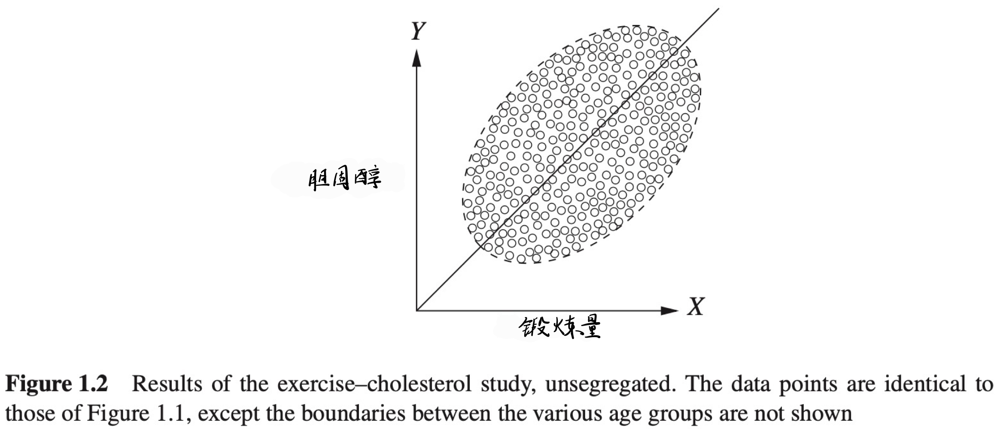

**注：** 在这个连续型变量的例子当中，同样也是需要有先验知识(年龄会影响胆固醇)，从而才能得知可能“正确”的结果。因此，我仍然认为若在陌生应用场景中，若不能发现这种先验知识，那还是要很大程度上依赖事实数据。

然而，分类的数据并不总能给出正确的答案，这可能让一些读者感到惊讶。假设使用与例1.2.1相同的用药和痊愈数据，但在试验结束后还要记录每位患者的血压，而非性别。试验数据如表1.2所示，对比表1.1可知，区别仅在于行列标签有差异。在这一案例中，我们知道药物会通过降低服药患者的血压来影响痊愈率，但不幸的是，药物也会产生副作用。

| 表1.2  | 用药         | 不用药       |
| ------ | ------------ | ------------ |
| 低血压 | 81/87(93%)   | 234/270(87%) |
| 高血压 | 192/263(73%) | 55/80(69%)   |
| 共计   | 273/350(78%) | 289/350(83%) |

现在，你会给患者推荐这种药物吗？

同样，答案 **因数据分类方式的不同** 而不同。对全体受试者而言，药物可能因其对血压的影响而提高痊愈率。但将受试者分类后，在治疗后血压偏高和治疗后血压偏低的亚群中，我们无法观察到这样的结果，而只能看出因药物副作用而降低痊愈率。

与例 1.2.1 一样，本试验的目的是评估药物对痊愈率的总体影响。但在这个例子中，由于降低血压是药物影响痊愈率的结果之一，所以基于血压的分类就变得没有意义了（如果在治疗前记录患者的血压，并且 **假定仅有血压对治疗有影响，那么情况就不同了** ）。我们再次统计、分析全体受试者的试验数据，发现药物治疗增加了痊愈的可能性，于是我们确定应该推荐药物治疗。值得注意的是，虽然表 1.1 和表 1.2 中的数值相同，但表 1.1 的正确结论体现在分类后的数据，而表 1.2 的正确结论体现在总体数据。

由前面的例子可知，数据并没有为治疗决策提供足够的信息，例如，无法知道何时测定药物的作用，无法知道药物如何影响血压，也无法知道血压如何影响痊愈率。事实上，正如统计学教科书所常提及（且正确地）指出的，相关性并不等于因果关系。利用统计方法无法仅根据数据确定因果关系，因此统计方法无法为决策提供支持。

然而，统计学一直是以某种因果假设来解释数据的。事实上，在辛普森悖论中，按性别对数据进行分类后之所以会得出矛盾的结论，其根本原因在于我们确信治疗不能影响性别。如果治疗可以影响性别，那么悖论就不存在了，因为我们可以轻松假设数据背后的因果关系具有与按血压分类那个例子相同的结构。尽管“治疗不能影响性别”这一命题看似平凡，但它无法通过数据验证，也无法依据标准统计学写出数学表达式。事实上，列联表（如表 1.1 和表 1.2）无法表达任何因果信息，而统计推理通常是以列联表为基础的。

可喜的是，最新发展的统计学方法能够用于表达和解释因果假设。这些方法及其内涵是本书讨论的重点内容。通过运用这些方法，读者可以用数学语言描述任何复杂的因果场景，解决类似辛普森悖论引发的决策问题，就像在代数中求解未知量一样“有法可依”。利用这些方法，可以轻松识别上述例子中的问题，并用适当的统计分析方法加以解释。通过简单的逻辑操作组合而成的因果演算，将验证我们已有的直觉，包括不存在一种药物会仅对男性患者或女性患者有效，但对总体人群无效，以及对（服药后）具有相同血压患者的无用性。这些方法还能处理更复杂的问题，而在这些问题中无需再依赖直觉来分析。也就是说，简单的数学工具有助于解决政策评估中的实际问题，以及诸如事件如何发生和为何发生等科学问题。

但是，我们还没有做好完成这些任务的准备。为了严格表述数据中蕴含的因果关系，还需要完成以下工作：

第一，给出“因果关系”的可操作性定义；

第二，给出表达因果假设的形式化方法，即建立因果模型；

第三，给出因果模型结构与数据特征相联系的方法；

第四，给出从数据与模型的因果假设中得出结论的方法。

本书的前两章主要介绍因果假设建模及其与数据相关联的方法，接着在第3章我们使用这些假设和数据来解决因果问题。在开始所有讨论之前，首先必须给出因果关系的定义。因果关系看似简单直观，但几个世纪以来，仍没有一个得到统计学家和哲学家共同认可的、完整的因果关系定义。本书将因果关系的定义简化为：如果变量 $Y$ 的值以某种形式依赖于变量 $X$  的值，那么变量 $X$  就是变量 $Y$  的原因。之后我们会对这个定义稍加扩展，但现在仅将因果关系看作是一种“听从”，即如果 $Y$  听从 $X$ ，需依据 $X$  的取值来决定自身的值，那么 $X$  就是 $Y$ 的原因。

为了理解上述的因果方法，读者还必须了解一些概率学、统计学及图论的基本概念。因此，下面两节将给出这些必要的基本概念和示例。读者若对概率、统计和图论有基本了解，可直接转到第1.5节，这并不会影响对全书内容的理解。

#### 思考题

#### 1.2.1

下面的命题有什么错误？

(a) 数据表明，收入与婚姻具有高度的正相关。因此，如果你结婚了，你的收入会增加。

(b) 数据表明，随着火灾数量的增加，消防员的数最也会增加。因此，为了减少火灾，应该域少消员的数量。

(c) 数据表明，匆忙赶赴会议的人，通常更容易迟到。因此不要着急，否则你会迟到。

#### 1.2.2

球手蒂姆的击球率比他的队友弗兰克高。然而，有人注意到，弗兰克分别跟右手投手和左手投手比赛时，击球率都比蒂姆高。为什么会这样？（用表格说明）

#### 1.2.3

对于下面的每一个因果问题，判断应该使用分类数据还是总体数据以获得正确的结论。

(a) 肾结石治疗有两种方法：方案 A 和方案 B。医生对大的结石（因此病情更严重）更倾向于采用方案 A，对小的结石倾向于采用方案 B。如果一个患者不知道其体内结石的大小，为确定哪种治疗方案更有效，应该检索总体人群的数据还是结石大小不同亚群的数据？

(b) 在一个小镇上有两位医生，两人在其职业生涯中都曾做过 100 例手术。手术分两类：一类是非常复杂的，一类是非常简单的。相比而言，第一位医生经常做简单的手术，第二位医生经常做复杂的手术。假如你需要做手术，但不知道自己的情况是属于简单情况还是复杂情况。为尽可能提高手术成功概率，你应该查阅每位医生的总体成功率，还是分别查阅他们各自简单和复杂手术的成功率呢？

#### 1.2.4

为评估一种新药的疗效，进行了一项随机试验。总体来说，50%的患者被分配服用新药，50%的患者接受安慰剂。在试验的前一天，某位护士给一些表现抑郁的患者分发棒棒糖，他们中的大多数是被指定第二天接受治疗的（也就是说，护士这一轮查房正巧经过诊疗病房）。奇怪的是，试验数据显示了一个辛普森悖论：尽管总体来看，药物对受试者是有益的，但在得到棒棒糖的亚群和没有棒棒糖的亚群中，服用药物的患者比不服用药物的患者更不容易痊愈。假设吃棒棒糖本身对痊愈没有任何影响，回答以下问题。

(a) 药物对总体受试者是有益的还是有害的？

(b) 你的答案能反驳前面的按性别分类的例子吗？在那个例子中，依据性别对数据进行分类更合适。

(c) 画一个简略图解释这一内容（可参考 1.4 节相关内容）。

(d) 你怎么解释这个问题中出现的辛普森悖论？

(e) 如果棒棒糖在试验后的第二天分发（按同样的准则），答案会不同吗？

[提示：接受棒棒糖的患者更可能被安排药物治疗，同时这些患者更有抑郁表现，而抑郁是降低痊愈可能性的风险因素。]

### 1.3 概率和统计

由于统计本身通常关注的是可能性而非绝对性，因此对统计来说，概率表述极其重要。概率对于因果关系的研究同样重要，因为大多数因果命题都具有不确定性。例如，“粗心驾驶导致事故”这句话是对的，但并不意味着一位粗心的司机一定会引发事故。概率是表达不确定性的工具。本书将使用概率的语言及定理来描述我们对现实世界的信念和不确定性。为帮助读者更好地理解本书后续内容，下面介绍一些需要了解的重要术语和概念。

#### 1.3.1 变量

变量是能取多个值的任意属性或符号。例如，在一项比较吸烟者和不吸烟者健康状况的研究中，变量可以是参与者的年龄、性别、是否有家族癌症史、吸烟多少年等。可以把变量看作一个问题，而变量的值就是这个问题的答案。例如，“这个参与者多大年龄了？”“38岁”，这里“年龄”是变量，“38”是变量的值。变量 $X$ 所取值 $x$ 的概率记作 $P(X=x)$ ，没有歧义时通常简写为 $P(x)$ 。也可以讨论多个变量同时取值的概率，例如， $X=x$ 与 $Y=y$ 的概率记作 $P(X=x,Y=y)$ 或 $P(x,y)$ 。因此 $P(X=38)$ 表示人群中随机选择一人，其年龄为38岁的概率。

变量可分为离散变量和连续变量。离散变量（有时又称类别变量）可以从有限集或可数无限集中取值，这些集合中的值可以是任意范围的。例如，描述一个标准开关状态的变量是离散变量，因为它有两个值：“开”和“关”。连续变量可以从无限集中任取一个值，这些集合中的值是连续区间上的值（即，对于任何两个值，存在位于它们之间的第三个值）。例如，描述体重的变量是连续变量，因为重量的测量值是实数。

#### 1.3.2 事件

为一个变量或者一个变量集合指定一个值（或一组值）称为一个事件，例如，“ $X=1$ ”“ $X=1$ 或 $X=2$ ”“ $X=1$ 与 $Y=3$ ”“ $X=1$ 或 $Y=3$ ”是事件。“掷硬币正面朝上”“调查对象年龄大于40岁”“患者痊愈”等也是事件。“掷硬币的结果”是变量，“正面朝上”是它的值；“调查对象的年龄”是变量，“40岁以上”描述了变量可以取的值；“患者的状态”是变量，“痊愈”是值。这里“事件”的定义与人们日常概念并不完全一致，日常概念中的事件指发生某些变化。例如，在日常谈话中，我们不会将某人处于某个年龄作为一个事件，但我们会将他长了一岁作为一个事件。另一种从概率角度考虑事件的方法是：任何陈述性说明（说明可能是真或假）都是一个事件。

#### 思考题

#### 1.3.1

对于思考题 1.2.4 中棒棒糖的故事，可以识别出以下变量和事件。

#### 1.3.3 条件概率

假设已知事件 $B$ 已经发生，那么此时事件 $A$ 发生的概率称为在 $B$ 条件下 $A$ 的条件概率。已知 $Y = y$ 条件下， $X = x$ 的条件概率记作 $P(X = x\mid Y = y)$ ，通常简记为 $P(x\mid y)$ ，表示事件“ $X = x$ ”的概率取决于给定的条件“ $Y = y$ ”。例如，你现在得流感的概率很低，但是如果你量体温发现是39°C，那你患流感的概率就大大提高了。

当数据乐使用由频次表示的概率时，一种考虑条件的方法是依据一个或多个变量的值过滤数据。例如，假设查看2012年美国总统选举中美国选民的年龄，根根据人口普查品的统计，得到如表1.3所示的数据集。

在表1.3中，总共有132,949,000张选票，因此可以估算一位选民年龄小于45岁的概率。

$$
P(选民的年龄<45)=\frac{20,539,000+30,756,000}{132,949,000}=\frac{51,295,000}{132,949,000}=0.38
$$

假定已知一位选民的年龄大于29岁，想要估算其年龄小于45岁的概率，则只需用年龄大于29岁的条件简单过滤数据，形成一个新的数据集（如表1.4所示）。

这个新的数据中，总共有112,410,000张选票，因此可以估算

$$
P(选民的年龄<45\mid 选民的年龄>29)=\frac{30,756,000}{112,410,000}=0.27
$$

表1.3 2012年美国总统造学选民/人数（按年龄分组）

| 年龄组 | 选民人数    |
| ------ | ----------- |
| 18～29 | 20,539,000  |
| 30~44  | 30,756,000  |
| 45~64  | 52,013,000  |
| 65以上 | 29,641,000  |
| 合计   | 132,949,000 |

表1.4 2012年美国总统选举选民数（按大于29岁的年龄分组）

| 年龄组 | 选民人数    |
| ------ | ----------- |
| 30~44  | 30,756,000  |
| 45~64  | 52,013,000  |
| 65以上 | 29,641,000  |
| 合计   | 112,410,000 |

在固果何题的研究中，你这样的条件概率起着重要的作用，因为经常安比软在不同的过滤或是不条件下，结果的概率（或风险）变化情况。例 如，与不吸烟的人相比吸烟者患肺癌的概率。

#### 思考题

#### 1.3.2

如表1.5所示为某年关国成年人与性别与受教育水平的关系。

| 性别 | 最高学历 | 人数(单位：十万) |
| ---- | -------- | ---------------- |
| 男性 | 高中以下 | 112              |
| 男性 | 高中     | 231              |
| 男性 | 大学     | 595              |
| 男性 | 研究生   | 242              |
| 女性 | 高中以下 | 189              |
| 女性 | 高中     | 189              |
| 女性 | 大学     | 763              |
| 女性 | 研究生   | 172              |

(a) 估算 $P(高中)$ 。

(b) 估算 $P(高中+女性)$ 。

(c) 估算 $P(高中\mid 女性)$ 。

(d) 估算 $P(女性\mid 高中)$ 。

#### 1.3.4 独立性

存在这样一种情况：一个事作的概率不随另一个事件的发生面改变。例如，当观察到事件“你体温升高会增加你忠流感的率”时，对于事件“你的朋友乔38岁的概率没有任何影响”。在这种情况下，我们说这两个事件是独立的。一般地， 如果

$$
P(A\mid B)=P(A)\tag{1.1}
$$

则称事件A与及相互独立。也就是说，事件 $B$ 发生对 $A$ 发生的概率不能提供任何额外信息。如果这一等式不成立，则说 $A$ 与 $B$ 相关。相关与独立具有对称关系：如果 $A$ 与 $B$ 相关，那么 $B$ 也与 $A$ 相关；如果 $A$ 独立于 $B$ ，那么 $B$ 也独立于 $A$ 。形式化表述为：如果 $P(A|B)=P(A)$ ，那么 $P(B|A)=P(B)$ 一定成立。从直观上说，如果“烟”能够提供一些关于“火”的信息，那么“火”一定会能提供一些关于“烟”的信息。

给定第三个事件C，如果

$$
P(A\mid B,C)=P(A\mid C)\tag{1.2}
$$

并且 $P(B\mid A,C)=P(B\mid C)$ 。则称两个事件 $A$ 和 $B$ 条件独立。例如，事件“烟雾检测器报警”与事件“附近有火”相关。但在第三个事件“附近有烟雾”的条件下，这两个事件可能变为独立的，烟雾检测器只对烟雾的存在做出响应，而不是对产生烟雾的原因做出响应。在处理数据集或列联表时，如果事件 $A$ 和 $B$ 在对 $C$ 过滤所产生的新数据集中是独立的，则称在给定 $C$ 的条件下， $A$ 和 $B$ 是条件独立的。如果 $A$ 和 $B$ 在原始的、未经速的数集中过滤后是独立的，则称它们为边独立的。

变量与事件类似，相互之间也存在相关或独立关系。对于 $X$ 和 $Y$ 的每一个取值 $x$ 和 $y$ ，如果有

$$
P(X=x\mid Y=y)=P(X=x)\tag{1.3}
$$

则称两个变量 $X$ 和 $Y$ 是独立的。与事件的独立性一样，变量的独立性也具有对称关系，因此式(1.3)意味着 $P(Y=y\mid X=x)=P(Y=y)$ 成立。若对 $X$ 和 $Y$ 的某一对取值，式(1.3)不成立，则称 $X$ 和 $Y$ 相关。从这个意义上说，变量的独立性可以理解为一组事件的独立性。例如，“高度”和“音乐才能”是两个独立的变量，对每一个高度 $h$ 和音乐水平 $m$ ，一个人身高 $h$ 英尺的概率不会因为发现他有音乐水平 $m$ 而改变。

#### 1.3.5 概率分布

变量 $X$ 的稳定率分布是 $X$ 的每一个可能取值的概率的集合。例如，如果 $X$ 能取三个值：1、2和3，则 $X$ 的一种可能的概率分布是 $P(X = 1)= 0.5,P(X = 2)= 0.25,P(X = 3)= 0.25$。在概率分布中，概率的值必定为 $0\sim 1$，并且所有可能取值的概率和必为1。概率为0的事件是不可发生事件，概率为1的事件是必然事件。

连续变量也有概率分布，连续变量 $X$ 的概率分布用密度函数 $f$ 来表示。当将密度函数 $f$ 绘制到坐标平面上时，变量 $X$ 的值在 $a$ 和 $b$ 之间的概率是曲线下 $a$ 与 $b$ 之间的面积，用积分表示该面积为 $\int_a^bf(x)dx$ 。整个去线下的面积，即 $\int_{-\infty}^{+\infty}f(x)dx$ 必定为1。

变量集也有概率分布，称为联合分布。一组变量 $V$ 的联合分布是 $V$ 中变量值的每一种可能组合的概率的集合。例如，如果 $V$ 中有两个变量 $X$ 和 $Y$ ，每个变量均可取两个值：1和2，那么，V的一种可能的联合分布是： $P(X=1, Y=1) = 0.2$ , $P(X=1, Y=2) = 0.1$ , $P(X=2, Y=1) = 0.5$ , $P(X=2, Y=2) = 0.2$ 。与单变量概率分布一样，联合分布的概率之和也一定是1。

#### 1.3.6 全概率公式

下面介绍几个非常有用的概率论定理。首先，对于任何两个互斥事件A和B（即A和B不能同时发生），有

$$
P(A+B)=P(A)+P(B)\tag{1.4}
$$

由此，对于任何两个事件A和B，有

$$
P(A)=P(A,B)+P(A,\bar B)\tag{1.5}
$$

因为事件“ $A$ 与 $B$ ”与“ $A$ 与 $\bar B$ ”是互斥的——如果 $A$ 为真，那么“ $A$ 与 $B$ ”或“ $A$ 与 $\bar B$ ”必定有一个为真。例如，“Dana是位高个子男性”与“Dana是位高个子女性”是互斥的，如果Dana是高个子，那么他必定要么是高个子男性，要么是高个子女性，因此，有 $P(Dana是个高个子)=P(Dana是个高个子男性)+P(Dana是个高个子女性)$ 。

更一般地，如果任意一组事件 $B_1,B_2,\dots,B_n$ ，其中恰好有一个事件必定为真（穷举的互斥集称为一个划分），那么

$$
P(A)=P(A,B_1)+P(A,B_2)+\dots+P(A,B_n)\tag{1.6}
$$

式（1.6）称为全概率公式，将其应用于日常生活中的实际例子，便可很容易地验证式（1.6）成立：例如，从整副牌中随机抽取一张，那么它正好是 $J$ 的概率等于它是红桃 $J$ 的概率加上梅花 $J$ 的概率，再加上方块 $J$  和黑桃 $J$ 的概率。事件 $A$ 与每个 $B_i$ 的联合概率称为 $A$ 在 $B_i$ 上的边缘概率，而对 $A$ 在所有 $B_i$ 上的边缘概率求和得到 $P(A)$ ，称为 $A$ 的边缘概率。

如果已知 $B$ 的概率以及在 $B$ 条件下 $A$ 的概率，可以通过简单的乘积推导求出 $A$ 与 $B$ 同时发生的概率：

$$
P(A,B)=P(A\mid B)P(B)\tag{1.7}
$$

例如，乔既风趣又聪明的概率等于一位聪明人风趣的概率，乘以乔聪明的概率。

除法法则

$$
P(A\mid B)=\frac{P(A,B)}{P(B)}
$$

被看作条件概率的形式化定义，正如表 1.3 和表 1.4 所示的案例，把条件视为过滤操作即可验证该法则的合理性。当以 $B$ 为条件时，从原始联合表中去掉所有与 $B$ 冲突的事件，得到的子表也表示一个概率分布，并且与所有概率分布一样，它的和必定为 1。由于子表中的每行在原表分布中的概率之和为 $P(B)$ （根据定义），那么可以通过每行乘以 $\frac{1}{P(B)}$ 来确定它们在新表中的分布概率。

式（1.7）蕴含了独立性的定义，到目前为止，对这一概念的使用是非正式的，意味着“没有给出额外的信息”。在概率分布中，它有一种数值形式的表示，即若事件 $A$ 和 $B$ 独立，则有：

$$
P(A,B)=P(A)P(B)
$$

例如，要检查两枚银币的结果是否真正独立，应该计算它们同时呈现背面的频次，并确定它等于每枚银币呈现背面的频次的乘积。

由式(1.7)及对称性 $P(A,B)=P(B,A)$ ，可以直接得到概率论中最重要的定理之一——贝叶斯法则：

$$
P(A\mid B)=\frac{P(B\mid A)P(A)}{P(B)}\tag{1.8}
$$

借助式(1.7)中的乘法法则，可以把全概率公式表示为条件概率的加权和：

$$
P(A)=P(A\mid B_1)P(B_1)+P(A\mid B_2)P(B_2)+\dots+P(A\mid B_n)P(B_n)\tag{1.9}
$$

式(1.9)非常有用，因为我们常常发现无法直接计算P(A)，但通常情况下更容易计算条件概率，比如 $P(A\mid B_k)$ ，它与特定的背景条件有关，而不是与背景条件无关的 $P(A)$ 。例如，假设有来自两个产地的一批小零件，其中30%是工厂A生产的，次品率是 $\frac{1}{5,000}$ ；70%是工厂B生产的，次品率是 $\frac{1}{10,000}$ ，求一个随机选择的小零件是次品的概率。这是一个伤脑经的问题，但是按照式(1.9)分解就变得容易了，有

$$
\begin{aligned}
P(次品)&=P(次品\mid A)P(A)+P(次品\mid B)P(B)\\
&=\frac{0.30}{5000}+\frac{0.70}{10000}=\frac{1.30}{10000}=0.00013
\end{aligned}
$$

或者举一个稍难的例子，假设掷两个骰子，想知道掷第二个骰子比第一个骰子点数大的概率，即求 $P(A)=P(掷2>掷1)$ 。没有一个直观的方法可以立即算出这个概率。如果以第一个骰子的点数为条件，将其分解到条件 $B_1,B_2,\dots,B_n$ ，就容易解决了，即有

$$
\begin{aligned}
P(掷2>掷1)&=P(掷2>掷1\mid 掷1=1)P(掷1=1)+P(掷2>掷1\mid 掷1=2)P(掷1=2)+\dots+P(掷2>掷1\mid 掷1=6)P(掷1=6)\\
&=(\frac{5}{6}\times\frac{1}{6})+(\frac{4}{6}\times\frac{1}{6})+(\frac{3}{6}\times\frac{1}{6})+(\frac{2}{6}\times\frac{1}{6})+(\frac{1}{6}\times\frac{1}{6})+(\frac{0}{6}\times\frac{1}{6})\\
&=\frac{5}{12}
\end{aligned}
$$

式(1.9)所给出的分解法有时也称为“替代率”或“扩展法”，在本书中，我们将其称为条件化B。

#### 1.3.7 使用贝叶斯法则

在使用贝叶斯法则时，有时把事件 A 称为假设，事件 B 称为证据。这种命名反映了贝叶斯定理的核心目的。在许多情况下，已知或可以轻易确定 （假设 A 正确的情况下，证据 B 发生的概率），但很难计算 （在得到证据 B 的情况下，假设 A 发生的概率）。然而，在现实世界中，后者是人们经常需要回答的问题。一般来说，在证据 B 发生后，希望将某些假设的信任度由 $P(A)$ 更新为 $P(A\mid B)$ 。在这种情况下，为了精确地使用贝叶斯法则，必须将某一个假设当作一个事件，并对所有假设赋予一个事先的概率分布，称为先验分布。

例如，假设在赌场中听到庄家喊出“11”。你恰好知道，该事件只能由骰子赌局和轮盘赌局这两种游戏引发，并且在任意时刻，这两种游戏正在进行的赌局数量完全相等。那么，在听到庄家报“11”的情况下，他正在进行骰子赌局的概率是多少呢？

在这种情况下，“骰子赌”是**假设**，而“11”是**证据**。要立即计算出这个概率是有困难的，但反过来，一轮骰子赌的结果是“11”的概率却很容易计算。骰子赌是一种游戏，掷两个骰子后计算点数的和。显然，两个骰子点数和为11的可能性是 $\frac{2}{36}=\frac{1}{18}$ ， $P(11\mid 骰子赌)=\frac{1}{18}$ 。在轮盘赌中，有等概率的38种结果，因此 $P(11\mid 轮盘赌)=\frac{1}{38}$ 。在此情况下，有两种可能的假设：“骰子赌”和“轮盘赌”，因为他们的赌局数相等， $P(骰子赌)=P(轮盘赌)=\frac{1}{2}$ ，这些是对两种赌局的先验知识。有全概率公式， 

$$
\begin{aligned}
P(11)&=P(11\mid 骰子赌)P(骰子赌)+P(11\mid 轮盘赌)P(轮盘赌)\\
&=\frac{1}{2}\times\frac{1}{18}+\frac{1}{2}\times\frac{1}{38}=\frac{7}{171}
\end{aligned}
$$

现在已经很容易地获取了确定 $P(骰子赌\mid 11)$ 所需要的全部信息： 

$$
P(骰子赌\mid 11)=\frac{P(11\mid 骰子赌)\times P(骰子赌)}{P(11)}=\frac{1/18\times1/2}{7/171}=0.679
$$

贝叶斯法则的另一个应用例子是蒙提霍尔问题（即三门问题），这是统计学中一个经典的脑筋急转弯问题。在这个问题中，你是一位由蒙提霍尔主持的游戏节目中的参赛者。蒙提向你展示三扇门 A、B 和 C，其中只有一扇门后面有一辆新车（另外两扇门后面是山羊）。如果你选对了车的门，车就归你；否则，你得到一只山羊。你随便猜测了一扇门，比如 A，然后在没有任何暗示的情况下，蒙提打开了 C 门，C 门后面是山羊。他告诉你，现在你可以换到 B，或者坚持选择 A。无论你选哪一扇门，你都将得到它后面的东西。

你的最好策略是坚持打开A门，还是换到B门？

当第一次遇到这个问题时，很多人认为，由于车的位置与你第一次选择门之间是独立的，换门既没有好处也没有坏处；车在A门后面的概率等于在B门后面的概率。

但是多年以后，统计学的学生惊愕地发现，正确的答案为，与坚持A门相比，如果换成B门，赢得汽车的可能性会变为原来的两倍。对这个有些违背直觉的结果通常的解释是，当最初选择一扇门时，你有 $\frac{1}{3}$ 的概率选到有车的那扇门。因为不管最初你是否选中了有车的那扇门，蒙蒂总是打开有山羊的那扇门，之后你没有接收到任何新信息。因此，你选择的那扇门有车的概率仍然是 $\frac{1}{3}$ ，其余 $\frac{2}{3}$ 的概率必定属于剩下的另一扇关闭的门。

可以用贝叶斯法则来证明这一令人惊讶的事实：这里有三个变量： $X$ ，参赛者选择的门； $Y$ ，后面藏有汽车的门； $Z$ ，蒙蒂打开的门。 $X$ 、 $Y$ 和 $Z$ 均可取值 $A$ 、 $B$ 或 $C$ 。现在要证明 $P(Y=B\mid X=A,Z=C)>P(Y=A\mid X=A,Z=C)$ 。先验假设是车在 $A$ 门后面，证据是蒙蒂打开了 $C$ 门。我们把证明留给读者（见思考题 1.3.5）。为进一步加强直觉认识，可以把游戏推广到有 100 扇门（1 扇门后有汽车，99 扇门后有山羊）的情况。参赛者仍然选择一扇门，但这次蒙蒂打开了 98 扇门——所有刻意打开的门后面都是山羊——在最后两扇门之间，给参赛者提供是否更换选择的机会。现在，选择更换应该是显而易见的。

为什么蒙蒂打开 $C$ 门构成了改变车位置的证据呢？毕竟它没有为你最初的选择是否正确提供任何证据。当他准备打开某扇门的时候，不管是 $B$ 还是 $C$ ，你当然知道它的后面没有车。答案是，在你选择 $A$ 门之后，蒙蒂不可以再打开它，但他本来可以打开其他门。但他没有这样做，这意味着他打开 $C$ 门更有可能是因为被迫这样做：这提供了汽车在 $B$ 门后面的证据。这是贝叶斯分析的一般性原理：任何经得起反驳的假设都会变得更有可能。 门容易被反驳（即蒙蒂本来可以打开它），但 $A$ 门不是。因此， $B$ 门变成了更可能的位置。

读者可能会发现，上面的解释充满了反事实术语，例如，“他本来可以打开”“因为他可能被迫”“他本来打算打开”。事实上， **蒙蒂霍尔问题** 在概率游戏中如此特别的原因就在于其 **对数据生成过程的高度依赖** 。它表明我们的概念不应该仅依赖于观察到的事实，还应该依赖于产生这些事实的过程。特别地，“汽车不在 $C$ 门后”的信息本身，不足以说明这个问题。为了计算所涉及的概率，我们也必须知道，在打开 $C$ 门之前主持人有哪些选项。本书第 4 章将形式化地陈述反事实理论，以便描述这样的过程和可能的选择，形成关于选择的正确概念。

有一些质疑贝叶斯法则的争议。当试图在给定一些证据条件下确定假设的概率时，通常无法根据情境的一部分或发生的频次来计算先验概率 $P(A)$ 。思考一下，如果不知道赌场里轮盘赌桌与骰子赌桌的比例，如何确定先验概率 $P(骰子赌)$ 呢？也许会尝试设定 $P(A)=\frac{1}{2}$ ，用以表达一种无所知的情境。但如果获知了一些信息，比如轮盘赌桌在这个赌场里并不常见，或者报数人的声调让我们联想起昨天听到的骰子赌的庄家，这会如何影响结果？在这些情况下，为了使用贝叶斯法则，可以将 $P(A)$ 设置为对假设的主观确信度，这比其他概率值更为可靠。然而， **对于贝叶斯法则的争论源于这种确信度的主观性质** 。例如，如何确定指定的 $P(A)$ 准确地概括了关于这个假设的已知信息？是否应该坚持将对某个问题的所有正反观点归结为一个数字？即使这样做了，为什么又要根据客观事件的发生频次来更新假设的主观确信度呢？一些行为实验表明， **人们不会依照贝叶斯法则更新他们的信念，尽管很多人相信他们应该这样做** 。如果不是推理上有问题，那么这种偏离规则的行为可能代表了一种妥协，并导致次优决策。关于如何恰当使用贝叶斯定理的争论一直持续到今天。然而，尽管存在这些争议，贝叶斯法则仍然是统计学中一个强大的工具。本书中将利用它来实现我们的目标。

#### 思考题

#### 1.3.3

思考第 1.3.6 节描述的赌场问题。

(a) 假设赌场中轮盘赌桌是骰子赌桌的两倍，计算 $P(骰子赌\mid 11)$ 。

(b) 假设赌场中骰子赌桌是轮盘赌桌的两倍，计算 $P(骰子赌\mid 10)$ 。

#### 1.3.4

假设有三张卡片，卡片1正反面各一个黑脸，卡片2正反面各一个白脸，卡片3正反面分别为一个白脸和一个黑脸。你随机选择张卡片并放在桌子上，发现面朝上的是黑脸。那么，这张卡片明下的一面也是黑脸的概率是多少？

(a) 根据你的直觉说明，这张卡片朝下的一面也是黑脸的概率是 $\frac{1}{2}$ 。为什么它也许大于 $\frac{1}{2}$ ？

(b) 根据下列的变量，给出你认为容易估计的概率和条件概率，例如， $P(C_D=黑脸)$ 。

$$
\begin{aligned}
I=选择卡的标识(卡1, 卡2, 卡3)\\ 
C_D=朝下一面的颜色(黑脸, 白脸)\\ 
C_U=朝上一面的颜色(黑脸, 白脸)
\end{aligned}
$$

使用你上面的估计，找出选择卡片朝下一面是黑脸的概率。

(c) 对随机选择的卡片，如果你看到它的正面是黑脸，使用贝叶斯法则找出其背面是黑脸的正确概率。

#### 1.3.5

使用贝叶斯法则证明，在蒙蒂霍尔问题中，换门提高你赢得汽车的概率。

#### 1.3.8 期望值

在统计学中，常常遇到要处理的数据量和概率分布规模太大，以至于无法有效检测变量取值的所有可能组合的情况。作为替代，常以损失部分信息为代价，用统计量来表示分布的、有意义的特征。这其中最常用的是期望值，也称为均值，它可以用于变量取值为数值的情况。变量 $X$ 的期望值表示为 $E(X)$ ，等于变量的每一个可能的取值与变量取这个值的概率的乘积，再对来积求和，即

$$
E(X)=\sum_xxP(X=x)\tag{1.10}
$$

例如，用变量 $X$ 表示掷一次六面骰子的结果，概率分布如下：

$$
P(1)=\frac{1}{6},P(2)=\frac{1}{6},P(3)=\frac{1}{6},P(4)=\frac{1}{6},P(5)=\frac{1}{6},P(6)=\frac{1}{6}
$$

则 $X$ 的期望值为

$$
E(X)=(1\times\frac{1}{6})+(2\times\frac{1}{6})+(3\times\frac{1}{6})+(4\times\frac{1}{6})+(5\times\frac{1}{6})+(6\times\frac{1}{6})=3.5
$$

同样地， $X$ 的任意函数 $g(X)$ 的期望值，可通过在 $X$ 的所有取值上对 $g(x)P(X=x)$ 求和得到，即：

$$
E(g(x))=\sum_xg(x)P(x)\tag{1.11}
$$

例如，若掷一个骰子后能得到点数平方的现金奖励，即有： $g(X)=X^2$ ，则奖励的期望值为：

$$
E(g(X))=(1^2\times\frac{1}{6})+(2^2\times\frac{1}{6})+(3^2\times\frac{1}{6})+(4^2\times\frac{1}{6})+(5^2\times\frac{1}{6})+(6^2\times\frac{1}{6})=15.17\tag{1.12}
$$

还可以计算 $Y$ 关于条件 $X$ 的期望值 $E(Y\mid X=x)$ ，方法是对 $Y$ 的每一个可能取值 $y$  乘以 $P(Y=y\mid X=x)$ 并求和，即

$$
E(Y\mid X=x)=\sum_yyP(Y=y\mid X=x)\tag{1.13}
$$

 $E(X)$ 是估计 $X$ 可能取值的一种方法。特别地，对于 $g$ 的值的所有猜测中，选择 $g=E(X)$ 可使得方差期望  $E(g-X)^2$ 最小。类似地，假定观察到 $X=x$ ，则 $E(Y\mid X=x)$ 表示对 $Y$ 的最佳估计。如果 $g=E(Y\mid X=x)$ ，那么使得方差期望 $E((g-Y)^2\mid X=x)$ 最小。

**注：** 可得到常用的概论论结论 $g=E(X)\quad s.t.\quad\min E(g-X)^2$ ，若要证明，不妨计算 $h(g)=E(g-X)^2$ ，后计算 $\frac{d}{dg}h(g)=0$ ，即可得证。

如表 1.3 所示，2012 年美国总统选举选民的期望年龄为 $E(\text{选民的年龄}) = 23.5 \times 0.16 + 37 \times 0.23 + 54.5 \times 0.39 + 70 \times 0.22 = 48.9$ 

对于该计算，假定每个类别中的各年龄的可能性相同，例如，选民是18岁的可能性与25岁相同，30岁的可能性与44岁相同。还假设投票者的最大年龄是75岁。这意味着，随机猜测一个选民的年龄，如果与真实值相差 $e$ 年，将会失去 $e^2$ 美元，那么猜测48.9，则平均损失会最小。同样，如果要求去猜测一个小于45岁的随机选民的年龄，则最好的赌注是

$$
P(\text{选民的年龄}\mid\text{选民的年龄}<45)=23.5\times0.40+37\times0.60=31.6\tag{1.14}
$$

用期望作为预测或“最佳猜测”的依据，在很大程度上取决于 $X$ 或 $(Y\mid X=x)$ 分布的假设，即它们的分布是近似对称的。然而，如果感兴趣的分布是高度偏态的，那么其他预测方法可能更好。例如，在这种情况下，可以使用 $X$ 分布的中值作为“最佳估计”，这个估计使期望的绝对误差 $E(|g - X|)$ 最小，这里不再进一步探讨这种方法。

**注：** 可以得到的结论为若对一个分布估计为 **中值** ，则满足 $\min E(|g-X|)$ 。

#### 1.3.9 方差和协方差

变量 $X$ 的方差记为 $Var(X)$ 或 $\sigma^2_X$ ，用于粗略地衡量 $X$ 的值在数据集或群体中“偏离”平均值的情况。如果 $X$ 的值均处于一个值附近，则方差相对较小；如果X的值覆盖了较大的范围，方差则相对较大。在数学上，将变量的方差定义为变量与均值的平均平方差。可先找出均值 $\mu$ ，然后依据如下公式计算得到：

$$
\sigma^2_X=E((X-\mu)^2)\tag{1.15}
$$

随机变量 $X$ 的标准差 $\sigma_X$ 是其方差的平方根。不同于方差， $\sigma_X$ 与 $X$ 有相同的单位表示。例如，根据表 1.3，小于 45 岁选民的年龄分布的方差，可以很容易地根据式（1.15）算出：

$$
\begin{aligned}
\sigma_X^2&=((23.5-31.6)^2\times0.40)+((37-31.6)^2\times0.60)\\
&=(65.61\times0.40)+(29.16\times0.60)\\
&=26.24+17.5=43.74
\end{aligned}
$$

而标准差是

$$
\sigma_X=\sqrt{43.74}=6.61
$$

这意味着，随机选择一个选民，他的年龄与平均年龄 31.6 岁相比，偏离值在 6.61 岁以内的概率很高。这种解释可以量化。例如，对于正态分布的随机变量 $X$ ，其中约 2/3 的值落在期望值或均值的一个标准差内，并且，大约 95% 的值落在偏离均值的两个标准差内。

乘积 $(X-E(X))(Y-E(Y))$ 的期望具有特别的重要性，它称为 $X$ 和 $Y$ 协方差，记为 $Cov(X,Y)$ 或 $\sigma_{XY}$ ：

$$
\sigma_{XY}\triangleq E((X-E(X))(Y-E(Y)))\tag{1.16}
$$

它用于衡量 $X$ 和 $Y$ 共变的程度，即这两个变量一起变化的程度，或称为“相关”。这种对相关性的度量实际上反映了 $X$ 和 $Y$ 共变的特定方式，它体现了 $X$ 和 $Y$ 线性共变的程度。读者可以把这看作是绘制点 $(X,Y)$ ，然后通过一条直线来刻画 $Y$ 随 $X$ 的变化而变化的程度。

协方差 $\sigma_{XY}$ 通常被归一化为相关系数

$$
\rho_{XY}=\frac{\sigma_{XY}}{\sigma_X\sigma_Y}\tag{1.17}
$$

这是一个标量值，范围为 -1 到 1，表示通过各自的标准差归一化 $X$ 和 $Y$ 后，最佳拟合直线的斜率。相关系数 $\rho_{XY}$ 等于 1 当且仅当一个变量能以线性方式预测另一个变量时；如果没有这样的线性预测，相关系数 $\rho_{XY}$ 为 0。无论什么情况下，这样的预测方法都不如随机估计效果好。相关系数 $\sigma_{XY}$ 和 $\rho_{XY}$ 的含义将在后面讨论。这里需要注意的是，共变的程度可以利用式（1.16）和式（1.17）根据联合分布 $P(X,Y)$ 计算得出。此外，当 $X$ 和 $Y$ 相互独立时， $\sigma_{XY}$ 和 $\rho_{XY}$ 都为 0。还需特别注意， $Y$ 和 $X$ 的非线性关系无法通过简单的数值来刻画，需要借助完全明确化的条件概率 $P(Y=y\mid X=x)$ 。

#### 思考题

#### 1.3.6

(a) 证明：当 $X$ 和 $Y$ 相互独立时， $\sigma_{XY}$ 和 $\rho_{XY}$ 都为0。[提示：使用式(1.16)和式(1.17)。]

(b) 给两个变量高度依赖，但它们的协相关系数仍然为0的例子。

#### 1.3.7

同时抛掷两枚硬币来确定乡镇俱乐部两名玩家的收益。当且仅当至少一枚硬币正面朝上时，1号玩家获得1美元。当且仅当两枚硬币落地面相同时，2号玩家得到1美元。现 $X$ 表示1号玩家的收益， $Y$ 表示2号玩家的收益。

(a) 指出并描述概率分布：

$$
P(x),P(y),P(x,y),P(y\mid x)和P(x\mid y)
$$

(b) 使用(a)中的描述，计算下面的度量：

$$
E(X),E(Y),E(Y\mid X=x),E(X\mid Y=y),\sigma_X^2,\sigma_Y^2,\sigma_{XY},\rho_{XY}
$$

(c) 如果 2号玩家获得 1元，则 1号玩家收益的最佳估计是多少？

(d) 如果 1号玩家获得 1元，则 2号玩家收益的最佳估计是多少？

(e) 存在相互独立的两个事件 $X=x$ 和 $Y=y$ 吗？

#### 1.3.8

一个掷双骰子游戏（一次掷两个独立的骰子），其中， $X$ 表示骰子1投掷结果， $Z$ 表示骰子2投掷结果， $Y$ 表示骰子1和骰子2投掷结果和。计算下面理论估计的结果。

表1.6描述了12轮掷双骰子游戏的结果。

(a) $E(X),E(Y),E(Y\mid X=x),E(X\mid Y=y)$ (对 $x$ 和 $y$ 的每一个值)，以及 $\sigma_X^2,\sigma_Y^2,\sigma_{XY},\rho_{XY},\sigma_{XZ}$ 。

(b) 根据表1.6中的数据，找出(a)中各个参数的样本估值。[提示：使用软件包。]

(c) 假设测得 $X=3$ ，利用 (a) 中的结果，确定 $Y$ 的最佳估计。

(d) 假设测得 $Y=4$ ， $X$ 的最佳估计是什么？

(e) 假设测得 $Y=4$ 和 $Z=1$ ， $X$ 的最佳估计是什么？说明为什么它与(d)的结果不一样。

| 轮次   | X    | Z    | Y    |
| ------ | ---- | ---- | ---- |
| 第1轮  | 6    | 3    | 9    |
| 第2轮  | 3    | 4    | 7    |
| 第3轮  | 4    | 6    | 10   |
| 第4轮  | 6    | 2    | 8    |
| 第5轮  | 6    | 4    | 10   |
| 第6轮  | 5    | 3    | 8    |
| 第7轮  | 1    | 5    | 6    |
| 第8轮  | 3    | 5    | 8    |
| 第9轮  | 6    | 5    | 11   |
| 第10轮 | 3    | 5    | 8    |
| 第11轮 | 5    | 3    | 8    |
| 第12轮 | 4    | 5    | 9    |

#### 1.3.10 回归

在统计学中，通常希望根据一个变量 $X$ 的值来预测另一个变量 $Y$ 的值。例如，根据年龄来预测一位学生的身高。通过前面的介绍可以看出， $Y$ 基于 $X$ 的最佳预测由条件期望 $E(Y \mid X = x)$ 给出，但这需要假定已知条件期望，或者能从联合分布 $P(y, x)$ 中计算出条件期望。而使用回归方法，则可以直接从数据中做出预测。我们试图找到一个函数，通常是线性函数，这个函数以 $X$ 的观测值作为输入，以 $Y$ 的值作为输出，使得 $Y$ 的预测值（输出）与实际值的平方误差量最小。

下面从一个散点图开始，将数据集的每种情况都画在同一个坐标平面上，其中，预测变量或输入变量位于横轴，预测结果变量位于纵轴上，如图1.3所示。

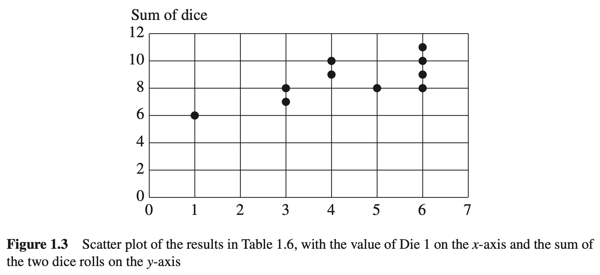

最小二乘回归线是使得散点图上的点到这条线的垂直距离的均方差量最小的直线，也就是说，如果散点图上有 $n$ 个数据点 $(x,y)$ ，对于任何一个数据点 $(x_i,y_i)$ ，直线 $y=\alpha+\beta x$ 在 $x_i$ 的值用 $y_i'$ 表示，那么最小二乘回归线就是使式（1.18）的值最小的直线：

$$
\sum_i(y_i-y_i')^2=\sum_i(y_i-\alpha-\beta x_i)^2\tag{1.18}
$$

下面分析斜率 $\beta$ 与概率分布 $P(x, y)$ 是如何关联的。假设连续投掷12轮骰子，得到如表1.6所示结果。根据该数据，根据骰子 $1(X)$ 的值来预测两个骰子的点数和 $Y$ ，图1.3为该数据的散点图。对于该例子，最小二乘回归线如图1.4所示，虚线表示样本数据的最佳拟合直线，实线表示总体数据的最佳拟合直线。注意，我们使用的样本数据的回归线不必与总体数据的回归线相同。当允许样本量增加到无限大时，将得到总体数据的回归线。图1.4中的实线表示理论上的最小二乘线，由式（1.19）给出：

$$
y=3.5+1.0x\tag{1.19}
$$

虚线表示样本的最小二乘线，由于抽样的原因，在斜率和截距两方面均与理论直线存在差异。

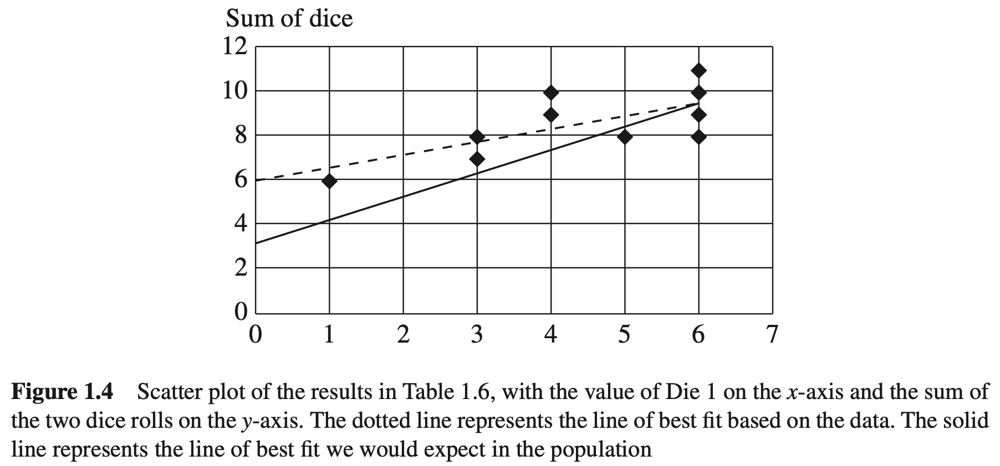

因为已知给定第一个骰子值为 $x$ 的条件下两个骰子和的期望值，因此在图1.4中，能够得到总体数据的回归线方程。计算比较简单：

$$
E(Y\mid X=x)=E(骰子2+X\mid X=x)=E(骰子2)+x=3.5+1.0x
$$

这个结果并不奇怪，因为 $Y$ （两个骰子之和）可以写成

$$
Y=X+Z
$$

其中 $Z$ 是骰子2的投掷结果。容易看出，如果 $X$ 增加一个单位，比如从 $X = 3$ 增加到 $X = 4$ ，那么 $E(Y)$ 也将同样增加一个单位。然而，读者可能有点奇怪，这个结果反过来则不成立， $X$ 关于 $Y$ 的回归线的斜率不为1.0。为了解释原因，有

$$
E(X\mid Y=y)=E(Y-Z\mid Y=y)=y-E(Z\mid Y=y)\tag{1.20}
$$

需要注意的是项 $E(Z\mid Y=y)$ ，因为它（线性）依赖于 $y$ ，因此 $y-E(Z\mid Y=y)<y$ ，从而使斜率小于1.0。为了计算 $E(X\mid Y=y)$ 的准确值，根据 $X$ 和 $Z$ 的对称性，有

$$
E(X\mid Y=y)=E(Z\mid Y=y)
$$

带入公式（1.20）后，得到

$$
E(X\mid Y=y)=0.5y
$$

这里斜率减小的原因是，当给 $Y$ 增加1个单位时，平均来说，每一个 $X$ 和 $Z$ 对此的贡献相同，这是与直觉相符的。当观察到两个极值的和是 $Y = 10$ 时，对每个数值的最佳估计是 $X = 5$ 和 $Z = 5$ 。

一般来说，如果写出 $Y$ 关于 $X$ 的回归方程为

$$
y=a+bx\tag{1.21}
$$

斜率 $b$ 由 $R_{YX}$ 表示，它可以用协方差 $\sigma_{XY}$ 来计算如下：

$$
b=R_{YX}=\frac{\sigma_{XY}}{\sigma_X^2}\tag{1.22}
$$

从这个方程可以清楚地看出， $Y$ 关于 $X$ 的斜率可能与 $X$ 关于 $Y$ 的斜率不一样，也就是说，在大多数情况下， $R_{YX}\neq R_{XY}$ （ $R_{YX}=R_{XY}$ 仅当 $X$ 的方差与 $Y$ 的方差相等时成立）。回归线的斜率可以为正、负或零。如果为正，称 $X$ 和 $Y$ 正相关，意思是随着 $X$ 值的增大， $Y$ 的值也增大；如果为负，称 $X$ 和 $Y$ 负相关，意思是随着 $X$ 值的增大， $Y$ 的值减小；如果为零（一条水平线），称 $X$ 和 $Y$ 线性无关，这意味着，至少从线性关系上来说，知道 $X$ 的值并不能有助于预测Y的值。如果两个变量是相关的，无论是正相关还是负相关（或其他方式），它们都是相互依赖的。

#### 1.3.11 多元回归

用多元线性回归也可以实现对多个变量进行回归分析。例如，如果想用变量 $X$ 和 $Z$ 的值来估计变量 $Y$ 的值，则可以在 $\{X,Z\}$ 上进行 $Y$ 的多元线性回归，并估计一个回归关系。

$$
y=r_0+r_1x+r_2x\tag{1.23}
$$

它表示三维坐标系中的一个斜面。

可以创建一个三维散点图， $Y$ 、 $X$ 和 $Z$ 的值分别表示在纵轴、横轴和竖轴上。然后，沿竖轴将散点图切片。每个切片将构成如图1.4所示的那种二维散点图。每个二维散点图将有一个斜率为 $r_1$ 的回归线。沿横轴的切片给出的斜率是 $r_2$ 。

当保持 $Z$ 不变时， $Y$ 关于 $X$ 的斜率称为偏回归系数，表示为 $R_{YX\cdot Z}$ 。注意当 $R_{YX}$ 为正时， $R_{YX\cdot Z}$ 可能为负，如图1.1所示。这从普森悖论中可以看出， $Y$ 与 $X$ 之间总是正相关的，但当增加第三个变量 $Z$ 为条件时， $Y$ 与 $X$ 就变成负相关了。

利用一个定理来极大地简化偏回归系数的计算，例如式（1.23）中的 $r_1$ 和 $r_2$ ，该定理是回归分析中最基础的定理之一。这个定理表述为，如果 $Y$ 是变量 $X_1$ 、 $X_2$ 、 $X_3$ 与噪声项 $\epsilon$ 的线性组合，

$$
Y=r_0+r_1X_1+r_2X_2+\dots+r_kX_k+\epsilon\tag{1.24}
$$

那么，不管 $Y,X_1,X_2,\dots,X_k$ 的实际分布如何，当 $\epsilon$ 与每一个回归元 $X_1,X_2,\dots,X_k$ 都不想关时，即

$$
Cov(\epsilon,X_i)=0\quad for\quad i=1,2,\dots,k
$$

可以得到最佳的最小二乘系数。

这一条件称为正交性原理，下面解释如何利用它来简化计算。假设想要在已知两个骰子点数之和 $Y = 骰子1 + 骰子2$ 的条件下，计算骰子1的最优估计，记

$$
X=\alpha+\beta Y+\epsilon\tag{1.25}
$$

我们的目标是按照可估计的统计度量找到 $\alpha$ 和 $\beta$ 。假设不失一般性，令 $E(\epsilon)=0$ ，在方程的两边取期望值，得到

$$
E(X)=\alpha+\beta E(Y)\tag{1.26}
$$

将式（1.25）两边乘以 $Y$ ，并取期望值，得

$$
E(XY)=\alpha E(Y)+\beta E(Y^2)+E(Y\epsilon)\tag{1.27}
$$

根据正交性原理得到 $E(Y\epsilon)=0$ ，由式（1.26）和式（1.27）得到关于两个未知数 $\alpha$ 和 $\beta$ 的两个方程，求解方程得到：

$$
\begin{aligned}
\alpha=E(X)-E(Y)\frac{\sigma_{XY}}{\sigma_Y^2}\\
\beta=\frac{\sigma_{XY}}{\sigma_Y^2}
\end{aligned}
$$

推导完毕。斜率 $\beta$ 其实已经可以从式（1.22）通过互换 $X$ 与 $Y$ 得到，但上面的推导展示了一个在二维或多维情况下计算斜率的一般性方法。

作为例子，考虑给定两个观测值 $X = x$ 和 $Y = y$ 时，找出 $Z$ 的最优估计问题。如前所述，写出回归方程

$$
Z=\alpha+\beta_YY+\beta_XX+\epsilon
$$

但现在，为得到关于 $\beta$ 、 $\beta_Y$ 和 $\beta_X$ 的三个方程，也需要两边乘以 $Y$ 和 $X$ ，并求期望。利用正交条件 $E(\epsilon Y) = E(\epsilon X) = 0$ ，解得到的方程，得

$$
\beta_Y=R_{ZY\cdot X}=\frac{\sigma_X^2\sigma_{ZY}-\sigma_{ZX}\sigma_{XY}}{\sigma_Y^2\sigma_X^2-\sigma_{YX}^2}\tag{1.28}
$$

$$
\beta_X=R_{ZX\cdot Y}=\frac{\sigma_Y^2\sigma_{ZX}-\sigma_{ZY}\sigma_{YX}}{\sigma_Y^2\sigma_X^2-\sigma_{YX}^2}\tag{1.29}
$$

式（1.28）和式（1.29）具有通用性；对于任何三个变量，这两个公式以方差和协方差的形式给出了线性回归系数 $R_{ZY\cdot X}$ 和 $R_{ZX\cdot Y}$ 。并且同样地，它们也反映了这些斜率受模型其他参数影响的敏感程度。然而，在实际求解中，回归斜率是通过有效的“最小二乘”算法从样本数据中估计出来的，一般很少通过数学方程直接进行演算。一个例外是在获得数据之前，需要估计这些斜率中是否有一个为零。当考虑为某种情况选择一组回归变量时，这样的预测很重要，正如后面将在第3.8节中提到的，这项任务可利用因果图进行非常有效的处理。

#### 思考题

#### 1.3.9

(a) 使用正交性原理证明式（1.22）[提示：参照式（1.27）的处理方式。]

(b) 为思考题1.3.8中描述的骰子游戏，计算所有的偏回归系数。[提示：应用式（1.28）及思考题1.3.8（a）中计算得到的方差和协方差。]

$$
R_{YX\cdot Z},R_{XY\cdot Z},R_{YZ\cdot X},R_{ZY\cdot X},R_{XZ\cdot Y}\text{和}R_{ZX\cdot Y}
$$

### 1.4 图

从辛普森悖论可知，某些决策无法仅从数据本身获得有效信息，而要依赖于 **数据背后的原因** 。本节介绍一种表述这些原因的数学工具——图论。在高中数学中一般并不讲授图论的内容，但作为一种有用的数学语言，它能像解决算术问题一样，用简单的运算解决因果问题。

虽然“图”这个词通俗来说或多或少与“图表”这个词相当，用于指代一大类视觉对象，但在数学中，图是一个形式化定义的对象。数学中的图是由顶点（或称为节点）和边组成的集合，图中的节点由边相连接（或不连接）。图1.5给出了一个简单的图，X、Y 和 Z（圆点）是节点，A 和 B（直线）是边，节点 X 和 Y 相邻，节点 Y 和 Z 相邻，节点 X 和 Z 不相邻。

如果两个节点间有边连接，则称这两个节点为相邻节点。在图1.5中，X和Y是相邻节点，Y和Z是相邻节点。若图中的每一对节点都有边连接，这种图称为完全图。

节点X和Z之间的路径是指从X开始，到Z结束的一系列由边首尾连接的节点。例如，在图1.5中，由于X和Y相连，而Y和Z相连，因此从X到Z有一条路径。

图中的边可以是有向的，也可以是无向的。图1.5中的两条边都是无向边，因为它们没有指定的输入端与输出端。有向边是指以一个节点指向另一个节点的边，并用箭头指示方向。所有边都有方向的图称为有向图。图1.6展示了一个有向图，其中A是从X到Y的有向边，B是从Y到Z的有向边，节点X是Y的父节点，节点Y是Z的父节点。

有向边的起始节点称为其终止节点的父节点；反之，有向边的指向节点称为其起始节点的子节点。在图1.6中，X是Y的父节点，Y是Z的父节点；相应地，Y是X的子节点，Z是Y的子节点。

如果两个节点间的路径能沿着箭头方向追踪，那么这条路径称为有向路径。也就是说，路径上不存在该路径上的某条边同时指向的节点，也不存在两条边共同起始的节点。如果两个节点由一条有向路径连接，那么，第一个节点称为该路径上所有节点(除自己外)的祖先节点，路径上的其他每个节点(除第一个节点)都是第一个节点的后代。类似于父节点与子节点的关系：父节点是其子节点的祖先，也是子节点的子节点的祖先，以此类推。例如，在图1.6中，X是Y和Z的祖先，Y和Z都是X的后代。

当一个节点存在返回自身的有向路径时，这个路径（或图）称为环（有环图），没有环的有向图称为无环图。例如，图1.7（a）是无环图，而图1.7（b）是有环图。注意，在图1.7（a）中不存在从任何节点回到该节点自身的有向路径，而图1.7（b）中存在从X回到X的有向路径。

#### 思考题

#### 1.4.1

如图1.8所示：

(a) 找出Z的所有父节点。

(b) 找出Z的所有祖先。

(c) 找出W的所有子节点。

(d) 找出X的所有后代。

(e) 画出X到T的所有简单路径（即每个节点只出现一次）。

(f) 画出X到T的所有有向路径。

### 1.5 结构因果模型

#### 1.5.1 因果假设建模

为了能够严格地处理因果关系问题，需要寻找一种能够形式化表述数据背后因果假设的方法。为此，引入结构因果模型（structural causal model, SCM）的概念，用于描述现实世界关联特征及其相互作用。具体来说，结构因果模型描述了如何为感兴趣的变量赋值。

从形式上看，结构因果模型含有两个变量集 $U$ 和 $V$ ，以及一组函数

$$
f = \{ f_X : W_X \to X \mid X \in V \}
$$

其中 $W_X\subseteq(U\cup V)-\{X\}$ ，即函数 $f_X$ 根据模型中其他变量的值给变量 $X$ 赋值。在这里，我们展开因果的定义：若 $Y$ 存在于 $f_X$ 后者的定义域中，则变量 $Y$ 是变量 $X$ 的直接原因。若 $Y$ 是 $X$ 的直接原因或原因的原因，则 $Y$ 是 $X$ 的原因。

 $U$ 中的变量称为外生变量，简单地说，它们属于模型的外部，不必解释它们变化的原因。 $V$ 中的变量称为内生变量，模型中每一个内生变量都至少是一个外生变量的后代。外生变量没有祖先节点，因此不是任何其他变量的后代，特别地，外生变量不能是内生变量的后代，在图中表现为一个根节点。如果知道每个外生变量的值，那么利用函数 $f_X\in f$ ，就能完全确定每个内生变量的值。

例如，假设研究治疗方案 $X$ 与哮喘患者的肺功能 $Y$ 之间的因果关系。再假设 $Y$ 也依赖于或归因于空气污染水平，由变量 $Z$ 表示。在这种情况下，把 $X$ 和 $Y$ 看作内生变量， $Z$ 看作外生变量。这是因为我们假设空气污染是一个外部因素，也就是说，它不能由个人特定的治疗方案或肺功能引发。

每一个结构因果模型（SCM）都与图形化的因果模型相关联，俗称“图模型”或简称“图”。图模型的节点表示 $V$ 中的变量，节点之间的边表示图中的函数。设有SCM  $M$ 的图模型 $G$ ， $M$ 中的每个变量都表示为一个节点，对于变量 $X\in V$ ，假如 $X$ 的定义域中包含变量 $Y$ （即，如果 $X$ 依赖于 $Y$ 的值），那么在图 $G$ 中，会有一条从 $Y$ 到 $X$ 的有向边。我们将主要讨论图模型是有向无环图（Directed Acyclic Graph, DAG）的结构因果模型，由于结构因果模型和图模型之间的这种关系，可以给出因果关系的图形化定义：在图模型中，如果变量 $X$ 是另一个变量 $Y$ 的子节点，那么 $Y$ 是 $X$ 的直接原因；如果 $X$ 是 $Y$ 的后代，那么 $Y$ 是 $X$ 的一个潜在原因（存在特殊的非传递的情况， $Y$ 不是 $X$ 的原因，我们将在第2章讨论）。

因果模型和图用这种方式将因果假设表示出来。例如，考虑下面简单的SCM：

**SCM 1.5.1(学历、工龄和工资)**

$$
\begin{aligned}
U=\{X,Y\},\quad V=\{Z\},\quad F=\{f_Z\}\\
f_Z:Z=2X+3Y
\end{aligned}
$$

这个模型表示雇主付给一位学历为 $X$ 、工龄为 $Y$ 的员工的工资。 $X$ 和 $Y$ 都出现在 $f_Z$ 中，因此， $X$ 和 $Y$ 都是 $Z$ 的直接原因。如果 $X$ 和 $Y$ 有祖先，这些祖先将是 $Z$ 的潜在原因。

图1.9展示了与SCM 1.5.I相关的图模型。

因为有从 $X$ 和 $Y$ 连接到 $Z$ 的边，因而只需根据图模型就可以得知，模型中存在基于 $X$ 和 $Y$ 给 $Z$ 赋值的函数，因此 $X$ 和 $Y$ 是 $Z$ 的原因。然而，由于没有关于SCM更详细的描述，故不能从图中得到定义2的具体内容，或者换句话说，无法得知 $X$ 和 $Y$ 是如何引起 $Z$ 的变化。

如果图模型比结构因果模型含有更少的信息，为什么还要使用它们呢？有以下几个原因。关于因果关系的知识通常不像SCM要求那样是定量的，而只是像图模型表示的那样是定性的。例如，容易知道性别是身高的原因，身高是打篮球成绩的原因，但要给它们之间的定量关系却是困难的。下面简单地创建一个部分细化的SCM来代替图模型。

**SCM 1.5.2(身高、性别和篮球成绩)**

$$
\begin{aligned}
V=\{身高,性别,成绩\},\quad U=\{U_1,U_2,U_3\},\quad F=\{f_1,f_2\}\\
性别=U_1\\
身高=f_1(性别,U_2)\\
成绩=f_2(身高,性别,U_3)
\end{aligned}
$$

这里， $U=\{U_1,U_2,U_3\}$ 表示未知的外部因素，我们并不关心它们的名字，但它们影响 $V$ 中的可测变量。 $U$ 有时称为“误差项”或“省略因素”，表示观察变量的未知的和（或）随机的外生原因。

相比较部分细化的SCM，图模型提供了对因果关系更直观的理解。考虑上面介绍的SCM和与之相关的图模型，尽管SCM和它的图模型包含相同的信息，即 $X$ 引发 $Y$ 和 $Y$ 引发 $Z$ ，但通过查看图模型，可以更快、更容易地确定这些信息。

#### 思考题

#### 1.5.1

假设有如下的SCM，所有的外生变量独立并且期望值是0。

**SCM 1.5.3**

$$
\begin{aligned}
V=\{X,Y,Z\},\quad U={U_X,U_Y,U_Z},\quad F={f_X,f_Y,f_Z}\\
f_X:X=U_X\\
f_Y:Y=\frac{X}{3}+U_Y\\
f_Z:Z=\frac{Y}{16}+U_Z
\end{aligned}
$$

(a) 画出这个模型的图。

(b) 假定观察到 $Y=3$ ，确定 $Z$ 的最优估计(期望值)。

(c) 假定观察到 $X=3$ ，确定 $Z$ 的最优估计。

(d) 假定观察到 $X=1$ 和 $Y=3$ ，确定 $Z$ 的最优估计。

(e) 假设所有的外生变量服从均值为0、方差为1(即 $\sigma=1$ )的正态分布。

(i) 假定观察到 $Y=2$ ，确定 $X$ 的最优估计。

(ii) 假定观察到 $X=1$ 和 $Z=3$ ，确定 $Y$ 的最优估计。

[提示：可以用多元回归技术，并可以利用如下事实：对三个正态分布的变量 $X$ 、 $Y$ 和 $Z$ ，有 $E(Y\mid X=x,Z=z)=R_{YX\cdot Z}x+R_{YZ\cdot X}z$ 。]

#### 1.5.2 乘法分解

图模型的另一个优点是，它能非常有效地表达联合分布。到日前为止，已经给出联合分布的两种表示方式。第一种是使用表格，对其中每个可能的组合值给出一个概率，这从直观上很容易理解，但在具有多个变量的模型中，它会占用大量的空间，10个二进制变量需要一个1024行的表！

第二种是结构因果模型，利用它可以更有效地表示 $n$ 个变量的联合分布：只需要确定决定变量之间关系的 $n$ 个函数，然后通过误差项的概率分析，就能发现支配联合分布的所有概率要素。但是，我们并不总是能够完全详尽地描述一个模型。我们可能知道一个变量是另一个变量的原因，而不知道与之相关的表达形式，或者可能不知道误差项的分布。即使获知了以上所有信息，但要将它们清晰地表达出来可能是很困难的，特别是当变量是离散的，且函数没有常见的代数表达式时。

幸运的是，可以利用以下法则及图模型克服以上障碍。

**乘积分解法则**

对任何无环的图模型，模型中变量的联合分布可通过对图中所有“家庭成员”计算条件分布概率 $P(\text{子节点}\mid\text{父节点})$ 的积给出。这个法则可形式化表述为：

$$
P(x_1,x_2,\dots,x_n)=\prod_iP(x_i\mid pa_i)\tag{1.30}
$$

其中， $pa_i$ 表示变量 $x_i$ 的所有父节点，积对 $\prod_i$ 从 1 到 $n$ 做乘积。式（1.30）应用了变量之间某些普遍成立的独立性，这些将在下一章中进行更详细的讨论。

例如，在一个简单的链 $X\to Y\to Z$ 中，可以直接写出：

$$
P(X=x,Y=y,Z=z)=P(X=x)P(Y=y\mid X=x)P(Z=z\mid Y=y)
$$

这一法则使得我们在表达联合分布时，可以节省大量的空间。因为不再需要创建一个概率表，列出每个三元组 $(x,y,z)$ 的值，只需为 $X,(Y\mid X)$ 和 $(Z\mid Y)$ 创建三个表就足够了，需时把值相乘即可。

为了估计由上述模型生成的数据集的联合分布，不必统计每个三元组的频次，而是统计每一个 $x,(y\mid x),(z\mid y)$ 及其乘积的频次，这为海量模型的处理节省了大量时间，实质上也提高了频次统计的准确性。因此，图的深层意蕴是将一个“高维”的分布估计问题变为一些“低维”的分布估计问题，所以图简化并提供了更精确的估计。如果我们不知道SCM的图形结构，那么对于具有众多变量的数据集合，哪怕只是中小规模，这种估计都将变得不可能，这就是所谓的“维数灾难”。

图模型让我们做到这一切，而不必总是需要知道那些与变量、参数或者误差项分布有关的函数。

如果要求不那么严格，这里给出一个实例来展示这种可节省时间和空间的策略。考虑链 $X\to Y\to Z\to W$ ，其中 $X$ 代表有云/无云， $Y$ 表示有雨/无雨， $Z$ 代表潮湿路面/干燥路面， $W$ 代表打滑路面/不打滑路面。

根据你的经验判断， $P(\text{有云},\text{无雨},\text{干燥路面},\text{打滑路面})=0.23$ 的可能性有多大？

这是一个很难直接回答的问题。但使用乘积法则，可以把它分解为

$$
P(\text{有云})P(\text{无雨}\mid\text{有云})P(\text{干燥路面}\mid\text{无雨})P(\text{打滑路面}\mid\text{干燥路面})
$$

根据常识， $P(\text{有云})$ 应该是相对比较高的，也许是0.5（当然，对于居住在李节不明显的洛杉矶居民，可能较低）。 $同样，P(\text{无雨}\mid\text{有云})$ 是相当高的，比如0.75。 $P(\text{干燥路面}\mid\text{无雨})$ 仍然会很高，也许是0.9。但 $P(\text{打滑路面}\mid\text{干燥路面})$ 应该很低，应小于0.05。于是根据所有这些数据，可大概估算为 $0.5×0.75×0.9×0.05=0.0169$ 。

在本书中，当需要用数值概率推理但又希望免给出大的概率表时，常常会使用这一乘积分解法则。

在处理估计问题时，乘积分解法则的重要性尤其值得重视。事实上，许多统计方法集中在有效的抽样设计和估算策略上，在研究适当的数据集时就可获得所需精度的概率估计。再看一下对于链 $X\to Y\to Z\to W$ ，估计概率 $P(X,Y,Z,W)$ 的问题。然而这次，我们尝试从数据中估计概率，而不是依据主观的判断。需要进行概率赋值的 $(x,y,z,w)$ 的组合数是 $16-1=15$ 。假设随机观察45次，每次生成一个向量 $(x,y,z,w)$ ，则平均每个 $(x,y,z,w)$ 单元对应大约3个样本，有的对应一个或两个，有的干脆没有。即使每个单元都获得了足够数量的样本，也很难估计其在大规模群体（即样本量趋于无穷）中的比例。

然而，如果使用乘积分解法则，这45个样本会被分成更大的类别。为了确定 $P(x)$ ，每个 $(x,y,z,w)$ 样本必落入两个单元（ $X = 1$ ）和（ $X = 0$ ）之一。显然，使其中之一为空集的概率很低，估计这两个单元在群体中频次的准确性要比估计前述15个单元的准确性高很多。要确定 $P(y\mid x)$ ，需要考虑4个单元： $(Y=1,X=1),(Y=0,X=1),(Y=1,X=0)\text{和}(Y=0,X=0)$ ；同理需要确定 $P(z\mid y)$ ，也涉及4个单元： $(Y=1,Z=1),(Y=0,Z=1),(Y=1,Z=0)\text{和}(Y=0,Z=0)$ ；要确定 $P(w\mid z)$ ，涉及4个单元： $(W=1,Z=1),(W=0,Z=1),(W=1,Z=0)\text{和}(W=0,Z=0)$ ，其中的分解同样成立。相比最初分为15个单元，每一个这样的分解将有助于实现更为精确的频次估计。通过SCM的图结构，可清楚地看到更简单的估计计算，并提高了频次估计的准确性。

上述实例不是为图模型提供定性知识的唯一用途。正如在下一节中将要看到的，相比直观理解，图模型能够揭示更多的信息。即使仅使用数据集中因果关系所构成的图模型，也能从该数据中了解并推理出很多信息。

#### 思考题

#### 1.5.2

假设一群患者中有 $r\%$ 的人患有某种致命的疾病，即表现为具有症状 $Z$ ，并且他们可以服用延长寿命的药物 $X$ ，效果为 $Y$ （见图 1.10）。令 $Z=z_1$ 和 $Z=z_0$ 分别表示有和没有这种症状， $Y=y_1$ 和 $Y=y_0$ 分别表示死亡和存活， $X=x_1$ 和 $X=x_0$ 分别表示服用和未服用该药物。假设对于没有这种症状的患者 $Z=z_0$ ，他们服用该药物死亡的概率为 $p_2$ ，不服用该药物死亡的概率为 $p_1$ 。另一方面，对于有症状的患者 $Z=z_1$ ，不服用该药物死亡的概率为 $p_3$ ，服用该药物死亡的概率为 $p_4$。而且，有症状的患者更倾向于不服用药物，概率 $q_1 = P(x_1 | z_0)$ 和 $q_2 = P(x_1 | z_1)$ 。

(a) 基于这个模型，根据参数 $(r,p_1,p_2,p_3,p_4,q_1,q_2)$ ，对于 $x,y\text{和}z$ 的所有取值，计算联合分布 $P(x,y,z)$ 、 $P(x,y)$ 、 $P(x,z)$ 和 $P(y,z)$ 。[提示：参照 1.5.2 节的乘积分解法则。]

(b) 对于有症状的患者、没有症状的患者及所有患者这三种人群，计算差值 $P(y_1\mid x_1)-P(y_1\mid x_0)$ 。

(c) 根据(b)的结果，找出呈现辛普森悖论的参数组合。

#### 1.5.3

考虑二值随机变量的链 $X_1\to X_2\to X_3\to X_4$ ，假设任意两个相邻变量之间的条件概率为

$$
\begin{aligned}
P(X_i=1\mid X_{i-1}=1)=p\\
P(X_i=1\mid X_{i-1}=0)=q\\
P(X_1=1)=p_0
\end{aligned}
$$

计算下列概率：

$$
\begin{aligned}
P(X_1=1,X_2=0,X_3=1,X_4=0)\\
P(X_4=1\mid X_1=1)\\
P(X_1=1\mid X_4=1)\\
P(X_3=1\mid X_1=0,X_4=1)
\end{aligned}
$$

#### 1.5.4

给出对应于豪蒂霍尔问题的结构模型，并用它描述所有变量的联合分布。

## 2. 图模型及其应用

### 2.1 模型与数据的联系

在第1章中，分别介绍了概率、图和结构方程，但没有提及它们之间的关系。实际上，这三者是密切相关的。在概率语言中，独立的概念是用代数等式定义的，本章将展示如何用有向无环图（DAG）形象地表示概念。此外，图形化的表示还有利于刻画结构方程模型中隐含的概率信息。

熟悉结构方程模型的研究人员可以仅仅根据图模型的结构就能预测数据中的独立性质，而不需要依赖方程式或误差分布所携带的任何定量信息。反过来看，这意味着观察数据中的独立性质对判断一个假设模型是否正确是有帮助的。在第3章还将介绍与数据结合的图结构，利用它能够定量预测干预的结果，而不必实际进行干预措施。

### 2.2 链结构和分叉结构

到目前为止，我们一直把因果模型看作是对数据背后的“因果故事”的表示。另一种看法是因果模型代表了数据产生的机制，可以把它看作世界相关部分的某种设计蓝图，我们可以用它来模拟世界中的数据。例如，如果给出高中三年级学生数学考试成绩的一个真实、完整的因果模型，并且给出一张完整的包含该模型各个外生变量值的表，那么理论上可以得出每个学生的考试成绩。当然，这需要指定所有可能影响学生考试成绩的因素，但这是不现实的。在大多数情况下，我们无法知道一个模型如此精确的知识。作为一种弥补，可以用一个概率分布来刻画外生变量，这样就可以生成整个学生群体和相关学生子群体的考试分数的近似分布了。

假设只有模型的一个图结构，但因果模型中变量的概率分布不明确，只知道哪些变量是由哪些其他变量引起的，但不知道关联的强度或性质，在此情况下，即使使用如此有限的信息，也可以获得由此模型生成的数据集的许多信息。从一个不明确的图形化因果模型中，即只知道该模型中哪些变量是哪些其他变量的函数，但不知道函数的具体形式，但可以获知数据集中哪些变量是相互独立的，以及哪些变量在哪些其他变量的条件下是相互独立的。这些独立性适用于由该图形化因果模型生成的各个数据集，而不论结构因果模型（SCM）附带的具体函数如何。

举个例子，以下三个假设的结构因果模型共享一个相同的图形化模型，第一个结构因果模型表示美国一所高中的学费（ $X$ ，单位为美元）、SAT平均分（ $Y$ ）和某年的大学录取率（ $Z$ ）之间的因果关系。第二个结构因果模型表示一个灯泡开关状态（ $X$ ）、一个与之相关的电路的状态（ $Y$ ）和一个灯泡的状态（ $Z$ ）之间的因果关系。第三个结构因果模型与竞赛参与者相关，它代表了参与者每周工作时间（ $X$ ）、参与者每周参加训练的时间（ $Y$ ）以及参与者完成比赛的时间（ $Z$ ）之间的因果关系。在这三个模型中，外生变量（ $U_X$ 、 $U_Y$ 、 $U_Z$ 等）代表了可能改变内生变量关系的未知或随机的影响因素。具体来说，在SCM2.2.1和SCM2.2.3中， $U_Y$ 和 $U_Z$ 是导致个体差异的附加因素。在SCM2.2.2中，如果有一些未被发现的异常，则 $U_Y$ 和 $U_Z$ 取值为1；反之，则 $U_Y$ 和 $U_Z$ 取值为0。

**SCM 2.2.1（高中学费、SAT平均分和大学录取率）**

$$
\begin{aligned}
V=\{X,Y,Z\},U=\{U_X,U_Y,U_Z\},F=\{f_X,f_Y,f_Z\}\\
f_X:X=U_X\\
f_Y:Y=\frac{x}{3}+U_Y\\
f_Z:Z=\frac{Y}{16}+U_Z
\end{aligned}
$$

**SCM 2.2.2（开灯、电路和灯泡状态）**

$$
\begin{aligned}
V &= \{X,Y,Z\}, U = \{U_X, U_Y, U_Z\}, F = \{f_X, f_Y, f_Z\} \\
f_X: X &= U_X \\
f_Y: Y &= 
\begin{cases}
\text{关} & \text{当}(\text{X="打开"且} U_Y = 0) \text{或}(\text{X = "合上"且} U_Y = 1) \\
\text{开} & \text{否则}
\end{cases} \\
f_Z: Z &= 
\begin{cases}
\text{亮} & \text{当}(\text{Y="关"且} U_Z = 0) \text{或}(\text{Y="开"且} U_Z = 1) \\
\text{灭} & \text{否则}
\end{cases} \\
\end{aligned}
$$

**SCM 2.2.3（工作时间、训练时间和比赛完成时间）**

$$
\begin{aligned}
V=\{X,Y,Z\},U=\{U_X,U_Y,U_Z\},F=\{f_X,f_Y,f_Z\}\\
f_X:X=U_X\\
f_Y:Y=84-x+U_Y\\
f_Z:Z=\frac{100}{y}+U_Z
\end{aligned}
$$

SCM2.2.1-SCM2.2.3共享如图2.1所示的图模型。

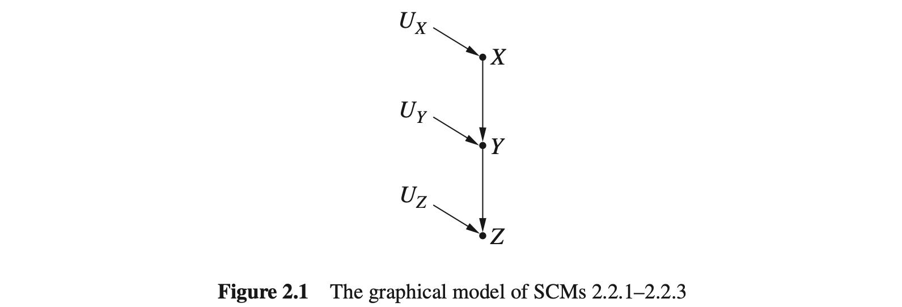

SCM 2.2.1 和 SCM 2.2.3 处理的是连续变量，SCM 2.2.2 处理的是离散变量。在 SCM 2.2.1 中，自变量（父变量）的值越大，因变量（子变量）的值越大；SCM 2.2.3 中，自变量（父变量）的值越大，因变量（子变量）的值越小；SCM 2.2.2 中，变量之间的相关关系是逻辑的。虽然没有任何两个结构因果模型包含共同的函数，但是由于它们对应同一个图结构，因此所有由这三个结构因果模型生成的数据必然具有某些相同的独立性质，可以通过检测图 2.1 中的图模型来简单地预测这些独立性质。这三种结构因果模型生成的数据具有共同的独立性和可能的依赖关系如下。

1.  $Z$ 和 $Y$ 可能是相互依赖的：对于某些 $z,y$ ，有：

$$
P(Z=z\mid Y=y)\neq P(Z=z)
$$

2.  $Y$ 和 $X$ 可能是相互依赖的：对于某些 $y,x$ ，有：

$$
P(Y=y\mid X=x)\neq P(Y=y)
$$

3.  $Z$ 和 $X$ 可能是相互依赖的：对于某些 $z,x$ ，有：

$$
P(Z=z\mid X=x)\neq P(Z=z)
$$

4.  $Z$ 和 $X$ 在 $Y$ 的条件条是独立的：对于所有的 $x,y,z$ ，有：

$$
P(Z=z\mid X=x,Y=y)=P(Z=z\mid Y=y)
$$

为了理解这些独立性和依赖关系，我们来检测图模型。首先，验证由一条边连接的两个变量可能是相互依赖的。注意，从一个变量指向另一个变量的箭头表示第一个变量是第二个变量的原因，也就是说，第一个变量是确定第二个变量值的函数的一部分。因此，第二个变量的值依赖于第一个变量的值；在某些情况下，改变第一个变量的值会引起第二个变量值的改变。这意味着，当检测数据集中的这些变量时，如果已知一个变量的值，则另一个变量取某个值的概率可能会改变。所以在一个典型的因果模型中，不管具体的函数是什么，由边连接的两个变量是依赖的。有这个推理可知，在SCM2.2.1～SCM2.2.3中， $Z$ 和 $Y$ 可能是相互依赖的， $Y$ 和 $X$ 也可能是相互依赖的。

根据这两个事实，可以得出结论：如果 $Z$ 依赖于 $Y$ 的值，而 $Y$ 依赖于 $X$ 的值，那么 $Z$ 很可能依赖于 $X$ 的值，即 $Z$ 和 $X$ 可能是依赖的。然后，在某些特殊的情况下不是这样的。例如，考虑下面的结构因果模型，他的图模型也与图2.1相同。

**SCM 2.2.4（非传递依赖的情况）**

$$
\begin{aligned}
V = \{X,Y,Z\}, U &= \{U_X, U_Y, U_Z\}, F = \{f_X, f_Y, f_Z\} \\
f_X:X&=U\\
f_Y:Y&=
\begin{cases}
a\text{, 当}X=1\text{且}U_Y=1\\
b\text{, 当}X=2\text{且}U_Y=1\\
c\text{, 当}U_Y=2
\end{cases}\\
f_Z:Z&=
\begin{cases}
i\text{, 当}Y=c\text{或}U_Z=1\\
j\text{, 当}U_Z=2
\end{cases}
\end{aligned}
$$

在这个例子中，无论 $U_Y$ 和 $U_Z$ 取什么值， $X$ 都对 $Z$ 值没有任何影响。 $X$ 的变化会造成 $Y$ 在 $a$ 和 $b$ 之间发生变化，但除非 $Y$ 取值 $c$ ，否则 $Y$ 不会影响 $Z$ 。因此， $X$ 和 $Z$ 在这个模型中独立地变化。此类情况称为非传递情况。

然而，非传递情况并不常见，在大多情况下， $X$ 和 $Z$ 的值会一起变化，就像 $X$ 和 $Y$ 、 $Y$ 和 $Z$ 一样，因此，在数据集中它们可能是相互依赖的。

现在再来讨论：在条件 $Y$ 下， $Z$ 和 $X$ 是独立的。 回顾一下，以 $Y$ 为条件时，我们基于 $Y$ 的值将数据过滤划分成不同的组，然后分别比较 $Y=a,Y=b$ 时的情况。首先来看 $Y=a$ 的情况。我们想知道在这些情况下， $Z$ 的值是否独立于 $X$ 的值。之前，我们认为 $X$ 和 $Z$ 可能是相互依赖的，因为当 $X$ 的值发生变化时， $Y$ 的值可能会发生改变，而当 $Y$ 的值发生变化时， $Z$ 的值可能会改变。但是现在仅检测 $Y=a$ 值的情况，即选择具有不同的 $X$ 值时， $U_Y$ 的值需随之变化而使得 $Y$ 的值保持为 $a$ 。但因为 $Z$ 值仅取决于 $Y$ 和 $U_Z$ ，不依赖于 $U_Y$ ，所以（无论 $U_Y$ 怎么变） $Z$ 的值都不会改变。这样一来，选择一个不同的 $X$ 值并不会改变 $Z$ 的值，因此，在 $Y=a$ 的情况下， $X$ 与 $Z$ 是独立的。无论 $Y$ 的值怎样变化，这个结论显然都是正确的。所以在 $Y$ 的条件下， $X$ 与 $Z$ 是独立的。

这种由三个节点和两条边组成，并且中间变量有一条边进入和一条边射出的结构称为链结构。以上的推理说明，在任何图模型中，对于给定的任意两个变量 $X$ 和 $Y$ ，如果 $X$ 和 $Y$ 之间的唯一路径完全由链组成，那么以该路径上的任何中间变量为条件， $X$ 和 $Y$ 都是独立的。无论连接变量的函数是什么，这种独立关系都成立。由此得到第一条规则：

**规则 2.2.1（链结构中的条件独立性）** 如果变量 $X$ 和 $Y$ 之间只有一条单向路径， $Z$ 是截断这条路径的任何一组变量，则在 $Z$ 的条件下， $X$ 和 $Y$ 是独立的。

**注：** 链式结构当中两头(即 $X$ 和 $Z$ )不一定关联，但是在 $Y$ 的条件下，两头一定独立。

需要注意的是，只有当假设误差项 $U_X,U_Y$ 和 $U_Z$ 相互独立时，规则2.2.1才成立。例加，如果 $U_X$ 是 $U_Y$ 的原因，那么以 $Z$ 为条件不一定会使 $X$ 和 $Y$ 相互独立，因为 $X$ 的变化可能仍然通过它们的误差项与 $Y$ 的变化关联。

现在来看如图2.2所示的图模型。举例来说，这个结构可能表示一个城市某天的温度（ $X$ ），当天本地一家冰激凌店的销售量（ $Y$ ），以及当天城市暴力犯罪的数量（ $Z$ ）之间的因果机制。SCM 2.2.5给出了这些变量之间可能的函数关系。这种结构也可以代表SCM 2.2.6中关于开关（ $X$ ）的状态（开或关），第一个灯泡（ $Y$ ）的状态（亮或灭）以及第二个灯泡（ $Z$ ）的状态（灭活亮）之间的因果关系，外生变量 $U_X,U_Y$ 和 $U_Z$ 代表影响这些变量相互之间关系的其他随机因素。

**SCM 2.2.5（温度、冰激凌销量和罪犯）**

$$
\begin{aligned}
V = \{X,Y,Z\}, U &= \{U_X, U_Y, U_Z\}, F = \{f_X, f_Y, f_Z\} \\
f_X:X&=U_X\\
f_Y:Y&=4x+U_Y\\
f_Z:Z&=\frac{x}{10}+U_Z
\end{aligned}
$$

**SCM 2.2.6（开关和两个灯泡的状态）**

$$
\begin{aligned}
V = \{X,Y,Z\}, U &= \{U_X, U_Y, U_Z\}, F = \{f_X, f_Y, f_Z\} \\
f_X:X&=U_X\\
f_Y:Y&=
\begin{cases}
\text{亮，当( $X$ ="开"且 $U_X=0$ )或( $X$ ="关"且 $U_Y=1$ )}\\
\text{灭，否则}
\end{cases}\\
f_Z:Z&=
\begin{cases}
\text{亮，当( $X$ ="开"且 $U_Z=0$ )或( $X$ ="关"且 $U_Z=1$ )}\\
\text{灭，否则}
\end{cases}
\end{aligned}
$$

如果假设误差项 $U_X,U_Y$ 和 $U_Z$ 是相互独立的，那么通过检测图2.2中的图模型，可以确定SCM 2.2.5和SCM 2.2.6共享如下的依赖性和独立性。

1.   $X$ 和 $Y$ 可能是相互依赖的：对于某些 $x,y$ ，有

$$
P(X=x\mid Y=y)\neq P(X=x)
$$

2.   $X$ 和 $Z$ 可能是相互依赖的：对于某些 $y,z$ ，有

$$
P(Y=y\mid Z=z)\neq P(Y=y)
$$

3.   $Z$ 和 $Y$ 是独立的：对于所有的 $z,y$ ，有

$$
P(Z=z\mid Y=y)\neq P(Z=z)
$$

4.   $Y$ 和 $Z$ 在 $X$ 的条件下可能是独立的：对于某些 $x,y,z$ ，有

$$
P(Y=y\mid Z=z,X=x)=P(Y=y\mid Z=z)
$$

对于第1点和第2点，由于 $Y$ 和 $Z$ 也都通过肩头与 $X$ 直接相连，因此当 $X$ 的值改变时， $Y$ 的值和 $Z$ 的值都可能发生变化。这使我们进一步想到：当 $X$ 改变时， $Y$ 会发生变化， $Z$ 也会发生变化，那么当 $X$ 改变时， $Y$ 与 $Z$ 可能（虽然不确定）会一起发生变化，反之亦然。由于可以从 $Y$ 值的变化中得到 $Z$ 值发生相应变化的信息，所以 $Y$ 和 $Z$ 可能是相互依赖的变量。

那么，为什么在 $X$ 的条件下 $Y$ 和 $Z$ 独立呢？当以 $X$ 为条件时发生了什么？以 $X$ 的值来筛选数据，所以只比较 $X$ 是一个固定值的情况。由于 $X$ 的值是不变的，所以 $Y$ 和 $Z$ 的值不会随着 $X$ 的变化而变化，它们只会随着 $U_Y$ 和 $U_Z$ 而变化，由于已经假设 $U_Y$ 和 $U_Z$ 是独立的，因此， $Y$ 和 $Z$ 的值是独立变化的。

这种具有三个节点，并且有两个箭头从中间变量射向的结构称为分叉结构。分叉结构中的中间变量是其他两个变量和它们任何后代的共同原因。如果两个变量共享一个共同原因，并且这个共同原因是它们之间唯一路径的一部分，那么上述推理说明，这些变量的依赖关系和条件独立性是成立的，因此，得到另一个规律：

**规则2.2.2（分叉结构的条件独立性）** 如果变量 $X$ 是变量 $Y$ 和 $Z$ 的共同原因，并且 $Y$ 和 $Z$ 之间只有一条路径，则 $Y$ 和 $Z$ 在 $X$ 的条件下独立。

### 2.3 对撞结构

到目前为止，已经研究了两种简单的边和节点的结构：链结构和分叉结构，这两种结构均允许边和节点出现在两个变量之间的路径上。还有第三种结构，因为这种结构有其独特的考虑和挑战，因此在这里专门介绍。这种结构包含一个对撞节点，它指的是一个节点接收来自两个节点射出的边。图2.3展示了一个最简单的，包含对撞结构的因果模型图，它代表两个原因 $X$ 和 $Y$ 的共同效应 $Z$ 。

与每个因果模型图一样，所有具有像图2.3这样结构的因果模型都可以从图中得出相同的依赖性和独立性。对于如图2.3所示的模型，假设 $U_X$ 、 $U_Y$ 和 $U_Z$ 是独立的，可以得出如下的独立性。

1.   $X$ 和 $Z$ 可能是相互依赖的：对于某些 $x,z$ ，有

$$
P(X=x\mid Z=z)\neq P(X=x)
$$

2.   $X$ 和 $Z$ 可能是相互依赖的：对于某些 $y,z$ ，有

$$
P(Y=y\mid Z=z)\neq P(Y=y)
$$

3.   $X$ 和 $Y$ 是独立的：对于所有的 $x,y$ ，有

$$
P(X=x\mid Y=y)=P(X=x)
$$

4.   $X$ 和 $Y$ 在 $Z$ 的条件下可能是相互依赖的：对于某些 $x,y,z$ ，有

$$
P(X=x\mid Y=y,Z=z)\neq P(X=x\mid Z=z)
$$

前两点已在2.2节中解释了。第3点是不言而喻的，因为 $X$ 和 $Y$ 都不是彼此的后代或祖先，也没有依赖于同一个变量的值，它们只会分别受 $U_X$ 和 $U_Y$ 的影响，而 $U_X$ 和 $U_Y$ 是独立的，所以没有使 $X$ 值变化与 $Y$ 值变化相关联的因果机制。这种独立性也反映了因果关系在时间上的机制，当前独立的事件不会因为将来产生共同的效应而变得相互依赖。

那么什么第4点成立呢？为什么以共同效应作为条件时，两个独立的变量实际上变得相互依赖了呢？为了回答这个问题，再改回到以条件变量的值来过滤的定义上。当以 $Z$ 为条件时，我们将比较限定在 $Z$ 取相同值的情况。由于 $Z$ 的值依赖于 $X$ 和 $Y$ ，因此，在对 $Z$ 取相同值做比较时， $X$ 值的任何变化必须通过 $Y$ 值的变化来补偿，否则 $Z$ 值也会改变。

对撞结构的这种特性，以对撞节点为条件会使该节点的父节点互相依赖，背后的原理一开始很令人费解，例如，一个最基本的例子： $Z=X+Y$ ，且 $X$ 和 $Y$ 是独立的变量，有以下推理：如果已知 $X=3$ ，你不知道关于 $Y$ 可能值的任何信息，因为这两个数字是独立的；另一方面，如果已知 $Z=10$ ，那么再告诉 $X=3$ ，相当于立刻确认 $Y$ 必然是7。因此，当给定 $Z=10$ 时， $X$ 和 $Y$ 是依赖的。

可以通过现实生活的例子进一步阐明这种现象。例如，假设某所大学为两类学生提供奖学金：一类是具有超常音乐天赋的学生，另一类则是拥有超常学业成绩的学生。通常，音乐天赋和学业成绩是独立的特质，所以在广泛人群中，对于一个有音乐天赋的人，无从获得关于其学业成绩的任何信息。但是，如果发现一个人获得了奖学金，并且知道这个缺乏音乐才能，那么会立即推断他可能有很高的学业成绩。因此，在固定两个独立变量的共同效应（第三变量为奖学金）的值时，这两个独立变量会变得相互依赖。

再来研究一个数值例子：同时（独立）投掷两枚质地均匀的硬币，至少有一枚硬币落地时正面向上时，铃就会响。令 $X$ 和 $Y$ 分别表示两枚硬币的投掷结果，令 $Z$ 代表铃的状态， $Z=1$ 表示铃响了， $Z=0$ 表示铃没响。这种机制可以表示为如图2.3所示的对撞结构，图中两枚硬币的投掷结果是父节点，铃的状态是对撞节点。

如果已知硬币1落地时正面向上，由于两枚硬币是独立的，我们不能获得硬币2的结果。但是假设听到铃声，且知道硬币1落地时反面向上，则可确认硬币2落地时必然正面向上。同样，如果假设听到了铃声，且知道硬币2也是落地时正面向上，那么硬币1落地时正面向上的概率会改变，这种概率变化比前一种情况更微妙。

为了后面的计算，表2.1给出了两枚质地均匀的硬币同时投掷的结果的概率分布。其中， $X$ 表示第一枚硬币， $Y$ 表示第二枚硬币， $Z$ 表示铃，如果任何一枚硬币落地时正面向上，则铃响。

表2.1 两枚质地均匀的硬币同时投掷的结果的概率分布

| $X$  | $Y$  | $Z$  | $P(X,Y,Z)$ |
| ---- | ---- | ---- | ---------- |
| 正面 | 正面 | 1    | 0.25       |
| 正面 | 反面 | 1    | 0.25       |
| 反面 | 正面 | 1    | 0.25       |
| 反面 | 反面 | 0    | 0.25       |

由表2.1知

$$
P(X=\text{正面}\mid Y=\text{正面})=P(X=\text{反面}\mid Y=\text{反面})=\frac{1}{2}
$$

也就是说， $X$ 和 $Y$ 是相互独立的。现在，以 $Z=1$ （铃声响）和 $Z=0$ （铃声不响）为条件，所得数据子集如表2.2所示。

表2.2 基于表2.1分布的条件概率分布

| $X$  | $Y$  | $P(X,Y\mid Z=1)$ | $P(X,Y\mid Z=0)$ |
| ---- | ---- | ---------------- | ---------------- |
| 正面 | 正面 | 0.333            | 0                |
| 正面 | 反面 | 0.333            | 0                |
| 反面 | 正面 | 0.333            | 0                |
| 反面 | 反面 | 0                | 1                |

通过计算这些表中的概率，有

$$
P(X=\text{正面}\mid Z=1)=\frac{1}{3}+\frac{1}{3}=\frac{2}{3}
$$

如果进一步筛选出 $Z=1$ 的子表，然后研究 $Y=\text{正面}$ 的情况，将得到

$$
P(X=\text{正面}\mid Y=\text{正面},Z=1)=\frac{1}{2}
$$

可以看出，在 $Z=1$ 的情况下，在知道 $Y=\text{正面}$ 时， $X=\text{正面}$ 的概率从 $\frac{2}{3}$ 变到 $\frac{1}{2}$ 。显然，给定 $Z=1$ 后， $X$ 和 $Y$ 是相互依赖的。当然，当铃声不响（ $Z=0$ ）时，更明显的相关依赖发生了，因为我们知道这两枚硬币落地时肯定都是反面向上的。

另一个对撞结构的例子是1.3节中遇到的蒙蒂霍尔问题。这个例子有助于进一步理解这种结构引起的问题。从本质上来说，蒙蒂霍尔问题反映了对撞结构的存在。你最初选择的门是一个父节点；后而有车的门是另一个父节点；蒙蒂打开的、后而有山羊的门是对撞节点，该节点受其他两个变量的共同影响。这里的因果关系是：如果你选择门 $A$ ，如果门 $A$ 后面有一只羊，那么蒙蒂将被迫打开剩下的、后面有羊的门。

最初关于门的选择和汽车的位置是独立的，这就是为什么虽初有 $\frac{1}{3}$ 的机会选择有车的门。然而，正如投掷两枚独立的硬币一样，在蒙蒂对门进行选择的条件下，最初的选择和车的位置是相互依赖的。在这个例子中，最初车在门 $B$ 后面的概率为 $\frac{1}{3}$ ，但是在选择门 $A$ 并且蒙蒂打开门 $C$ 的情况下，车在门 $B$ 后面的概率将为 $\frac{2}{3}$ 。

在对撞节点的条件下，可以使先前独立的变量变得相互依赖，以对撞点的任何后代为条件也是如此，再次回到投掷两枚独立的硬币的例子看看为什么是这样。假设没有直接听到铃声，而是依靠一个不太可靠的目击者。当铃不响时，目击者有 $50%$ 的概率谎报铃响。令 $W$ 表示目击者的报告，因果结构如图2.4所示，其中， $X$ 代表第一枚硬币投掷的结果， $Y$ 代表第二枚硬币投掷的结果， $Z$ 表示当 $X$ 或 $Y$ 是正面向上就会响的铃， $W$ 代表报告铃是否响的目击者， $X,Y$ 和 $W$ 的所有组合的概率如表2.3所示。

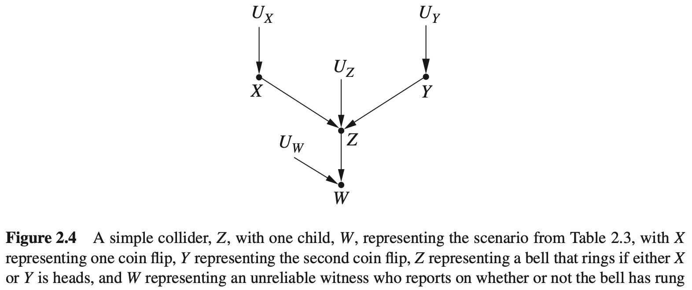

表2.3 两枚质地均匀的硬币同时投掷的结果的概率分布。

| $X$  | $Y$  | $W$  | $P(X,Y,W)$ |
| ---- | ---- | ---- | ---------- |
| 正面 | 正面 | 1    | 0.25       |
| 正面 | 反面 | 1    | 0.25       |
| 反面 | 正面 | 1    | 0.25       |
| 反面 | 反面 | 1    | 0.125      |
| 反面 | 反面 | 0    | 0.125      |

基于表2.3，可以很容易地验证如下式子：

$$
P(X=\text{正面}\mid Y=\text{正面})=P(X=\text{正面})=\frac{1}{2}
$$

$$
P(X=\text{正面}\mid W=1)=\frac{0.25+0.25}{0.25+0.25+0.25+0.125}=\frac{0.5}{0.875}
$$

$$
P(X=\text{正面}\mid Y=正面,W=1)=\frac{0.25}{0.25+0.25}=0.5<\frac{0.5}{0.875}
$$

由上述结果可得出，在得到目击者报告之前， $X$ 和 $Y$ 是独立的，但之后就变得相互依赖了。进而得出2.2节两个规则之外的第三条规则：

**规则 2.3.1（对撞结构中的条件独立性）** 如果变量 $Z$ 是变量 $X$ 和 $Y$ 之间的对撞节点，并且 $X$ 与 $Y$ 之间只有一条路径，那么 $X$ 与 $Y$ 是无条件独立的，但是在 $Z$ 或 $Z$ 的任何子孙条件下是相互依赖的。

规则2.3.1对于研究因果关系是极其重要的，在接下来的章节中，该规则可用于测试一个数据集是否由某个因果模型所生成，用于从数据中发现模型，或者用于在混杂情况下确定应该检测哪个变量以及如何估计因果效应，从而彻底解决因果推断问题。

备注：好奇的读者可能想知道为什么在对撞节点条件下产生的依赖关系会令大多数人都感到惊讶，正如蒙蒂霍尔问题所示的那样。原因是人们倾向于将依赖关系和因果关系联系起来。因此，他们错误地认为两个变量之间的统计依赖之所以存在，只能是因为有产生这种依赖性的因果机制；也就是说，要么两个变量中的一个是另一个的原因，要么出现第三个变量是这两个变量的共同原因。在对撞结构中，他们惊奇地发现还有第三种方式可以产生这种依赖，违背了“没有因果关系就无关联”的假设。

#### 思考题

#### 2.3.1

(a) 列出图2.5中在集合 $Z=\{R,V\}$ 条件下的每一对独立的变量。

(b) 列出图2.5中使每一对不相邻的变量独立的条件变量。

(c) 列出图2.6中在集合 $Z=\{R,P\}$ 条件下的每一对独立的变量。

(d) 列出图2.6中使每一对不相邻的变量独立的条件变量。

(e) 假设用图2.5中的模型产生一组数据，并用线性方程 $Y=a+bX+cZ$ 来拟合这组数据，为确保斜率 $b=0$ ， $Z$ 可以是模型中的那些变量？ [提示：回归一下，一个非零斜率意味着 $X$ 与 $Y$ 在 $Z$ 条件下相互依赖。]

(f) 继续问题(e)，但现在参考图2.6，如果方程 $Y=a+bX+cR+dS+eT+fP$ 来拟合数据，哪些系数可能为0？

### 2.4 d-分离

因果模型通常不会像前面遇到的例子那样简单。具体来说，变量之间只有一条路径的图模型是很少的。在大多数的图模型中，变量可能有多条路径连接，且每个路径包含多个链、分叉和对撞结构。因此需要考虑这样的问题，即对于任意复杂的图因果模型，是否存在一个准则或方法，用来预测由该模型生成的数据所具有的相关性质呢？

实际上，根据前面章节介绍的规则，可以得到一个这样的方法：d-分离。d-分离（d表示“方向的”）使我们能够确定任何一对节点是否是d-连通的，即它们之间是存在一条连通路径；或者确定任何一对节点是否是d-分离的，即它们之间不存在连通的路径。当说一对节点是d-分离的，指的是这两个变量是绝对独立的；当说一对节点是d-连通的，指的是这两个变量可能或很有可能是相互依赖的。

如果两个节点 $X$ 和 $Y$ 之间存在的任何路径都被阻断，则它们是（关于这些阻断变量）d-分离的；如果 $X$ 和 $Y$ 之间存在一条路径没有被阻断，那么 $X$ 和 $Y$ 是连通的。可以把变量之间的路径看作管道、依赖性就像通过管道里的水：如果存在一根管道是未被阻断的，水就可以从一个地方流到另一个地方，如果有一条路径是通畅的，那么两端的变量就是相互依赖的。仅在一个地方阻断管道就可以阻止水流通过，同样地，只需要一个节点就可以阻断整个路径上的依赖性传递。

d-分离分为两类：以某些节点为条件和不以任何节点为条件。如果不以任何节点为条件，那么只有对撞节点可以阻断一条路径。原因是：不以任何变量为条件时，对撞结构会阻断依赖关系，正如在2.3节中所提到的那样。因此，如果两个节点 $X$ 和 $Y$ 之间的每条路径都有一个对撞节点，则 $X$ 和 $Y$ 不会有依赖关系，它们必须是边缘独立的。

然而，如果以一组节点 $Z$ 为条件，那么以下类型的节点可以阻断一条路径：

- 自身不在 $Z$ 中且其子孙节点也不在 $Z$ 中的对撞节点
- 在 $Z$ 中的链节点或分叉的中间节点

其背后的原因要追溯到在2.2节和2.3节介绍的内容。对撞节点不允许依赖性在其父节点之间传递，因此阻断了路径。而规则2.3.1告诉我们，当以对撞节点或其后代为条件时，父节点之间可能会变成互相依赖的。因此，不在条件集 $Z$ 中的对撞节点会使依赖关系无法在路径上传递，而在条件集中的对撞节点或其后代则不会阻断依赖关系。相反，非对撞结构（包括链结构和分叉结构）不会阻断依赖关系，但规则2.2.1和规则2.2.2又告诉我们，当以非对撞结构的中间节点为条件时，这些路径的两端节点会变得独立（每次只考察一条路径）。因此，条件集中的任何非对撞节点将阻断依赖关系，而不在条件集中的非对撞节点将允许依赖关系在路径上传递。

**定义2.4.1（d-分离）** 一条路径会被一组节点 $Z$ 阻断，当且仅当：

1. 路径包含链结构 $A\to B\to C$ 或分叉结构 $A\gets B\to C$ ，其中间节点 $B$ 在 $Z$ 中（即以 $B$ 为条件）；或者
2. 路径 $p$ 包含一个对撞结构 $A\to B\gets C$ ，且对撞节点 $B$ 及其子孙节点都不在 $Z$ 中。

如果 $Z$ 阻断了 $X$ 和 $Y$ 间的每一条路径，则 $X$ 和 $Y$ 在 $Z$ 的条件下是d-分离的，因此 $X$ 和 $Y$ 在以 $Z$ 为条件时是独立的。

我们使用d-分离工具来探究一些更复杂的图模型，并确定其中的独立变量和依赖变量，包括不以其它变量为条件和以其它变量为条件这两种情况。以如图2.7所示的图模型为例，图2.7可能与许多因果模型相关联。变量可能是离散的、连续的或两者的混合，它们之间的关系可能是线性的、指数的或其它任意形式的。然而，无论模型如何，d-分离将总是描述该模型生成的数据集所具有的独立性质。

特别地，我们来分析图2.7模型中 $Z$ 和 $Y$ 之间的关系。使用一个空的条件集时，它们是d-分离的，这说明 $Z$ 和 $Y$ 是无条件独立的。为什么呢？因为 $Z$ 和 $Y$ 之间只有一条路径，并且该路径被对撞结构 $(Z\to W\gets X)$ 阻断，所以它们之间就没有未被阻断的路径。

但如果以 $W$ 为条件呢？d-分离告诉我们在 $W$ 的条件下， $Z$ 和 $Y$ 是d-连通的。原因是：当条件集是 $\{W\}$ 时， $Z$ 和 $Y$ 之间的唯一路径包含一个分叉节点 $(X)$ ，该节点不在条件集内，并且路径中的唯一对撞节点 $(W)$ 在条件集内，因此该路径没有被阻断（注意以对撞节点为条件时，会“解除阻断”）。如果以 $U$ 为条件，由于 $U$ 是 $Z$ 和 $Y$ 之间路径上对撞节点的后代，因此结果也是如此。

另一方面，如果以集合 $\{W,X\}$ 为条件，则 $Z$ 和 $Y$ 仍然是独立的。此时，基于规则2.2.1，路径上有一个在条件集合中的非对撞节点 $(X)$ ，因此 $Z$ 和 $Y$ 之间的路径被阻断。虽然通过以 $W$ 为条件解除了阻断，但有一个阻断节点就足以阻断整条路径。由于 $Z$ 和 $Y$ 之间的唯一路径被该条件所阻断，所以 $Z$ 和 $Y$ 在 $\{W, X\}$ 的条件下是d-分离的。

现在考虑，当在 $Z$ 和 $Y$ 之间添加另一个路径时，如图2.8所示，会发生什么情况。 $Z$ 和 $Y$ 现在是无条件依赖的。为什么？因为它们之间有一条路径 $(Z\gets T\to Y)$ ，且该路径不包含对撞节点。然而，如果以 $T$ 为条件，则该路径被阻断， $Z$ 和 $Y$ 再变得独立。另一方面，以 $\{T,W\}$ 为条件时，它们再次变成d-连通（以 $T$ 为条件时，阻断了路径 $Z\gets T\to Y$ ，但以 $W$ 为条件则解除了路径 $Z\to W\gets X\to Y$ 的阻断）。如果将 $X$ 添加到条件集中，条件集变成 $W,U,\{W,U\},\{W,T\},\{U,T\},\{W,U,T\},\{W,X\},\{U,X\}$ ，或 $\{W,U,X\}$ 时， $Z$  和 $Y$ 是d-连通的（因此也可能是相互依赖的）。而当条件集为 $T,\{X,T\},\{W,X,T\},\{U,X,T\},\{W,U,X,T\}$ 时，它们是d-分离的（因此是独立的）。注意： $T$ 在使和 $Z$ 和 $Y$ 是d-分离的每个条件集合中；这是因为 $T$ 是使 $Z$ 和 $Y$ 无条件d-连通的路径上的唯一节点，所以除非以它为条件，否则 $Z$ 和 $Y$ 将始终是d-连通的。

#### 思考题

#### 2.4.1

图2.9表示一个误差项已被移除的因果图，其中，假设所有 $U$ （未显示）都是独立的。假设所有这些误差项都是相互独立的。

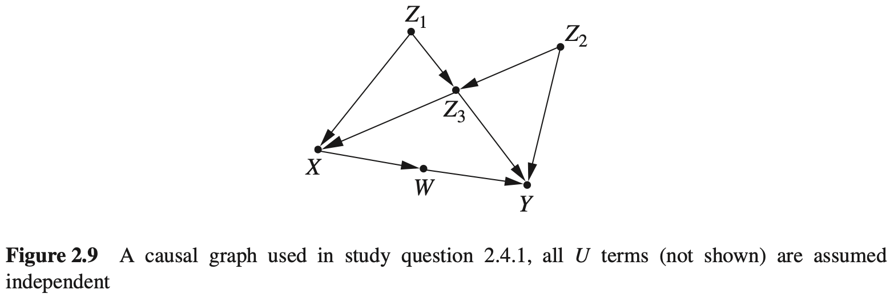

(a) 对于图2.9中每一对不相邻的节点，找到一组使它们d-分离的节点。在数据独立性方面，这个结果说明了什么？

(b) 假设只有集合 $\{Z_3,W,X,Z_1\}$ 中的节点可以测量，重新回答同题(a)。

(c) 对于图2.9中每一对不相邻的节点，在以其他所有节点为条件的情况下，确定它们是否是独立的。

(d)对于图中每一个节点 $V$ ，找到一个最小的节点集合，使得 $V$ 与图中其他所有节点独立。

(e) 假设想要用模型中其他所有变量的值来估计 $Y$ 的值。我找到一个最小的变量集合，能够获得与所有变量同样准确的对于 $Y$ 的估计。

(f) 假设希望估计 $Z_2$ ，重新回答问题(e)。

(g) 假设希望用 $Z_3$ 的值来预测 $Z_2$ 的值，如果增加 $W$ 的值，精度会提升吗？解释原因。

### 2.5 模型检验与因果搜索

前面的章节表明因果模型在其生成的数据集上有可被检验的推论式。例如，如果认为图 $G$ 可能生成了数据集 $S$ ，d-分离将告诉我们图 $G$ 中的哪些变量在哪些其他变量的条件下一定是独立的，而我们可以用数据集来检验条件独立性。假设列出图 $G$ 中的d-分离条件，并注意到变量 $A$ 和 $B$ 在 $C$ 的条件下一定是独立的，然后，基于数据集 $S$ 来估计概率，发现 $A$ 和 $B$ 在 $C$ 的条件下不是独立的，我们就拒绝将图 $G$ 作为数据集 $S$ 的因果模型。

现在以图2.9的因果模型来说明。由模型列出的条件独立性可知， $W$ 和 $Z_1$ 在给定 $X$ 的条件下是独立的，因为 $X$ “d-分离” $W$ 与 $Z_1$ 。现在在 $X$ 和 $Z_1$ 上回归 $W$ ，也就是说，要寻找一条最符合我们的数据的直线：

$$
w=r_Xx+r_1z_1
$$

如果 $r_1\ne0$ ，表明在给定 $X$ 的条件下， $W$ 的值依赖于 $Z_1$ ，因此，模型是错误的（回想一下，条件相关就是条件依赖）。我们不仅知道模型是错误的，而且也知道错误在哪儿。在正确的模型中，在 $W$ 和 $Z_1$ 间一定有一条不被 $X$ “d-分离”的路径，这是适用于所有具有误差独立性特质的（有向）无环模型的一个理论结果（Verma et al., 1990）。而且如果模型中的每个d-分离条件均与数据中的条件独立性一致，则任何进一步的检验也不能否定该模型。这意味着，对于任何（与模型独立性相符的）数据集，人们总能为这个模型找到一组函数，并指定误差项的摄率，从而确地生成该数据。

还可以利用其他方法来检验模型（对于数据集）的适合度。评估适合度的标准方法涉及对模型的统计假设检验，也就是说，评估所观察的样本不是凭运气，而是根据由假设模型产生的可能性有多大。然而，由于模型设有完全确定，在评估这种可能性之前需要先估计模型参数。可以通过假设线性高斯模型（即，模型中的所有函数都是线性的，所有误差项都是正态分布的）来近似估计参数，因为在这样的假设下，联合分布（也是高斯分布）可以用模型参数来简洁地表达，然后可以评估观察样本由完全参数化的模型生成的可能性（Bollen, 1989）。

然而，这个过程也存在很多问题。首先，如果有某些参数不能被估计，那么就得不到联合分布，则模型不能被检验。正如将在3.8.3节中看到的，当某些误差项相关或者某些变量不可观谢时，会出现这种问题。其次，这是一个全局性模型检验过程，如果发现这个模型不能较好地适合数据，我们无法去寻找其原因，也没有办法确定应该在模型中删除或添加哪些边来提高这种适合性。第三，当对一个模型实施局部性检验时，涉及的变量可能很多，如果每个变量均存在测量噪声和/或采样差异，那么检验将不可靠。

相比于这种局部性检验方法，d-分离有以下优点。首先，它是非参数的，这意味着它不依赖于任何具体的变量间的函数，而是仅使用问题中的图模型。其次，它仅能依赖局部性检验模型，而不是全局性检验，这使我们能够识别假设模型中有缺陷的特定区域，并修复该区域，从而得到一个全新的模型。这也意味着，如果无法确定模型中某个区域的参数，无论是什么原因导致的，我们仍然可以获得模型剩余部分的一些不完整的信息（与全局性检验方法相反，在全局性检验方法中，如果无法估计一个参数，就不能检验模型的任何部分）。

如果有一台计算机，就可以用d-分离方法来检验和排除很多可能的模型，最终将得到一些经过检验，与数据结果中依赖关系不矛盾的模型。最终结果是几个模型，而不是一个模型，这是因为有些图有不可区分的蕴涵式。具有不可区分蕴涵式的一组图被称为等价类。如果两个图 $G_1$ 和 $G_2$ 有相同的骨架（即有相同的边，而不管边的方向），并且它们具有同样的v-结构（即父节点不相邻的对撞结构），则这两个图在同一个等价类内。满足这条规则的任何两个图都具有相同的d-分离条件集，因此具有相同的可检验蕴涵式集（Verma et al., 1990）。

这个结果的重要性在于它使我们能够为数据集寻找可能产生它的因果模型。因此，不仅可以从一个因果模型出发生成一个数据集，也可以从一个数据集出发反推出因果模型。由于大多数数据分析研究的目标正是要找到一个解释数据的模型，因此，这个结果是非常有用的。

还有其他的因果模型搜索方法，包括在本节开始时提到的依赖于全局校型检验的一些方法，但是对它们进行全面研究超出了本书的范围，对此感兴趣、想要了解更多的读者可以参考Pearl（2000）、Pearl祭（1991）、Rebane等（1987）、Spirtes等（1991）以及Spirtes等（1993）。

#### 思考题

#### 2.5.1

(a) 图2.9中的哪些箭头反向后可不被任何统计检验识别出来？[提示：使用等价类准则。]

(b) 应用等价类准则列出所有等价于如图2.9所示的因果图。

(c) 列出图2.9中可以由非实验数据确定方向的箭头。

(d) 给出一个 $Y$ 的回归方程，使得当方程中某个系数非零时，如图2.9所示的模型是错误的。

(e) 给出一个 $Z_3$ 的回归方程，使得当方程中某个系数非零时，如图2.9所示的模型是错误的。

(f) 假设 $X$ 不可测量，重新回答问题(e)。

(g) 对(d)和(c)中的这类回归方程一共需要多少个，才能确保模型能够被完全检验？也就是说，如果图通过了所有的这些检验，它将不能被其他这类检验所否定。[提示：确保你检验了每一个由式（1.30）乘积分解所隐含的偏回归系数为0的情况。]

## 3 干预的效果

### 3.1 干预

许多统计研究的最终目标是预测干预措施的效果。例如，我们收集西部火灾相关因素的数据，实际上是要寻找可以用于预测的因素，以减少火灾的发生；当对一种新的癌症药物进行研究时，通过让患者服药以实施干预，观察患者用药后的反应；而当研究暴力电视节目与儿童的攻击性行为之间的相关性时，是想尝试确认少数儿童接触暴力电视节目的干预措施能否降低儿童的攻击性。

在统计学课程中常会提到“相关关系不是因果关系”。两个变量之间的关系并不仅仅只有一个变量引起另一个变量的变化（关于这个性质有一个著名例子：冰激凌销量的增加与暴力犯罪数目的增加是有关系的，不是因为冰激凌导致犯罪，而是因为冰激凌销量和暴力犯罪都在炎热天气中更常见）。因此，随机对照试验被认为是统计学中的黄金准则。在一个正确的随机对照试验中，除了输入变量，所有影响输出变量的因素要么是不变的，要么是随机变化的，因此输出变量的任何改变必然由这一个输入变量引起。

不幸的是，很多问题不适合用随机对照试验来解决。我们不能控制天气，所以无法将引起火灾的变量随机化；研究暴力电视节目的时候，虽可以随机选取参与者，但很难有效地控制每个孩子电视的行为，而且几乎不可能知道我们对孩子的控制是否有效；甚至在随机药物试验中，也会出现很多问题，参与者退出了、没有吃药或者弄虚作假吃药。

在随机对照试验不可行的情况下，研究人员实施观察性研究，他们仅仅记录数据，而不是擦除数据。这种研究方法的问题在于很难将因果关系从相关关系中提取出来。常识告诉我们，对冰激凌的销量进行干预，不会影响犯罪的数目，但事实不都是这么清晰。例如，温尼伯大学最近的一项研究表明，青少年过度发短信与（知识）“肤浅”相关。有媒体证实说，发短信使青少年更加肤浅（从干预角度说，对青少年进行干预，使他们减少发短信的数量，从而不让他们那么“肤浅”）。但是，这个试验没有证明任何事情，可能是肤浅使青少年发短信更多；也可能肤浅和短信过度是由一个共同因素引起的，例如基因，如果可能的话，对该基因因素进行干预，可以避免这两个方面的问题。

对一个变量进行干预与以该变量为条件的区别是很明显的。当干预模型中的一个变量时，我们固定这个变量的值，这意味着改变了系统，其他变量的值通常会因此发生变化。当以一个变量为条件时，我们不做任何改变；仅仅关注问题的子集，在这个子集内，变量的值都是我们感兴趣的，这里改变的是我们对世界的看法，而不是世界本身。

例如，图3.1展示了冰激凌销量例子的图模型， $X$ 表示冰激凌销量， $Y$ 表示犯罪率， $Z$ 表示温度。当采取干预措施、固定变量的值时，意味着削弱了该变量为响应其他变量而变化的自然趋势。这相当于在图模型上进行一种处理，即删除指向该变量的所有边。如果采取的干预措施是降低冰激凌销量（比如，关闭所有的冰激凌店），将得到如图3.2所示的图模型。检验图3.2中的相关性可以发现，犯罪率与冰激凌的销量完全独立（即不相关），这是因为后者不再与温度（2）相关。换句话说，即使改变了固定值的水平，这个变化也不会传递到变量 $Y$ （犯罪率）。也就是说，干预一个变量会产生一种与以变量为条件完全不同的依赖模式。此外，以变量为条件可以用第1章中描述的方法直接从数据集中获得，而干预的变化依赖于因果图的结构。对于任何给定的干预，可以根据图模型来确定应该删除哪些边。

我们在符号上区分变量 $X$ 自然地取值 $x$ 的情况和固定 $X$ 取值 $x$ 的情况，后者用 $do(X=x)$ 来表示。因此， $P(Y=y\mid X=x)$表示在 $X=x$ 的条件下 $Y=y$ 的概率： $P(Y=y\mid do(X=x))$ 表示通过干预使 $X=x$ 时 $Y=y$ 的概率。以分布的术语来说， $P(Y=y\mid X=x)$ 反映了在 $X$ 的值都是 $x$ 的个体上 $Y$ 的总体分布；另一方面， $P(Y=y\mid do(X=x))$ 反映了如果群体中的每个个体均将 $X$ 值固定为 $x$ 时， $Y$ 的总体分布。类似地，用 $P(Y=y\mid do(X=x),Z=z)$ 表示对于给定的 $Z=z$ ，干预 $do(X=x)$ 得到的分布中 $Y=y$ 的条件概率。

利用do-表达式和图模型，可以将因果关系从相关关系中分解出来。在这一章剩下的部分，我们将学习一种通过单纯地观察数据就能神奇地分解出因果关系的方法，当然，首先要假设图是实际问题的有效表述。箭要注意的是，默认假设的干预不会造成其他影响，也就是说，当对一个个体给变量 $X$ 分配值 $x$ 时，不会直接改变其他变量的值。比如，给一个患者分配一种药物和违背了他的宗教信仰强迫其服用药物，在恢复上可能有不同的效果，当改变了其他变量的值时，这些改变必须在模型中明确地表示出来。

### 3.2 校正公式

冰激淋的例子代表了一种极端的情况，在这个例子中， $X$ 和 $Y$ 之间的相关性从因果角度完全是假设的，因为从 $X$ 到 $Y$ 没有因果路径，但现实生活中大多数情况并不那么明确。为了探讨一个更现实的情况，我们来分析图3.3，其中 $X$ 代表使用药物， $Y$ 代表痊愈， $Z$ 代表性别， $Z$ 和 $X$ 都对 $Y$ 有影响，这个模型实际上反映的就是辛音森悖论。为了确定药物在人群中的有效性，设想一种假设性的干预指施，即对整个人人统一致服用这种药物，并与补充干预下的痊愈率进行比较，补充干预指阳止每个服用药物。用 $do(X=1)$ 表示第一种干预，用 $do(X=0)$ 表示第二种干预，现在要估计它们的差异。

$$
P(Y=1\mid do(X=1))-P(Y=1\mid do(X=0))\tag{3.1}
$$

该差异称为“因果效应差异”或“平均因果效应”（average causal effect, ACE）。一般地，如果 $X$ 和 $Y$ 都能取多个值，我们希望使 $x$ 和 $y$ 取遍 $X$ 和 $Y$ 可以取得的任意两个值来预测综合因果效应 $P(Y=y\mid do(X=x))$ ，例如， $X$ 可能是药物的剂量， $Y$ 可能是患者的血压。

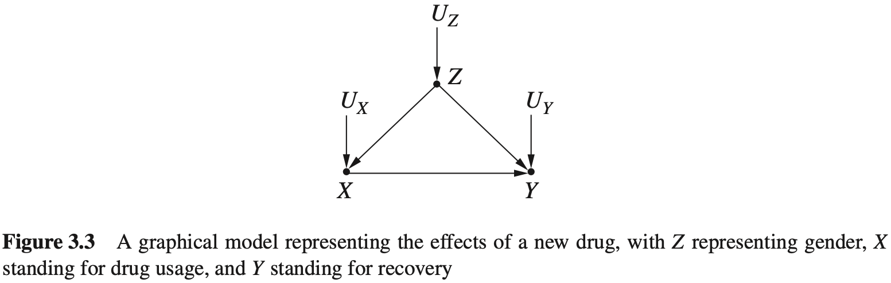

根据基本规则可知，在没有因果关联的情况下，当然无法从数据集本身估计因果效应。这就是辛普森悖论的教训，数据本身甚至不足以确定药物的作用是正面的还是负面的。但是，借助图 3.3 的图模型，可以从数据中计算因果效应的大小。为此，可以通过对图进行处理的方式模拟干预（见图 3.4，该模型中全体人群都服用了该药物，结果为操纵概率 $P_m$ ），就像在冰激凌的例子中所做的那样。因果效应 $P(Y=y\mid do(X=x))$ 与图3.4中修改后模型的条件概率 $P_m(Y=y\mid X=x)$ 相等。 $P_m$ 代表修改后模型中的概率，因此也被称为操纵概率（这种处理方法也解决了是应该分析总体数据，还是应该分析以变量 $z$ 的值划分的子表才能得到正确答案的问题。当通过干预来确定答案时，只需处理一个表就行了）。

计算因果效应的关键在于观察操纵概率 $P_m$ ，其具有 $P$ （图 3.3 中干预前模型的原始概率）的两个基本属性。第一，边际概率 $P(Z)$ 在干预后不变，因为移除 $Z$ 到 $X$ 的箭头不会影响确定 $Z$ 值的过程。在辛普森悖论的例子中，这意味着干预前后男性患者和女性患者的比例不会发生变化。第二，条件概率 $P(Y=y\mid Z=z,X=x)$ 是不变的，因为无论 $X$ 是自然变化还是被故意操控发生变化， $Y$ 对 $X$ 和 $Z$ 的响应函数 $Y=f(x,z,u_Y)$ 都不变。因此，可以给出两个不变性方程：

$$
P_m(Y=y\mid Z=z,X=x)=P(Y=y\mid Z=z,X=x)
$$

$$
P_m(Z=z)=P(Z=z)
$$

由于 $Z$ 和 $X$ 在修改后的模型中是d-分离的，因此在干预分布中也是独立的，这说明 $P_m(Z=z\mid X=x)=P_m(Z=z)=P(Z=z)$ 综上所述，可以得到：

$$
P(Y=y\mid do(X=x))=P_m(Y=y\mid X=x)(\text{由定义})\tag{3.2}
$$

$$
=\sum_zP_m(Y=y\mid X=x,Z=z)P_m(Z=z\mid X=x)\tag{3.3}
$$

$$
=\sum_zP_m(Y=y\mid X=x,Z=z)P_m(Z=z)\tag{3.4}
$$

式（3.3）由全概率公式得到，即以 $Z=z$ 的所有值为条件求条件概率，然后求和，正如式（1.9）一样，而式（3.4）则利用了修改后模型中 $Z$ 和 $X$ 的独立性得到。

最后，利用不变性关系，得到一个以干预前概率表示的因果效应公式

$$
P(Y=y\mid do(X=x))=\sum_zP(Y=y\mid X=x,Z=z)P(Z=z)\tag{3.5}
$$

式（3.5）称为校正公式，它对每一个 $Z$ 的值 $z$ 计算了 $X$ 和 $Y$ 之间的关系，然后对这些值求平均值，这个过程被称为“对 $Z$ 的校正”或“对 $Z$ 的控制”。

式（3.5）的右边可以直接从数据中估算得到，这是因为它只包括条件概率，每个条件概率可以用第1章中描述的方法来计算。还应注意，随机对照试验中不需要做这样的校正计算，因为在这一试验中，数据是由具有如图3.4所示的模型生成的。因此，不管影响 $Y$ 的因素 $Z$ 是什么， $P_m=P$ 都成立。因此，对于校正公式（3.5）的推导形式化地证明了：随机试验可用于定量估计 $P(Y=y\mid do(X=x))$ 。实际上，研究人员也使用该公式对随机试验的数据进行校正，以减少采样误差（Cox, 1958）。

为了演示校正公式的作用，我们将其应用于辛普森悖论。设 $X=1$ 表示患者用药， $Z=1$ 表示男性患者， $Y=1$ 表示患者痊愈。于是有：

$$
\begin{aligned}
P(Y=1\mid do(X=1))=&P(Y=1\mid X=1,Z=1)P(Z=1)+\\
&P(Y=1\mid X=1,Z=0)P(Z=0)
\end{aligned}
$$

使用表1.1中给出的数据，可以得到：

$$
P(Y=1\mid do(X=1))=\frac{0.93\times(87+270)}{700}+\frac{0.73\times(263+80)}{700}=0.832
$$

同理，

$$
P(Y=1\mid do(X=0))=\frac{0.87\times(87+270)}{700}+\frac{0.69\times(263+80)}{700}=0.7818
$$

因此，比较服用药物（ $X=1$ ）的效果和不服用药物（ $X=0$ ）的效果，有：

$$
ACE=P(Y=1\mid do(X=1))-P(Y=1\mid do(X=0))=0.832-0.7818=0.0502
$$

这表明服药具有明显的积极作用。对平均因果效应（ACE）更通俗的解释是，如果将每位患者在服用药物和不服用药物的情况下进行比较，那么平均因果效应反映的是在总体人群中痊愈率比例的差异。

校正公式指示，以性别为条件，分别计算男性患者和女性患者服用药物的痊愈率，然后根据男性患者和女性患者在全体受试者中的比例，对结果求平均值。该公式还指出，可以不直接使用群体数据 $P(Y=1 | X=1)$ 和 $P(Y=1 | X=0)$ ，因为这些群体数据可能会导致错误地判断该药物对全体受试者具有负面作用。

这些简单的例子可能会让读者产生这样的印象：每当我们面临是否使用第三个变量 $Z$ 进行条件分析的困境时，相比非特异性分析，校正公式更倾向于 Z-特异性分析。但事实并非如此。回想表 1.2 中辛普森悖论的血压示例。在那个例子中，我们认为更明智的方法是不使用血压进行条件分析，而是直接测试无条件的群体数据。那么，校正公式如何应对这种情况呢？

图3.5中的图表示了血压例子中的因果关系，与图3.3不同之处是 $X$ 和 $Z$ 之间的箭头反转了，这反映了治疗对血压有影响的事实。图3.5中没有显示外生变量，这意味着这些外生变量是相互独立的。现在来评估与这个模型相关联的因果效应 $P(Y=y\mid do(X=1))$ ，就像处理性别例子一样。首先模拟干预，然后计算模拟干预产生的校正公式。在图模型中，通过切断进入干预变量 $X$ 的所有箭头来模拟干预。但在这个例子中，因为图3.5中 $X$ 没有父节点，所以没有箭头进入 $X$ 。这意味着不需要修改这个图模型；这种获得数据的情况类似于服药分配“好像是随机的”。如果有一个因素使受试者偏爱或拒绝治疗，这个因素就应该出现在模型中，由于没有这样一个因素，因此可以认为 $X$ 是随机变化的。

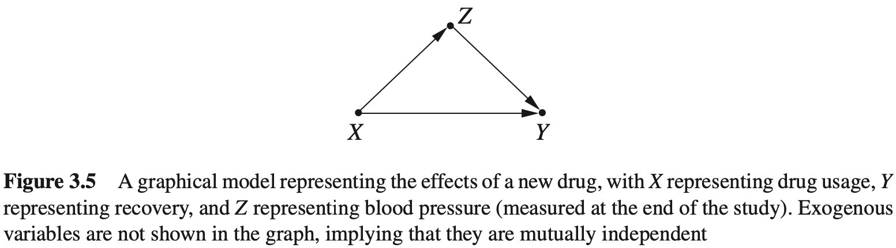

在这种条件下，干预后的图与原始图相同（没有箭头被删除），校正公式归约为

$$
P(Y=y\mid do(X=x))=P(Y=y\mid X=x)
$$

这个式子可以将校正公式的校正变量设为空集得到。显然，如果试图校正血压对于结果的影响（对应的模型是血压引发人们服药），我们会得到一个不正确的估计。

#### 3.2.1 校正还是不校正

我们现在需要确定，哪个变量或哪组变量最可以合理地用于校正公式中。导出校正公式的干预过程说明， $Z$ 应与 $X$ 的父节点一致。因为当通过外部操作固定 $X$ 的值时，我们消除的是这些父节点的影响。将 $X$ 的父节点记作 $PA(X)$ ，可以得到一般化的校正公式，并将其总结为下面这条规律：

**规则 3.2.1（因果效应规则）** 给定一个图 $G$ ，设变量 $X$ 的父节点集合为 $PA$ ，则 $X$ 对 $Y$ 的因果效应为：

$$
P(Y=y\mid do(X=x))=\sum_zP(Y=y\mid X=x,PA=z)P(PA=z)\tag{3.6}
$$

其中， $z$ 的取值范围是 $PA$ 中变量可能取值的所有组合。

如果将式（3.6）求和公式乘以概率 $P(X=x\mid PA=z)$ ，再除以这个概率，这样可以得到以联合概率表示的形式：

$$
P(y\mid do(x))=\sum_z\frac{P(X=x,Y=y,PA=z)}{P(X=x\mid PA=z)}\tag{3.7}
$$

式（3.7）明确显示了 $X$ 的父节点在预测干预结果中所起的作用。因素 $P(X=x\mid PA=z)$ 被称为倾向分数，第 3.5 节将讨论 $P(y\mid do(x))$ 这种表达式的优点。

现在，我们了解了因果图在解决辛普森悖论中的作用。更一般地，利用图即可单纯地从统计数据中预测因果关系。根据图来确定 $X$ 的父节点，在不进行试验的条件下，这一组变量足够用来确定 $X$ 的值或值的概率。

使用图及其基本假设，能够在纯观测数据中识别出因果关系，这是令人吃惊的。但是，基于前面的讨论，读者可能会认为图的作用是相当有限的，一旦识别出了 $X$ 的父节点，即可应用校正公式刻板地评估因果效应，图剩下的部分就可以被舍弃了。在下一节将看到事情可能并不是这么简单，在大多数实际的例子中， $X$ 的父节点集合会包含不可观测的变量，这使我们无法计算校正公式中的条件概率。幸运的是，我们将在后续章节中看到，可以对模型中的其他变量进行校正，从而代替 $PA(X)$ 中不可观测的变量。

#### 思考题

#### 3.2.1

参考思考题 1.5.2（图 1.10）及其中列出的参数。

(a) 通过对模型进行模拟干预 $do(x)$ ，对 $X$ 和 $Y$ 所有的值计算 $P(y\mid do(x))$ 。

(b) 用校正公式(3.5)，对 $X$ 和 $Y$ 所有的值计算 $P(Y\mid do(x))$ 。

(c) 计算平均因果效应： $ACE=P(y_1\mid do(x_1))-P(y_1\mid do(x_0))$ ，并与风险差（risk difference，RD）比较： $RD=P(y_1|x_1)−P(y_1|x_0)$ 。ACE和RD有什么不同，哪个参数的值可能使两者的差异最小化？

(d) 找到一个参数组合，使这个例子变成辛普森悖论（正如思考题1.5.2(c)一样），并解释药物的总体因果效应可以从分类数据中获得。

#### 3.2.2 多重干预和截断乘积规则

在推导校正公式时，假设仅对单个变量 $X$ 进行干预，使 $X$ 不与其父节点连接，以模拟干预后 $X$ 不受影响的情形。有关社会和医疗政策决策问题偶尔会涉及多重干预措施，例如同时指定几个变量的值，或者控制一个变量随时间而变。为了表示多重干预，可以使用在 1.5.2 节讨论的方法，简单地对图模型产生的联合分布进行乘积分解。根据乘积分解法则，图 3.3 中的模型在干预前的分布可用乘积的形式给出：

$$
P(x,y,z)=P(z)P(x\mid z)P(y\mid x,z)\tag{3.8}
$$

而干预后的分布由图 3.4 的模型确定，以乘积的形式表示为

$$
P(z,y\mid do(z))=P_m(z)P_m(y\mid x,z)=P(z)P(y\mid x,z)\tag{3.9}
$$

在这个公式中，由于固定 $X=x$ 后， $X$ 无父节点了，因此从乘积中删除了因子 $P(x)$ 。这与校正公式一致，因为在评估 $P(y\mid do(x))$ 时，需要对 $z$ 求和，所以校正公式为

$$
P(y\mid do(x))=\sum_zP(z)P(y\mid x,z)
$$

这与式（3.5）一致。

这也启发我们将校正公式推广到多重干预，即将一组变量 $X$ 的值固定为常数的干预，简单写下干预前分布的乘积分解，并且删去与干预集 $X$ 中的变量相对应的所有因素，有

$$
P(x_1,x_2,\dots,x_n\mid do(x))=\prod_iP(x_i\mid pa_i)\quad\text{( $i$ 取所有不在 $X$ 中的 $X_i$ )}
$$

这被称为截断公式或g-公式。为了说明，假设干预如图2.9所示的模型，将 $X$ 设置为 $x$ ， $Z_3$ 设置为常数 $z_3$ ，则干预后模型中其他变量的分布为

$$
P(z_1,x_2,w,y\mid do(X=x,Z_3=x_3))=P(z_1)P(z_2)P(w\mid x)P(y\mid w,z_3,z_2)
$$

其中，从乘积公式中删除了因子 $P(x\mid z_1,x_3)$ 和 $P(z_3\mid z_1,z_2)$ 。

有趣的是，结合式（3.8）和式（3.9），得到干预前和干预后分布之间的简单关系为

$$
P(z,y\mid do(x))=\frac{P(x,y,z)}{P(x\mid z)}\tag{3.10}
$$

它告诉我们，为了预测在分布 $P(x,y,z)$ 下非试验数据对 $X$ 干预的效果，我们仅需要知道所有的条件概率 $P(x\mid z)$ 即可。

### 3.3 后门准则

根据3.2节讨论可以得到结论：当试图确定一个变量对另一个变量的因果效应时，可以对该变量的父节点变量进行校正。但我们知道或者相信变量通常有不可观察的父节点，即虽然该父节点在途中表现出来了，但是节点的值却无法得到。在这些情况下，需要找到一个替代的变量集合用于校正。

这一定困境引发了一个更深层次的统计问题：在什么条件下，因果关系允许我们从被动观察得到的非干预数据中计算一个变量对另一个变量的因果效应呢？既然我们已经决定用图的方法表示因果关系，那么这个问题就变为一个图论问题：在什么条件下，因果图结构足以用来计算给定数据的因果效应？

这个问题的答案很长，也很重要，我们将用本章剩下的内容来说明。实际上，用于计算因果效应的一个非常重要的工具就是一个简单的准则——后门准则。使用后门准则可以确定，对于由有向无环图表示的因果模型中的任何两个变量 $X$ 和 $Y$ ，应该以模型中的某些变量 $Z$ 为条件来寻找 $X$ 与 $Y$ 之间的因果关系。

**定义 3.3.1（后门准则）** 给定有向无环图中的一对有序变量 $(X, Y)$ 。如果变量集合 $Z$ 满足： $Z$ 中没有 $X$ 的后代节点，且 $Z$ 阻断了 $X$ 与 $Y$ 之间的每条含有指向 $X$ 的路径，则称 $Z$ 满足关于 $(X, Y)$ 的后门准则。

如果变量集合 $Z$ 满足 $(X, Y)$ 的后门准则，那么 $X$ 对 $Y$ 的因果效应可以由以下公式计算：

$$
P(Y=y\mid do(X=x))=\sum_zP(Y=y\mid X=x,Z=z)P(Z=z)
$$

这类似于前面 3.2 节对 $PA(X)$ 做的校正（注意： $PA(X)$ 总是满足后门准则）。

后门准则背后的逻辑很明确，一般来说，我们希望以这样的节点集合 $Z$ 为条件：

1. 阻断 $X$ 和 $Y$ 之间的所有伪路径，
2. 保持所有从 $X$ 到 $Y$ 的有向路径不变，
3. 不会产生新的伪路径。

当试图寻找 $X$ 对 $Y$ 的因果效应时，希望被纳入条件的节点能阻断任何含有指向 $X$ 的“后门”路径，这样的路径可能使 $X$ 和 $Y$ 相关但并不传递 $X$ 产生的因果效应。如果不阻断它们，它们会混淆 $X$ 对 $Y$ 的效应。因此，应该以阻断后门路径为条件，以满足第一个要求。然而，并不会以 $X$ 的任何后代节点为条件，因为对 $X$ 的干预会影响 $X$ 的后代节点，从而影响 $Y$ ，以 $X$ 的后代为条件可能会阻断这些路径。因此，不以 $X$ 的后代节点为条件就符合第二个要求。最后，为了遵守第三个要求，应该避免以任何对撞节点为条件，否则会解除阻断，从而产生 $X$ 与 $Y$ 之间的一条新路径。排除 $X$ 后代节点的要求也能避免以 $X$ 和 $Y$ 之间共同节点的后代节点为条件（例如，图2.4中的对撞节点 $W$ ），以这些后代节点为条件会干扰因果关系在 $X$ 和 $Y$ 之间的传递，正如以它们的父节点为条件时那样。

下面以图3.6所示的具体案例为例，说明这些要求在实际应用中的含义。

这⾥，试图获取药物（ $K$ ）对痊愈率（ $Y$ ）的因果效应，同时还测量了对痊愈率有影响的体重 $W$ 。此外，我们知道经济社会地位（ $Z$ ）同时影响患者体重和患者对接受治疗的选择，但是在这个研究中并没有关于经济社会地位的统计数据。

我们搜索满足从 $X$ 到 $Y$ 后门准则的观察变量。观察图 3.6 可发现：节点 $W$ （⾮ $X$ 的后代）阻断后门路径 $X\leftarrow Z\to W\to Y$ 。因此， $W$ 满足后门准则。只要因果关系符合如图3.6所示的图模型，校正 $W$ 都会得到 $X$ 对 $Y$ 的因果效应，使用校正公式，有

$$
P(Y=y\mid do(X=x))=\sum_wP(Y=y\mid X=x,W=w)P(W=w)
$$

只要 $W$ 是可观测的，上述求和式就可以通过观察数据估算出来。

在后门准则的帮助下，读者可以轻松地应用算法为一个追切关注的政策问题寻找答案，即使该问题的图型很复杂。考虑如图2.8所示的模型，再次假设我们希望评估 $X$ 对 $Y$ 的因果效应。那么应该以什么变量为条件来得到正确的效应呢？这个问题可以归结为找到一组满足后门准则的变量集合。图2.8的模型中没有从 $X$ 到 $Y$ 的后门路径，那么问题的答案就很简单了：空集即满足准则，因此不需要校正。答案是

$$
P(y\mid do(x))=P(y\mid x)
$$

但是，如果对 $W$ 进行了校正，能够得到 $X$ 对 $Y$ 的因果效应的正确结果吗？由于 $W$ 是对撞节点，因此以 $W$ 为条件将打开路径 $W\leftarrow Z\leftarrow T\to Y$ ，该路径不是从 $X$ 到 $Y$ 的因果路径，它是伪路径。打开这条路径将产生偏差并导致错误的答案。这意味着对 $W$ 的每一个值分别计算 $X$ 和 $Y$ 的关联性不会得到 $X$ 对 $Y$ 的正确因果效应，甚至对于 $W$ 的每一个值计算 $X$ 和 $Y$ 的关联性也是错误的。

那么当指定 $W$ 为一个确定值 $w$ 时，如何计算 $X$ 对 $Y$ 的因果效应呢？例如，在图 2.8 中， $W$ 可以表示患者治疗后的疼痛水平，我们可能感兴趣的是仅在那些没有遭受任何疼痛的患者中评估 $X$ 对 $Y$ 的效应。指定 $W$ 的值相当于以 $W=w$ 为条件，这样正如之前所说的，由于 $W$ 是对撞节点，因此会打开一条从 $X$ 到 $Y$ 的伪路径。

答案是，可以选择使用其他变量来阻断这条路径。例如，如果以 $T$ 为条件，即使 $W$ 是条件集的一部分，仍可阻断伪路径 $X\to W\leftarrow T\to Y$ 。因此，为了计算 w-特定因果效应 $P(y\mid do(x), w)$ ，可以对 $T$ 进行校正，获得

$$
\begin{aligned}
&P(Y=y\mid do(X=x), W=w)\\
=&\sum_tP(Y=y\mid X=x,W=w,T=t)P(T=t\mid X=x,W=w)
\end{aligned}\tag{3.11}
$$

计算这样的 W-特定因果效应是检验效应受某个变量调节的关键步骤，即 $X$ 对 $Y$ 的因果效应依据 $W$ 值的变化而改变的程度。再来考虑如图3.6所示的图模型，假设希望对某个个体，测试 $W=w$ 时与 $W=w'$ 时的因果效应是否相同（ $W$ 可表示任何预处理变量，例如年龄、性别）。这个问题需要计算两个因果效应，即

$$
P(Y=y\mid do(X=x), W=w)\quad\text{与}\quad P(Y=y\mid do(X=x),W=w')
$$

在图 3.6 中，因为 $W$ 是满足后门准则的节点，所以这个答案很简单。只需要比较 $P(Y=y\mid X=x,W=w)$ 和 $P(Y=y\mid X=x,W=w')$ 的提奥见概率就可以了，不需要进行求和运算。在更一般的情况下，单独的 $W$ 通常不满足后门准则，然而一个更大的集合，如 $T\cup W$ ，可以满足后门准则，因此需要对 $T$ 的成员进行校正，这就产生了式（3.11）。我们将在3.5节继续讨论。

从前面介绍的各个例子中，读者可能会产生我们应该避免校正对撞节点的印象。但是有的时候，如图3.7所示，这样的校正是不可避免的。在图3.7中，从 $X$ 到 $Y$ 有四条后门路径，并且它们都经过 $Z$ 节点，其中 $Z$ 节点在路径 $X\leftarrow E\to Z\leftarrow A\to Y$ 中是一个对撞节点。以 $Z$ 为条件会导致这条路径连通，从而违反了后门准则。要阻断所有的后门路径，需要以下面条合中的一个为条件： $\{E,Z\}$ , $\{A,Z\}$ 或 $\{E,Z,A\}$ 。每一个集合都包括节点 $Z$ 。因此，要得到 $X$ 对 $Y$ 的因果效应的无偏向估计，对撞节点 $Z$ 必须存在于校正集合中。

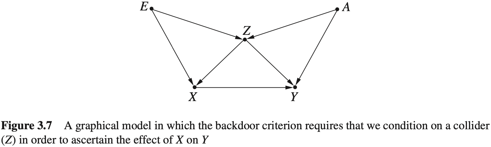

后门准则还有其他一些好处。考虑 $P(Y=y\mid do(X=x))$ 是自然存在的试验这一事实，而不是我们计算分析得到的附带结果，这意味着关于 $P(Y=y\mid do(X=x))$ ，对任何适当的校正变量或变量集合，无论它是 $PA(X)$ 还是符合后门准则的任何共他集合，计算的结果都必须是相同的。在这种情况下，以图3.6为例，这意味着若

$$
\sum_wP(Y=y\mid X=x,W=w)P(W=w)=\sum_zP(Y=y\mid X=x,Z=z)P(Z=z)
$$

这个等式具有两个用处。首先，当拥有多个观测到的、可供校正的变量集时（例如图3.6中，如果 $W$ 和 $Z$ 都已经被观测到），等式可为校正变量提供选择。这种选择非常有用，特别是考虑若干现实原因，例如，也许其中一组变量的观测成本比其他变量高，或者更容易出现人为的错误，或者因为这个变量集合拥有更多变量导致难以计算等。

其次，当所有校正变量都可观测时，这个等式在数据上提供了一个可衡试的约束，这很像d-分离准则。如果构建了一个模型，这个模型能够推断出上述的等式，但是与实际数据不相符，那么就可以舍弃这个模型。

#### 思考题

#### 3.3.1

考虑如图3.8所示的图模型。

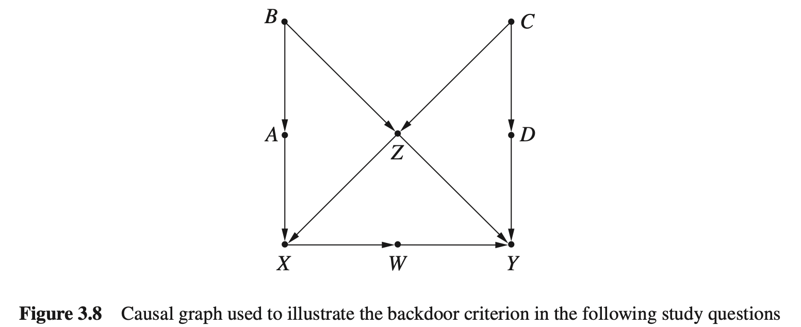

(a) 列出所有满足后门准则的变量集合，以确定 $X$ 对 $Y$ 的因果效应。

(b) 列出所有满足后门准则的最小变量集合，以确定 $X$ 对 $Y$ 的因果效应（即，对于任何一个变量集合，如果从集合中移除任何一个变量，它将不再满足后门准则）。

(c) 为了识别 $D$ 对 $Y$ 的因果效应，列出需要控制的最小变量集合。如果要识别 $\{W,D\}$ 对 $Y$ 的因果效应，重新回答该问题。

#### 3.3.2(洛德悖论)

在学年初，某寄宿学校为学生提供两种用餐方案：方案 $A$ 和方案 $B$ 。在年初和年终会记录学生的体重。为了确定每个方案如何影响学生的体重，学校雇用了两位统计学家，但他们奇怪地得出了不同的结论。第一个统计学家计算每个学生在 6 月（ $W_F$ ）和 9 月（ $W_I$ ）之间的体重差异，发现每个方案的平均增重都为零。

第二个统计学家将学生分为几组，每组对应一个相同的初始体重。他发现相对于初始体重，方案B的最终（平均）体重要高于方案A的最终（平均）体重。

因此，第一个统计学家认为饮食对增重设有影响，第二个统计学家则得出结论：有影响。

图3.9展示了一个能导致两个统计学家得出矛盾结论的数据架，其中横轴表示学生初始体重，纵轴表示学生最终体重。统计学家1检验了体重增量 $W_F-W_I$ ，对于每一个学生，该增量由图中点到45°线的垂直距离表示。确实，这两个组分别关于零增重线（ $W_F=W_I$ ）对称，因此每种饮食方案的平均增量是零。另一方面，统计学家2比较了起初相同体重 $W_0$ 的学生在方案 $A$ 的最终体重和方案 $B$ 的最终体重，正如图3.9中竖直线所示：沿着这条竖直线，方案 $B$ 学生的平均最终体重高于方案 $A$ 学生的平均最终体重。无论选取哪条竖直线 $W_0$ ，结果都一样。

(a) 给出一个表示题目中情况的因果图。

(b) 确定那个统计学家是正确的。

(c) 这个例子郁辛普森悖论有什么关系？

#### 3.3.3

重温思考题 1.2.4 的棒棒糖故事，并回答以下问题。

(a) 给出一个刻画该故事的因果图。

(b) 应用后门准则确定必须校正哪些变量。

(c) 写出药物对恢复效果的校正公式。

(d) 假设护士在研究结束第二天给了棒棒糖，相比于接受安慰剂的患者，护士仍然优先选择接受治疗的患者。在此情形下，重新回答同题 (a) ~ (c)。

### 3.4 前门准则

当试图通过非实验数据来估计因果效应时，后门准则为我们提供了一种简单的方式来识别需要校验的变量集合。然而，并不是所有的因果效应估计问题都可以通过这种方法来解决。do-操作还可以应用于一些不满足后门准则的图模式，已确定哪些初看似乎无法求解的因果效应，本节将讨论这样的一种模式，即前门。

考虑一个世纪性争论案例，关于吸烟与肺癌之间的关系。在1870年前，烟草业积极宣扬一种理论，即吸烟与肺癌之间观察到的相关性，可以由某种嗜好尼古丁的致癌基因给出解释，从而阻止反吸烟立法。

描述该案列的图模型如图3.10(a)所示。该模型不符合后门准则，因为变量 $U$ 是未观测到的，因此不能阻断从 $X$ 到 $Y$ 的后门路径。吸烟对肺癌的因果效应在这个模型中是不可识别的；人们永远都不能确定 $X$ 和 $Y$ 之间观察到的相关性中哪一部分是虚假的，即可归因为他们的共同效应 $U$ ，哪一部分是真正的原因。然而，我们观察到，即使在这种情况下，为了完全解释 $X$ 和 $Y$ 之间观察到的关联关系，对于 $U$ 和 $X$ 以及 $U$ 和 $Y$ 之间的(未观测的)关联性所必须达到的量化强度，人们还是做了很多令人信服的研究。

通过思考如图 3.10(b)所示的图模型来做更深层的探究。在图 3.10(b)中，有一个额外的可观测的变量：患者肺部焦油的含量。这个模型不满足后门则，因为仍然没有变量能够阻断 $X \leftarrow U \rightarrow Y$ 这条协路径。然而，我们发现在这个模型中，因果效应 $P(Y=y\mid do(X=x))$ 可以通过连续两次应用后门准则来识别。

如何通过中介变量 $Z$ 来评估 $X$ 对 $Y$ 的因果效应呢？该问题的回答绝不是无关紧要的，正如下述量化的例子所示，它可能会引发极大的争议。

假设有一个严谨的研究，该研究中随机选择了 80 万名受试者来同时测量以下因素。这些受试者被认为具有非常高的癌症风险（由于吸烟、石棉、氮等环境暴露因素）。

1. 受试者是否吸烟。
2. 受试者肺重的焦油量。
3. 受试者是否被检测到肺癌。

表3.1展示了本研究的数据。为简单起见，假定三个变量为布尔型变量。

表 3.1 一个样本随机选择的假设数据集

<table border=0 cellpadding=0 cellspacing=0 width=696 style='border-collapse:
 collapse;table-layout:fixed;width:520pt'>
 <col width=87 span=8 style='width:65pt'>
 <tr height=21 style='height:16.0pt'>
  <td colspan=2 rowspan=3 height=63 class=xl65 width=174 style='height:48.0pt;
  width:130pt'>患病情况</td>
  <td colspan=2 class=xl65 width=174 style='width:130pt'>有焦油</td>
  <td colspan=2 class=xl65 width=174 style='width:130pt'>无焦油</td>
  <td colspan=2 class=xl65 width=174 style='width:130pt'>合计</td>
 </tr>
 <tr height=21 style='height:16.0pt'>
  <td height=21 class=xl63 style='height:16.0pt'>吸烟者</td>
  <td class=xl63>不吸烟者</td>
  <td class=xl63>吸烟者</td>
  <td class=xl63>不吸烟者</td>
  <td class=xl63>吸烟者</td>
  <td class=xl63>不吸烟者</td>
 </tr>
 <tr height=21 style='height:16.0pt'>
  <td height=21 class=xl64 style='height:16.0pt'>380</td>
  <td class=xl64>20</td>
  <td class=xl64>20</td>
  <td class=xl64>380</td>
  <td class=xl64>400</td>
  <td class=xl64>400</td>
 </tr>
 <tr height=21 style='height:16.0pt'>
  <td rowspan=2 height=42 class=xl65 style='height:32.0pt'>无癌症</td>
  <td class=xl63>人数</td>
  <td class=xl64>323</td>
  <td class=xl64>1</td>
  <td class=xl64>18</td>
  <td class=xl64>38</td>
  <td class=xl64>341</td>
  <td class=xl64>39</td>
 </tr>
 <tr height=21 style='height:16.0pt'>
  <td height=21 class=xl63 style='height:16.0pt'>比例/%</td>
  <td class=xl64>85</td>
  <td class=xl64>5</td>
  <td class=xl64>90</td>
  <td class=xl64>10</td>
  <td class=xl64>85.25</td>
  <td class=xl64>9.75</td>
 </tr>
 <tr height=21 style='height:16.0pt'>
  <td rowspan=2 height=42 class=xl65 style='height:32.0pt'>患癌症</td>
  <td class=xl63>人数</td>
  <td class=xl64>57</td>
  <td class=xl64>19</td>
  <td class=xl64>2</td>
  <td class=xl64>342</td>
  <td class=xl64>59</td>
  <td class=xl64>361</td>
 </tr>
 <tr height=21 style='height:16.0pt'>
  <td height=21 class=xl63 style='height:16.0pt'>比例/%</td>
  <td class=xl64>15</td>
  <td class=xl64>95</td>
  <td class=xl64>10</td>
  <td class=xl64>90</td>
  <td class=xl64>14.75</td>
  <td class=xl64>90.25</td>
 </tr>
 <![if supportMisalignedColumns]>
 <tr height=0 style='display:none'>
  <td width=87 style='width:65pt'></td>
  <td width=87 style='width:65pt'></td>
  <td width=87 style='width:65pt'></td>
  <td width=87 style='width:65pt'></td>
  <td width=87 style='width:65pt'></td>
  <td width=87 style='width:65pt'></td>
  <td width=87 style='width:65pt'></td>
  <td width=87 style='width:65pt'></td>
 </tr>
 <![endif]>
</table>

从这些数据中可以得出两个相反的结论。烟草业辩称该表证明了吸烟的有益效果。他们指出，只有 14.75% 的吸烟者得了肺癌，而不吸烟者为 90.25%。此外，在有焦油和无焦油两个分组中，吸烟者比不吸烟者显示出了更低的癌症患病比例。这些数字显然与经验观察相反，但这也正好说明了我们的观点：观察是不可信的。

**注：** 此处的描述当中，作者显然已经带着吸烟会导致肺癌的先验知识再进行的论述/实验。

然而，反对吸烟者则辩称该表讲述了一个完全不同的故事，即吸烟确实增加而不是降低了一个人的肺癌风险。他们的论点是：如果你选择吸烟，那么你有 95%（380/400）的概率出现焦油沉积；如果选择不抽烟，则概率仅为 5%（20/400）。为了评估焦油沉积对肺癌的影响，对样本重新分组为吸烟者和不吸烟者两组，如表 3.2 所示。

表3.2 重新组织表 3.1 的数据，展示了每个吸烟-焦油分组中的癌症比例

<table border=0 cellpadding=0 cellspacing=0 width=696 style='border-collapse:
 collapse;table-layout:fixed;width:520pt'>
 <col width=87 span=8 style='width:65pt'>
 <tr height=21 style='height:16.0pt'>
  <td colspan=2 rowspan=3 height=63 class=xl63 width=174 style='height:48.0pt;
  width:130pt'>患病情况</td>
  <td colspan=2 class=xl63 width=174 style='width:130pt'>吸烟者</td>
  <td colspan=2 class=xl63 width=174 style='width:130pt'>不吸烟者</td>
  <td colspan=2 class=xl63 width=174 style='width:130pt'>合计</td>
 </tr>
 <tr height=21 style='height:16.0pt'>
  <td height=21 style='height:16.0pt'>有焦油</td>
  <td>无焦油</td>
  <td>有焦油</td>
  <td>无焦油</td>
  <td>有焦油</td>
  <td>无焦油</td>
 </tr>
 <tr height=21 style='height:16.0pt'>
  <td height=21 align=right style='height:16.0pt'>380</td>
  <td align=right>20</td>
  <td align=right>20</td>
  <td align=right>380</td>
  <td align=right>400</td>
  <td align=right>400</td>
 </tr>
 <tr height=21 style='height:16.0pt'>
  <td rowspan=2 height=42 class=xl63 style='height:32.0pt'>无癌症</td>
  <td>人数</td>
  <td align=right>323</td>
  <td align=right>18</td>
  <td align=right>1</td>
  <td align=right>38</td>
  <td align=right>324</td>
  <td align=right>56</td>
 </tr>
 <tr height=21 style='height:16.0pt'>
  <td height=21 style='height:16.0pt'>比例/%</td>
  <td align=right>85</td>
  <td align=right>90</td>
  <td align=right>5</td>
  <td align=right>10</td>
  <td align=right>81</td>
  <td align=right>14</td>
 </tr>
 <tr height=21 style='height:16.0pt'>
  <td rowspan=2 height=42 class=xl63 style='height:32.0pt'>患癌症</td>
  <td>人数</td>
  <td align=right>57</td>
  <td align=right>2</td>
  <td align=right>19</td>
  <td align=right>342</td>
  <td align=right>76</td>
  <td align=right>344</td>
 </tr>
 <tr height=21 style='height:16.0pt'>
  <td height=21 style='height:16.0pt'>比例/%</td>
  <td align=right>15</td>
  <td align=right>10</td>
  <td align=right>95</td>
  <td align=right>90</td>
  <td align=right>19</td>
  <td align=right>86</td>
 </tr>
 <![if supportMisalignedColumns]>
 <tr height=0 style='display:none'>
  <td width=87 style='width:65pt'></td>
  <td width=87 style='width:65pt'></td>
  <td width=87 style='width:65pt'></td>
  <td width=87 style='width:65pt'></td>
  <td width=87 style='width:65pt'></td>
  <td width=87 style='width:65pt'></td>
  <td width=87 style='width:65pt'></td>
  <td width=87 style='width:65pt'></td>
 </tr>
 <![endif]>
</table>

似乎焦油沉积在两组中都是有害影响：在吸烟组中，它将癌症比例从 10% 提升到了 15% ，在不吸烟组中，它将癌症比例从 90% 提升到了 95% 。因此，无论是否对尼古丁有嗜好，都应该避免焦油沉积的有害影响，而不吸烟是避免这种情况的非常有效的方法。图3.10(b)使我们能够在这两组统计结论中做出决定。首先， $X$ 对 $Z$ 的因果效应是可识别的，这是因为没有从 $X$ 到 $Z$ 的后门路径。因此，可以立即得到

$$
P(Z=z\mid do(X=x))=P(Z=z\mid X=x)\tag{3.12}
$$

接下来， $Z$ 对 $Y$ 的因果效应也是能够识别的，因为从 $Z$ 到 $Y$ 的后门路径 $Z\leftarrow X\leftarrow U\to Y$ ，通过以 $X$ 为条件来阻断。因此，有

$$
P(Y=y\mid do(Z=z))=\sum_xP(Y=y\mid Z=z,X=x)P(X=x)\tag{3.13}
$$

式（3.12）和式（3.13）都是通过校正公式获得的，第一个以空集为条件，第二个对 $X$ 进行校正。

现在要把这两部分效应连接起来，以获得 $X$ 对 $Y$ 的整体因果效应。推理如下：如果选择固定 $Z$ 的值为 $z$ ，则 $Y$ 的概率为 $P(Y\mid do(Z=z))$ 。但考虑选择将 $X$ 设置为 $x$ ，那么选择固定 $Z$ 值为 $z$ 的概率为 $P(Z=z\mid do(X = x))$ 。对 $Z$ 的所有可能取值 $z$ 求和，可以得到：

$$
P(Y=y\mid do(X=x))=\sum_zP(Y=y\mid do(Z=z))P(Z=z\mid do(X=x))\tag{3.14}
$$

式（3.14）的右边部分可以由式（3.12）和式（3.13）来评估，替换后可得到 $P(Y=y\mid do(X=x))$ 的无do-操作的表达式。我们要区分出现在式（3.12）中的 $z$ 和出现在式（3.13）中的 $z$ ，后者仅用于求和的索引，（为区分二者）也可以表示为 $x'$ 。因此，得到最终表达式为：

$$
\begin{aligned}
&P(Y=y\mid do(X=x))\\
&=\sum_z\sum_xP(Y=y\mid Z=z,X=x')P(X=x')P(Z=z\mid X=x)
\end{aligned}\tag{3.15}
$$

式（3.15）称为前门公式。

将式（3.15）应用于表3.1的数据可发现，烟草业的观点是错误的；焦油沉积产生有害的影响，它们会使肺癌更可能发生，而吸烟通过增加焦油沉积而增加了产生这种危害的可能。

表3.1中的数据虽然不是真实的，而是刻意设计出来的，目的是为了阐明对观测数据进行简单因果分析时可能得出的违背直觉的结论，这可能会让读者感到惊讶。在现实中，我们期望通过观察性研究能够显示吸烟与肺癌之间的正相关性，那么式（3.15）的估计就可以用于验证和量化吸烟对肺癌的有害影响。

前面的分析可以推广到具有多条从 $X$ 到 $Y$ 路径的图结构。

**定义 3.4.1（前门）** 变量集合 $Z$ 被称为满足关于有序变量对 $(X,Y)$ 的前门准则，如果：

1.  $Z$ 切断了所有 $X$ 到 $Y$ 的有向路径，

2.  $X$ 到 $Z$ 没有后门路径；

3.  所有 $Z$ 到 $Y$ 的后门路径都被 $X$ 阻断。

**定理 3.4.1（前门校正）** 如果 $Z$ 满足变量对 $(X, Y)$ 的前门准则，且 $P(x,z)>0$ ，那么 $X$ 对 $Y$ 的因果效应是可识别的，并由下式计算：

$$
P(Y=y\mid do(x))=\sum_zP(z\mid x)\sum_{x'}P(y\mid x',z)P(x')\tag{3.16}
$$

定义3.4.1中规定的条件过于保守了；条件2和3排除了一些（从 $Z$ 到 $Y$ 的）可能被其他变量阻断的后门路径，但实际上这也是允许的。有一个被称为“do-演算”的强大工具可以实现这种复杂结构的分析。事实上，do-演算可以揭示给定图结构中能够被识别的所有因果效应。该工具的讨论超出了本书的范畴（详见 Tian et al., 2002; Shpitser et al., 2008; Pearl, 2009; Bareinboim et al., 2012），但是结合校正公式、后门准则和前门准则，已经涵盖了许多场景。这证明了因果图的作用不仅体现在表示因果信息方面，更是在发现因果关系方面具有强大甚至是指导性的能力。

#### 思考题

#### 3.4.1

假设在图3.8中只能测量 $X$ ， $Y$ 和一个附加变量。那个变量可用于确定 $X$ 对 $Y$ 的因果效应？请找出并计算 $X$ 对 $Y$ 的因果效应。

#### 3.4.2

假设你去一家药店买一种药，发现不同价格的两个品种：一种标价为1美元，另一种标价为10美元。你问店员：“有什么区别？”店员说：“10美元那瓶是新进的，而1美元那瓶已经在货架上3年了。但是，数据显示，买便宜药的人有更高的痊愈率。很神奇吧？”你追问这些陈旧的药物是否经过测试。店员说：“是的，这甚至更神奇，95%的陈旧药物失去了活性成分，而仅有5%的新进药物失去了活性成分，但那些购买旧药的患者仍然比那些购买了新药的患者的痊愈率高。”

在买陈旧的药物之前，你出于好奇看了一下数据。数据记录了购买信息，包括购买的药物类型（陈旧或新进）、药物活性成分浓度（高或低）、顾客是否从疾病中痊愈等。数据完美地证实了店员的说法。但是经过一番额外的计算后，你还是决定购买昂贵的新药，甚至没有测试它的活性成分。你确认新药会为普通皮肤者提供更高的痊愈率。

基于两个非常合理的假设，数据明确地表明新药更加有效，这两个假设如下：

1. 顾客不知道他们要买的药中化学成分，他们的选择仅受价格和上架时问影响；
2. 药物对任何个体的疗效仅取决于它的化学成分，而不是上架时间（新进或陈旧）。

​	(a) 确定问题的相关变量，并以一个因果图来描述该问题。

​	(b) 构建与题干适配的数据集。

​	(c) 使用假设1和2及问题(b)的数据，确定选样新进药物相比于陈旧药物的效果。

### 3.5 条件干预和特定变量效应

迄今为止所讨论的干预仅仅限于固定一个变量或一组变量 $X$ ，并且只取一些特定的值。一般而言，干预是动态的，即变量 $X$ 以指定的方式响应其他变量 $Z$ ，例如，通过函数关系 $x=g(z)$ 或通过一种随机关系，其中 $X$ 依据 $P^*(x|z)$ 的概率取 $x$ 。例如，医生仅对体重 $Z$ 超过特定水平 $(Z = z)$ 的患者使用药物。在这种情况下，干预以 $Z$ 的取值作为条件，可以写为 $do(X = f(Z))$ 。其中当 $Z>z$ 时， $g(Z)=1$ ，否则为0（其中 $X=0$ 表示不使用药物）。由于 $Z$ 是一个随机变量，所以追随 $Z$ 变化的 $X$ 的预期取值也类似于随机变量。这种情况下的结果可以写作概率分布 $P(Y=y\mid do(X=g(Z)))$ ，其取决于函数 $g$ 和驱动 $X$ 的变量集合 $Z$ 。

为了估计这种干预的效应，要借助另一个概念—— $X$ 的“z-特定效应”，在3.3节中简单介绍过这个效应，类似于式（3.11），写作 $P(Y=y\mid do(X = x),Z=z)$ ，它度量了 $Y$ 在总体的一个子集中的分布，该子集合在干预后 $Z$ 的取值为 $z$ ，例如，我们可能会感兴趣于治疗方案如何影响特定年龄组 $(Z=z)$ ，或治疗后调整的具有特定特征 $(Z=z)$ 的患者。

z-特定效应可以通过类似于后门校正的方法来获得。推理如下：当要估计 $P(Y=y\mid do(X=x))$ 时，如果存在集合 $S$ 阻断了 $X$ 到 $Y$ 的所有后门路径，则对 $S$ 进行校正。现在希望计算 $P(Y=y\mid do(X=x),Z=z)$ ，需要确保当添加另一个变量 $Z$ 到条件集时，这些后门路径仍然是阻断的。这产生了计算z-特定效应的一个简单规则。

**规则 3.5.1** 如果可以找到可测变量集合 $S$ ，使集合 $S\cup Z$ 满足后门准则，则z-特定效应 $P(Y=y\mid do(X-x),Z=z)$ 即可确定。此时，z-特定效应可以由以下校正公式获得：

$$
\begin{aligned}
&P(Y=y\mid do(X=x), Z=z)\\
=&\sum_zP(Y=y\mid X=x,S=s,Z=z)P(S=s\mid Z=z)
\end{aligned}
$$

这个修改后的校正公式非常接近于式（3.5），但是仍然有两点不同：首先，校正集合是 $S\cup Z$ ，而不仅仅是 $S$ ；第二，只需对的每个取值求和，不需要包括 $Z$ 。表达式 $S\cup Z$ 中的 $U$ 符号表示集合加法（或并），这意味着如果 $Z$ 是 $S$ 的子集，则有 $S\cup Z=S$ 且仅需 $S$ 满足后门标准。

要注意的是，z-特定效应的可计算准则比非特定效应的准则更严苛，把 $Z$ 添加到条件集中可能会产生变量依赖，进而阻碍后门路径的阻断。举个简单的例子，当变量 $Z$ 是一个对撞节点时，以 $Z$ 为条件会在 $Z$ 的父节点之间产生新的依赖关系，可能因此违背后门准则。

现在我们可以处理最初的条件干预估计了。假设一个政策制定者考虑一个与年龄相关的政策，其中分配给忠者的药物量依赖于他们的年龄 $Z$ 。写作 $do(X=g(Z))$ 。为了找出由这一个政策产生的结果 $Y$ 的分布，尝试估计 $P(Y=y\mid do(X=g(Z)))$ 。

现在我们展示确定政策的效应等价于计算z-特定效应 $P(Y=y|do(X=x),Z=z)$ 的值。

要计算 $P(Y=y\mid do(X=g(Z))$ ，我们以 $Z=z$ 为条件，有

$$
\begin{aligned}
P(Y=y\mid do(X=g(Z)))&=\sum_zP(Y=y\mid do(X=g(Z)),Z=z)\cdot P(Z=z\mid do(X=g(Z)))\\
&=\sum_zP(Y=y\mid do(X=g(z)),Z=z)P(Z=z)
\end{aligned}\tag{3.17}
$$

因为 $Z$ 是发生在 $X$ 之前的事实，所以等式 $P(Z=z\mid do(X=g(Z)))=P(Z=z)$ 一定成立。因此，对 $X$ 进行任何的改变都不会对 $Z$ 的分布产生影响，式（3.17）也可以写成。

$$
\sum_zP(Y=y\mid do(X=x), Z=z)\mid_{x=g(z)}P(Z=z)
$$

这说明我们可以通过公式 $P(Y=y\mid do(X=x),Z=z)$ 将 $g(z)$ 替换为 $x$ ，并对 $Z$ 求期望（使用观察分布 $P(Z=z)$ ）来直接估计条件干预 $do(X=g(Z))$ 的因果效应。

#### 思考题

#### 3.5.1

考虑图3.8的因果模型。

(a) 找到对于 $Y$ 的 $X$ 的c-特定效应的表达式（注：干预后变量 $C$ 取 $c$ 值的特定效应）。

(b) 确定一个需要测量的四个变量的集合，以便估计 $X$ 对 $Y$ 的z-特定效应，并给出表示该效应的值的表达式。

(c) 使用（b）的答案，确定在Z-依赖策略下 $Y$ 的期望值，其中当 $Z\le 2$ 时 $X$ 被设置为0，当 $Z>2$ 时， $X$ 被设置为1（假设 $Z$ 取1~5的整数值）。

### 3.6 逆概率加权

聪明的读者可能会发现前面干预过程中一个问题。后门和前门准则告诉我们能否从观测数据中预测假设干预的结果，更进一步，不必做实际模拟干预，甚至不用考虑干预，即可做出预测。只需要找到一个满足其中一个准则的协交量集合 $Z$ ，然后将该集合代入校正公式中就可以了，得到的表达式能够确保对干预结果提供有效的预测。

这在理论上是美好的，但是在实际应用中，对 $Z$ 进行校正可能会产生问题。它需要分别查看 $X$ 的每个值或值的每一种组合，估计每种情况下给定 $X$ 的 $Y$ 的条件概率，然后对结果求平均值。随着规模的增大，对 $Z$ 的校正会产生计算上和估计上的困难，因为变量 $Z$ 可以由许多变量组成，每个变量又有许多离散值，校正公式所需的计算量可能会极大，这样落在每个 $Z=z$ 单元中的有效样本数量可能太小以至于不能提供所要求的条件概率的可靠估计值。

校正过程本身很简单，因此很容易用来解释干预准则，还可使用另一种更精妙的方法来克服校正的实际困难。

本节将讨论这种方法，该方法仅需假设对于每个 $x$ 与 $z$ ，能够获得函数 $g(x,z)=P(X=x\mid Z=z)$ 的可靠估计，这个函数通常称为“倾向分数”。这样的估计可以通过将函数 $g(x, z)$ 的参数拟合数据来获得，与通过最小化一组样本的均方误差来拟合线性回归函数的系数（图1.4）基本一致。该方法的使用依赖于随机变量 $X$ 的性质，例如它是连续的、离散的或者二值的。

假设已知函数 $P(X=x\mid Z=z)$ ，且可以使用它来生成仿真样本，这些样本似乎是从干预后的概率 $P_m$ 得到的，而不是从 $P(x,y,z)$ 得到的。一旦获得了这样的虚构样本，就可以通过对样本中每个 $X=x$ 分组来简单地统计事件 $Y=y$ 的频次，从而计算 $P(Y=y|do(x))$ 。这样，就省略了对所有 $Z=z$ 分组求和运算，这个过程本质上是将这个求和隐含在其中了。

使用虚构样本估计概率的想法对我们来说并不陌生，每当从有限样本中估计条件概率时，实际上就是在使用虚构样本的方法。

在第1章中，曾将按条件取值刻画为一个过滤过程，也就是说，忽略了所有条件 $X=x$ 不成立的情况，并将成立的情况归一化，使它们的总概率之和为1。这个操作的最终结果是使每个成立情况的概率被因子 $1/P(X=x)$ 提高了。这可以从贝叶斯法则中直接看出来，即有

$$
P(Y=y,Z=z\mid X=x)=\frac{P(Y=y,Z=z,X=x)}{P(X=x)}
$$

换句话说，要找到成立情况列表中每一行的概率，需要将无条件概率 $P(Y=y,Z=z,X=x)$ 乘以常数 $1/P(X=x)$ 。

现在来看由 $do(X=x)$ -操作产生的总体数据，并讨论执行该操作后，每种情况的概率是怎么改变的。校正公式可以给予我们答案：

$$
P(y\mid do(x))=\sum_zP(Y=y\mid X=x,Z=z)P(Z=z)
$$

将求和号内部的表达式乘以倾向分数 $P(X=x\mid Z=z)$ ，然后除以该分数，得到

$$
P(y\mid do(x))=\sum_z\frac{P(Y=y\mid X=x,Z=z)P(X=x\mid Z=z)P(Z=z)}{P(X=x\mid Z=z)}
$$

实际上，分子是 $(X,Y,Z)$ 在干预前的分布，上式可以写为。

$$
P(y\mid do(X))=\sum_z\frac{P(Y=y,X=x,Z=z)}{P(X=x\mid Z=z)}
$$

现在客案就变得很清晰了，总体数握中的每个 $(Y=y,X=x,Z=z)$ 的概率被因子 $1/P(X=x\mid Z=z)$ 放大了（因此被称为“逆概率加权”）。

这为我们在使用有限样本的时候提供了一个估计 $P(Y=y\mid do(X=x))$ 的简单方法。如果通过因子 $1/P(X=x\mid Z=z)$ 对每个可用样本进行加权，那么将重新加权的样本看作是从 $P_m$ 生成的而不是 $P$ 。然后用它们来估计 $P(Y=y\mid do(X))$ 。

我们用例子进行说明。

表3.3显示的是一个关于药物效果的辛普森悖论，这种药物似乎分别对男性患者和女性患者有效，但对总体人群是有害的。现在使用与之前相同的数据，但这次以加权表格的形式呈现。其中， $X$ 表示患者是否服用药物， $Y$ 表示患者是否痊愈， $Z$ 表示患者的性别。

表3.3 第1章（表1.1）的药物-性别-痊愈的联合概率分布 $P(X,Y,Z)$

| X    | Y    | Z    | 人口比例 |
| ---- | ---- | ---- | -------- |
| 是   | 是   | 男性 | 0.116    |
| 是   | 是   | 女性 | 0.274    |
| 是   | 否   | 男性 | 0.009    |
| 是   | 否   | 女性 | 0.101    |
| 否   | 是   | 男性 | 0.334    |
| 否   | 是   | 女性 | 0.079    |
| 否   | 否   | 男性 | 0.051    |
| 否   | 否   | 女性 | 0.036    |

如果以“X=是”为条件，那么可以通过两个步骤（从表3.3）得到表3.4的数据。第一步，删除所有”X=否”的行；第二步，赋予剩余行的权重，使其”重新归一化”，即乘以一个常数，使它们总和为1。根据贝叶斯法则，这个常数是 $1/P(X=\text{是})$ ，本例中的 $P(X=\text{是})$ 为表3.3中前四行的合并权重，计算如下：

$$
P(X=是)=0.116+0.274+0.009+0.101=0.5
$$

重新归一化后的结果为表3.4中四行数据的加权分布，每行的权重已经被因子 $1/0.5=2$ 提高了。

表3.4 表3.3群体数据里以服药者（X = 是）为条件的概率分布 $P(Y,Z\mid X)$ 

| X    | Y    | Z    | 人口比例 |
| ---- | ---- | ---- | -------- |
| 是   | 是   | 男性 | 0.232    |
| 是   | 是   | 女性 | 0.548    |
| 是   | 否   | 男性 | 0.018    |
| 是   | 否   | 女性 | 0.202    |

现在来看看由 $do(X=\text{是})$ -操作产生的总体数据，该操作表示对总体人员全部给予药物的慎重决策。

要计算这个总体的权重分布，需要对每一个 $z$ ，计算因子 $P(X=\text{是}\mid Z=z)$ ，根据表3.3，计算如下：

$$
\begin{aligned}
P(X=\text{是}\mid Z=\text{男性})&=\frac{0.116+0.009}{0.116+0.009+0.334+0.051}=0.245\\
P(X=\text{是}\mid Z=\text{女性})&=\frac{0.274+0.101}{0.274+0.101+0.079+0.036}=0.765
\end{aligned}
$$

将表3.3相关数据按照对应性别分别加以 $1 / 0.245$ 和 $1 / 0.765$ ，得到如表3.5所示数据，该表表示对表3.3的样本进行干预后的分布。在这个分布中，可以直接通过将前两行相加来从数据中计算痊愈的概率：

$$
P(Y=\text{是}\mid do(X=\text{是}))=0.473+0.358=0.831
$$

表3.5 通过逆摄率法确定的在 $do(X=\text{是})$ 干预下的表3.3群体的概率分布

| X    | Y    | Z    | 人群比例 |
| ---- | ---- | ---- | -------- |
| 是   | 是   | 男性 | 0.473    |
| 是   | 是   | 女性 | 0.358    |
| 是   | 否   | 男性 | 0.037    |
| 是   | 否   | 女性 | 0.132    |

这个过程中特别需要注意三点。首先，权重的重新分配不再是成比例的，而是有差别的。例如，第1行将权重从0.116提高到0.473，系数为4.1，而第2行从0.274提高到0.358，系数仅为1.3。这种权重重新分配使得 $X$ 独立于 $Z$ ，正如在随机试验（图3.4）中 $X$ 独立于 $Z$ 一样。

聪明的读者还会发现这个例子本身并没有简化计算，为了估计 $P(Y=\text{是}\mid do(X=\text{是}))$ ，仍然需要对 $Z$ 的所有值（男性，女性）求和。实际上，如果 $Z$ 值的数量是成千上万，且样本规模是数百时，这个计算方法的简化效果会变得非常显著。在这些问题中，利用逆概率法计算的 $Z$ 值数量等于可用样本的数量，而不是可能的 $Z$ 值数量，后者的数量非常惊人。

最后需要注意一点。逆概率加权法仅在因子 $1/P(X=x\mid Z=z)$ 中的集合 $Z$ 满足后门准则时有效。如果缺乏这种保证，该方法实际上可能会比简单的条件计算方法引入更多的偏差，而条件计算方法产生了表3.4和辛普森悖论。

基于这个原因，我们将仅专注因果效应的无偏估计，换句话说，将重点放在当样本数量无限大时会收敛到真实因果效应的估计。

这显然很重要，但也不是与估计有关的唯一问题，还必须解决精度问题。精度是指如果样本数量有限，所做因果估计的方差，特别是其在不同试验之间的误差有多大。显然，当所有其他事情都是一致的时候，我们更喜欢具有高精度且只有很小或没有偏差的估计方法。实际上，用样本来估计感兴趣的因果效应，置信区间能够量化这种估计的确定性水平，而高精度估计具有更小的置信区间宽度。前面大部分讨论并没有关注“最佳”或最精确的估计相关因果效应的方法，而是关注当样本数量达到无限大时，是否可以从观察到的数据分布中估计这些量化值。

例如，假设希望估计 $X$ 对 $Y$ 的因果效应（如图3.3所示），其中 $X$ 和 $Y$ 都是连续变量。假设 $Z$ 的效应是使得 $X$ 的较大值和较小值更可能被观察，而接近 $X$ 取值范围中间位置的值则很难被观察。那么，使用逆概率加权法可降低 $X$ 取值范围两端极值的权重（由于 $Z$ 的原因它们会被频繁地观察到），并主要关注 $X$ 的“中间”值。如果随后使用一个回归模型来估计 $X$ 对 $Y$ 的因果效应（例如，参见3.8节），并通过重新分配的观察分布来说明作用，那么得到的估计将非常不准确。如果遇到这些情况，我们通常会去寻求更精确的估计策略。虽然本书不讨论这些替代策略，但有必要强调，除了看到因果效应可从数据中识别之外，还必须设计有效策略，使用有限数据来估计效应。

### 3.7 中介

通常，当一个变量引起另一个变量变化时，这种作用是通过一系列中介变量以直接或间接形式产生的。例如，在辛普森悖论的关于血压-治疗-痊愈的实例中，治疗既是痊愈的直接（消极）原因，也是间接（积极）原因，后者是通过血压作为中介产生的，治疗降低血压，进而提高痊愈率。在很多情况下，知道 $X$ 对 $Y$ 的效应中直接因素及间接因素的比例是非常有用的。然而，现实中，分离这两种因果路径被证实是困难的。

例如，假设想知道公司的雇佣政策（ $Y$ ）中是否存在性别（ $X$ ）歧视及歧视的程度，这样的歧视构成了性别对雇佣的直接效应，在许多场景中这种歧视是非法的。然而，性别也会以其他方式影响雇佣政策。例如，女性通常比男性更有可能在某些特定领域获得聘用，或是在这些领域中获得更高的职位。因此，性别也可能通过中介变量资质（ $Z$ ）对雇佣产生同样效应。

为了找到性别对雇佣的直接效应，需要控制资质不变，从而衡量性别与雇佣之间剩下的关系；在资质保持不变的情况下，任何雇佣的变化都仅由性别导致。一般情况下，以中介变量为条件来完成这个操作。如果 $P(\text{雇佣}\mid \text{女性},\text{高资质})$ 与 $P(\text{雇佣}\mid \text{男性},\text{高资质})$ 存在差异，那么可以判断性别对雇佣有直接效应。

在图3.11的例子中，上述方法是正确的。但是如果中介变量和结果变量之间存在混杂因子，会发生什么呢？比如，混杂因子为收入，高收入的人更有可能上大学从而获得高资质，他们也更有可能拥有人脉关系，从而帮助他们更可能得到雇佣。

现在，如果以资质为条件，那实际上是以对撞节点为条件。如果不以资质为条件，那么间接依赖会通过路径“ $\text{性别}\to\text{资质}\to\text{雇佣}$ ”从性别传递到雇佣。但是如果以资质为条件，那么间接依赖会通过路径“ $\text{性别}\to\text{资质}\leftarrow\text{收入}\to\text{雇佣}$ ”从性别传递到雇佣（要直观地理解这个问题，需要注意：以资质为条件，我们将比较不同收入水平的男性和女性，因为性别与收入均影响资质，性别发生变化而资质不变，则收入必须相应改变），如图3.12所示。无论怎么看，我们都不能获得性别对雇佣的真实直接效应。因此，长期以来，统计学家不得不放弃大量的潜在中介问题，“直接效应”的概念无法被定义，更不用说估计“直接效应”了。

幸运的是，我们现在有一个理论的方法可用于保持中介变量不变，而不需要以中介变量为条件，就可以直接干预中介变量。如果固定资质变量，而不是以其为条件，那么性别与资质之间的箭头（以及收入与资质之间的箭头）会消失，没有伪相关性能通过它（当然，我们实际上去改变应聘者的资质是不可能的，但回想一下，这是理论上的干预，可以通过选择合适的校正变量完成）。因此，对于任意的三个变量 $X$ 、 $Y$ 和 $Z$ ，其中 $Z$ 是 $X$ 和 $Y$ 之间的中介变量，将 $X$ 的值从 $x$ 变为 $x’$ 后，对于 $Y$ 的受控直接效应（controlled direct effect，CDE）由下面的公式定义：

$$
CDE=P(Y=y\mid do(X=x),do(Z=z))-P(Y=y\mid do(X=x')do(Z=z))\tag{3.18}
$$

与基于条件概率的定义相比，这一定义的显著优势是其通用性；它剥离了“保持不变”的含义，即使 $Z\to Y$ 的关系是混杂的情况（同样适用于 $X\to Z$ 和 $X\to Y$ 的关系是混杂的情况），实际上，这个定义保证了，在任何预估概率可由观测概率确定的情况下，都能估计 $X$ 对 $Y$ 的直接效应。注意：对于不同的 $X$ 值，直接效应可能会不同；例如，对于资质要求高的工作，雇佣政策歧视女性；而对于资质要求低的工作，雇佣政策歧视男性。因此，想要获得直接效应的全部信息，必须对 $Z$ 的每一个相关取值 $z$ 进行计算（在线性模型中，则不必这么做，详见3.8节）。

当表达式中有两个do-操作时，如何估计直接效应？这项技术或多或少与3.2节中用校正处理一个d0-操作的技术类似，如图3.12所示，资质（ $Z$ ）是性别（ $X$ ）和雇佣（ $Y$ ）的中介变量，收人（ $I$ ）是混杂因系，我们首先注意到在模型里没有从 $X$ 到 $Y$ 的后门路径，因此可以将 $do(x)$ 替换为简单地对 $x$ 取条件（这本质上相当于对所有混杂因求进进行校正），可得

$$
P(Y=y\mid X=x,do(Z=z))-P(Y=y\mid X=x',do(Z=z))
$$

接下来，尝试移除 $do(z)$ 项，注意从 $X$ 到 $Y$ 有两条后门路径，一条经过 $X$ ，一条经过 $I$ 。第一条已经被阻断（因为取 $X$ 为条件），如果对 $I$ 进行校正，则可以阻断第二条。因此得到

$$
\sum_i(P(Y=y\mid X=x,Z=z,I=i)-P(Y=y\mid X=x',Z=z,I=i))P(I=i)
$$

该公式是没有do-操作的，这意味着可以从非实验数据中得到结果。

通常情况下，如果满足以下两个条件，可以确定以 $Z$ 为中介的 $X$ 对 $Y$ 的受控直接效应：

1. 存在一个变量集合 $S_1$ 阻断 $X$ 到 $Y$ 的所有后门路径；

2. 删除了所有指向 $Z$ 的箭头后，存在一个变量集合 $S_2$ 阻断 $X$ 到 $Y$ 的所有后门路径。

如果一个模型 $M$ 同时满足以上两个条件，那么可以通过合适的变量进行校正，并估计条件率从数据中获得 $P(Y=y\mid do(X=x),do(Z=z))$ 。注意：条件2在随机试验中并不是必需的，因为 $X$ 的随机性导致其不存在父节点。同样的情况也发生在 $X$ 被认为是外生变量时（即如问随机试验中一样），正如之前提到的性别歧视的例子。

比起直接效应，间接效应更加难以确定，因为没有方法可以简单地排除 $X$ 对 $Y$ 的直接效应。我们可以很容易地获得总效应和直接效应，因此一些人可能认为间接效应是二者之差。这在线性模型中或许是正确的，但在非线性系统中，这种差值没有太大意义。例如， $Y$ 的变化可能取决于 $X$ 和 $Y$ 之间的一些相互作用，正如前面假设的，如果女性在对资质要求高的工作招聘中受到歧视，而男性在对资质要求低的工作招聘中受到歧视，从总效应中减去直接效应，仍然无法获得由资质导致的性别对雇佣的间接效应。显然，我们需要一个不依赖于总效应或直接效应的间接效应定义。

我们将在第4章中展示如何应用反事实来克服这些困难，反事实是一种更为复杂的干预类型，其适用于个体层面，且可以从结构模型中计算得到。

### 3.8 线性系统中的因果推断

本书介绍的因果方法的优点之一是，无论构成问题中因果模型的方程是什么类型，该方法均有效。d-分离和后门准则没有任何两个位量之间关系形式的假设，只要求关系存在即可。

然而，从非参数化的角度展示和解释因果方法限制了我们，不能很好地描述这些方法的全部能力，如它们在线性系统中所展现的性能，这是令人遗憾的。线性系统是传统因果分析在社会和行为科学中应用的主要平台，许多统计学家在线性系统上具有丰富的经验，几乎所有统计学家都非常熟悉线性系统。

在本节中，我们深入研究类似线性方程系统中的因果假设和蕴涵等内容，以及如何利用图论方法来回答线性系统中的固果问题。这是对应用于非参数模型方法的扩展，也为那些希望在线性系统环境中应用因果推断的研究者提供了有用的帮助。

例如，想知道校正混泽因素后计划生育对血压的效应；课后学习项目对考试成绩的总体效座；没有其他中介变量影响的课后学习项目对考试成绩的直接效应；或者参与一项可选的工作培训项目对未来收入的效应，其中参与项目与收入被共同原因（例如动机）所混杂。这些涉及连续变量的问题，长久以来被形式化表示为线性方程模型，但很少有人关注这些方程中独特的因果特性，我们将弄明白这些因果特性。

在本节用到的所有模型中，都做了一个很强的假设，变量之间的关系是线性的，且所有的误差项服从高斯（或“正态”）分布（在一些情形中，仅需要假设为对称分布）。这一假设在很大程度上简化了因果分析的过程。我们都熟悉刻画一个变量正态分布的钟形曲线。它在统计学中如此受欢迎的原因是其在自然界中频繁出现，只要一个现象的宏观检测量，如身高、体重、收入或死亡率等，附加上许多微小的噪声过程，这个检测量就能满足正态分布。然而，我们对于正态分布的兴趣源于各个服从正态分布的变量组合成联合分布的方式。正态性的假设为我们使用线性模型提供了四个非常有用的性质：

1. 高效的表示，
2. 期望对概率的可替代性，
3. 期望是线性的，
4. 回归系数的不变形。

下⾯从两个正态变量 $X$ 和 $Y$ 开始讨论，它们的联合密度形成了一个三维尖峰（像在 $Oxy$ 平⾯上升起的⼭），尖峰上相同⾼度形成的平⾯是如图1.2所示的椭圆。每个这样椭可由1.3.8节和1.3.9节中定义的统计量表示的五个参数刻画： $\mu_X$ ， $\mu_Y$ ， $\sigma_X$ ， $\sigma_Y$ 和 $\sigma_{XY}$ 。均值 $\mu_X$ 和 $\mu_Y$ 确定了椭圆在 $Oxy$ 平⾯上的位置（或重心），标准差 $\sigma_X$ 和 $\sigma_Y$ 分别确定了椭圆在 $x$ 维度和 $y$ 维度上的范围，相相关系数 $\rho_{XY}$ 确定了椭圆的方向。在三维空间中，描绘联合分布的最直观方式是想象一个悬浮在 $Oxyz$ 空间中的椭圆形足球（图1.2）；那么每一个常数 $Z$ 的平⾯将把足球切成如图1.1所示的二维椭圆。

若扩展到更高的维度，考虑含有 $N$ 个正态分布变量 $X_1,X_2,\dots,X_N$ 的集合，只需要确定刻面 $N(N-1)/2$ 个变量对 $(X_i,X_j)$ 参数就足够了，不需要考虑额外的参数。换句话说，一旦确定 $(X_i,X_j)$ 的双变量概率密度，其中 $i$ 和 $j(i\neq j)$ 的变化范围是 $1\sim N$ ，那么 $(X_1,X_2,\dots,X_N)$ 的联合概率密度就能完全确定了，这是一种非常有用的性质，因为它提供了一种极其简化的方法来确定 $N$ 个变量的联合分布。此外，因为每一对变量的联合分布由五个参数确定，因此可得出结论：联合分布最多需要 $5(N(N-1))/2$ 个参数（均值、方差和协方差），且每个参数都由期望定义。事实上，参数的数量甚至更少，即 $2N+N(N-1)/2$ ，前一项是均值和方差参数的数目，后一项是相关系数的数目。

这为我们提供了另一个多变量正态分布的有用性质，多变量正态分布完全由期望定义，因此不需要像处理离散型变量那样关注概率表。条件概率可以表示为条件期望，而且图模型构造的概念，如条件独立等，可以用条件期望中的等价关系表示。例如，要表示在给定 $Z$ 的条件下， $Y$ 和 $X$ 的条件独立：

$$
P(Y\mid X,Z)=P(Y\mid Z)
$$

可以写为

$$
E(Y\mid X,Z)=E(Y\mid Z)
$$

其中 $Z$ 是变量集合。

正态分布的这个性质赋予我们一项非常有用的能力，用期望代替概率进而使用回归（一种预测方法）来确定因果信息。正态分布的另一个有用的特征是它们的线性特性，每个条件期望 $E(Y|X_1,X_2,\dots,X_k)$ 均由条件变量的线性组合得出，即：

$$
E(E\mid X_1=x_1,X_2=x_2,\dots,X_n=x_n)=r_0+r_1x_1+r_2x_2+\dots+r_nx_n
$$

其中，斜率 $r_1,r_2\dots,r_n$ 是1.3.10节和1.3.11节中定义的偏回归系数。

这些斜率的大小不取决于条件变量（回归量）的值，它们仅取决于选择哪些变量作为回归量：换句话说， $Y$ 关于测量量 $X_i=x_i$ 的敏感性不依赖于回归方程中其他变量的测量值，它仅依赖于选择测量哪个变量， $X_i=1, X_i=2$ 或 $X_i=312.3$ 均没有关系，只要用 $X_1,X_2,\dots,X_n$ 对 $Y$ 作回归，所有的系统效应将保持不变。

第1章的圈1.1和图1.2展示了正态分布的这个独特而有用的性质。图1.1显示了无论选择什么阶段的年龄，那个阶段的 $Y$ 对 $X$ 的斜率均相同。然而，如果不维持年龄不变（例如，不对其做回归），斜率则变化很大，如图1.2所示。

线性假设还允许我们完全确定模型中的函数，方法是使用沿着每条边的路径系数（或结构系数）来注释因果图。沿着边 $X\to Y$ 的路径系数 $\beta$ 量化了模型里定义的函数中工作的贡献。例如，如果有函数定义 $Y=3X+U$ ，则 $X\to Y$ 的路径系数为3。路径系数 $\beta_1,\beta_2,\dots,\beta_n$ 从根本上不同于在1.3节讨论的回归系数 $r_1,r_2,\dots,r_n$ ，前者是“结构的”或“因果的”，而后者则是统计的，这其中的差异会在下一节给予说明。

前面讨论的许多回归方法具有普适性，可以应用于变量 $X_1,X_2,\dots,X_k$ 服从多变量非正态分布的情况，例如一些 $X_i'$ 的取值是离散的，甚至是二值的。因此，这种普适性也允许条件期望 $E(Y\mid X_1=x_1,X_2=x_2,\dots,X_k=x_k)$ 包含 $X_i$ 的非线性组合，例如包括诸如 $X_1X_2$ 项，允许效果修正或者交叉影响。因为以所有 $X_i'$ 的值为条件，因此通常不需要对这些变量强制作分布假设。不过，利用完整的多变量正态分布能够对结构因果模型进行更深入的挖掘。

#### 3.8.1 结构系数与回归系数

现在我们要处理线性模型。那么，理所当然地要使用回归方程，因此，明确回归方程和贯穿全书的结构因果模型中使用的结构方程的区别是至关重要的。回归方程是描述性的，它不涉及关于因果的假设。当写出 $y=r_1x+r_2x+\epsilon$ 时，作为一个回归方程，不是说 $X$ 和 $Z$ 造成了 $Y$ ，只能说需要知道 $r_1,r_2$ 取什么值可以使等式 $y=r_1x+r_2z$ 成为数据的最佳线性近似，或者，等价地，成为 $E(y\mid x,z)$ 的最佳线性近似。

由于结构方程和回归方程之间存在这样的本质区别，一些书籍中通过在结构方程中使用箭头来区分它们，而不是也使用等号，还有一些书籍通过使用不同的字体来区分系数。我们通过将结构方程系数表示为 $\alpha$ 、 $\beta$ 等，将回归系数表示为 $r_1,r_2$ 等，以此来区分这两种方程。此外，我们还区分了这些方程中出现的随机“误差项”，回归方程中的误差项表示为 $\epsilon_1,\epsilon_2$ 等，例如式（1.24），结构方程中的误差项表示为 $U_1,U_2$ 等，如SCM 1.5.2中那样。前者表示在对数据拟合方程 $y=r_1x+r_2z$ 后的残留误差，而后者表示影响但不明确的那些潜在因素（有时称为“扰动”，或者“省略变量”）。前者是人为（由于不完美的拟合）造成的，后者则是自然形成的。

虽然回归方程本身没有绑定因果关系，但是它们在因果研究中非常有用，因为它们属于线性系统。思考一下，在3.2节中用条件概率形式表示预期的效应，例如校正公式（3.5）。在线性系统中，条件概率将会被回归系数所取代，这些系数表示模型蕴含的相关性。此外，它们很容易用最小二乘分析估计出来。类似地，非参数化模型的可测试蕴含式以条件独立的形式表示，这些独立性在线性系统中通过消除回归系数表示，正如在1.3.11节中讨论的那样。具体来说，给定回归方程

$$
y=r_0+r_1X_1+r_2X_2+\dots+r_kX_k+g
$$

如果 $r_i$ 取0，则在其他所有回归变量的条件下， $Y$ 独立于 $X_i$ 。

#### 3.8.2 结构系数的因果解释

在一个线性系统中，每个路径系数代表自变量 $X$ 对因变量 $Y$ 的直接效应，来看下为什么如此。参考3.7节（式（3.18））中给出的直接效应的干预定义，该定义要求在控制 $Y$ 的其他父节点保持不变的条件下，计算 $X$ 增加一个单位时 $Y$ 的变化。当将这个定义应用到任何一个线性系统中时，不管扰动是否相关，计算结果均是箭头 $X\to Y$ 上的路径系数。

例如，考虑如图3.13所示的模型，假设想要估计 X 对 Y 的直接因果效应。在完全确定的模型下，结构方程如下：

$$
\begin{aligned}
X&=U_X\\
Z&=aX+U_Z\\
W&=bX+cZ+U_W\\
Y&=dZ+eW+U_Y
\end{aligned}
$$

将公式（3.18）转换成期望形式，得：

$$
DE=E(Y\mid do(Z=z+1),do(W=w))-E(Y\mid do(Z=z),do(W=w))
$$

这是因为取的是图3.13中 $Y$ 的除 $Z$ 以外的唯一父节点。通过在模型中删去适当的方程来实施 do-操作，DE中 $Z$ 值增加后的项变为 $do(z+1)+ew$ ， $Z$ 值增加前的项是由 $dz+ew$ 。正如预期的那样，两者之差为 $d$ ，即 $Z$ 与 $Y$ 之间的路径系数。注意，因为 do-操作（式（3.18））的定义中没有做误差项 $U$ 之间相关性的假设，因此可以用这种形式简化方程。即使误差项 $U_Y$ 与 $U_Z$ 之间存在相关性，公式 $DE=d$ 仍然成立，虽然这会使得 $d$ 无法确定。其他直接效应的计算也是如此，每个结构系数都表示一个直接效应，无论误差项是如何分布的。还需要注意，变量 $X$ 以及系数 $a,b$ 和 $c$ 没有参与这个计算，因为 do-操作所需要的“手术”将它们从模型中移除了。

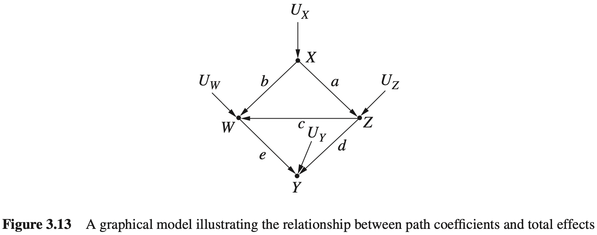

这种方法非常有利于计算直接效应。然而，如果想要计算 $Z$ 对 $Y$ 的总效应呢？

在线性系统中， $X$ 对 $Y$ 的总效应是从 $X$ 到 $Y$ 的每个非后门路径上边的系数的乘积的总和。

这个听起来有些拗口，把它想象为这样的一个过程：要找到 $X$ 对 $Y$ 的总效应，首先找到从 $X$ 到 $Y$ 的每条非后门路径；然后，对每条路径，将这条路径上的所有系数相乘，并最后将所有的乘积相加。

这样做的依据是结构因果模型的内在性质。再次考虑如图3.13所示的模型，因为想知道 $Z$ 对 $Y$ 的总效应，所以应该首先干预 $Z$ ，移除所有进入 $Z$ 的箭头，然后在剩余模型中用 $Z$ 表示 $Y$ 。可以用以下代数式来表示：

$$
Y=dZ+eW+U_Y=dZ+b(dX+cZ)+U_Y+eU_W=(d+ec)Z+ebX+U_Y+eU_W
$$

最终的表达式的形式为 $Y=\tau Z+U$ ，其中 $\tau=d+ec$ ，而 $U$ 包含了修改后的模型中不依赖于 $Z$ 的项。 $Z$ 每增加一个单位，会导致 $Y$ 增加 $\tau$ ，这就是总效应的定义。 $\tau$ 就是从 $Z$ 到 $Y$ 的两个非后门路径上系数的乘积之和。在所有线性模型中都是如此，这是由方程的代数性质决定的。此外，无论误差项如何分布，无论它们是相关的还是独立的，乘积之和的规则都是有效的。

#### 3.8.3 识别结构系数和因果效应

到目眩为止，我们已经用路径系数的形式效应，假设路径系数可以预先得知或者从表示了总效应和直接干预试验中估计获得。现在要解决一个更困群的问题是从非实验数据中估计总效应和直报效应。这个问题是“可识别性”问题，从数学角度来说，它是格与总效应和直接效应有关的路径系数以协方差 $\sigma_{XY}$ 或者回归系数 $R_{YX\cdot Z}$ 的形式表示，其中 $X$ 和 $Y$ 是模型中的任意两个变量， $Z$ 是模型中一组变量的集合（见式（1.28）、式（1.29）和第1.3.11节）。

然而，在许多情况下，要识别总效应和直接效应，其实并不需要识别模型中的每个结构参数。让我们首先用总效应 $\tau$ 来说明。后门准则告诉我们需要校正变量集合 $Z$ ，以确定 $X$ 对 $Y$ 的因果效应。然而，如何利用这一准则来确定线性系统中的效应呢？原则上，一旦获得了集合 $Z$ ，就可以估计给定 $X$ 和 $Z$ 条件下的上条件期望，然后对 $Z$ 求平均值，可以使用 $Y$ 和 $X$ 之间的结果相关性来衡量 $X$ 对 $Y$ 的效应。下面只需要将这个过程转化为回归描述。

这个转化很简单。首先，从模型中找到一组满足从 $X$ 到 $Y$ 的后门准则的变量 $Z$ 。然后，用 $X$ 和 $Z$ 回归 $Y$ ，结果方程中系数表示 $X$ 对 $Y$ 的真实因果效应。这个推理类似于我最开始用来证明后门准则的推理，在 $Z$ 上回归是将这些变量添加到方程中，从而阻断 $X$ 到 $Y$ 的所有后门路径，因此防止了 $X$ 的系数吸收后门路径上包含的虚假信息。

例如，考志一个符合同图3.14所示的线性模型，其中 $X$ 对 $Y$ 没有直接效应，但是通过校正 $T$ 可状取总效应。如果想要获得 $X$ 对 $Y$ 的总因果效应，首先使用后门准则确定是否必须对了进行校正。因此，用 $X$ 和 $T$ 回归 $Y$ ，回归方程为 $y=r_XX+r_TT+\epsilon$ 。系数 $r_X$ 表示 $X$ 对 $Y$ 的总因果效应。注意，这种方法可能不需要确定任何模型参数，也不用测量变量 $W$ ，图结构本身告诉我们可以忽略 $W$ ，只用 $X$ 和 $T$ 回归 $Y$ ，并用回归方程中 $X$ 的系数来确定（ $X$ 对 $Y$ 的）总因果效应。

现在，假设想要找出 $X$ 对 $Y$ 的直接因果效应，而不是总因果效应。在线性系统中，这个直接因果效应是系统中定义 $Y$ 的函数 $y=\alpha x+\beta z+\dots+U_Y$ 中的结构系数 $\alpha$ 。从图3.14中的图模型可以看出，没有直接从 $X$ 指向 $Y$ 的箭头，因此 $\alpha=0$ 。因此，在这个特例的案例中，答案是平凡的：直接因果效应为0。但是在一般情况下，如果不能从模型确定它的值，那么怎么样从数据中找到它的值呢？

我们可以调用一个类似于后门准则的方法，不同的是，不仅需要阻断后门路径，还要阻断从 $X$ 到 $Y$ 的非直接路径。首先，移除 $X$ 到 $Y$ 的边（如果这样的边存在），移除边后的图为 $G_\alpha$ 。如果在 $G_\alpha$ 中存在任一组变量 $Z$ 能使 $X$ 和 $Y$ 是d-分离的，那么可以简单地用 $X$ 和 $Z$ 回归 $Y$ 。结果方程中 $X$ 的系数就是结构系数 $\alpha$。

上述过程也称为“可识别性的回归准则”，它为我们提供了一种快速的方式来确定任何给定的参数（例如a）是否可以利用普通最小二乘法（ordinary least squares, OLS）实现回归识别，且如果可以识别，应该将哪些变量引入回归方程。例如，在图3.15的线性模型中，可以用这种方法得到 $X$ 对 $Y$ 的直接效应。首先，移除 $X$ 和 $Y$ 之间的边，得到如图3.16所示的图 $G_\alpha$ 。在图3.16中很容易发现， $W$ 使 $X$ 与 $Y$ 之间的路径变为d-分离。因此用 $X$ 和 $W$ 回归 $Y$ ，回归方程为 $Y=r_XX+w_WW+\epsilon$ 。系数 $r_X$ 为 $X$ 对 $Y$ 的直接效应。

总结到目前为止的发现，有两个有趣的特征。首先，在线性系统中，回归是识别和估计因果效应的主要工具。为了估计一个因果效应，仅需要写出一个回归方程，并确定：（1）方程中应该包含哪些变量，（2）这个方程中的哪些系数代表你感兴趣的效应。剩下的是在样本数据上进行常规的最小二乘分析，正如之前所说的，有各种非常有效的软件包可以帮助实现该分析。其次，只要变量彼此独立，并且图中的所有变量都被测量到，则每个结构参数都可以用这种方法识别，也就是说，至少在一个识别回归方程中，其中的系数对应于要估计的参数。 其中一个这样的方程显然是结构方程本身，其中的父节点作为回归量。但可能存在其他一些识别方程，它们对于估计和图分析可能有更好的特征，进而揭示所有的参数（见思考题3.8.1（c））。此外，当某些变量不可测时，或者某些误差项存在相关性时，从结构方程本身出发找到一个识别回归方程通常是不可行的，这就必须使用 $G_\alpha$ 方法（见思考题3.8.1（d））。

值得注意的是，回归准则的方法已经困扰了研究者近百年，这是因为难以用代数的、非图论术语的方式表达它。

假设 $G\alpha$ 中不存在使得 $X$ 与 $Y$ 为d-分离的变量集合。 例如在如图3.17所示的模型中，不能通过校正获得 $X$ 对 $Y$ 的直接效应，因为虚线箭头弧线表示 $X$ 和 $Y$ 之间存在一条后门路径，该后门路径包含不可测量的变量。由于存在不可观察的变量，因此不能对其取条件，因此， $X$ 和 $Y$ 将始终通过它产生依赖。在这种特殊情况下，可以使用一种工具变量来识别直接效应。如果一个变量在 $G_\alpha$ 图中与 $Y$ 为d-分离，且它与 $X$ 为d-连通，那么这个变量被称为“工具变量”。想要知道为什么这样一个变量可以使我们识别结构系数，我们需要进一步观察图 3.17。

在图3.17中， $Z$ 是一个关于 $X$ 对 $Y$ 效应的工具变量，因为它在 $G_\alpha$ 中与 $X$ 是d-连通的，与 $Y$ 是d-分离的。分别用 $Z$ 对 $X$ 和 $Y$ 做回归，可以分别得到回归方程 $y=r_1z+g$ 和 $x=r_2z+g$ 。因为 $Z$ 没有后门路径，因此 $r_2$ 等于 $\beta,r_2$ 等于 $Z$ 对 $Y$ 的总体效应 $\beta\alpha$ 。所以比例 $r_1/r_2$ 提供了所需的系数 $\alpha$ 。这个例子展示了如何从总效应中之别直接效应。

图模型为我们提供了一种在系统中找到所有⼯具变量的⽅法，但枚举这些变量的⽅法超出了本书的范围。有兴趣的读者可以参考相关⽂献（Chen et al., 2014; Kyono, 2010）。

#### 思考题

#### 3.8.4 线性系统中的中介

当假定变量之间的关系是线性时，中介分析要比非线性或非参数化系统中的分析简单得多（见第3.7节），例如，估计发对了的肖按效应相当于估计两个变量之间的路径系数，通过使用3.8.3节介绍的技术，可以将其归约为估计相关系数。类似地，间接效应可以用差值 $IE=\tau-DE$ 计算得到，其中总效应 $\tau$ 可以通过如图3.14所示的回归方法来估计。另一方面，在非线性系统中，直接效应通过式（3.18）定义，或者

$$
DE=E(Y\mid do(x,z))-E(Y\mid do(x',z))
$$

其中， $Z=z$ 表示 $Y$ 的除 $X$ 外的所有父节点的一个特定值。即使当识别条件满足，且能够将do-操作（通过校正）归约为普通的条件期坚时，结果仍然依校于 $x$ ， $x’$ 和 $z$ 的特定值。此外，间接效应不能以do-表达式的形式给出定义，因为无法通过控制变量为常数而使 $Y$ 不受 $X$ 的影响。同时，何接效应也不能被定义为总效应与直接效应之间的差值，因为差值不能忠实地反映非线性系统中对 $X$ 的操作。

第4章（4.4.5节和4.5.2节）将使用反事实的语育来介绍这样的一种操作。

## 4 反事实及其应用

### 4.1 反事实

当我昨晚开车回家的时候，我来到了一个路口，我必须做出选择：走高速公路（ $X=1$ ）还是走维达大道（ $X=0$ ）。我最终选择了维达大道，结果发现交通非常拥堵。一小时以后我终于到家了，我对自己说：“啊，我应该选择走高速公路的！”

“我应该选择走高速公路的”这句话意味着什么呢？通俗地讲，它表示，“如果我当初选择走高速公路，我会早一点到家”。科学地来说，它意味着：在同样的那一天，在同样的环境、相同的驾驶习惯条件下，我心里估计的、走高速公路的期望驾驶时间要小于我的实际驾驶时间。

这种“如果”的陈述形式（其中“如果”部分是不真实的或者未能实现的）被称作反事实。反事实的“如果”部分称作假设条件，或者更一般地，称为前件。使用反事实来着重强调，想要在完全一致的现实条件下比较不同前件的结果（例如，行驶时间），在前面的例子中，前件是“走高速公路”，对比于“走维达大道”。已知实际决策的结果，这一事实很重要，因为在看到实际决策（走维达大道）结果后，我对于走高速公路的驾驶时间预估可能会与我知道结果前的估计完全不一样。实际决策结果（1小时）可以为走高速公路的评估提供有价值的证据，例如，那天的交通特别拥堵，这可能是由一场木丛火灾造成的。陈述“我应该走高速公路的”表达了这样的判断：无论什么情况影响了维达大道上的行驶速度，它都不会以同样的方式影响高速公路上的行驶速度。我的事后估计是，高速公路的行驶时间不超过1小时，这个估计和我在知道结果前做决策时的期望估计明显不同，否则，我会在开始时选择走高速公路。

如果尝试用，do-表达式来描述这个问题，会遇到困境，如

$$
E(\text{驾驶时间}\mid do(\text{高度公路}),\text{驾驶时间=1小时})
$$

我们想要估计的驾驶时间和观察到的实际驾驶时间之间产生了冲突。显然，要避免这个冲突，必须从符号上区分以下两个变量：

1. 实际驾驶时间；
2. 若知道走维达大道的驾驶时间为1小时，走高速公路的假设驾驶时间。

不幸的是，do-操作太笼统，无法实现这个区分。do-操作能区分两个概率： $P(\text{驾驶时间}\mid do(\text{高速公路}))$ 和 $P(\text{驾驶时间}\mid do(维达大道))$ ，但却不能区分两个变量：维达大道实际驾驶时间和高速公路假设驾驶时间。现在需要区分这两个变量，从而让实际驾驶时间（走维达大道）为估计假设驾驶时间提供信息。

幸运的是，实现这样的区分还是容易的。我们简单地使用不同的下标来标记这两个变量。用 $Y_{X=1}$ （或者 $Y_1$ ，上下文允许的话）来表示高速公路的驾驶时间，用 $Y_{X=0}$ （ $Y_0$ ）来表示维达大道的驾驶时间。针对前面的例子中，因为 $Y_0$ 是 $Y$ 实际观测值，因此希望估计的数值为

$$
E(Y_{x=1}\mid X=0,Y=Y_0=1)\tag{4.1}
$$

初学者在看到这个表达式时可能会感觉有些不适，这个表达式包含了三个变量的混合，一个假设变量和两个观察变量，假设变量 $Y_{X=1}$ 是一个事件（ $X=1$ ）上的断言，它以实际观察到的事件（ $X=0$ ）为条件。我们之前没有遇到过这样的冲突。当使用do-操作预测因果效应时，使用如下表达式：

$$
E(Y\mid do(X=x))\tag{4.2}
$$

这个表达式里的 $Y$ 是事件 $X=x$ 的结果。这个表达式也可以用新符号描述为 $E(Y_{X=x})$ ，它也表示在 $X$ 设置为 $x$ 时， $Y$ 的取值，两种表示形式都可以使用，没有必要抛弃do-操作，而仅使用反事实的符号。

我们会遇到需要使用反事实表达式（4.1）才能解决的问题，这是因为 $Y_{X=1}=y$ 一和 $X=0$ 是且一定是在不同条件下发生的事件，这两个事件发生在“不同的世界”。这样的问题不会出现在干预表示中，因为式（4.1）试图在给定实际驾驶时间（在我们选择走维达大道的世界中）为1小时的条件下，估计在选择走高速公路的世界中的驾驶时间；而式（4.2）则是在选择走高速公路的世界中估计期望驾驶时间，不参考发生在另一个世界中的任何信息。

在式（4.1）中出现的冲突使我们不能把这个表达式归约为一个do-表达式，这意味着不能从预试验中估计表达式的值。实际上，在两个决策选项上进行随机对照试验永远不会得到我们想要的估计值，这样的试验说明 $E(Y_1)=E(Y\mid do(\text{高速公路}))$ 和 $E(Y_0)=E(Y\mid do(\text{维达大道}))$ ，但是我们不能同时走高速公路和维达大道，因此无法计算我们想要的估计值，即条件期望 $E(Y_1\mid X=0,Y=1)$ 。研究者可能感兴趣是否有其他方法可以绕过这个困难，如事后专门测量高速公路时间，或者同时用另一个驾驶员，但现场条件可能随着时间发生变化，另一个驾驶员有他自己的驾驶习惯。无论哪种情况，用这些智能方法估量的驾驶时间仅是我们想要估计的“驾驶时间”的近似，随着这些条件与如果当初走高速公路的条件相似度的变化，估计的近似度也会变化。这种近似可能适合估计某些情况下的目标值，但并不适用于定义反事实。定义需要能够准确刻画我们想要做的估计，因此必须依赖下标符号 $Y_1$ ，它表示在那个特定的历史时刻我选择走高速公路的条件下，我“想要”的估计时间。

尽管式（4.1）中反事实 $Y_1$ 属于假设，但是本书第2章中的结构因果模型已证明其不仅能够用于计算任何完全确定模型的反事实摄率，也能在潜在的函数不确定或者某些变量不可测时，从数据中估计这些概率。

下一节将详细介绍计算及估计反事实的方法，之后还会用这些方法来解决各种复杂的、看起来难以解决的问题。例如，计算有多少参与者如果当初没有参加培训还能得到工作，从而识别一个工作培训项目的效应；在一个使用统一千预（将忠者组的族岛素水平控制在相同的常数值）试验中预测添加干预（对不同康岛素水平的忠者组增加5mg/l的成岛素）的效应；确定一个癌症患者如果当初选择不同的治疗方案有不同结果的可能性；以足够的概率来证明当公司拒绝应聘者时是否存在歧视现象；通过直接效应和间接效应的分析，来弄清楚不同性别的雇佣政策对于纠正劳动力中性别差异的效应。

我们可以用反事实解决所有上述问题和许多其他问题。但首先，必须学习怎样定义反事实，以及在实际中如何使用它们。

### 4.2 反事实的定义和计算

#### 4.2.1 反事实的结构性解释

在前面关于干预的章节中，通过用等式 $X=x$ 代替结构方程中的 $X$ 来模拟将变量 $X$ 设置为值 $x$ 的行为，从而用结构因果模型预测从未实施过的行动和决策的效应。本节将展示：通过在一个稍微不同的环境中使用相同的操作，我们如何使用结构方程模型来定义反事实，如何从给定模型中理解反事实，以及当模型中一部分未知时，有多大的概率能够估计出反事实。

从一个完全确定的模型 $M$ 开始，已知模型中所有外生变量的值和函数 $\{F\}$ 。在这样一个确定的模型中，每一个对于外生变量的赋值 $U=u$ 。关联到群体中的每个单个成员，或个体中的“个体”，或者关联到某种“情形”。这一关联的理由如下：每一个赋值 $U=u$ 唯一定了“中所有变量的值，因此总体中的每一个个体的属性取得唯一值，这依赖于个体的身份。如果群体是“人”，那么这些属性可能包括资历、地址、受教育情况、参加音乐活动的倾向以及在任何给定时间关联给那个个体的所有其他属性。如果群体是“农业用地”，那么属性包括土壤含量、环境气候和当地野生动物等。这些定义属性如此之多，我们不可能把所有属性都包含在模型里，但是必须把能够区别每个个体的属性全部考虑进来，这样才能确定模型里所有变量的值。从这个意义上说，每一个值对应了群体中的某个成员或“个体”，或者某种“情形”。

例如，如果 $U=u$ 代表一个名叫乔的人的属性， $X$ 代表变量“薪资”，那么 $X(u)$ 就代表了乔的薪资。如果 $U=u$ 代表了一块农业用地， $Y$ 代表了给定季节的产量，那么 $Y(u)$ 代表了那个季节 $U=u$ 该地块的产量。

现在，考虑反事实语句“在 $U=u$ 的情况下，若 $X$ 当初取值 $x$ ，则 $Y$ 会取值 $y''$ ，记做 $Y_x(u)=y$ ，其中 $X$ 和 $Y$ 是 $V$ 中的任意两个变量。解释这个句子的关键是将语句“ $X$ 当初取值 $x$ ”作为一个在当前模型中进行微小修改的陈述，以便建立前件条件 $X=x$ ，这个前件条件有可能与 $X$ 的实际观测值 $X(u)$ 冲突。这个微小修改相当于将方程中的 $X$ 替换为常量 $x$ 。可以认为是一个外部干预 $do(X=x)$ ，这个替换允许常量 $x$ 不同于 $X$ 的实际观测值（即 $X(u)$ ），而不会使方程系统不协调，用这种方式允许所有变量（包括外生变量和内生变量）都可以作为其他变量的前件。

下面在一个简单的因果模型中演示这个定义，它只包含三个变量 $X$ 、 $Y$ 、 $Z$ ，并由以下两个方程定义：

$$
X=aU\tag{4.3}
$$

$$
Y=bX+U\tag{4.4}
$$

首先计算反事实 $Y_x(u)$ ，即在 $U=u$ 的情况下，若 $X$ 当初取 $x$ ， $Y$ 的取值情况。用 $X=x$ 替换第一个方程，得到“修正”的模型 $M_x$ ：

$$
X=x
$$

$$
Y=bX+U
$$

代入 $U=u$ ，求解 $Y$ ，得到

$$
Y_x(u)=bx+u
$$

这正是我们所预期的。因为结构方程 $Y=bX+U$ 的含义是“赋值给 $Y$ 的值是加上 $X$ 赋值的 $b$ 倍”，让我们展示一个不是那么明显的结果，观察反事实 $X_y(u)$ ，即在 $U=u$ 的情况下，若 $Y$ 当初取值 $y$ 的话。 $X$ 会取什么值。这时，用 $Y=y$ 替换第二个方程，并求解 $X$ ，得到 $X_y(u)=au$ ，这意味着在假设条件“ $Y$ 当初取值 $y$ ”下， $X$ 保持不变。如果将这个假设条件看作是来自外部的、未知的干预产生的，那么似乎是可以接受的。如果不用干预的说法，而将 $Y=y$ 看作是自发的，意料之外的变化，那就可能不是我们期望的了。无论 $Y$ 的变化是外部产生的还是自发产生的， $X$ 都不会发生变化，反事实条件下的 $X$ 不变性反映了这样一种直觉：假设的未来事件并不会改变过去。

对应于模型中变量可以取得的不同值，每个结构方程模型都包含许多这样的反事实。为了展示这个模型隐含的其他反事实，现假设式（4.3）和式（4.4）中的 $U$ 可以取三个值 $1,2,3$ ，并令 $a=b=1$ 。表4.1给出了对应 $x$ 和 $y$ 不同水平的 $X(u), Y(u),Y_X(u)$ 和 $X_y(u)$ 的取值。例如，为了计算 $u=2$ 时的 $Y_2(u)$ ，只需要 $X=2$ 替换 $X=aU$ ，求解一组新的方程，然后得到 $Y_2(u)=2+u=4$ 。这个计算非常简单，其足以表明虽然反事实被认为是假设的，甚至从统计角度看是神秘的，但它们很自然地从我们对现实的感知中表现出来，就像在结构模型中表现的那样。每一个结构方程模型都为所有可能的反事实赋予了确定的值。

表4.1 对式（4.3）和式（4.4）线性模型取值情况

| $u$  | $X(u)$ | $Y(u)$ | $Y_1(u)$ | $Y_2(u)$ | $Y_3(u)$ | $X_1(u)$ | $X_2(u)$ | $X_3(u)$ |
| ---- | ------ | ------ | -------- | -------- | -------- | -------- | -------- | -------- |
| 1    | 1      | 2      | 2        | 3        | 4        | 1        | 1        | 1        |
| 2    | 2      | 4      | 3        | 4        | 5        | 2        | 2        | 2        |
| 3    | 3      | 6      | 4        | 5        | 6        | 3        | 3        | 3        |

从这个例子中，读者可能会得到这样的印象：反事实与待通的由 do-操作刻画的干预措施没有区别。然而，需要注意的是，在这个例子中，我们计算的不仅仅是 $Y$ 在这样或那样干预下的概念或期望值，而且还计算了 $Y$ 在假设的新条件 $X=x$ 下的值。对于每一种情况 $U=u$ ，得到了一个确定的数值 $Y_x(u)$ ，它代表了 $Y$ 在这种情况下的假设值。另一方面，do-操作仅仅根据定义在从来积分类（式（1.30））中删除因子 $P(x_i\mid pa_i)$ 之后的概率分布，提供了如 $E(Y\mid do(x))$ 这样的概率结果。从实验主义的角度来看，这一差异反映了计算总体水平和个体水平之间的巨大鸿沟：do(x)-操作刻画了干预下的总体行为，而 $Y_x(u)$ 描述了一个特定的个体在这样一个干预下的行为。这一差异具有意义深远的影响，将使我们能够定义诸如信任、过失和遗憾等概念的概率，而这些都是 do-操作无法刻画的。

#### 4.2.2 反事实的基本定理

现在，可以将反事实的概念推广到任何结构模型 $M$ 。考虑任意两个变量 $X,Y$ ，它们不一定在同一个方程里（但在同一个方程组里）。令 $M_x$ 表示用 $X=x$ 代替 $X$ 后得到的 $M$ 的修改版。反事实 $Y_x(u)$ 的形式化定义为

$$
Y_x(u)=Y_{M_x}(u)\tag{4.5}
$$

用语言描述为：模型 $M$ 中的反事实 $Y_x(u)$ 被定义为“修改后的”子模型 $M_x$ 中 $Y$ 的解。式（4.5）是因果推理最重要的基本原则之一。它使我们获得具有现实意义的科学概念，并用它来回答大量类似于“若当初取值 $x$ ， $Y$ 会取什么值”的各种问题。当 $X$ 和 $Y$ 是变量集合时，如果 $M_x$ 表示 $X$ 集合中所有成员均被常数值替换后的模型，定义同样适用。这带来了大量的、可由给定模型计算的反事实语句，并引出了一个有趣的问题：这样一个由几个方程组成的简单模型，怎么会有如此多的反事实赋值？答案是：这些反事实得到的值并不是完全任意的，而是必须相互一致的，并且与一个基础模型相协调。

例如，如果观察到 $X(u)=1$ 和 $Y(u)=0$ ，那么 $Y_{X=1}(u)$ 一定是0。这是因为将 $X$ 设定为一个已经存在的值 $X(u)=1$ ，不应该对世界产生任何改变。因此， $Y$ 应当保持当前的值 $Y(u)=0$ 。

一般来说，反事实遵循以下的一致性原则：

$$
\text{如果}\quad X=x\quad\text{那么}\quad Y_x=Y\tag{4.6}
$$

如果 $X$ 是二值的，那么一致性原则变为

$$
Y=XY_1+(1-X)Y_0
$$

这可以解释如下： $Y_1$ 为 $X$ 取值为1时候的 $Y$ 的观察值。对应地， $Y_0$ 为 $X$ 取值为0时候的 $Y$ 的观察值，如果通过式（4.5）计算反事实，那么所有这些约束都会自动成立。

#### 4.2.3 从总体数据到个体数据行为

为了显示反事实个体行为推理中的作用，使用图4.1中描述的模型加以说明。图4.1表示一个“激励方案”：即表示一个学生在课后补习班上花费的时间， $H$ 表示家庭作业量， $Y$ 表示考试成绩。每一个变量的值以超出学生考试成绩均值的标准差来表示（即模型是标准化的，所有的变量均值为0，方差为1）。例如，如果 $Y=1$ ，那么学生得分超出考试成绩均值的1个标准差。这个模型表示一个随机试点项目，学生们被随机地指定参加课后补习。图4.1对应模型描述见“模型4.1”。

模型4.1

$$
X=U_X
$$

$$
H=aX+U_H
$$

$$
Y=bX+cH+U_Y
$$

$$
\sigma_{U_iU_j}=0,\quad\text{对于所有}i,j\in\{X,H,Y\}
$$

假设所有的因子 $U$ 都是独立的，且得到了模型4.1中系数的值（这些值可以从总体数据中估计得到）：

$$
a=0.5,b=0.7,c=0.4
$$

考总一个名为乔的学生，测得： $X=0.5,H=1,Y=1.5$ 。假设希望回答以下问题：如果乔当韧的家庭作业量加倍，他的分数会是多少呢？

在线性结构方程模型中，每个变量的值均由系数和变量 $U$ 确定，后者表示了个体之间的差异。因此，可以使用证据 $X=0.5,H=1$ 以及 $Y=1.5$ ，确定与乔相关的变量 $U$ 的值。这些值对于假设的行为是不变的，比如那些可能使乔家庭作业量加倍的行为。

这种情况下，能够从证据中获得乔的特定 $U$ 值：

$$
U_X=0.5
$$

$$
U_H=1-0.5\times0.5=0.75
$$

$$
U_Y=1.5-0.7\times0.5-0.4\times1=0.75
$$

接下来，用 $H=2$ 替换 $H$ 的结构方程，模拟将乔的家庭作业量加倍的行为。图4.2描述了修改后的模型，最后，在修改后的模型中用计算后的 $U$ 值来计算 $Y$ 的值，得到

$$
\begin{aligned}
Y_{H=2}(U_X&=0.5,U_H=0.75,U_Y=0.75)\\
&=0.5\times0.7+2.0\times0.4+0.75\\
&=1.90
\end{aligned}
$$

因此得出了如果乔的家庭作业量增加一倍，则他的分数会变为1.9而不是1.5。根据之前的约定，这意味着增加到比均值高1.9个标准差，而不是现在的1.5个标准差。

上述过程可总结为：首先应用证据 $X=0.5,H=1$ 以及 $Y=1.5$ 去获取变量 $U$ 的值；然后通过 $H=2$ 替换方程 $H=aX+U_H$ ，来模拟一个外部干预从而强制条件 $H=2$ ；最后，在给定的结构方程和获取的取值条件下计算 $Y$ 的值（当然，在上面的所有情况下，假设对 $H$ 的干涉不会改变 $U$ 的值）。

#### 4.2.4 计算反事实的三个步骤

乔的课后补习项目的例子展示了反事实的基本定义，以及如何获得给定反事实值的过程。任何反事实值的确定可由如下三步过程来计算：

(i)溯因：用证据 $E=e$ 来确定 $U$ 的值；

(ii)作用：修改模型 $M$ ，移除变量 $X$ 出现在左边的方程，用 $X=x$ 来替换它们，从而获得修正的模型 $M_x$ ；

(iii)预测：使用修改后的模型 $M_x$ 和 $U$ 的值来计算 $Y$ 的值，即反事实的结果。

做一个时间上的比喻，步骤（i）根据当前证据 $e$ 解释过去（ $U$ ）；步骤（ii）通过（最低限度的）扭曲历史来符合假设的前件 $X=x$ ；步骤（iii）根据对过去的认识和新立的条件 $X=x$ 来预测未来（ $Y$ ）。

这个过程可以解决任何确定性的反事实问题，即已知每个相关变量值的总体中与个体有关的反事实问题，结构方程模型能够回答这种性质的反事实问题，因为每个方程都表示一个变量获得其值的方式。如果我们知道这些方式，也就应该能够预测给定修改条件下，某些方式被改变后变量将会得到什么值。因此，将反事实视作是结构方程的衍生性质是很自然的。在一些框架中，反事实被当作本原性质（Hallamd, 1986；Rubin, 1974）。

但反事实是可论是以某概率发生的，这与总体中的一类个体有关。例如，在课后补习项目的例子中，可能想知道如果令所有 $Y<2$ 的学生当初的家庭作业量加倍，会发生什么。这些概率性的反事实与do-操作干预不同，因为它们限制了施加干预的个体集合，而do-表达式不能这样做。

现在可以将确定性模型改进为概率性模型来处理关于反事实的概率和期望的问题。例如，假设乔是一名参与了图4.1项目的学生，他的考试分数为 $Y=y$ 。如果当初增加5个小时的激励训练，那么他的分数是 $Y=y’$ 的概率是多少？或者，在这样一个假设世界中，他期望的分数是多少？与模型4.1不同，我们没有关于所有三个变量 $\{X,Y,H\}$ 的信息，因此不能唯一地确定与乔相关的值 $u$ 。相反，乔可能属于一个与证据相对应的个体分组，组内每个个体具有不同的 $u$ 值。

我们可以通过为外生变量 $U$ 赋饱和率 $P(U=u)$ ，将不确定性引入因果模型。它们代表了我们对于识别对象的不确定性，或者，当对象已知时，对于问题中可能包含的对象的其他属性的不确定性。

外生点率 $P(U=u)$ 在内生变量 $V$ 上引入了唯一的概率分布 $P(V)$ 。在这个分布的帮助下，我们不仅可以定义和计算任何一个反事实 $Y_x=y$ 的概率，还可以定义和计算观测变量及反事实变量所有组合的联合分布。例如，可以确定 $P(Y_x=y,Z_x=z,X==x')$ ，其中 $X,Y,Z$ 和 $W$ 是模型中的任意变量。这样的联合概率表示某些 $u$ 的比例，即括号内的所有事件对于这些 $u$ 都是事实的，满足 $Y_x(u)=y$ 和 $Z_w(u)=z$ 以及 $X(u)=x'$ ，特别是，允许 $w$ 或者 $x'$ 与 $x$ 冲突。

关于这些概率的一个典型问题是：假定我们观察到给定个体的特征 $E=e$ ，那么如果 $X$ 当初取值 $x$ ，我们对于这个个体的 $Y$ 的期望值是多少？这个期望表示为 $E(Y_{X=x}\mid E=e)$ 。其中，允许 $E=e$ 与前件 $X=x$ 冲实。竖线后的 $E=e$ 代表了我们在这个个体上所获得的所有的信息（或证据），可能包括 $X,Y$ 或其他变量的值，就像在式（4.1）中看到的那样。下标 $X=x$ 表示了由反事实语句所确定的前件。 

在接下来的章节中会介绍处理这些概率和期望的细节。但是目前知道如何使用它们很重要，可以将之前的三步法扩展到任何概率型的非线性系统。

给定任何一个形式为 $E(Y_{X=x}\mid E=e)$ 的反事实，三步法过程如下：

（i）溯因：根据证据更新 $P(U)$ ，获得 $P(U\mid E=e)$ ；

（ii）作用：修改模型 $M$ ，移除 $X$ 出现在左边的结构方程，用 $X=x$ 来替换它们，从而获得修正的模型 $M_x$ ；

（iii）预测：使用修正的模型 $M_x$ 和 $P(U\mid E=e)$ ，计算 $Y$ 的期望，即反事实的结果。

我们将在4.4节中看到，以上的过程不仅适用于回顾性的反事实问题（形式为“如果 $X$ 当初取值 $x$ ， $Y$ 的值会是多少？”的问题），还适用于某些前瞻性问题。特别地，若让每个个体都实施一个依赖于它的 $X$ 当前值的行为，该方法也适用。一个典型的例子是“添加干预”，例如，不管患者之前的剂量如何，均对每个患者增加5 mg/L的胰岛素。由于最终胰岛素水平根据患者的不同而不同，因此这个措施不能用do-表达式来表示。

另一个例子是，假设想要使用图4.1来估计一项学校政策对考试成绩的效应，该政策是令懒得做作业（ $H<H_0$ ）的学生参加课后补习项目（ $X=1$ ）。我们不能简单地干预 $X$ ，使其在 $H$ 低的情况下等于1，因为在该模型中， $X$ 是 $H$ 低的原因之一（参见图4.1）。

相反，我们用反事实符号表示这个量的期望，即 $E(Y_{X=1}\mid H\le H_0)$ ，原则上，它可以使用上述三步法来计算。在用由特征表示的总体子集估计行为和政策效应时，如果这些特征受政策的影响（如 $H\le H_0$ ），那么反事实推理和上述过程是必需的。

### 4.3 非确定性的反事实

#### 4.3.1 反事实的概率

为了说明非确定性是如何体现在反事实计算中的，让我们给公式（4.3）和（4.4）中的变量 $U$ 的值赋予概率。设想 $U=\{1, 2, 3\}$ 代表了总体中的三种类型的个体，概率如下：

$$
P(U=1)=\frac{1}{2},P(U=2)=\frac{1}{3},P(U=3)=\frac{1}{6}
$$

所有在同一总体类型中的个体有相同的反事实值，正如表4.1中对应行所确定的。使用这些值，可以计算满足指定条件的反事实的概率，例如，可以计算若 $X$ 当初取值为2， $Y$ 的值会是3的个体的比例，或者 $Y_2(u)=3$ 。这个条件仅发生在表的第一行，因为它是 $U=1$ 的一个属性，所以可以得出结论：它的发生概率为1/2，即 $P(Y_2=3)=1/2$ 。同样可以计算其他反事实的概率，例如， $P(Y_1=4)=1/6,P(Y_1=3)=1/3,P(Y_2>3)=1/2$ 等。然而，值得注意的是，也可以计算每一个反事实事件和观察事件组合的联合概率，例如：

$$
P(Y_2>3,Y_1<4)=1/3
$$

$$
P(Y_1<4,Y-X>1)=1/3
$$

$$
P(Y_1<Y_2)=1
$$

在第一个表达式中，我们发现了两个发生在不同世界中的事件的联合概率： $Y_2>3$ 发生在 $X=2$ 的世界中， $Y_1<4$ 发生在 $X=1$ 的世界中。它们联合的概率为1/3，这是因为这两个事件仅在 $U=2$ 时才能共同发生，而 $U=2$ 的概率为1/3。第二个和第三个表达式展示了其他跨越世界的事件。值得注意的是，不同世界之间的冲突不会为计算设置障碍。实际上，跨越世界的概率计算正如在相同世界内计算那样简单：简单地确定那些特定组合条件为真的行，然后将这些行的概率加起来，这使我们具有在反事实中计算条件概率和定义相关概念的能力，例如反事实中的变量依赖和条件独立，正如在第1章中处理观察变量时所做的那样。例如，很容易验证，在 $Y>2$ 的个体中，如果 $X$ 当初取 3， $Y$ 会增加的概率为 2/3。因为 $P(Y_3>Y\mid Y>2)=\frac{1}{3}/\frac{1}{2}=\frac{2}{3}$ 。同样地，可以验证差值 $Y_{x+1}-Y_x$ 与 $x$ 独立，这意味着 $X$ 对 $Y$ 的因果效应不会随着总体类型的变化而变化，这是一个所有线性模型都具有的性质。

这种多个世界中的反事实联合概率可以很容易地用下标符号来表示，如 $P(Y_1=y_1,Y_2=y_2)$ ，且能够从结构模型中计算，正如表4.1那样，然而，它们不能用 do(x) 符号来表示，因为后者仅能为每一个干预 $X=x$ 计算一个概率。为了了解这个局限带来的问题，我们来研究一个对式（4.3）和式（4.4）中模型进行轻微改动形成的模型。新模型的方法如下：

$$
X=U_1,Z=aX+U_2,Y=bZ\tag{4.7}
$$

图 4.3 给出了其结构。为了让这个模型符合所讨论的问题，令 $X=1$ 表示受过高等教育， $U_2=1$ 表示有工作经验， $Z$ 表示给定工作所需的技能水平， $Y$ 表示薪资。

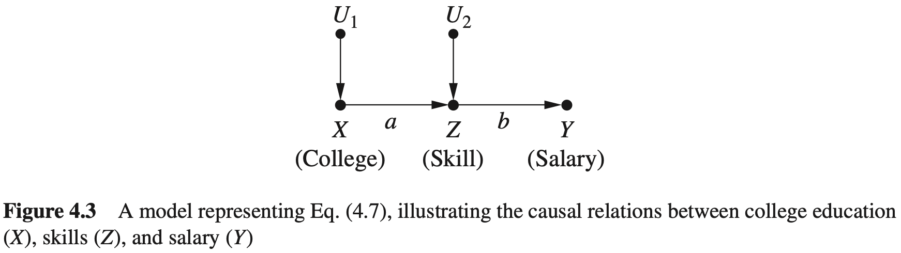

假设我们的目标是计算 $E(Y_{X=1}\mid Z=1)$ ，它表示技能水平 $Z=1$ 的个体如果当初接受了高等教育的话，他们薪资的期望值。这个统计量不能用do-表达式描述，因为条件 $Z=1$ 和前件 $X=1$ 属于两个不同的世界；前者表示当前的技能，而后者表示在非现实的过去中的一个假设教育。如果试图用表达式 $E(Y\mid do(X=1), Z=1)$ 来描述这个假设的薪资，是无法揭示我们想要的信息的。do-表达式表示所有完成了高等教育并且之后获得了技能水平 $Z=1$ 的个体的期望薪资，如图4.3所示，这些个体的薪资仅依赖于他们的技能水平，技能来自高等教育还是工作经验并不会影响他们的薪资。在这种情况下，条件 $Z=1$ 切断了我们感兴趣的干预效应。与之相反，在那些当前 $Z=1$ 的个体中，某些个体可能没有接受过高等教育，如果他们当初接受了高等教育的话，他们会获得更高的技能水平（及薪资），我们感兴趣的是这些人的薪资，但是这没有被包含在do-表达式中。因此，在这种情况下，do-表达式不能刻画反事实问题。

$$
E(Y\mid do(X=1),Z=1)\neq E(Y_{X=1}\mid Z=1)\tag{4.8}
$$

我们可以进一步证实这个不等式，方法是观察如下事实：当 $E(Y\mid do(X=1),Z=1)$ 等于 $E(Y\mid do(X=0),Z=1)$ 时， $E(Y_{X=1}\mid Z=1)$ 不一定等于 $E(Y_{X=0}\mid Z=1)$ 。将 $Z=1$ 看作干预后条件，在两个前提条件下所满足的两个不同的个体集合（即 $X=1$ 的人群和 $X=0$ 的人群）；而后者是当前世界中定义的单独个体集合（即 $Z=1$ 的人群），该集合中的个体在两个不同的假设前提下会有不同的结果。 $do(x)$ 符号不能描述后者，这是因为表达式 $E(Y_{X=1}\mid Z=1)$ 中的事件 $X=1$ 和 $Z=1$ 指的是干预前和干预后两个不同的世界。另一方面，表达式 $E(Y\mid do(X = 1),Z=1)$ 仅仅表示干预后的事件，这就是为什么它可以用 $do(x)$ 来表述的原因。

一个很自然的问题是：反事实符号是否也能用于描述干预后的事件，即单一世界的表达式 $E(Y\mid do(X = 1), Z = 1)$ 。答案是肯定的，反事实符号更灵活，既能刻画单一世界，又能描述跨世界的事件概率。 $E(Y\mid do(X=1),Z=1)$ 可以很容易地转化为反事实表达： $E(Y_{X=1}\mid Z_{X=1}=1)$ ，它显式地将事件 $Z = 1$ 指定为干预后的事件。变量 $Z_{X=1}$ 表示 $X$ 如果取值为1时 $Z$ 的取值，这正是我们之前在用贝叶斯公式将 $Z = z$ 加入表达式时想要表达的：

$$
P(Y=y\mid do(X=1),Z=1)=\frac{P(Y=y,Z=z\mid do(X=1))}{P(Z=z\mid do(X=1))}
$$

这明确地说明了 $Z$ 对 $X$ 的依赖应该如何处理。在3.5节的特别例子中，作为年龄变量 $Z$ 在干预前和干预后是不变的，因此有 $Z_{X=1}=Z$ ，在这种情况下不需要区分两者（即干预前和干预后），式（4.8）中的不等号将变为等号。

下而分析这个逻辑是如何反映在数字上的。表4.2描述了与式（4.7）对应模型相关的反事实，其中所有的下标表示 $X$ 的状态，这个表是用构建表4.1的方法构建的：用适当的常数（0或1）来替换方程 $X=u$ ，然后求解 $Y$ 和 $Z$ 。使用这个表，能够立即验证：

表4.2 对式（4.7）模型取值情况

| $u_1$ | $u_2$ | $X(u)$ | $Z(u)$ | $Y(u)$ | $Y_0(u)$ | $Y_1(u)$ | $Z_0(u)$ | $Z_1(u)$ |
| ----- | ----- | ------ | ------ | ------ | -------- | -------- | -------- | -------- |
| 0     | 0     | 0      | 0      | 0      | 0        | ab       | 0        | a        |
| 0     | 1     | 0      | 1      | b      | b        | (a+1)b   | 1        | a+1      |
| 1     | 0     | 1      | a      | ab     | 0        | ab       | 0        | a        |
| 1     | 1     | 1      | a+1    | (a+1)b | b        | (a+1)b   | 1        | a+1      |

$$
E(Y_1\mid Z=1)=(a+b)b\tag{4.9}
$$

$$
E(Y_0\mid Z=1)=b\tag{4.10}
$$

$$
E(Y\mid do(X=1),Z=1)=b\tag{4.11}
$$

$$
E(Y\mid do(X=0),Z=1)=b\tag{4.12}
$$

这些方法提供了对式（4.8）中不等式的数值验证。它们也说明了一个我们之前就注意到的反事实的独特性质，虽然在图4.3的图模型中 $Z$ 分离了 $X$ 和 $Y$ ，但我们发现对于那些符合条件 $Z=1$ 的个体， $X$ 对 $Y$ 是有效度的。

$$
E(Y_1-Y_0\mid Z=1)=ab\neq 0
$$

这可以由薪资的例子给出完美的解释。对于那些已经获得技能水平 $Z=1$ 的个体，他们的薪资仅依赖于他们的技能，而不是 $X。$ 对于那些当前技能水平 $Z=1$ 的个体，如果他们有不一样的过去，那么他们的薪资会变得不同。这种类型的回顾性推理，惯于对非现实历史的依赖，但并没有在如图4.3所示的图模型中表示出来。为了实现这样的推理，我们需要设计能直接在图中表示反事实的方法，将在4.3.2节给出这样的表示。

到目前为止， $P(u_1)$ 和 $P(u_2)$ 概率值还没有用于计算，因为条件 $Z=1$ 仅发生在 $u_1=0$ 且 $u_2=1$ 时（假定 $a\neq 0$ 且 $a\neq 1$ ），这时每一个 $Y,Y_1$ 和 $Y_0$ 都有确定值。然而，如果假设模型中 $a=1$ ，那么这些概率就会发挥作用，因为现在 $Z=1$ 可以发生在两个条件下：（ $u_1=0,u_2=1$ ）以及（ $u_1=1,u_2=0$ ）。每一个发生的概率为 $P(u_1=0)\cdot P(u_2=1)$ ，第二个发生的概率为 $P(u_1=1)P(u_2=0)$ 。在这种情况下，有

$$
E(Y_{X=1}\mid Z=1)=b(1+\frac{P(u_1=0)P(u_2=1)}{P(u_1=0)P(u_2=1)+P(u_1=1)P(u_2=0)})\tag{4.13}
$$

$$
E(Y_{X=0}\mid Z=1)=b(1+\frac{P(u_1=0)P(u_2=1)}{P(u_1=0)P(u_2=1)+P(u_1=1)P(u_2=0)})\tag{4.14}
$$

式（4.13）大于式（4.14）的事实再一次说明受教育程度对薪资的技能-特定因果效应不为 0，薪资仅由技能决定，而非教育。这是可以预料到的，因为技能水平 $Z=1$ 的雇员中没有接受高等教育的雇员比例不为零，他们如果当初接受了高等教育的话，他们的技能水平会增加到 $Z_1=2$ ，他们的薪资会达到 $2b$ 。

#### 思考题 4.3.1

考虑如图 4.3 所示模型，假定 $U_1$ 和 $U_2$ 是两个独立的高斯变量，每一个都是零均值和单位方差。

（a）对于技能水平 $Z=z$ 的雇员，如果他们当初接受了 $x$ 年的高等教育，计算他们的期望薪资。[提示：使用定理 4.3.2 的公式，其中证据 $e:Z=z$ ，并使用事实：对于任意两个高斯变量（设为 $X$ 和 $Z$ ），有 $E(X\mid Z=z)=E(X)+R_{XZ}(z−E(Z))$ 。使用第 3.8.2 节和第 3.8.3 节的知识，以结构参数的形式表示所有的回归系数，得到 $E(Y_x\mid Z=z)=abx+bz/(1+a^2)$ 。]

（b）基于（a）的答案，说明受教育程度对薪资的技能-特定因果效应独立于技能水平。

#### 4.3.2 反事实的图形化表示

由于反事实是结构方程的副产品，那么一个很自然的问题是：能否在与这些模型相关联的因果图中理解它们？答案是肯定的，正如可以从式（4.5）的反事实基本原理中理解它们一样。这个原理说明：如果修改模型 $M$ 得到子模型 $M_x$ ，那么修改后的模型中的结果变量 $Y$ 就是原始模型的反事实 $Y_x$ 。由于模型修改要求移除所有指向 $X$ 的箭头，因此能够得出结论，如图4.4所示：与变量 $Y$ 关联的节点若换为与 $Y_x$ （表示在 $X = x$ 情况下的潜在结果）关联，这个替换仅在修改后的模型中成立。

这个反事实的形象化表示足够回答一些关于 $Y_x$ 的统计性质的基本问题，以及这些性质如何依核干模型中的共他变量，特别是当以这些变量为条件时。

在讨论 $Y_x$ 的统计属性时，需要探究是什么引起了 $Y_x$ 的变化。根据它的结构性定义， $Y_x$ 表示了在 $X$ 被限定为常数 $X = x$ 时的值。因此，当 $X$ 被固定为常数时，即当移除指向 $X$ 的箭头时，如图4.4(b)所示， $Y_x$ 在统计上的变化受所有能够影响 $Y$ 的外生变量所支配。在这样的条件下，能够传递变化给 $Y$ 的变量集合是 $Y$ 的父节点（观察到的或未观察到的），以及 $X$ 到 $Y$ 路径上节点的父节点。例如，在图4.4(b)中，这些父节点是： $\{Z_3,W_2,U_3,U_Y\}$ ，其中 $U_Y$ 和 $U_3$ 是 $Y$ 和 $W_3$ 的误差项，它们没有显示在图中。任何阻断 $X$ 到这些父节点路径的变量集合也阻断了到 $Y_x$ 的路径，因此导致 $Y_x$ 条件独立。特别地，如果有一个变量集合 $Z$ 满足模型 $M$ 中的后门准则（见定义 3.3.1），那么这个集合也阻断了所有 $X$ 到这些父节点之间的路径，因此会使 $X$ 和 $Y_x$ 对于每一个 $Z = z$ 的情况均（条件）独立。

这次考虑被形式化总结为定理4.3.1。

**定理 4.3.1（后门的反事实解释）** 如果一个变量合 $Z$ 满足 $(X,Y)$ 的后门条件，那么对于所有的 $x$ ，在给定 $Z$ 条件下，反事实 $Y_x$ 条件独立于 $X$ ，记为

$$
P(Y_x\mid X,Z)=P(Y_x\mid Z)\tag{4.15}
$$

当需要从观察研究中估计反事实的概率时，定理 4.3.1 会非常有价值。特别是，它表明 $P(C \mid Y = y)$ 可由校正公式（3.5）计算。为了证明这一点，以 $Z$ 为条件（如公式（1.9）中那样），得到

$$
\begin{aligned}
P(Y_x=y)&=\sum_zP(Y_x=y\mid Z=z)P(z)\\
&=\sum_zP(Y_z=y\mid Z=z,X=x)P(z)\\
&=\sum_zP(Y=y\mid Z=z,X=x)P(z)
\end{aligned}
\tag{4.16}
$$

第二行由定理4.3.1获得，第三行由一致性规则（式（4.6））获得。

在式（4.16）中得到了熟悉的校正公式，这并不令人惊讶，因为同样的公式在3.2节（式（3.4））对 $P(Y=y \mid \text{do}(x))$ 的推导中也得到过， 我们知道 $P(Y_x=y)$ 只是 $P(Y=y \mid \text{do}(x))$ 的另一个表达式是一样的。有趣的是，这个推导只引用了代数形式。一旦确定 $Z$ 满足后门准则，那么这个推导就可以不借助模型。式（4.15）将图形化表示转化为代数形式，进而推导出式（4.16），有时也称其为“（ $X$ 的）条件可忽略性”。定理4.3.1给出了这个概念的科学表述，我们可以测试它是否在任何给定的模型中都成立。

使用反事实的图形化表示，可以解决在4.3.1节（图4.3）中所面临的困境，图形化地解释了为什么较强的受教育程度（ $X$ ）会对耳前处于技能水平 $Z=z$ 的人的薪资（ $Y$ ）产生影响，尽管根据模型，薪资仅由技能水平决定。要形式化地检测受教育程度对薪资（ $Y_x$ ）的效应是否统计上独立于受教育程度，我们需要在图中找到 $Y_x$ ，看它是否在给定 $Z$ 的条件下与 $X$ 是“d-分离”的。参考图4.3可以看到， $Y_x$ 可由 $U_2$ 确定， $U_2$ 是从 $X$ 到 $Y$ 的因果路径上节点的唯一父节点（因此当 $X$ 被固定为常量时，它是唯一能令 $Y_x$ 产生变化的变量）。图4.3告诉我们 $Z$ 是 $X$ 和 $U_2$ 的对撞节点。因此，在给定 $Z$ 的条件下， $X$ 和 $U_2$ （类似地， $X$ 和 $U_2$ ）不是“d-分离”的。因此可得出结论。

$$
E(Y_x\mid X,Z)\neq E(Y_x\mid Z)
$$

尽管有

$$
E(Y\mid X,Z)=E(Y\mid Z)
$$

在思考题4.3.1中，我们在线性⾼斯模型的条件下明确地估计了反事实的期望。在这一节中建立的图形化表示允许我们通过图形化的方法来确定反事实中的独立性，而不用假设线性或任何特定的参数形式。这是将现代因果分析引入统计学的⼯具之一，从前面对如图4.3所示模型的分析可以看出，这是一个难以通过直觉解决的任务，但可以将其简化为关于图的简单操作。Pearl（2000:213-215）中讨论了其他与可祝化反事实相关的方法，名为“孪⽣⽹络”。

#### 4.3.3 试验环境中的反事实

我们已经相信每一个反事实向题都能够从完全确定的结构模型中获得回答，接下来我们考虑试验环境，在该情况下可能无法得到完整的模型，试验者必须通过观察有限的样本来回答干预向题。现在回到图4.1的“激励方案”模型，分析一个学生乔的个体行为，并假设试验者观察了10个这样的个体的集合，乔是参与者1号，每个个体由一个单独的向量刻画： $U_t=(U_X,U_W,U_Y)$ ， $U_t$ 服从 $[0,1]$ 上的均匀分布，正如在表4.3的前三列中展示的。

表4.3 根据图4.1中的结构模型预测得到的潜在的和观察的结果

使用这个信息，可以创建一个符合模型要求的完整数据集。对于每个三元组 $(U_X,U_H,U_Y)$ ，图4.1的模型使我们能够给出表中一整行的数据，包括 $Y_0$ 和 $Y_1$ ，这二者分别代表了试验（ $X=1$ ）和控制（ $X=0$ ）条件下的潜在结果。图4.1的结构模型实际上表示了一个模拟的个体群体，以及群体在观察及试验条件下的预测行为。标记为 $Y_0,Y_1,H_0,H_1$ 的列预测了两种处理方式下（ $X=0$ 和 $X=1$ ）的假设结果。例如， $Y_{X=0.5,Z=2.0}$ ，如同在图4.2中为乔计算的，当然也包括其他所有可能的下标组合。从这个模拟的群体中，人们能够估计变量 $X,Y,H$ 上的每一个反事实问题的概率，前提是假设我们有表中所列的所有数据。这个估计只需简单地统计满足给定要求的个体比例，如同在4.3.1节中演示的那样。

毋庸置疑的是，无论是在观察研究中还是在试验研究中，都不能完整获得像表4.3这样的数据。这些数据是从诸如图4.2的参数化模型中推导出来的。从该模型中，能够在给定观察 $\{X,Y,Z\}$ 的条件下推导每一个参与者的属性 $\{U_X,U_H,U_Y\}$ 。一般而言，如果缺少参数化模型，仅仅观察他们的行为 $\{X,Y,Z\}$ 时，我们几乎无法知道任何个体参与者的潜在结果 $Y_1$ 和 $Y_0$ 。从理论上讲，我们仅有的反事实 $\{Y_1,Y_0\}$ 与观察数据 $\{X,Y,Z\}$ 之间的联系是公式（4.6）中的一致性原则，该原则说明，当 $X=1$ 时， $Y_1$ 一定等于 $Y$ ，当 $X=0$ 时， $Y_0$ 一定等于 $Y$ 。除了这个简单的联系外，与个体参与者有关的大部分反事实将无法被观测。

幸运的是，我们可以在样体水平上了解许多关于这些反事实的信息，例如估计它们的概率和期望。通过式（4.16）的校正可以仅使用图计算 $E(Y_1-Y_0)$ ，而不需要完整的模型。还可以从试验研究中获得更多的信息，有时候图本身甚至可以是可有可无的。

假设没有关于潜在模型的任何信息，仅有试验研究中 $Y$ 的观测值，其中， $X$ 随机在两个水平取值， $X=1$ 和 $X=0$ 。

表4.4描述了相同的10个参与者（乔是参与者1号）在这样的试验条件下的结果， $X$ 在 $X=0$ 和 $X=1$ 上随机分布，其中参与者 $1,5,6,8,10$ 被赋予 $X=0$ ，其余为 $X=1$ 。前两列给出了真实的潜在结果（从表4.3中获益），而最后两列描述了试验者所能获得的信息，其中黑色方块表示结果未被观察到。显然， $Y_0$ 仅能在被赋予 $X=0$ 的参与者中观察到，类似地， $Y_1$ 仅能在被赋予 $X=1$ 的参与者中观察到。随机化能够确保，虽然一半的潜在结果无法观测，但试验组与对照组的观测均值差异会收敛到群体均值的差异， $E(Y_1−Y_0)=0.9$ 。这是因为随机化能够使黑色方块在表4.4的最右两列中随机分布，并独立于 $Y_0$ 和 $Y_1$ 的值，因此随着样本数目的增多，样本均值会收敛到群体均值。

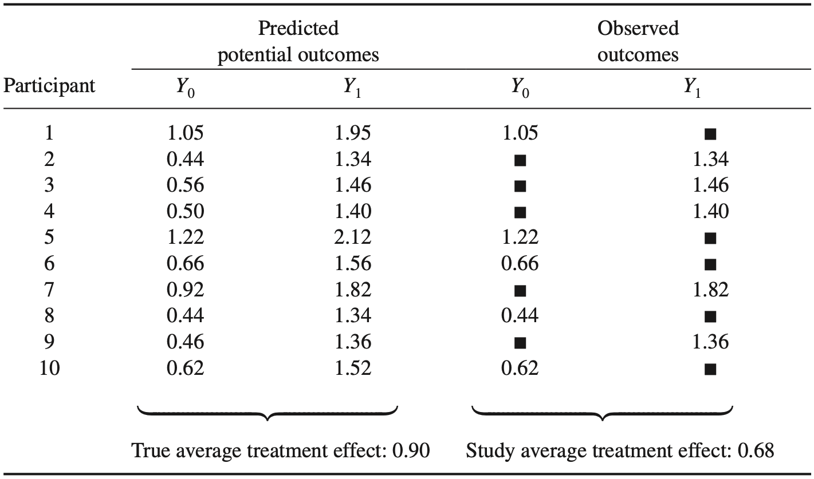

随机试验的这个独特而重要的性质其实并不陌生，因为随机化像干预一样，使得 $X$ 独立于任何可能影响 $Y$ 的变量，如图4.4（b）所示。在这样的条件下，可以令 $Z=\emptyset$ ，应用校正公式（4.16），得到 $E(Y_x)=E(Y\mid X=x)$ ，其中 $x=1$ 代表处理过的个体， $x=0$ 表示未被处理的个体。表4.4帮助我们理解从试验中获取样本均值时，实际上计算的是什么，以及这个均值如何与潜在的反事实 $Y_0$ 和 $Y_1$ 发生联系。

#### 4.3.4 线性模型中的反事实

在非参数化模型中，即使做了大量的试验，形式为 $E(Y_{X=x}\mid Z =z)$ 的反事实的值也可能无法识别。然而，在完全的线性模型中，事情要简单得多。只要能够识别模型参数，任何反事实的也都是可以识别的。这是因为，参数完全定义了模型的函数，正如之前看到的，一旦函数确定了，那么反事实就可以用公式（4.5）来计算。因为每个模型参数都可以用直接因果效应的干预来确定。因此可以得出结论，在线性模型中，每一个反事实都是试验可识别的。那么问题变为，当某些模型参数不能识别时，反事实是否可以在观察研究中被识别出来？事实证明，只要 $E[Y \mid do(X = x)]$ 可识别，那么任何形如 $E(Y_{x} \mid Z = e)$（其中 $e$ 是一个任意的证据集合）的反事实均可被识别（Pearl, 2000:389）。定理4.3.2总结了二者之间的关系，它提供了一种计算反事实的捷径。

**定理4.3.2** 令 $\tau$ 表示 $X$ 到 $Y$ 的总体因果曲线（回归曲线）的斜率，则有

$$
\tau=E(Y\mid do(x+1))-E(Y\mid do(x))
$$

对于任意的证据 $Z = e$ ，有

$$
E(Y_{X=x}\mid Z=e)=E(Y\mid Z=e)+\tau(x-E(X\mid Z=e))\tag{4.17}
$$

这提供了一个线性模型上的反事实的直观解释， $E(Y_{X=x}\mid Z=e)$ 能够通过以下方式计算得到：首先计算证据 $e$ 条件下的 $Y$ 的最优估计 $E(Y\mid e)$ 。然后计算当 $X$ 从当前最佳估计 $E(X|Z=e)$ 转换到它的假设值 $x$ 时 $Y$ 的期望变化，并将之前 $Y$ 的最佳估计加到这个期望变化上。

从方法论上讲，定理4.3.2的重要性在于它能够让研究人员从群体数据中回到关于个体（或个体合集合）的假设问题。在接下来的章节中我们会探讨这个性质在法律和社会场景中的应用。在图4.2展示的情景中，在证据 $e=\{X=0.5,H=1,Y=1\}$ 的条件下计算了反事实 $Y_{H=2}$ 。现在来演示如何将定理4.3.2应用于计算实施后的实施效应（effect of treatment on the treated, ETT）这样的问题中：

$$
ETT=E(Y_1-Y_0\mid X=1)\tag{4.18}
$$

在式（4.17）中替换证据 $e=\{X=1\}$ ，得到

$$
\begin{aligned}
ETT&=E(Y_1\mid X=1)-E(Y_0\mid X=1)\\
&=E(Y\mid X=1)-E(Y\mid X=1)+\tau(1-E(X\mid X=1))-\tau(0-E(X\mid X=1))\\
&=\tau\\
&=b+ac=0.9
\end{aligned}
$$

换句话说，实施后的实施效应（施加于群体的 $X=1$ 的子集合）等于整个群体上的实施效应。这是线性系统中的一般性结果，可以直接从式（4.17）中得出。 $E(Y_{x+1}-Y_x\mid e)=\tau$ 个与证据 $e$ 独立。若将一个乘法（即非线性的）交互项添加到结果方程中时，情况会变得不同。例如，如果图4.1中 $X\to H$ 的箭头反转过来， $Y$ 的方程将变为

$$
Y=bX+cH+\delta XH+U_Y\tag{4.19}
$$

即有一个交与项 $\delta XH$ 被增加到等式中。 $\tau$ 会与ETT有所不同。我们将该问题留给读者作为练习来验证 $\tau-ETT$ 的差值等于 $\frac{\delta a}{1+a^2}$ （思考题4.3.2（c））。

#### 思考题

#### 4.3.2

（a）描述图4.1的参数 $a,b,c$ 如何能从非试验数据中估计得到。

（b）在图4.3的模型中，找出受教育程度对那些薪资 $Y=1$ 的个体的效应。[提示：使用定理4.3.2来计算 $E(Y_1-Y_0\mid Y=1)$ 。]

（c）估计式（4.19）描述的模型中的 $\tau$ 以及 $ETT=E(Y_1-Y_0\mid X=1)$ 。[提示：使用反事实的基本定理、式（4.5）和等式 $E(Z\mid X=x')=R_{ZX}x'$ 。]

### 4.4 反事实的实际应用

现在我们知道了如何计算反事实，进一步了解了反事实在实际应用中很有意义，并且具有启发作用。在这一节中，我们研究一些乍看起来令人困惑的问题，它们可以用前面提到的技术来解决。希望读者在这节中能够对如何应用反事实有一个更好的理解，且能够更深层次地理解为什么要使用它们。

#### 4.4.1 项目招募

**实例4.4.1** 政府正在资助一项工作培训项目，致力于让无业人员回到工作岗位。一个试点的随机试验表明这个项目是有效的，参加这个项目的人员比没有参加这个项目的人员的就业率高。因此，这个项目被批准了，政府随后招募工作人员，为任何无业人员提供免费的工作培训，鼓励失业人员参与这个项目。

你看，项目是成功的，项目培训合格人员的就业率甚至比随机试验还要高。项目开发者很满意这个结果，决定要求更多的资助。

奇怪的是，批评者声称这个项目浪费了纳税人的钱，应该被叫停。他们的推理如下：虽然这个项目在试验研究中或多或少是成功的，参与的人员也是随机选择的，但是参加项目人是那些自愿来参与的。批评者称，自愿参与项目的人比那些没有参与项目的人更灵活，有更多的资源和更多的社会关系，无论参不参与这个项目，他们都更有可能找到工作。批评者称，我们需要估计的是，项目对那些参与者的差量效益，即对于那些参与者，相比于他们当初不参加培训，就业率会有多大程度的提高。

使用下标符号来表示反事实，令 $X=1$ 表示参加培训， $Y=1$ 表示获得工作， 需要估计的量值是培训后的培训效应（ $ETT$ ，更被广泛地称为“实施后的实施效应”，即式（4.18））：

$$
ETT=E(Y_1-Y_0\mid X=1)\tag{4.20}
$$

这里差值上 $Y_1-Y_0$ 表示对一个随机选择的个体，培训（ $X$ ）对雇佣（ $Y$ ）的因果效应，条件 $X=1$ 将选择限制到那些出于自愿选择培训项目的个体。

正如 4.1 节的高速路例子那样，我们看到反事实 $Y_0$ （当初不参加培训的就业率）的前件（ $X=0$ ）和作为条件（ $X=1$ ）事件之间的冲突。高速路例子的反事实分析不能为个体的后悔陈述（“我本来应该走高速路”）提供帮助，但这里的结果有重要的经济意义，例如结束培训项目，或者可能的话重新构建招募策略，来吸引那些能够从项目中有更多收益的人员。

我们既不能从观测数据，也不能从实验数据中估计 $ETT$ 表达式的值。原因还是 $Y_0$ 的下标和条件 $X=1$ 之间的冲突。的确， $E(Y_0\mid X=1)$ 代表了一个培训的人（ $X=1$ ）如果当初不参加培训所能得到工作的期望。这个反事实期望似乎忽略了现实，因为我们永远无法回到过去，拒绝那些参与过培训的人参加培训。然而，在本章后续的章节中我们会看到，尽管有这个冲突，期望  $E(Y_0\mid X=1)$ 在许多场合下还是可被计算的，虽然不是全部场合。其中之一就是变量集合 $Z$ 满足关于实施变量和结果变量的后门准则时。在这种情况下， $ETT$ 概率可以由一个修正的校正公式得到：

$$
P(Y_x=y\mid X=x')=\sum_zP(Y=y\mid X=x,Z=z)P(Z=z\mid X=x')\tag{4.21}
$$

它可以直接由定理4.3.1得到，因为以 $Z=z$ 为条件可得到

$$
P(Y_x=y\mid x')=\sum_zP(Y_x=y\mid z,x')P(z\mid x')
$$

定理4.3.1允许我们用 $x$ 替换 $x'$ ，式（4.6）允许我们从 $Y_x$ 中移除 $x$ ，因此得到式（4.21）。

将式（4.21）与标准的校正公式（3.5）比较，

$$
P(Y=y\mid do(X=x))=\sum_zP(Y=y\mid X=x,Z=z)P(Z=z)
$$

我们看到这两个公式都引用条件 $Z=z$ ，并且在 $z$ 上求均值，不同之处在于式子（4.21）引用了不同的加权平均，使用 $P(Z=z\mid X=x')$ 代替 $P(Z=z)$ 。

使用式（4.21），可以为 $ETT$ 找到一个可计算的、非反事实的表达式：

$$
\begin{aligned}
ETT&=E(Y_1-Y_0\mid X=1)=E(Y_1\mid X=1)-E(Y_0\mid X=1)\\
&=E(Y\mid X=1)-\sum_zE(Y\mid X=0,Z=z)P(Z=z\mid X=1)
\end{aligned}
$$

其中，最后那个表达式的第一项是使用式（4.6）的一致性原则得到的。换句话说， $E(Y_1\mid X=1)=E(Y\mid X=1)$ ，这是因为以 $X=1$ 为条件时， $X$ 当初取值为1的 $Y$ 的值就是 $Y$ 的观测值。

另一个允许识别 $ETT$ 的场合是，对于二值变量 $X$ ，可以获取分别以 $P(Y = y\mid do(X=x))$ 和 $P(X=x,Y=y)$ 形式表示的试验数据和非试验数据。还有一个场合是当 $X$ 和 $Y$ 之间存在一个中介变量满足前门准则（图 3.10(b)）时。这些场合的共同点是通过查看因果图能够告诉我们 $ETT$ 是可计算以及如何计算。

#### 思考题

#### 4.4.1

（a）证明：如果 $X$ 是二值的，实施后的实施效应既可以从观测数据也可以从试验数据中估计得到。[提示：分解 $E(Y_x)$ 为 $E(Y_x) = E(Y_x\mid X')P(X')+E(Y_x\mid X)P(X)]$ 。

（b）应用问题（a）的结果来解决具有表 1.1 非试验数据的辛普森悖论，估计治疗对于那些自愿使用药物的人的效应。[提示：假设性别是唯一的混杂因素，估计 $E(Y_x)$ 。]

（c）利用定理 4.3.1 和图 3.3 中 $Z$ 满足后门准则的事实，再次回答问题（b），说明两个答案是一致的。

#### 4.4.2 添加干预

**实例4.4.2** 在许多试验中，外部操作要求对 $X$ 增加（或者减少）一些数量，而不变更 $X$ 之前的原因，正如 $do(x)$ -操作要求的那样。例如，我们给一组已经具有不同胰岛素水平的患者（增加）5mg/l的映岛素。这里，操纵变量之前的影响继续发挥作用，又添加了一个新的数量，个体之间的差异仍然存在，这样干预的效应能够从观察研究中预测出吗？或者能够从 $X$ 被预先统一设置为 $x$ 值的试验研究中预测出来吗？

如果用反事实变量来描述这个问题，答案变得显而易见。假设对一个当前水平为 $X=x$ 的变量 $X$ 增加数量 $q$ ，结果将会变成了 $Y_{x'+q}$ ，这个结果在当前水平 $X = x’$ 的所有个体中的平均值是 $E(Y_x\mid x')$ ，其中， $x=x'+q$ 。这里再次遇到 $ETT$ 表达式 $E(Y_x\mid x')$ 。我们可以将上节实例的方法应用到这个实例上，特别地，可以立刻得到结论，只要模型中的某个变量集合 $Z$ 满足后门准则，那么添加干预的效应就可以用式（4.21）的 $ETT$ 校正公式来估计。在式（4.21）中执行替换 $x=x′+q$ 并取期望，可以得到这个干预的效应，我们称之为 $add(q)$ ：

$$
\begin{aligned}
E(Y\mid add(q))-E(Y)&=\sum_{x'}E(Y_{x'+q}\mid X=x')P(X=x')-E(Y)\\
&=\sum_{x'}\sum_zE(Y\mid X=x'+q,Z=z)P(Z=z\mid X=x')P(X=x')E(Y)
\end{aligned}\tag{4.22}
$$

在我们的例子中， $Z$ 可能包含诸如年龄、体重或者遗传因案等变量，仅要求这些变量中的每一个都可测量，且它们满足后门准则。

同样地，对于所有其他可识别的 $ETT$ 例子，都可以确保这个效应的可计算性。

这个例子展示了利用反事实来估计实际干预措施的效应，这些干预虽然不是总能被描述为do-表达式，但是在某些情况下，还是可以估计的。一个很自然的问题出现了：为什么需要求助反事实来预测一个相当常见的干预效应呢？这个效应明明可以通过在群体水平上进行简单的试验来估计。我们简单地将一组随机选择对象分成两部分，对一半的对象施加 $add(q)$ 类型的干预，然后将该组的期望值与 $add(0)$ 组的期望值进行比较。那么，如果这个答案通过简单的随机试验即可得到，我们为什么要去寻求反事实和 $ETT$ 这些令人费解的神秘方式来实施这些添加性干预呢？

实际上，我们需要求助反事实，仅仅是因为解决问题的目标。科学家总是通过do-表达式来得到他们的试验发现，但是 $E(Y \mid \text{add}(q))$ 的值的计算不能归约为do-表达式。当然，这并不是说 $E(Y \mid \text{add}(q))$ 的值不能从特别设计的试验中获得。这仅仅表明，除了实施这样的特别试验外， $E(Y \mid \text{add}(a))$ 的值不能从已知的知识中推理得到，也不能从 $X$ 被统一赋值为 $X=x$ 的总体上的标准试验中得到。我们通过理想的标准试验来寻求基本判断的理由是：它们提供了科学知识。科学家感兴趣的是添加胰岛素后的量化效应，从给定的水平 $X = x$ 添加到另一个水平 $X = x + q$ ，这种增加可以由 do-表达式来刻画： $E(Y \mid do(X = x + g)) - E(Y \mid do(X = x))$ 我们将这种方法称为“科学的”，是因为它在生物学上是有意义的。也就是说，它的试验内容在群体中是一样的（所有胰岛素浓度水平为 $X = x$ 的患者被添加同量的胰岛素，并通过血液检测持续追踪患者的胰岛素浓度水平）。相比之下，添加性干预案例中的决策问题没有这种不变性质；要求的是给每个人添加一个增量 $q$ 的平均效应，无论该个体的当前水平 $x$ 是多少。它不是那么容易实现的，因为它对群体中的分布率 $P(X=x)$ 是敏感的。这导致标准试验给出的结果与决策者要求估计每个不同个体增加 $q$ 量胰岛素后的平均效应之间是不一致的。因此，为了使二者一致，我们需要诉诸一种个体水平分析（即反事实）的语言，也就不足为奇了。

读者也可能会奇怪为什么 $E(Y \mid \text{add}(q))$ 不等于平均因果效应 $\sum_x(E(Y\mid do(X=x+q))-E(Y\mid do(X=x)))P(X=x)$ 毕竟，我们知道在水平 $X=x$ 中加入 $q$ 会将它的 $Y$ 的期望增加 $E(Y \mid do(X = x + q)) - E(Y \mid do(X = x))$ ，然后对 $X$ 求这个增加的平均值，就能得到这个决策问题 $E(Y \mid add(q))$ 的答案。不幸的是，这种平均方法并没有反映这类决策问题的本质，这种平均方法代表了这样一个试验：在这个试验中，对象随机从群体中选择，比例为 $P(X = x)$ 的群体被赋予一个额外剂量 $q$ ，其他的保持不变。但在这个决策问题中情况有所不同，因为 $P(X = x)$ 表示通过自然选择获得水平 $X = x$ 的对象的比例，我们不能排除这样的可能：相比干预试验环境中“选择”出来的 $X = x$ 的对象，通过自然选择的 $X = x$ 水平的对象会对 $add(q)$ 有不同的反应。例如，很有可能在试验选择的条件下，那些对 $add(q)$ 高度敏感的人会尝试降低他们的 $X$ 水平，这会影响和干扰试验的客观性。

我们将其转化为反事实分析，可写为不等式

$$
E(Y\mid add(q))=\sum_xE(Y_{x+q}\mid x)P(X=x)\neq\sum_xE(Y_{x+q})P(X=x)
$$

只有当 $Y_x$ 独立于 $X$ 时，等式成立，这相当于非混杂的情形（参看定理 4.3.1）。如果 $Y_x$ 不独立于 $X,E(Y\mid\text{add}(q))$ 的估计可以通过某q-特定干预或者一个更强的假设来完成，该假设要能够将 $ETT$ 转换为 do-表达式，如同式（4.21）一样。

#### 思考题

#### 4.4.2

乔从前没有吸过烟，但是由于同辈压力和其他个人因素的影响，他决定开始吸烟。他买了一包香烟，回家后问自己：“我要开始吸烟了，我应该吗？”

（a）以 ETT 的形式从数学上形式化表述乔的问题，假设感兴趣的结果是肺癌。

（b）相比他拒绝吸烟，假定他决定开始吸烟，哪种类型的数据能让乔估计自己患癌症的概率？

（c）使用表 3.1 中的数据来估计与（b）中决策相关的数值。

#### 4.4.3 个人决策制定

**实例4.4.3** 琼斯女士是一位癌症患者，她要在两种可能的治疗方案之间做出选择：（i）乳房肿瘤切除术，（ii）乳房肿瘤切除术加放疗。在咨询了她的肿瘤医生后，她决定选择方案（ii）。10年后，琼斯女士还活着，肿瘤没有复发。她思考：我还活着是因为放疗吗？

另一方面，史密斯夫人仅做了乳房肿瘤切除术，一年后她的肿瘤复发了。她很后悔：我本来应该接受放疗的。

这些猜测能够从统计数据中得到证实吗？此外，证实琼斯女士的正确选择或史密斯夫人的遗憾有什么益处吗？

当然，放疗的总体效果可以由随机试验确定。的确，在2002年10月17日，新英格兰医学杂志发表了一篇Fisher等作者的论文，描述了一项随机试验的20年随访结果，比对了仅做乳房肿瘤切除术和乳房肿瘤切除术加放疗的两种治疗方案。论文表明乳房肿瘤切除术附加放疗可以显著减少乳腺癌的复发（14% 对比 39%）。

然而，这些都是总体数据的结果，我们能从中推断出琼斯女士和史密斯夫人的特定案例结果吗？如果能够这样做，除了支持琼斯女士对她的决定的满意度，或者强化史密斯夫人的失败感，我们还能得到什么呢？

当然，放疗的总体效果可以由随机试验确定。的确，在2002年10月17日，《新英格兰医学杂志》发表了一篇Fisher等作者的论文，描述了一项随机试验的20年随访结果，对比了仅做乳房肿瘤切除术和乳房肿瘤切除术加放疗的两种治疗方案。论文表明乳房肿瘤切除术附加放疗可以显著减少乳腺癌的复发（14%对比39%）。

然而，这些都是总体数据的结果，我们能从中推断出琼斯女士和史密斯夫人的特定案例结果吗？如果能够这样做，除了支持琼斯女士对她的决定的满意度，或者强化史密斯夫人的失败感，我们还能得到什么呢？

为了回答第一个问题，首先必须使用反事实把琼斯女士和史密斯夫人的问题以数学的形式表示出来。如果指定 $Y = 1$ 代表病情有所缓解， $X = 1$ 代表实施放疗，那么确定琼斯女士有理由将她的病情缓解归因为放疗（ $X = 1$ ）的概率是：

$$
PN=P(Y_0=0\mid X=1,Y=1)\tag{4.23}
$$

它的含义是，在给定琼斯女士实际做了放疗（ $X = 1$ ）、病情得到缓解（ $Y = 1$ ）的条件下，如果当初不做放疗，病情不会缓解（ $Y = 0$ ）的概率。符号 PN 代表“必要性概率”，它衡量了琼斯女士的决定对她的积极结果的必要程度。

同样地，史密斯夫人后悔成立的概率是

$$
PS=P(Y_1=1\mid X=0,Y=0)\tag{4.24}
$$

它的含义是：在给定史密斯夫人实际上没有做放疗（ $K=0$ ）、病情设有缓解（ $Y=0$ ）的条件下，如果她当初做了放疗（ $X=1$ ）的话，病情得到缓解的概率。PS代表“充分性概率”，它衡量了当初没有采取的行动（ $X=1$ ）对于她的恢复的充分性程度。

这两个概率（有时被称为“因果概率”）在所有归因的问题中有重要的作用，范围涵盖了从法律责任到个人决策制定。一般来说，它们既不能从观察数据也不能从试验数据中直接得到，但正如将在下面看到的，当观察数据和试验数据都可用时，它们在某些条件下是可估计的。

但是在开始定量分析之前，让我们先来回答第二个问题：评估这些回顾性的反事实参数能获得什么呢？一个答案是，诸如后悔和成功、正确和错误等概念不仅仅有情感上的价值，它们在认知发展和适应性学习中也扮着重要的角色。证实琼斯女士的正确决策会增强她在决策制定策略上的信心，这可能包括她的医疗信息来源、她对风险的态度、她的主次观念以及她将所有这些考虑放在一起的策略等。对于后悔的分析驱使我们识别策略中弱点的来源，并思考一些能够改进它们的方法。通过反事实强化，我们学习改进自己决策的制定过程，并获得更好的表现。正如凯瑟琳·舒尔在其书《Being Wrong》中说的：“尽管我们的错误会令我们困惑，或者给我们造成困难，抑或令我们感到羞辱，但是最终却是失败，而不是成功教会我们：我们是谁。”

估计对错的概率也会对关键决策的制定产生切实而深远的影响，想象有第三位女士戴利女士，她面对和琼女士一样的抉择，她告诉自己：如果我的肿瘤是那种只做肿瘤切除手术就不会复发的类型，我为什么要经历放疗的痛苦呢？同样地，如果我的肿瘤是那种无论我做不做放疗都会复发的类型，我宁愿不做放疗。我做放疗的唯一原因是我的肿瘤是那种做了放疗会缓解，不做放疗会复发的类型。

从形式上来说，戴利女士的困境是要在必要性和充分性两方面量化放疗对于消除肿瘤的概率：

$$
PNS=P(Y_1=1,Y_0=0)\tag{4.25}
$$

其中 $Y_1$ 和 $Y_0$ 分别表示接受放疗（ $Y_1$ ）和不接受放疗（ $Y_0$ ）下康复的情况。知道这个概率就能够帮助戴利女士判断她属于 $Y_1=1$ 且 $Y_0=0$ 这种类型的可能性。

当然，这个概率不能从试验研究中得出，因为我们永远无法从试验数据中分辨出，如果一个人当初采用不同的治疗方案，结果是否会有所不同。然而，将戴利女士的问题表述为数学形式后，就能够用代数方法来研究需要什么样的假设才能估计 PNS，以及从什么数据中估计。在 4.5.1 节将会看到，如果假设单调性，即放疗不会引发将要缓解的肿瘤复发，那么 PNS 确实可以被估计出来。此外，在单调性条件下，试验数据足以得出结论：

$$
PNS=P(Y=1\mid do(X=1))-P(Y=1\mid do(X=0))\tag{4.26}
$$

例如，如果使用 Fisher 等作者（2002）的试验数据，那么计算戴利女士的 PNS 为

$$
PNS=0.86-0.61=0.25
$$

因此，她的肿瘤有 25% 的概率在实施了乳房肿瘤切除术和放疗后会缓解，但只做乳房肿瘤切除术会复发。这种个体风险的量化在个人决策制定方面非常重要，且只能通过反事实分析和适当的假设从总体数据中推断这种风险。

#### 4.4.4 招聘中的歧视

**实例 4.4.4** 玛丽对纽约的 $XYZ$ 国际公司提出法律诉讼，指控其在招聘中受到歧视。根据她的诉讼，她申请了 $XYZ$ 国际公司的职位，她拥有工作所需的全部证书，但她没有被录用。她声称，这是因为在她面试的过程中提到自己离异。此外，她声称， $XYZ$ 国际公司的聘用档案显示出对离异员工的一致性歧视偏向。她的诉讼成立吗？聘用记录能证明 $XYZ$ 国际公司在拒绝她的工作申请时有歧视吗？

美国法院对雇佣歧视签发了明确的指示。依据相关文件，在任何聘用歧视案件中的关键问题是：如果应聘者当初是另一种群体（年龄、性别、信仰、民族血统等），且当初其他条件均不变时，雇主是否将采取相同的行为。

需要注意的是，第一，它不是一个基于群体的准则，而是针对上诉的原告个体；第二，它是用反事实的术语陈述的，使用了诸如“当初将采取”“应聘者当初是”“当初不变”等术语。它们意味着什么呢？研究者能证明玛丽当初未离异的话，雇主当初将采取不同的行为吗？当然，这不是一个能够在试验环境中干预的变量。观察所研究的数据能证明雇主存在歧视吗？

虽然玛丽的案例在表面上与实例 4.4.3 存在差异，但它与史密斯夫人面对的不成功的癌症治疗问题有很多相似之处。玛丽由于她的婚姻状况而未被录取的概率可以用充分性概率来表示：

$$
PS=P(Y_1=1\mid X=0,Y=0)
$$

在这个案例中， $Y$ 代表玛丽的聘用情况， $X$ 代表面试官对于玛丽婚姻状况的感知。这个表达式表示：在给定面试官知道玛丽离异，且玛丽没有被录用的条件下，如果面试官当初知道玛丽未离异的话，玛丽当初将被聘用的概率（注意，问题中的变量是面试官对于玛丽婚姻状况的感知，并不是玛丽实际的婚姻状况，因为在这个例子中，感知上的干预非常简单，我们只需要设想玛丽从来没有提及她离异）。

我们将在 4.5.2 节中展示，虽然在个体案例中歧视无法被证实，但是这种歧视发生的概率能够被确定，这个概率有时能达到一个接近证实的水平。下一个关于性别歧视的实例探讨歧视问题是怎样呈现给政策制定者，而不是法官的。

#### 4.4.5 中介和路径阻断干预

**实例4.4.5** 一个政策制定者希望评估一项措施以减少招聘中性别差异的程度，这项措施是在聘用过程中令性别固案不可见，而不是消除在教育和工作培训中的性别不平等。前者关注的是性别对聘用的“直接效应”，而后者关注的是“间接效应”，或者通过就业资格表现的效应。

在这个例子中，纠正雇主的偏见和开展敏育改革是两个竞争的政策选项，需要昂贵的投资及不同的实现策略。预先知道这两个政策中的哪一个会对减少招聘差异产生更大的影响，对于决策是至关重要的。这种判断在很大程度上依赖于中介分析技术，例如，知道当前招聘中引起性别差异的主要原因是雇主偏见，会使教育改革变得多余，这一事实可以节省大量资源。然而需要注意，本例中的决策关注的是方案的启用和放弃，而不是降低或提高方案中某些特定变量的值。教育改革提案要求放弃当前的教育项目，代之以一个新项目，该项目中女性获得与男性同样的教育机会。招聘改革提案要求放弃当前招聘流程，代之以一个性别在聘用决策中不起任何作用的过程。

因为要处理的是方案取舍而不是改变原有变量的水平，因此没有办法使用面-操作来表示这类干预的效应，如同在3.7节的中介分析中所做的那样。然而可以用反事实的语言表示它，将所需的最终结果作为前件。例如，如果想要成功实现招聘过程中性别因素不可见，然后评估招聘的性别差异，这可以将所有女性求职者都认为是男性作为一个前件，并在这样的反事实条件下估计录用率。

分析过程如下。在给定雇主把女性求职者认为是男性的情况下，具有资格 $Q=q$ 的女性求职者的录用状态（ $Y$ ）可由反事实 $Y_{X=1,Q=q}$ 刻画，其中 $X=1$ 表示称为男性。但是因为 $q$ 值因求职者的不同而不同，因此需要根据女性求职者的分布来平均这个量值，得到 $\sum_qE(Y_{X=1,Q=q})P(Q=q\mid X=0)$ 。男性求职者的录用概率与此类似，只需将女性求职者的分布替换为男性求职者的分布并计算平均值，得到 $\sum_qE(Y_{X=1,Q=q})P(Q=q\mid X=1)$ 。

如果将两式相加，得到

$$
\sum_qE(Y_{X=1,Q=q})(P(Q=q\mid X=0)-P(Q=q\mid X=1))
$$

该式表示求职者的性别对招聘结果的间接效应。我们把这个效应称为自然间接效应（natural indirect effect, NIE），因为允许资格 $Q$ 自然地因应职者不同而不同，与第3章中的受控直接因果效应相反。在受控直接因果效应中，是在整个群体上将中介变量（即这里的 $Q$ ）固定为常数水平，而在这里仅仅阻断了 $Y$ 对 $X$ 直接做出响应的能力，而不改变它对 $Q$ 做出响应的能力。

下一个问题是，这样的一个反事实表达式能否从数据中识别出来。Pearl（2001）中表明在没有混杂的情况下，NIE 可通过条件概率估计，得到

$$
NIE=\sum_qE(Y\mid X=1,Q=q)(P(Q=q\mid X=0)-P(Q=q\mid X=1))
$$

这个表达式称为中介公式。已衡量的是 $X$ 对 $Y$ 的效应可由其对中介变量 $Q$ 的效应进行解释的程度。反事实分析允许我们定义和评估 NIE，方法是“冻结” $X$ 对 $Y$ 的直接因果效应，并允许个体的中介变量（ $Q$ ）以自然的方式对 $X$ 的变化做出反应，仿佛 $X$ 没有被“冻结”。

4.5节总结了在估计各种不同中介时所需要的数学工具。

### 4.5 用于归因和中介的数学工具包

在4.4节讨论反事实分析的实际应用时，我们注意到几个重复出现的模式，它们常被用于数学表达式及求解方法中。第一个是实施后的实施效应ETT，它的句法特征是反事实表达式 $E(Y_x\mid X=x')$ ，其中 $x$ 和 $x’$ 是 $X$ 的两个不同的值。如同项目招募（4.4.1节）与添加干预（4.4.2节）展示的那样，不同的问题都依赖于这个表达式的估计。我们已经列举过什么条件下的估计是可行的，以及估计的结果（式（4.21）和式（4.8））。

另一个重复出现的模式出现在归因问题中，例如个人决策问题（实例4.4.3）和可能的歧视案例（实例4.4.4）。这个模式是必要性概率的表达式：

$$
PN=P(Y_0=0\mid X=1,Y=1)
$$

必要性概率也出现在法律责任问题中，这里它的表述是：“给定实际实施的行为（ $X=1$ ），在损失已经发生了（ $Y=1$ ）的条件下，如果当初不实施这个行为，损失将不发生（ $Y_0=0$ ）的概率。”4.5.1节总结了结合观察数据和试验数据来估计（或者界定）PN的数学结果。

最后，在中介问题中（实例4.4.5），主要的反事实表达式是：

$$
E(Y_{x,M_{x'}})
$$

它表述的是：“在当初的方案是 $X=x$ ，且同时中介变量 $M$ 获得值（ $M_{x'}$ ）的条件下，期望的结果（ $Y$ ）。其中， $M_{x'}$ 是当初 $X$ 取值为 $x’$ 时， $M$ 所取到的值。4.5.2节将列出什么条件下这个“嵌套的”反事实表达式能够被估计，以及估计的结果和它们的解释。

#### 4.5.1 用于归因和因果概率的工具包

假定二值事件， $X=x$ 和 $Y=y$ 分别表示治疗和结果， $X=x',Y=y'$ 分别表示它们的否定，我们的目标值由这样的句子定义：

“在给定现实中 $X$ 是 $x$ ， $Y$ 是 $y$ 的条件下，找出如果 $X$ 当初取值为 $x'$ ， $Y$ 当初将是 $y'$ 的概率。”

数学上表述为

$$
PN(x,y)=P(Y_{x'}=y'\mid X=x,Y=y)\tag{4.27}
$$

这个反事实的数值 $PN$ 名为“必要性概率”，刻画了“若非（but for）”的法律评判准则。根据这个准则，当且仅当“如果没有被告的行为，损失不会发生”这个事件具有“肯定偏向”时，应该作出有利于原告的判决（Robertson, 1997）。

为PN写下形式化表达式（4.27），然后就可以进行识别，探寻什么样的假设允许我们从实证研究中识别PN，研究可以是观察性的、试验性的，或者二者的结合。

这个问题的数学分析（Pearl, 2000：第9章）有如下结果：

**定理4.5.1** 如果 $Y$ 关于 $X$ 是单调的，即对于所有的 $u,Y_1(u)\ge y_0(u)$ ，只要因果效应 $P(Y\mid do(x))$ 可识别，PN就可识别，并且

$$
PN=\frac{P(y)-P(Y\mid do(x'))}{P(x,y)}\tag{4.28}
$$

或者，设 $P(⁠y⁠) = P(y\mid x)P(x) + P(y\mid x')(1 - P(x))$ ，代入式（4.28），得到

$$
PN=\frac{P(y\mid x)-P(Y\mid x')}{P(y\mid x)}+\frac{P(y\mid x)-P(Y\mid do(x'))}{P(x,y)}\tag{4.29}
$$

式（4.29）等号右边第一项被称作过剩风险案（excess risk ratio，ERR），它经常用在没有试验数据的诉讼案例中（Greenland, 1999）。它也被称作接受治疗群体中的可归因风险比例（Jewell, 2004：第4.7节）。第二项混杂因子（confounding factor, CF）表示需要为混杂偏差考虑的校正，即 $P(y\mid do(x'))\neq P(y\mid x')$ 。也就是说，试验中为个体指定治疗方案 $X = x$ ，其治疗效果 $Y = y$ 群体的比例，与个体通过自愿选择治疗方案 $X = x'$ ，其治疗效果 $Y = y$ 的群体比例不一样时，混杂就会发生。例如，假设有一起针对汽车制造商的案件，声称其汽车设计缺陷导致了一名男子在车祸中丧生。ERR告诉我们当驾驶该制造商生产的汽车时，人们在车祸中死亡的可能性增加多少。如果事实证明，自愿购买该制造商汽车的人比一般人群更容易超速（导致车祸），那么第二项（即混杂校正项）会调整这个偏差。

因此，无论是通过随机试验还是借助图模型的观察研究（例如通过后门准则），只要因果效应 $P(y\mid do(x))$ 可估计，式（4.29）就提供了一个单调性条件下对必要性因果可估计的度量。更重要的是，研究（Tian et al., 2000）还表明表达式（4.28）提供了在一般的非单调性例子中PN的下界。特别地，PN的上下界为：

$$
\text{max}\{0,\frac{P(y)-P(y\mid do(x'))}{P(x,y)}\}\le PN\le\text{min}\{1,\frac{P(y'\mid do(x'))-P(x',y')}{P(x,y)}\}\tag{4.30}
$$

在药物相关的诉讼案例中，通常可以从试验和观察研究中获得效据。试验数据通常可以从制造商或者批准药物发售的机构（例如FDA）处获得，而观测数据可以通过对于群体的调查问卷获得。

通过代数学的几个步骤可以让我们把下界（LB）和上界（UB）表示为：

$$
LB=ERR+CF
$$

$$
UR=ERR+q+CF\tag{4.31}
$$

其中， $ERR, CF$ 和 $q$ 被定义为：

$$
CF\triangleq[P(y\mid x')-P(y_{x'})]/P(x,y)\tag{4.32}
$$

$$
ERR\triangleq 1-1/RR=1-P(y\mid x')/P(y\mid x)\tag{4.33}
$$

$$
q\triangleq P(y'\mid x)/P(y\mid x)\tag{4.34}
$$

这里，CF代表了未服药（ $X=x'$ ）的群体中标准化的混杂程度，ERR是“过剩风险率”， $q$​ 是服药群体中负面结果与正面结果的比率。

图4.5描述了ERR函数的这些边界情形，其中，图4.5(a)展示了必要性概率（PN）作为过剩风险率（ERR）和混杂因子（CF）的函数（公式（4.31））是如何受限的；图4.5(b)展示了当单调性假设成立时，PN是如何被识别的（定理4.5.1）。图4.5揭示了三个有用的特征：第一，无论混杂如何，UB-LB的区间总是保持一个常数，并且仅依赖于一个可观察的参数 $q=P(y'\mid x)/P(y\mid x)$ 。第二，当ERR本身的值偏小时，CF通过提高下界来提升“多半如此”的判断，即PN > 1/2。最后，两个边界“上升”的数量是由CF给定的，它是唯一需要从试验数据中估计的，并不需要计算因果效应 $P(y_x)−P(y_{x'})$ 。

定理4.5.1进一步保证了：如果假设有单调性，那么上界和下界是一致的，二者之间的间隔会消失，正如图4.5（b）展示的。这个消失并不意味着 $q=0$ ，而是由上下界公式（4.30）转换为准确公式（4.28）了。

如果试验数据和问卷调查数据是从相同的群体中随机获取的，那么试验数据可以用来估计感兴趣的反事实问题，既可以针对观测数据，也可以针对抽样总体，例如 $P(Y_x=y)$ 。

**实例4.5.1（法律情景中的归因）**有一个起诉药物 $x$ 的制造商的诉讼案件声称，该药物很可能导致了 $A$ 先生的死亡， $A$ 先生服用该药物以缓解背部疼痛。制造商称根据对患有背部疼痛的患者所做的试验数据，可确定药物 $x$ 仅对死亡率有微小的效应。然而，原告辩论，试验研究跟这个案例没有相关性，因为试验数据反映的是参加研究的受试者的平均效应，而不是像 $A$ 先生这种未参加研究的个体。特别地，原告辩论， $A$ 先生独特的地方在于他是出于自愿服用该药物的，不像试验研究中的对象，他们是遵从试验协议来服用药物的。为了支持这个辩论，原告提供了像 $A$ 先生这种受试者的非试验数据，这些患者自愿选择药物 $X$ 来缓解背部疼痛，但却没有参加任何试验，而且非试验中那些服药的人比不服用药物的人有更高的死亡率。法庭必须基于试验数据和非试验数据决定，药物 $x$ 是 $A$ 先生死亡原因的这个论断是否具有“肯定偏向”性。

为了展示式（4.30）中上下界的用途，考虑表4.5中与实例4.5.1研究有关的（假设）数据（在下述的分析中忽略抽样的差异性），其中，PN表示药物 $x$ 是个体死亡（ $y$ ）原因的概率。

试验数据提供如下估计：

$$
P(y\mid do(x))=\frac{16}{1000}=0.016\tag{4.35}
$$

$$
P(y\mid do(x'))=\frac{14}{1000}=0.014\tag{4.36}
$$

然而非试验数据提供如下估计：

$$
P(y)=\frac{30}{2000}=0.015\tag{4.37}
$$

$$
P(x,y)=\frac{2}{2000}=0.001\tag{4.38}
$$

$$
P(y\mid x)=\frac{2}{1000}=0.002\tag{4.39}
$$

$$
P(y\mid x')=\frac{28}{1000}=0.028\tag{4.40}
$$

表4.5 用于说明估计PN所使用的实验数据和非实验数据

<table align="center">
  <tr>
    <th align="center" rowspan="2"></th>
    <th align="center" colspan="2">实验数据</th>
    <th align="center" colspan="2">非实验数据</th>
  </tr>
  <tr>
    <th align="center">do(x)</th>
    <th align="center">do(x')</th>
    <th align="center">x</th>
    <th align="center">x'</th>
  </tr>
  <tr>
    <td align="center">死亡 (y)</td>
    <td align="center">16</td>
    <td align="center">14</td>
    <td align="center">2</td>
    <td align="center">28</td>
  </tr>
  <tr>
    <td align="center">存活 (y')</td>
    <td align="center">984</td>
    <td align="center">986</td>
    <td align="center">998</td>
    <td align="center">972</td>
  </tr>
</table>

假设药物 $x$ 仅能导致（但从不阻止）死亡，单调性成立，根据定理4.5.1（式（4.29））有：

$$
\begin{aligned}
PN&=\frac{P(y\mid x)-P(y\mid x')}{P(y\mid x)}+\frac{P(y\mid x')-P(Y\mid do(x'))}{P(x,y)}\\
&=\frac{0.002-0.028}{0.002}+\frac{0.028-0.014}{0.001}=-13+14=1
\end{aligned}\tag{4.41}
$$

我们看到，观察的ERR是负值（-13），给人留下药物实际上阻止了死亡的印象，但是偏差校正项（+14）修正了这个印象，使得必要性的概率（PN）为1。此外，由于式（4.30）的下界变成了1，故可以得出结论：甚至不需要假设单调性，PN=1.00。因此原告是正确的。除非抽样本身有问题，数据提供了充分的担保证实药物 $x$ 确实是 $A$ 先生死亡的原因。

为了使归因的工具包完整，我们注总到在个人决策制定（实例4.4.3）的讨论中出现了另外两个概率：PS和PNS，它们可以通过相似的表达式进行界定。详见Pearl（2000：第9章）和Tian等（2000）。

尤其是，当 $Y_x(u)$ 单调的时候，有

$$
PNS=P(Y_x=1,Y_{x'}=0)=P(Y_x=1)-P(Y_{x'}=1)\tag{4.42}
$$

如同在实例4.4.3式（4.26）中描述的那样。

#### 思考题

#### 4.5.1

考志实例4.4.3中描述的琼斯女士面对的困境。假设除了Fisher等（2002）的试验结果外，她还能够获得一个观察研究，根据该研究，在所有患者中肿瘤复发的概率是30%（无论是否接受治疗），而在复发的案例中，70%的个体没有选择放疗。使用式（4.30）中提供的界限来更新她的接受放疗对于复原是有必要的估计。

#### 4.5.2 用于中介的工具包

一个典型中介问题的标准模型有如下形式：

$$
t=f_T(u_T),m=f_M(t,u_M),y=f_Y(t,m,u_Y)\tag{4.43}
$$

其中 T（治疗）、M（中介）、Y（结果）是离散的或者连续的随机变量； $f_T,f_M,f_Y$ 是任意的函数： $U_T,U_M,U_Y$ 分別表示影像 $T,M,Y$ 的未知因素。三元组 $U=(U_T,U_M,U_Y)$ 是一个随机向量，解释了个体间的所有差昇。

在图4.6（a）中，未知因素被假定为任意分布，并且相互独立。在图4.6（b）中，连接 $U_T$ 和 $U_M$ （以及 $U_M$ 和 $U_T$ ）的虚弧线表示这些因素可能是相互依赖的。

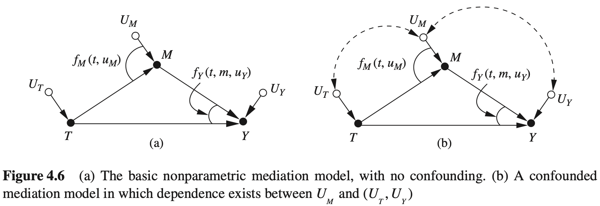

**1. 直接因果效应和间接因果效应的反事实定义**

使用式（4.43）中的结构模型和4.2.1节中定义的反事实符号，可以为 $T=0$ 到 $T=1$ 的变化定义四种类型的因果效应。也可以推广到任意的情形，如从 $T=t$ 到 $T=t'$ 。

（a）总因果效应

$$
TE=E(Y_1-Y_0)=E(Y\mid do(T=1))-E(Y\mid do(T=0))\tag{4.44}
$$

TE衡量了当治疗方案从 $T=0$ 变为 $T=1$ 时，同时允许中介变量自然地随 $T$ 变化而变化（即函数 $f_M$ 所描述的那样）时， $Y$ 的期望增加值。

（b）受控直接因果效应

$$
\begin{aligned}
CDE(m)&=E(y_{1,m}-Y_{0,m})\\
&=E(Y\mid do(T=1,M=m))-E(Y\mid do(T=0,M=m))
\end{aligned}\tag{4.45}
$$

CDE度量了当治疗方案从 $T=0$ 变为 $T=1$ 时，同时在整个群体上统一地将中介变量设置为一个特定的水平 $M=m$ 时， $Y$ 的期望增加值。

（c）自然直接因果效应

$$
NDE=E(Y_{1,M_0}-Y_{0,M_0})\tag{4.46}
$$

NDE度量了当治疗方案从 $T=0$ 变为 $T=1$ 时，同时将中介变量设置为变化之前（即 $T=0$ ）获得的值（对于每一个个体）， $Y$ 的期望增加值。

（d）自然间接因果效应

$$
NIE=E(Y_{0,M_1}-Y_{0,M_0})\tag{4.47}
$$

NIE度量了当治疗方案被固定为常数， $T=0$ ，且 $M$ 变为 $T=1$ 条件下自身获得的值（对于每一个个体）时， $Y$ 的期望增加值。因此，它刻画了当阻断 $Y$ 对 $X$ 作出响应时，仅由中介变量的变化所引发的效应。

我们注意到，一般情况下，总因果效应可被分解为

$$
TE=NDE-NIE_r\tag{4.48}
$$

其中， $NIE_r$ 代表了反向转换，即从 $T=1$ 到 $T=0$ 时的NIE。这意味着只要NDE和TE可识别，NIE即可识别。在线性系统中，反向转换相当于原来效应公式的反号，因此有标准的公式： $TE = NDE + NIE$ 。

我们进一步注意到，TE和CDE(m)是do-表达式，因此能够使用后门或者前门校正公式从试验数据或者在观察研究中估计它们。而NDE和NIE则不能，它们的识别需要一组新的假设。

**2.识别自然因果效应的条件**

下面的条件集合（标记为A-1到A-4），对于识别直接自然因果效应和间接自然因果效应是充分的。

假如存在一个可测量的变量集合 $W$ 也满足如下条件，则可以识别NDE和NIE：

A-1： $W$ 中没有 $T$ 的后代；

A-2： $W$ 阻断了所有 $M$ 到 $T$ 的后门路径（移除 $T\to M$ 和 $T\to Y$ 后）；

A-3： $T$ 对 $M$ 的 W-特定因果效应可识别（使用试验或者校正）；

A-4： $\{T,M\}$ 对 $Y$ 的 W-特定因果效应可识别（使用试验或者校正）。

**定理 4.5.2（NDE 的识别）** 当条件 A-1 和 A-2 满足时，自然直接因果效应可由试验识别，计算公式为

$$
\begin{aligned}
NDE=&\sum_m\sum_w[E[Y\mid do(T=1,M=m),W=w]-E[Y\mid do(T=0,M=m), W=w]]\\
&\times P(M=m\mid do(T=0),W=w)P(W=w)
\end{aligned}\tag{4.49}
$$

式（4.49）中 do-表达式的识别由条件 A-3 和 A-4 保证，可以通过后门准则或前门准则确定。

**推论4.5.1** 如果变量集合 $W$ 满足条件 A-1 和 A-2，且它还消除了条件 A-3 和 A-4 中的混杂关系，那么式（4.49）中的 do-表达式可归约为条件期望，自然直接因果效应变为

$$
\begin{aligned}
NDE=&\sum_m\sum_w[E[Y\mid T=1,M=m,W=w]-E[Y\mid T=0,M=m,W=w]]\\
&\times P(M=m\mid T=0,W=w)P(W=w)
\end{aligned}\tag{4.50}
$$

在非混杂的情况下（图 4.6(a)），NDE 简化为

$$
NDE=\sum_m[E[Y\mid T=1, M=m] - E[Y\mid T=0,M=m]]P(M=m\mid T=0)\tag{4.51}
$$

同样地，使用式（4.48），且 $TE=E(Y\mid T=1)-E(Y\mid T=0)$ ，NIE变为

$$
NIE=\sum_mE[Y\mid T=0,M=m][P(M=m\mid T=1)-P(M=m\mid T=0)]\tag{4.52}
$$

最后两个表达式被称为中介公式，我们看到，虽然NDE是CDE的加权平均，但这样的解释不能应用于NIE。

NDE和NIE的反事实定义（式（4.46）和式（4.47））允许我们以“响应比例”的形式给出这些因果效应的合理解释。比例NDE/TE衡量了在“冻结”M时直接因果效应的响应部分。NIE/TE衡量了在忽视X的变化时，通过M传导的响应部分，因此，差值(TE−NDE)/TE衡量了单纯由于M造成的响应部分。

**3.数值实例：具有二值变量的中介**

为了将这些中介公式应用在一个具体的例子中，回顾4.2.3节的激励方案例子，假设 $T=1$ 表示参与一项增强的培训项目， $Y=1$ 表示通过考试， $M=1$ 代表学生每周在家庭作业上花费超过3小时。进一步假设表4.6和表4.7描述的数据是在随机试验中获得的，没有中介变量影响结果的混杂（图4.6（a））。数据显示，参与培训项目会增加花费在家庭作业的时间以及提高考试成绩。此外，相比于单独一个因素，参加培训项目并且增加家庭作业时间更可能提高考试成绩。

我们的问题是，不管参不参加培训项目，学生的家庭作业在多大程度上提高了他们的考试成绩。研究这样的问题的意义在于评估政策选项，或者减少或者增加家庭作业强度，例如，可以在期末考试时统计家庭作业强度，或者在家里为学生提供优良的学习环境。评估结果可能出现的极端解释是，这个培训项目本质上对于学生的成绩没有贡献，应该鼓励学生花更多的时间在家庭作业上，因此可以通过更少花费获得同样的成绩，这对于教育政策有重大影响。对于这个结论，有教师辩称培训项目本质上是成功的，因为培训覆盖了课程的内容要点，而简单增加家庭作业强度不能解释观察到的成功。

表4.6 对于接受培训（T=1）和不接受培训（T=0）的学生的期望的成功（Y），其中 Y 是他们的家庭作业（M）的函数

| 干预 $T$ | 家庭作业 $M$ | 成功率 $E(Y\mid T=t,M=m)$ |
| :------: | :----------: | :-----------------------: |
|    1     |      1       |           0.80            |
|    1     |      0       |           0.40            |
|    0     |      1       |           0.30            |
|    0     |      0       |           0.20            |

表4.7 接受培训（T=1）和不接受培训（T=0）的学生完成的期望的家庭作业（M）

| 干预 $T$ | 家庭作业 $E(M\mid T=t)$ |
| -------- | ----------------------- |
| 0        | 0.40                    |
| 1        | 0.75                    |

将数招代入式（4.51）和式（4.52），得到

$$
NDE=(0.40-0.20)\times(1-0.40)+(0.80-0.30)\times0.40=0.32
$$

$$
NIE=(0.75-0.40)\times(0.30-0.20)=0.035
$$

$$
TE=0.80\times0.75+0.40\times0.25-(0.30\times0.40+0.20\times0.60)=0.46
$$

$$
NIE/TE=0.07,NDE/TE=0.696,1-NDE/TE=0.304
$$

因此得到结论：培训项目总体上增加了 46% 的成功率，这个增加中的 30.4% 的比例是由于培训项目能够刺激家庭作业强度造成的。同时，仅有 7% 的增长可由刺激家庭作业，而不依赖于培训项目来解释。

#### 思考题

#### 4.5.2

考虑模型结构：

$$
Y=\beta_1m+\beta_2t+u_y\tag{4.53}
$$

$$
m=\gamma_1t+u_m\tag{4.54}
$$

（a）使用自然因果效应的基本定义（式（4.46）和式（4.47））来确定TE，NDE和NIE。

（b）假定 $u_y$ 和 $u_m$ 相关，重新回答问题（a）。

#### 4.5.3

考虑模型结构：

$$
y=\beta_1m+\beta_2t+\beta_3tm+\beta_4w+u_y\tag{4.55}
$$

$$
m=\gamma_1t+\gamma_2w+u_m\tag{4.56}
$$

$$
w=\alpha t+u_w\tag{4.57}
$$

（a）使用自然因果效应时基本定文（式（4.46）和式（4.47）（将 $M$ 看作中介变量），来确定中介变量是必要因果效应（TE-NDE）的比例，以及中介变量是充分因果效应（NIE）的比例。[提示：证明以下各式。]

$$
NDE=\beta_2+\alpha\beta_4\tag{4.58}
$$

$$
NIE=\beta_1(\gamma_1+\alpha\gamma_2)\tag{4.59}
$$

$$
TE=\beta_2+(\gamma_1+\alpha\gamma_2)(\beta_3+\beta_1)+\alpha\beta_4\tag{4.60}
$$

$$
TE-NDE=(\beta_1+\beta_3)(\gamma_1+\alpha\beta_2)\tag{4.61}
$$

（b）使用 $W$ 作为中介变量，重新回答问题（a）。

#### 4.5.4

将本节提供的中介公式应用到4.4.4书讨论的歧祝案例中，确定ABC国际公司在招聘过程中的歧视程度。使用表4.6和4.7的数据，其中 $T=1$ 代表男性应聘者， $M=1$ 代表优秀资格的应联者， $Y=1$ 代表确定雇佣，找出由于性别而导致的雇佣差异的比例，以及可仅由资格差异来斛释的比例。

**4.结束注记**

我们在本书中一直追求的是通过反事实-图形化相结合来提高分析的有效性，中介分析提供了描述这一方法的最主要工具，如果能识别条件A-1到A-4，能够发现关于模型的四个条件都不是很容易确定的。如果不使用图，在任何场合中评估相应的变量是否符合A-1到A-4的要求，无庸置疑是一项可怕的、人力所不能及的任务。然而，这种反事实-图形化相结合的中介分析将研究者从理解、表达、检查和评估可识别性的繁琐事务中解放出来。这个方法可以基于一个更可靠的假设来合在算法上证实或证伪这些假设，这个假设集合就体现在结构模型之中。一旦构建出因果图，就允许使用简单的路径追踪方法来代替很多在中介分析中需要人为评估的工作；这些计算内容已经充分体现在图的构造中，仅需要计算可表示变量及其变化之间的因果关系即可。

